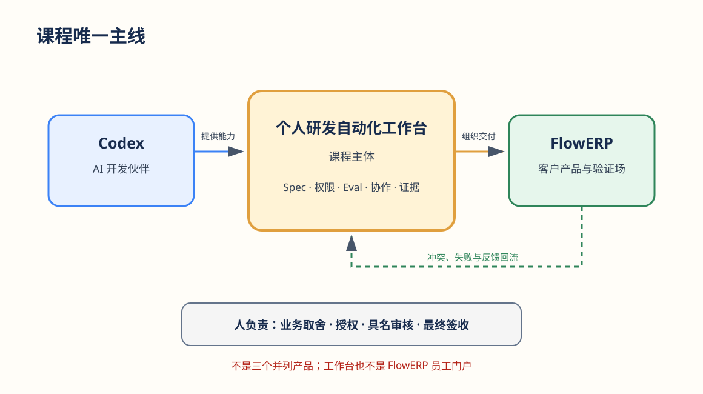
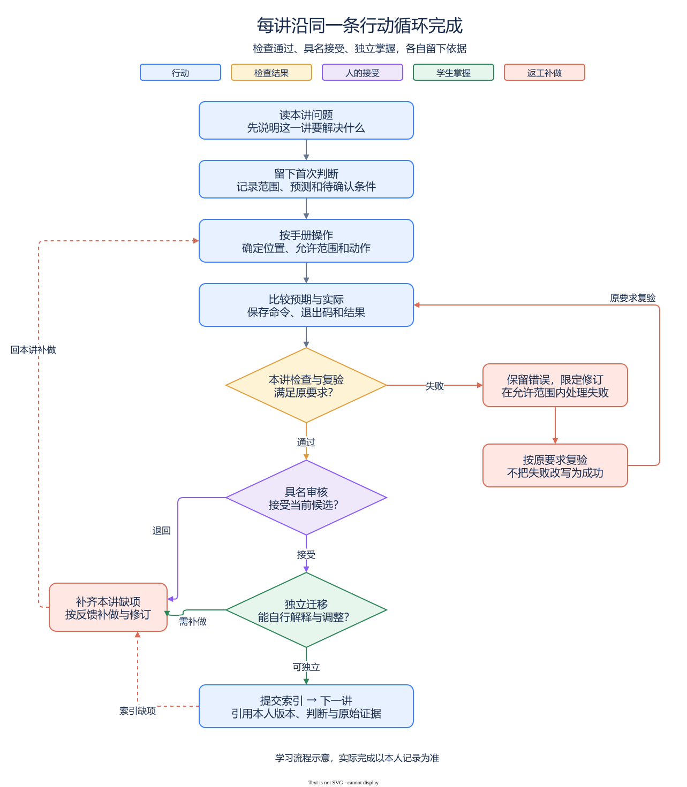

# Codex AI 工程交付行动营｜学生学习入口

**用 Codex 搭建个人 AI 研发工作台，再通过工作台组织人与 AI 协同，持续开发 FlowERP。**

学完要交付两项成果：自己的研发工作台，以及通过它开发并留下交付证据的 FlowERP。你负责确定范围、授权和验收，Codex 协助调查、实现与修复，工作台组织任务并保存过程。

## 现在从哪里开始

- **第一次学习**：进入 [L00 课前准备](./courses/L00/README.md)，按步骤准备工具并保存自己的实际记录。
- **完成 L00**：进入 [L01](./courses/L01/README.md)，开始正式课程的工作台建设任务。
- **正在跟课**：在下表找到当前讲次，只打开这一讲的入口，沿原任务与记录继续。

每讲都按同一顺序：**本讲入口 → 辅导资料理解问题 → 实践手册逐步操作 → 提交模板留下证据 → 完成后进入下一讲。** 手册写明目标、操作位置、预期结果、失败处理、完成判断和迁移任务；附件在步骤需要时打开。

## 工作台为什么逐讲增长

L04 第一次交付库存 CSV 时，先验收工作台 V0，再用它组织 Codex 实现、复验和人审。后来收货重试会重复记账、取消订单可能不释放库存、采购必须等待批准；这些产品问题推动工作台补齐检查、返工、协作和审核能力。新增能力再由下一次 FlowERP 交付检验。

图中沿着“Codex 帮你建工作台 → 工作台组织 FlowERP 交付 → 产品结果推动工作台改进”阅读。人负责范围、授权和接受决定。[可编辑源图](./courses/assets/course-three-layer.drawio)

| 阶段 | 工作台怎样增长 | 用什么结果检验 |
|---|---|---|
| L01～L04：完成首次交付 | 从需求、规则和记录做到受控执行 | L01～L03 建工作台；L04 首次交付库存导出 |
| L05～L08：让检查可信 | 能发现错误、组织检查、自动触发并独立复验 | 收货不重复生效、库存口径一致、订单创建与原子预占 |
| L09～L12：控制返工与协作 | 限定修复范围与轮次，明确分工、等待和人审 | 取消释放库存、合法状态迁移、采购申请与审批后入库 |
| L13～L16：交给别人使用 | 支持任务查询、页面操作、反馈复用与新环境接手 | 补货结果、客户操作页、反馈改进与现场新需求 |

## 16 讲学习路线

每行只有一个本讲入口；讲义、手册、提交模板和课堂课件都从该入口取得。第三列说明这一讲怎样承接前面的建设。

| 讲次 | 主题与本讲入口 | 本讲推进 |
|---|---|---|
| L01 | [以终为始：一次可验证的 AI 交付怎样完成？](./courses/L01/README.md) | 形成首份需求、测试和工作台记录能力 |
| L02 | [把仓库规则写进 `AGENTS.md`](./courses/L02/README.md) | 让协作约定能被下一次会话继承 |
| L03 | [把模糊需求变成可验收 Spec](./courses/L03/README.md) | 把需求整理成可复用、可解析的交付约定 |
| L04 | [委托 Codex 执行一次最小变更](./courses/L04/README.md) | 补齐并验收 V0，再由它组织首次库存导出 |
| L05 | [先设计失败，再编写 Eval](./courses/L05/README.md) | 用重复收货检验检查能否发现错误 |
| L06 | [用 Harness 汇总证据和等级](./courses/L06/README.md) | 统一库存口径，组织检查并如实汇总结果 |
| L07 | [用 Codex Hooks 建立本地护栏](./courses/L07/README.md) | 创建订单时让已有检查按约定触发 |
| L08 | [把同一套 Eval 接入 CI](./courses/L08/README.md) | 对整单原子预占进行他人可追查的复验 |
| L09 | [把失败报告翻译成修复任务](./courses/L09/README.md) | 从取消未释放的失败定位最小修复范围 |
| L10 | [建立有停止条件的修复 Loop](./courses/L10/README.md) | 修复订单迁移，并判断何时继续、何时停止 |
| L11 | [用 Codex 原生 Subagents 并行处理独立任务](./courses/L11/README.md) | 在采购申请交付中验证独立分工与集成复验 |
| L12 | [用 Graph 显式表达状态、回退和人工审核](./courses/L12/README.md) | 在采购批准中验证等待、打回与恢复 |
| L13 | [把执行链路封装成任务 API](./courses/L13/README.md) | 让补货任务能被查询，并经受进程中断 |
| L14 | [让交付状态在 Web 面板可见](./courses/L14/README.md) | 在页面如实呈现任务、失败与客户业务结果 |
| L15 | [生成交付摘要并采集真实反馈](./courses/L15/README.md) | 让反馈经审核进入另一事项，再检验复用结果 |
| L16 | [在新环境接手，并完成现场新需求](./courses/L16/README.md) | 换人换环境，交付此前未实现的小需求并答辩 |

## 怎样判断可以进入下一讲

从本讲开始就记录自己的首次判断。按手册在隔离候选中操作，对照预期保存实际输出、退出码与失败后状态；失败时停在当前步骤，保留原错误，修订后用原要求复验。规则前后都正确时如实记录，不伪造红灯。

完成时核对范围内 Diff、当前报告与业务状态，用提交模板引用原始证据，再由具名人员决定接受或退回。最后换一个条件或小需求，独立解释方法如何调整。缺少复验、迁移或审核，就回到本讲续做。

图中沿主箭头完成本讲，遇到失败或缺项沿返工箭头回到当前任务。检查通过、具名接受、独立迁移分别核对，最后用提交模板索引实际证据。[可编辑源图](./courses/assets/student-lesson-loop.drawio) · [PNG](./courses/assets/student-lesson-loop.png)

参考实现已存在、Codex 自述“完成”或绿色截图，都不能替代你自己的判断、修订与复验。工作台检查通过与 FlowERP 业务检查通过分别核对。

已建成的工作台从 [http://127.0.0.1:8001/](http://127.0.0.1:8001/) 首页“事项与决策”继续组织交付；具体启动步骤跟当前讲手册。

## 课件怎样获取

课堂 PPT、`.pptx` 与 `slides/` 归档不随 Git 发布。需要课件时，向课程提供方取得与本讲讲义、手册匹配的授课版本，按本讲 README 的文件名存放。讲义与手册继续承担学习和操作入口。

## 需要时再查

- **操作卡住**：先看当前讲手册的排错；通用环境、路径和恢复问题查 [实操手册执行与排错](./reference/实操手册执行与排错.md)。Windows 选 PowerShell，macOS 选 zsh，只运行自己系统的步骤。
- **想查设计、日常使用或业务规则**：进入 [按问题查阅的参考入口](./reference/README.md)。
- **教师备课与维护**：进入 [课程蓝图](./courses/课程蓝图.md)，由课表和大纲核对正式标题与课程合同。
