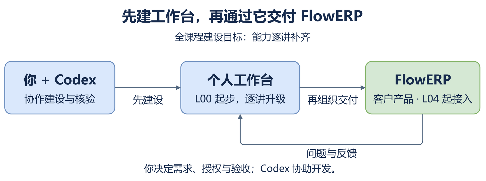
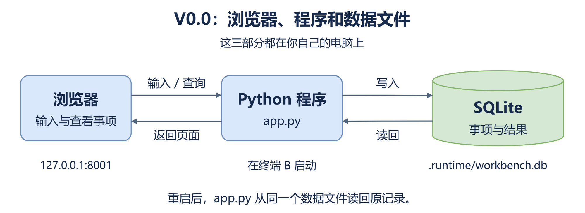

# 从 0 开始搭建个人 AI 研发工作台

这次从空目录做出一个能用的小工作台：**登记一件事 → 保存处理结果 → 停止程序 → 重启后查回。**程序由你和 Codex 建设，课程不提供成品源码。

## 先看架构，再开始建设

动手前先看清：谁负责判断，程序由哪几部分组成，数据保存在哪里。下面先给全课程的目标关系，再给这次要实现的最小结构。

### 全课程：先建工作台，再交付 ERP



这张图是**逐讲建设目标**。先让 Codex 协助你建工作台，再逐步补齐受控执行与检查能力；到 L04，通过工作台首次交付 FlowERP。工作台保存研发任务与交付证据，FlowERP 保存客户业务数据，二者各有自己的项目和数据库。

### 本讲 V0.0：程序怎样运行



读图顺序是**左 → 中 → 右**：你在浏览器输入事项，`app.py` 检查输入并写入数据文件；查询时沿反向箭头读回记录，再返回页面。

默认网址是 `http://127.0.0.1:8001/`，数据文件在自己项目的 `.runtime/workbench.db`。SQLite 由 Python 程序直接使用，无须另启动服务。停止程序后文件仍在；重启或换端口时，继续读取同一个文件。

**本讲先实现图中的结构，后面用四项现场检查验证它。**

建设时，你在终端 A 与 Codex 生成、修复源码；运行时，你在终端 B 启动 `app.py`，用浏览器登记事项并填写核对后的实际结果。V0.0 暂不从页面自动调用 Codex，也不接入 FlowERP。

图版可直接阅读；需要修改时使用可编辑源文件：[课程目标图](../assets/l00-architecture/course-mainline.drawio)、[V0.0 运行结构图](../assets/l00-architecture/personal-workbench-v0.drawio)。

接下来按 **确认需求与结构 → 生成源码 → 运行检查** 推进。到第 2 步，把图中各部分的职责和数据位置写入需求文件，确认后再开发。

先完成[工具准备](./L00｜课前准备：装好工具，跑通第一次环境自检.md#1-装好四个工具)：Python 3.11、Git、VS Code 和 Codex CLI 都应可用。本文的操作从“工具已经装好”开始。

## 先分清操作位置

本手册统一使用 Codex CLI。第 1 步在 VS Code 建立终端 B，第 2 步再建立终端 A；下表先说明它们的分工。

| 位置 | 用来做什么 | 怎样辨认 |
|---|---|---|
| 终端 A：Codex | 粘贴本手册的对话消息，讨论需求和修改程序 | 启动 `codex` 后看到的是 Codex 对话界面 |
| 终端 B：运行 | 输入 Python、Git 命令，启动和停止工作台 | 未启动服务时，能看到 PowerShell 或 zsh 的命令提示符 |
| VS Code 文件区 | 打开需求、源码和记录文件，修改后保存 | 左侧文件列表属于自己的新项目 |
| 浏览器 | 新建事项、保存结果、检查重启恢复 | 访问本次启动日志给出的网址 |

**自然语言消息发到 A；运行命令输入 B。**B 中的服务正在运行时，不再输入其他命令。代码块不包含终端提示符；Windows 只用 PowerShell 块，Mac 只用 zsh 块。

## 第 1 步：建立自己的空项目和运行环境

### 1.1 在系统终端创建目录

Windows 打开 PowerShell，Mac 打开“终端”。下面使用 `work/my-ai-workbench`；已经存在同名项目时，**续做请看文末的恢复方法；首次练习则将代码中的 `my-ai-workbench` 换成新名字**。

**Windows（PowerShell），整段运行：**

```powershell
& {
    $ErrorActionPreference = 'Stop'
    $projectFolder = Join-Path $env:USERPROFILE 'work\my-ai-workbench'
    if (Test-Path -LiteralPath $projectFolder) { throw '目录已存在，请换新名字或按文末方法续做。' }
    New-Item -ItemType Directory -Path $projectFolder -Force | Out-Null
    Set-Location -LiteralPath $projectFolder
    Get-Location
    Get-ChildItem -Force
}
```

**macOS（zsh），整段运行：**

```zsh
create_project() {
  local projectFolder="$HOME/work/my-ai-workbench"
  [ ! -e "$projectFolder" ] || { printf '目录已存在，请换新名字或按文末方法续做。\n'; return 1; }
  mkdir -p "$projectFolder" || return 1
  cd "$projectFolder" || return 1
  pwd
  ls -A
}
create_project
```

**看到什么才继续：**终端显示新项目的绝对路径，文件列表为空。先把这段输出复制到记事本或纯文本记录中，稍后转入项目记录。若报错，停在这里。

在同一个系统终端执行两端通用命令：

```text
code .
```

VS Code 应打开刚才的空目录。若 `code` 不可用，用 VS Code“文件 → 打开文件夹”选择终端刚显示的绝对路径。

### 1.2 在 VS Code 的终端 B 创建环境

在 VS Code 选择“终端 → 新建终端”，把这个终端作为 B。Windows 选择 PowerShell，Mac 使用 zsh。**逐行运行，前一行报错就停下。**

**Windows（PowerShell）：**

```powershell
Get-Location
py -3.11 -m venv .venv
.\.venv\Scripts\python.exe -X utf8 -c "import sys, sqlite3; print(sys.version); print(sys.executable); print('SQLite:', sqlite3.sqlite_version)"
$LASTEXITCODE
git init
```

**macOS（zsh）：**

```zsh
pwd
python3.11 -m venv .venv
./.venv/bin/python -X utf8 -c "import sys, sqlite3; print(sys.version); print(sys.executable); print('SQLite:', sqlite3.sqlite_version)"
echo $?
git init
```

先核对第一行路径属于新项目，再创建环境。Python 应为 `3.11.x`，解释器路径包含这个项目的 `.venv`，能显示 SQLite 版本，检查退出码为 `0`。这里直接调用 `.venv` 中的 Python，不需要另做环境激活。

### 1.3 现在就开始留记录

在 VS Code 左侧文件区新建文件夹 `lesson-00-submission`，在其中新建 `L00-环境自检.md`。打开[空白提交模板](../labs/L00/SUBMISSION.md)，复制全文到这个文件并保存。

先填模板第 2 节：项目绝对路径、刚才的空目录输出、Python 与 SQLite 输出。后面每完成一步就补记，不等到最后凭记忆填写。现在已有环境和记录文件，**工作台程序源码仍为零**。

**本步完成：**自己的项目已打开，B 能运行本项目的 Python，记录已保存。

## 第 2 步：在 Codex 中确认需求，保存第一份 Spec

### 2.1 打开终端 A

在 VS Code 再选择一次“终端 → 新建终端”，把新终端作为 A。先运行自己系统的路径检查：Windows 用 `Get-Location`，Mac 用 `pwd`。路径应与 B 相同。然后运行两端通用命令：

```text
codex -C .
```

首次使用按提示完成登录。出现 Codex 输入区后，**把下面这段作为对话消息发送，不要当作 PowerShell/zsh 命令运行**：

```text
我要在当前新项目中，从零建设个人 AI 研发工作台基础版 V0.0。
先只读报告当前目录的绝对路径和已有文件，确认尚无工作台程序。
本次先讨论需求，不写 app.py，不复制其他仓库的源码。

我先用它管理一件能现场完成的小事：核对本项目的 Python 版本。
第一版需要登记事项、查看事项、保存实际结果和由人选择的状态，重启后仍能查回。
请每轮只问一个问题，依次确认：
1. 这件事的目标与完成条件；
2. 需要保存的信息，以及浏览器、app.py、SQLite 各负责什么；
3. 怎样现场检查保存、空标题拒绝和重启恢复。
确认这三件事后，请汇总我的回答，列出仍待确认的问题，暂不开发。
```

先核对它报告的目录。若不是自己的项目，退出 Codex（输入 `/quit`），回到正确目录再启动。若它未经确认就开始写程序，要求暂停，先完成需求确认。

回答时可使用下面的练习数据；Python 版本必须来自第 1 步的真实输出：

| 要确认什么 | 本次练习的填写依据 |
|---|---|
| 标题 | 核对本项目的 Python 版本 |
| 目标 | 确认本项目使用 Python 3.11 |
| 完成条件 | 核对第 1 步的实际输出，记录完整版本；重启后仍能查到 |
| 保存的信息 | 编号、标题、目标、完成条件、创建时间、实际结果、状态 |
| 状态 | 待处理、处理中、已完成；由自己选择 |

本次先用版本核对走通全程。四项检查完成后，再换成自己的小事练习。待确认问题没有解决时，继续回答，不进入开发。

### 2.2 让需求真正写入文件

确认汇总正确后，在 A 发送：

```text
请把刚才确认的需求保存为当前项目根目录的 WORKBENCH_SPEC.md。
写清目标、暂缓的能力、保存字段，以及浏览器 → app.py → SQLite 的最小结构。
浏览器负责输入和显示，app.py 负责页面、输入检查和数据读写，数据保存到 app.py 所在项目的 .runtime/workbench.db。
写清四项完成条件：
新建后能查回；空白标题被拒绝且不增加事项；实际结果与人工选择的状态能保存；重启后原编号、内容、结果和状态不变。
本次暂不接入 ERP，不自动调用 Codex，不自动判断事项完成。
署名与确认日期留“待本人填写”，不要替我签署。仍然不要写程序。
```

在 VS Code 左侧打开 `WORKBENCH_SPEC.md`。核对内容是否符合自己的回答；对照开头的图，指出页面入口、处理输入的程序和保存数据的文件。若职责或数据路径不一致，先修改，再填写自己的学习署名和确认日期，保存。若找不到文件，先要求 Codex 保存到本项目，不用对话文字冒充文件。

然后在 A 发送：

```text
我已打开并确认 WORKBENCH_SPEC.md，署名和日期已由我填写。
请重新读取保存后的文件，下一步以这份文件为建设依据。
```

**本步完成：**需求文件能在自己的项目打开，四项检查已写清；记录中能说明自己的一个范围决定。

## 第 3 步：生成源码，检查文件和语法

在同一个 A 对话中发送：

```text
请依据我确认的 WORKBENCH_SPEC.md，在当前新项目从零实现 V0.0。
创建 app.py、README.md、.gitignore；不复制课程或其他项目的实现。

实现约定：
1. 按 Spec 中确认的结构实现：使用 Python 3.11 标准库，以 http.server 提供页面、sqlite3 保存数据，不安装第三方库。在 app.py 内用职责清楚的函数区分页面生成、输入检查和数据读写，暂不拆成多个程序。
2. python app.py 启动，默认监听 127.0.0.1:8001，支持 --port 8002 这类自定义端口。
3. 首页根路径 / 显示“个人 AI 研发工作台 V0.0”和“事项与决策”。
4. 新建表单包含标题、目标、完成条件，按钮叫“保存事项”。事项列表显示编号、标题、状态，并有“查看”入口。新建后状态为“待处理”。
5. 详情显示原内容；可填写“实际结果”，选择“待处理”“处理中”“已完成”，点击“保存结果”。状态只能来自人的选择。
6. 空白标题提示错误且不新增事项；未知编号不能修改其他事项。SQL 参数化，显示用户输入时做 HTML 转义。
7. 数据保存在 app.py 所在项目的 .runtime/workbench.db；首次列表为空，重启不清库、不插入示例事项。
8. 启动成功后在终端显示项目绝对路径、数据库绝对路径和访问网址；README 写出真实启动命令。
9. .gitignore 排除 .venv/、.runtime/、__pycache__/、lesson-00-submission/。

可以检查语法，但不要启动持续运行的服务或代做 Git 提交；启动、页面检查和版本保存由我在终端 B 完成。
完成后列出实际写入的文件与未解决问题，不替我填写检查结果或宣布验收通过。
```

等 Codex 完成后，切到 **B**。B 此时应显示命令提示符，目录是自己的项目。**先运行文件检查，四个文件都存在才运行下一行语法检查。**

**Windows（PowerShell）：**

```powershell
Get-Item .\WORKBENCH_SPEC.md, .\app.py, .\README.md, .\.gitignore
.\.venv\Scripts\python.exe -m py_compile app.py
$LASTEXITCODE
```

**macOS（zsh）：**

```zsh
ls -l WORKBENCH_SPEC.md app.py README.md .gitignore
./.venv/bin/python -m py_compile app.py
echo $?
```

文件检查应列出四个文件；编译检查应无错误、退出码为 `0`。文件缺失或语法失败就停下，把实际输出发回 A 修复，再在 B 运行同一检查。

打开 `README.md` 找到启动方法和数据位置；打开 `.gitignore`，确认第 9 条的四个目录已被排除。语法通过只说明程序能解析，下一步还要实际运行。

**本步完成：**四个文件在自己的项目中齐全，语法检查通过。

## 第 4 步：在 B 启动，用浏览器打开本次程序

**Windows（PowerShell），终端 B：**

```powershell
.\.venv\Scripts\python.exe -X utf8 app.py
```

**macOS（zsh），终端 B：**

```zsh
./.venv/bin/python -X utf8 app.py
```

先看启动日志：项目路径应是自己的目录，数据库应在该项目的 `.runtime/workbench.db`，访问网址应是 `http://127.0.0.1:8001/`。**日志报错或程序已经退出时，不继续打开旧页面作检查。**

保持 B 运行，在浏览器地址栏输入日志中的网址并回车。应看到 V0.0 标题、“事项与决策”和空事项列表。B 没有返回命令提示符，是正常运行状态；接下来在浏览器操作。

### 8001 被占用时

若启动日志明确报端口占用，原进程已退出，再在 B 使用下面的完整命令；若本次程序仍在运行，先在 B 按 `Ctrl+C`（Mac 为 `Control+C`）停止它。

**Windows（PowerShell）：**

```powershell
.\.venv\Scripts\python.exe -X utf8 app.py --port 8002
```

**macOS（zsh）：**

```zsh
./.venv/bin/python -X utf8 app.py --port 8002
```

这时浏览器改用 `http://127.0.0.1:8002/`，后续启动、检查和重启都沿用 8002。其他报错按文末方法修复。

**本步完成：**日志的项目和网址能对上浏览器页面，实际启动命令与数据路径已写入记录。

## 第 5 步：亲自完成四项检查

### 检查 1：新建后能查回

在浏览器的新建表单填写：

- 标题：`核对本项目的 Python 版本`
- 目标：`确认本项目使用 Python 3.11`
- 完成条件：`核对实际版本输出，保存完整版本，重启后仍能查回`

点击“保存事项”，在列表记下**实际编号**，点击该事项的“查看”。逐项核对输入内容和“待处理”状态。在个人记录中填编号、标题和实际结果。页面刷新后仍要能通过这个编号找到同一事项。

### 检查 2：空标题不增加事项

回到列表，先记下当前事项数。尝试再新建一项：标题只输入空格，目标和完成条件仍填写上面的内容，点击“保存事项”。应有明确错误提示。

再回列表并刷新：事项数没有增加，检查 1 的事项及内容仍在。只看见错误提示、不核对列表，不算完成这项检查。

### 检查 3：保存真实结果和自己的状态选择

打开检查 1 的同一编号。把第 1 步真实输出中的完整 Python 版本写入“实际结果”，例如 `已核对，本项目实际使用 Python 3.11.x`，其中 `x` 必须替换为真实值。

先选“处理中”，点击“保存结果”，返回列表，再打开该编号核对。完成版本核对后，再改选“已完成”并保存，返回列表重新打开。**两次状态都应来自自己的选择，实际结果仍在。**

把真实结果和最终状态写入个人记录。不直接照抄示例版本或让 Codex 代填检查通过。

### 检查 4：停止后重启，同一记录仍在

1. 先在记录中写下这个编号、结果和状态。
2. 切到 B，按 `Ctrl+C` / `Control+C`，直到命令提示符重新出现。
3. 在 **同一目录**运行第 4 步的原启动命令；使用 8002 的同学保留 `--port 8002`。
4. 回浏览器刷新，找到同一编号，打开并比较标题、目标、完成条件、结果、状态。

全部保留才算这项通过。丢失时保留原数据库和现象，按文末修复，不重新创建同名记录冒充恢复成功。

### 再核对两个文件依据

四项检查完成后，在 A 发送只读问题：

```text
请只读指出 app.py 中两处依据：
1. 页面点击“保存事项”后，在哪里把内容写入数据库；
2. 重启后，在哪里打开同一个数据库并查回原事项。
给出函数名和具体代码位置，解释它们的关系，先不修改程序。
```

在 VS Code 打开 `app.py`，找到它指出的位置。是否看到了写入、读取，以及同一个数据库路径？将依据填入模板第 5 节。看不懂时请 Codex 解释这几行，再核对；仍无法确认就如实记“未确认”。

**本步完成：**四项检查有实际编号和前后对照，两项文件依据经过本人查看。失败项修好后需重新检查。

## 第 6 步：保存记录和一个可找回的 Git 版本

在 B 停止服务，确认命令提示符出现。补完 `lesson-00-submission/L00-环境自检.md`：填实际动作、输出、失败、修复和未解决项，保存后关闭再打开一次，确认记录还在。

在项目根目录的 B 执行两端通用命令：

```text
git status --short
git check-ignore .venv/ .runtime/ __pycache__/ lesson-00-submission/
```

第一条应能看到源码和需求文件的 `??`，不应列出环境、数据库或个人记录。第二条应输出四个被忽略的目录；不齐时先修 `.gitignore`，再查一次。

确认后，**逐行运行**，只把这四个文件保存为版本：

```text
git add WORKBENCH_SPEC.md app.py README.md .gitignore
git diff --cached --name-only
```

暂存清单应只有上面的四个文件，核对后再运行：

```text
git commit -m "完成个人工作台 V0.0 基础版"
git log -1 --oneline
git status --short
```

成功时能看到一条提交及其编号，最后的状态输出为空。把提交编号填入个人记录。若 Git 提示无法确定作者身份，在 **本项目 B** 用自己的信息运行下面两条，替换引号中的文字，再重试原提交命令；不加 `--global`：

```text
git config user.name "你的学习署名"
git config user.email "你的Git提交邮箱"
```

本地保存版本不需要创建 GitHub 仓库或推送。保留完整项目用于下次运行；交作业按开营通知提供源码、Spec 和个人记录，不附环境、数据库或凭据。

**本步完成：**自己的项目、真实检查记录和 Git 提交都能找回。带着这版源码、需求和检查记录进入后续建设，下一讲先明确要补哪项能力以及如何沿用本项目。

## 失败时：把事实发给 A，修完重启再查

先复制原错误或记录页面现象，再切到 A 发送下面这段。把空白处换成自己的信息：

```text
我在 L00 第__步，检查__失败，请先只读定位原因并说明最小修改范围，暂不修改文件。
项目绝对路径：
实际命令或页面动作：
完整错误或实际现象：
预期结果：
原事项编号（尚未创建则写尚无）：
请保留已有源码、原数据库和失败记录；不要用删除数据库或新建同名事项绕过。
修复后告诉我改了哪些文件，启动仍由我在终端 B 完成。
```

需要改程序时，先在 B 停止服务，等命令提示符出现，再向 A 发送：“服务已停止，请修复刚才定位的问题，保留原数据；修复后列出改动，不启动服务。”B 本来没有运行服务时，无需按停止键。

修好后依次做：**第 3 步语法检查 → 第 4 步原命令启动 → 重做失败项 → 重做四项检查**。修改了文件不等于正在运行的旧进程已经更新。

登录或安装失败先返回[工具准备与排错](./L00｜课前准备：装好工具，跑通第一次环境自检.md#遇到问题再看)；源码生成和功能失败用上面的事实记录求助，不把环境错误算成程序功能缺失。

## 重开窗口后：回原项目继续

在 VS Code“文件 → 打开文件夹”选择记录中的项目，再打开 A、B 两个终端。每个新终端都要核对目录；默认路径的恢复命令如下，改过位置或名称的同学替换为自己记录的路径。

**Windows（PowerShell）：**

```powershell
Set-Location -LiteralPath "$env:USERPROFILE\work\my-ai-workbench"
Get-Location
.\.venv\Scripts\python.exe --version
```

**macOS（zsh）：**

```zsh
cd "$HOME/work/my-ai-workbench"
pwd
./.venv/bin/python --version
```

B 按进度恢复：停在第 1～3 步时，返回未完成的步骤，不提前启动服务；第 4 步已经启动成功的，才运行记录中的原启动命令。

A 重新运行 `codex -C .` 后，告诉它：“我停在第__步，先读取当前已有的需求和记录文件，列出缺项，从未完成处继续。”尚未生成的文件如实说明，不让它补写运行结果。不重新创建目录或已有环境，不替换原数据库。

需要结束 Codex 时，在 A 的对话输入区发送 `/quit`；停止工作台则在 B 按 `Ctrl+C`。这两者分别结束对话和本次服务进程。CLI 的目录参数和退出方式依据 [OpenAI 官方命令说明](https://learn.chatgpt.com/docs/developer-commands)，核对日期：2026-10-03。

返回 [L00 入口](./README.md)。
