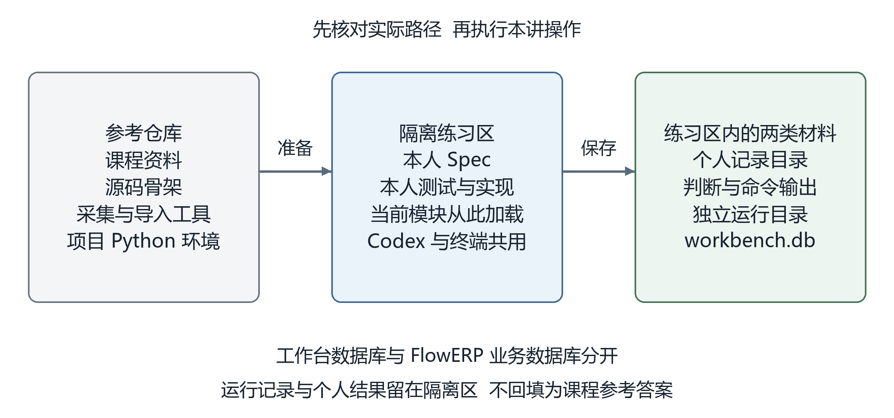
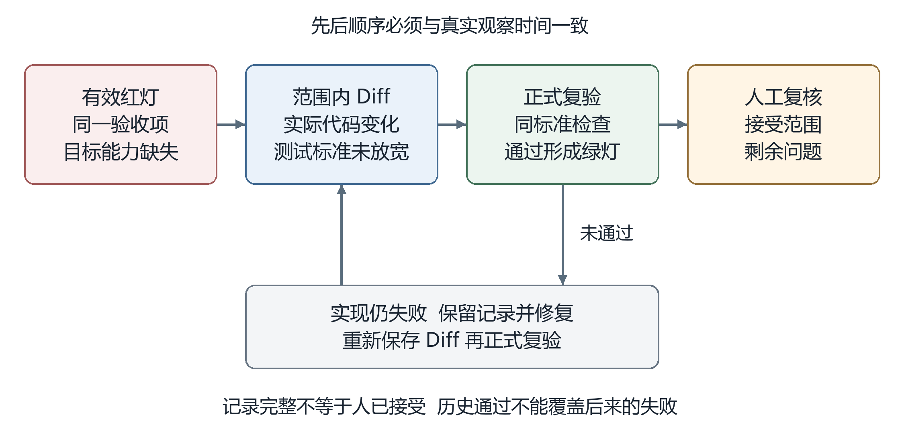
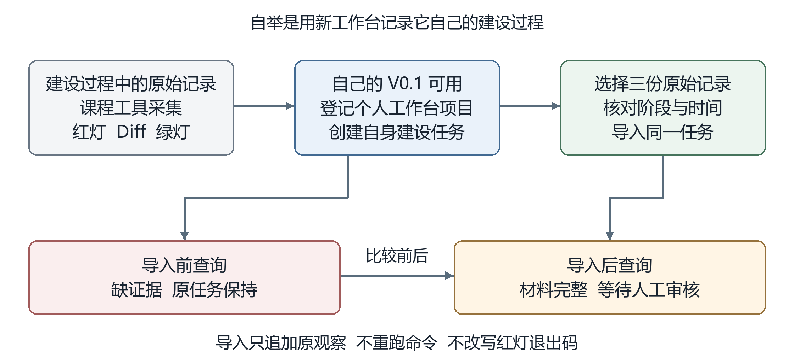
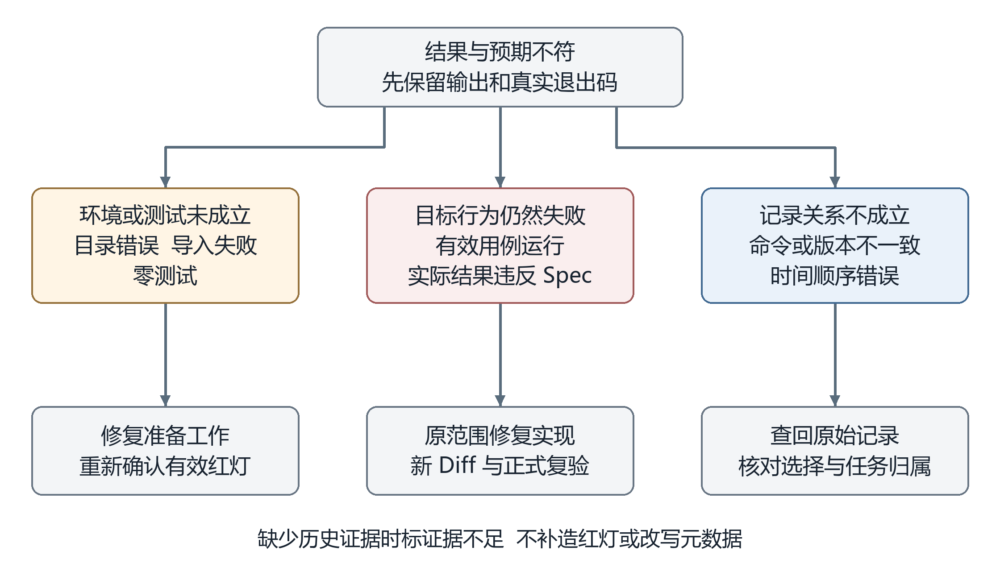
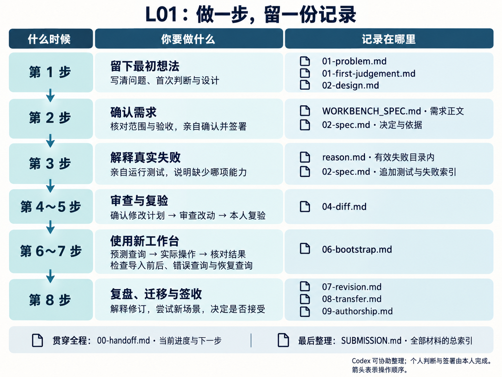

# L01｜以终为始：一次可验证的 AI 交付怎样完成？

> **终端选择：**本手册同时提供 Windows PowerShell 与 macOS 默认终端 zsh 的操作。每一步只运行自己系统对应的代码块；本手册标为 `text` 的 Python、Git 命令是两端通用命令。首次准备按第 1.1 节执行；重开终端按文末“故障定位与中断恢复”回到原隔离区，再核对当前源码位置。环境与路径约定见[执行与排错说明](../../reference/实操手册执行与排错.md#macos-zsh)。

> 本手册是操作主线。先读讲义理解原因，再按步骤完成实践，用同一份 SUBMISSION.md 引用自己的证据。

> 不确定先看哪份资料？返回[本讲 README](README.md)。准备好后从本手册第 1 步开始，按顺序操作。

本手册规定 Workbench V0.1 从隔离准备、需求确认到正式复验与自举的操作流程。最终交付五个可运行的 CLI 命令、本人签署的 Spec、真实红灯与复验结果，以及个人复核结论。FlowERP 在本讲尚未接入。

本讲首次执行前确认课程工具 `docs/courses/L01/tools/evidence.py` 与 `import_evidence.py` 已在参考仓库中。`WORKBENCH_SPEC.md` 的正式位置是隔离区内的 `docs/courses/L01/WORKBENCH_SPEC.md`；参考仓库同名文件是未签署样稿。个人记录由第 1 步创建，测试与实现由第 2～4 步形成，不要从根目录寻找另一份同名 Spec。

开始操作前，遇到解释器、路径或输出问题，按[执行与排错说明](../../reference/实操手册执行与排错.md)核对。

课堂配套：[极客时间实操演示版 PPT](L01-以终为始-极客时间实操演示版.pptx)。先看讲师切屏示范，再按本手册在自己的隔离区执行；PPT 中的参考结果不代替个人记录。

动手前，先读[辅导资料中的需求决定、记录结构与行为检查](辅导资料.md#requirement-contract)，理解需求、设计与检查之间的关系，并完成 [L00 环境准备](../L00/L00｜课前准备：装好工具，跑通第一次环境自检.md)。完整实践可分次完成；每次从上一次记录的未完成步骤继续。

| 步骤 | 完成后应得到什么 |
|---|---|
| [1. 准备隔离区](#prepare) | 正确的代码位置、缺能力起点和个人初始判断 |
| [2. 签署需求](#spec) | 有范围、失败行为、验收项和本人决定的 Spec |
| [3. 建立有效红灯](#red) | 确实发现目标能力缺失的测试与原始记录 |
| [4. 授权实现](#implement) | 在确认范围内实现的五个操作 |
| [5. 审查并复验](#review) | 范围内 Diff 与同一标准下的绿灯 |
| [6. 完成自举](#bootstrap) | 新工作台能够查回自身建设记录 |
| [7. 检查失败后状态](#failure-check) | 错误查询被拒绝，原任务仍然完整 |
| [8. 复核与提交](#submit) | 个人解释、真实反馈和最终签收结论 |

只运行当前步骤的命令，读完结果再继续。遇到错误可将完整输出交给 Codex 分析，但原始记录要保留。排错与中断续做见文末；个人记录的填写要求也在本手册内。


<a id="lesson-goals"></a>

## 本讲目标与通过要求

本讲从 L00 的可用环境出发，由你直接监督 Codex 完成需求访谈、测试和 Workbench V0.1。FlowERP 尚未接入；新工作台先记录自身建设。

完成时逐项核对：

- 本人 Spec 的关键要求可回指原始问题、Codex 建议与本人决定；参考样稿不代替个人确认。
- 初始化、项目登记、任务创建、记录追加和状态查询五个 CLI 操作可运行；明确入口、逻辑与存储的分工理由。
- 保留有效起始红灯、测试快照、范围内 Diff 和同标准绿灯；保存后重启查询、重复编号与错误查询均核对失败后状态。
- 新工作台能查回自身建设任务、需求快照和运行证据；记录完整仍待人审。
- 个人取舍、真实反馈、修订与迁移分别留证；反馈缺失写待复核。

### 大纲四项合同

- **核心内容**：开课时没有个人工作台、`WORKBENCH_SPEC.md` 或验收测试；学生从一句模糊诉求和真实痛点出发，利用 Codex 完成需求访谈，由学生决定范围并签署首份 Spec，再把验收项转成红灯测试，开发初始化、项目登记、任务账、命令证据账和状态检查。
- **演示结果**：`“帮我搭建个人 AI 研发工作台”` 经历“原始诉求 → Codex 追问 → 学生取舍 → `WORKBENCH_SPEC.md` → 验收测试红灯 → Codex 实现 → 同一测试绿灯”，最后由新工作台记录自己的建设证据。
- **课内增量**：学生亲手形成并签署首份 `WORKBENCH_SPEC.md`、从验收项生成失败测试、开发出可运行的 Workbench V0.1，并完成第一次自举记录；本讲不接入、不开发 FlowERP。
- **通过标准**：Spec 每项关键要求能回指原始痛点、Codex 建议和学生决定；测试能回指验收项；必须保留实现前红灯、范围内 Diff 和实现后绿灯；学生能用自己开发的命令完成自举，并说明 L04 才会通过“个人工作台 + Codex”开发 FlowERP。

按下面的步骤操作，个人索引用 [SUBMISSION 填写提示](SUBMISSION.md) 核对；它只提供字段，不预填结果。

## 执行约定

第 1 步先从参考仓库根目录创建并进入隔离练习区，后续命令均在该隔离区执行。复制命令时，只选代码块中的内容，不把说明文字输入终端。长命令可能因页面宽度自动折行；同一条命令仍需完整复制后一次执行，不把显示上的折行当作独立命令。所有路径均相对于当前隔离区，除非工具输出明确给出绝对路径。

代码块按步骤整段复制即可；课程编号和证据路径在运行后按提示输入，不需要先编辑命令。`workbench-init`、`workbench-status` 等名称在正文中表示子命令，不能单独输入终端；可执行代码块均包含完整的 `python -X utf8 -m workbench.cli` 入口。第 1 步只检查起点，第 2～4 步需要你与 Codex 完成需求、测试和实现，第 5 步复验通过后才能执行第 6 步初始化。复制可执行不等于可以跳过这些前置条件。

| 对象 | 本讲约定 | 核对方法 |
|---|---|---|
| Python | 使用参考仓库的 `.venv` | 核对 `sys.executable` |
| 实际源码 | 来自当前隔离练习区 | 核对 `workbench.__file__` |
| 实现范围 | 已签署 Spec 中的源码写集 | 同时检查全量状态与范围内 Diff |
| 个人记录 | `lesson-01-submission/` | 按实际输出建立索引 |
| 工作台数据 | `.runtime/course/L01-workbench/` | 同一实验全程使用同一运行目录 |
| 正式运行 | 学员执行并提供真实记录 | Codex 诊断与本人复验分开标明 |

操作前确认输入和目录，操作后核对退出码、输出内容及数据状态。非零退出码可能是预期的失败实验，也可能是环境错误，需根据本步骤的条件判断。

需要查看退出码时，紧接被检查的命令执行自己系统的一条命令；中间不要运行其他命令，否则读到的是其他操作的退出码：

Windows PowerShell：

```powershell
Write-Host "上一条命令退出码：$LASTEXITCODE"
```

macOS（zsh）：

```zsh
printf '上一条命令退出码：%s\n' "$?"
```

macOS 的参考仓库可以放在 `~/work/CodexFDE`，也可以使用自己的目录。路径含空格或中文时，终端命令中用双引号，例如 `cd "$HOME/work/课程练习/CodexFDE"`；下方交互提示让你粘贴路径时，输入完整绝对路径，不加引号，不用 `~` 缩写。隔离区借用参考仓库的 `.venv/bin/python`，不需要在隔离区重新安装环境。

<a id="prepare"></a>


## 1 准备隔离练习区

> **一句话说明：**先创建只属于自己的练习仓库并确认代码从这里运行，参考仓库里的现成功能不能算你的成果。

**前置条件**  已完成 L00，参考仓库可用；本步骤尚未要求工作台功能存在。

先分清三个位置：参考仓库提供课程材料和工具；隔离练习区保存本次修改的源码；`lesson-01-submission/` 保存个人判断与运行记录。隔离区是另一个本地文件夹。

课程提供的 `tools/evidence.py` 负责采集命令输出，`tools/import_evidence.py` 负责导入；你要实现的 Python CLI 程序负责保存、关联和查询记录。两类工作各有分工。

完成 [L00 环境准备](../L00/L00｜课前准备：装好工具，跑通第一次环境自检.md)，打开参考仓库根目录。下面按系统选择一组命令；之后所有标为 `text` 的命令都适用于两类终端。`python` 必须来自参考仓库的 `.venv`。




*图 1 目录与数据边界  解释器位置和源码位置分别核对*

### 1.1 创建并进入隔离练习区

Windows PowerShell：在参考仓库根目录整段执行（包括最外层的 `& { ... }`，使任一步骤失败时停止后续操作）。

```powershell
& {
    $ErrorActionPreference = 'Stop'
    $coursePython = (Resolve-Path -LiteralPath .\.venv\Scripts\python.exe).Path
    . .\.venv\Scripts\Activate.ps1
    $id = "TASK-L01-" + (Get-Date -Format "yyyyMMdd-HHmmss-fff")
    $courseRuntime = Join-Path (Get-Location).Path '.runtime'
    $metadataPath = Join-Path $courseRuntime "course-worktrees\$id.json"
    Write-Host "正在创建隔离区：$id，请等待……"
    & $coursePython -X utf8 -m workbench.cli course-prepare --lesson 1 --source working-tree --task-id $id --runtime-dir $courseRuntime | Out-Null
    if ($LASTEXITCODE -ne 0) { throw "隔离区创建失败，请先阅读上方错误。" }
    $json = Get-Content -LiteralPath $metadataPath -Raw -Encoding UTF8
    if ([string]::IsNullOrWhiteSpace($json)) { throw "准备结果文件为空，请先排查，不要继续后续步骤。" }
    $prepared = $json | ConvertFrom-Json -ErrorAction Stop
    if ([string]::IsNullOrWhiteSpace($prepared.path)) { throw "准备结果缺少 path，请先检查原始结果。" }
    if (-not (Test-Path -LiteralPath $prepared.path -PathType Container)) { throw "准备结果中的隔离目录不存在。" }
    Set-Location -LiteralPath $prepared.path
    New-Item -ItemType Directory -Force lesson-01-submission | Out-Null
    Copy-Item -LiteralPath $metadataPath -Destination .\lesson-01-submission\00-isolation.json
    Write-Host "隔离区已准备完成：$($prepared.path)"
    Get-Item .\lesson-01-submission\00-isolation.json
}
```

正常执行时，先显示“正在创建隔离区”，完成后显示隔离目录和 `00-isolation.json` 文件信息；中间复制源码和初始化 Git 时可能暂时没有输出。出现完成提示后再进入 1.2。若目录已创建，但解析或保存失败，可从参考仓库的 `.runtime/course-worktrees/<本次任务编号>.json` 读取工具保存的原始结果，核对其中的 `path` 后恢复证据文件，不要直接重新创建任务。重开终端后，旧的 `$raw` 等变量不会保留。

Windows PowerShell 可能按系统默认编码解码外部程序的输出；即使 Python 使用 `-X utf8`，捕获到变量中的中文仍可能乱码，导致 JSON 解析失败。因此这里直接按 UTF-8 读取工具保存的结果文件，并原样复制到提交目录。

macOS（终端默认 zsh）：在参考仓库根目录整段执行。函数中的任一步失败会停止本组后续操作；先处理错误，再继续手册。

```zsh
prepare_l01() {
  local courseRoot="$PWD"
  local coursePython="$courseRoot/.venv/bin/python"
  [ -x "$coursePython" ] || { printf '参考仓库缺少可用的 .venv/bin/python，请先完成 L00。\n'; return 1; }
  source "$courseRoot/.venv/bin/activate" || return 1
  local id="TASK-L01-$(date +%Y%m%d-%H%M%S)-$$"
  local runtime="$PWD/.runtime"
  local metadata="$runtime/course-worktrees/$id.json"
  local target
  printf '正在创建隔离区：%s，请等待……\n' "$id"
  "$coursePython" -X utf8 -m workbench.cli course-prepare --lesson 1 --source working-tree --task-id "$id" --runtime-dir "$runtime" > /dev/null || return 1
  target="$("$coursePython" -X utf8 - "$metadata" "$courseRoot" <<'PY'
import json, sys
from pathlib import Path
data = json.loads(Path(sys.argv[1]).read_text(encoding="utf-8-sig"))
if not isinstance(data, dict):
    sys.exit("隔离结果不是 JSON 对象，请核对原文件。")
for key in ("source_root", "path"):
    value = data.get(key)
    if not isinstance(value, str) or not value.strip() or not Path(value).is_absolute():
        sys.exit(f"隔离结果缺少有效的绝对路径字段：{key}")
    if not Path(value).is_dir():
        sys.exit(f"隔离结果中的目录不存在：{key}")
if Path(data["source_root"]).resolve() != Path(sys.argv[2]).resolve():
    sys.exit("隔离结果的 source_root 与本次参考仓库不一致，请核对。")
if not isinstance(data.get("student_start"), dict) or data["student_start"].get("lesson") != 1:
    sys.exit("所选结果不是本讲隔离起点，请核对任务编号。")
print(data["path"])
PY
  )" || return 1
  cd "$target" || return 1
  mkdir -p lesson-01-submission || return 1
  if [ -e lesson-01-submission/00-isolation.json ]; then
    cmp -s "$metadata" lesson-01-submission/00-isolation.json || { printf '已有隔离证据与本次结果不同，已停止并保留原文件。\n'; return 1; }
  else
    cp "$metadata" lesson-01-submission/00-isolation.json || return 1
  fi
  printf '隔离区已准备完成：%s\n' "$PWD"
  ls -l lesson-01-submission/00-isolation.json
}
prepare_l01
```

这组命令依次选择课程 Python 环境、创建独立源码副本、进入新目录，并将准备结果保存为 `00-isolation.json`。`.venv` 是本项目的 Python 环境目录；使用它可以保持解释器与已安装项目一致。JSON 是按字段保存信息的文本格式，本步骤由工具生成，后面读取其中的路径与起点信息即可。

副本包含当前源文件，但移除了本讲需要开发的能力，这就是后文的“隔离快照”。图片和 PPT 仍在参考仓库阅读。若创建失败，应先处理错误，避免在原目录继续实践。

### 1.2 核对实际运行的代码与起点

**这一步要确认“还没有工作台”。第三条命令预期会报错；看到 `invalid choice: 'workbench-status'` 是本步骤的预期结果。** Spec、测试和五个工作台命令将在后面的步骤中由你与 Codex 建立。

核对解释器、模块来源与能力起点，逐条执行（通用 Python 命令）：

```text
python -X utf8 -c "import sys,workbench; print('Python:', sys.executable); print('源码:', workbench.__file__)"
python -X utf8 -c "from pathlib import Path; print('Spec 已存在:', Path('docs/courses/L01/WORKBENCH_SPEC.md').exists()); print('测试已存在:', Path('tests/test_l01_workbench_bootstrap.py').exists())"
python -X utf8 -m workbench.cli workbench-status
```

**如果结果和下面一致，就继续 [1.3 留下开发前的判断](#first-judgement)。**

| 终端结果 | 含义 |
|---|---|
| `Python` 指向参考仓库的 `.venv`；macOS 路径以 `.venv/bin/python` 结尾 | 使用本讲约定的课程环境 |
| `源码` 路径位于刚创建的隔离区 | 正在检查自己的练习代码 |
| `Spec 已存在: False` | 第 2 步需要形成首份 Spec |
| `测试已存在: False` | 第 3 步需要建立验收测试 |
| `invalid choice: 'workbench-status'`，退出码 2 | 第 4 步需要实现该命令；此时命令行会同时打印很长的用法列表 |

第三条命令后，立即按“执行约定”查看退出码，macOS 使用 `$?`，PowerShell 使用 `$LASTEXITCODE`。此处预期为 2；不能因它非零就改为运行参考仓库的现成功能。

现在保持在这个隔离目录，执行 1.3 的记录命令，再进入第 2 步与 Codex 确认需求。这里无需重新安装、重建隔离区或运行 `workbench-init`；初始化安排在实现与复验完成后的第 6 步。

若 `workbench` 模块根本无法导入，先解决环境；若目标命令直接成功，先核对起点。为 Codex 选择同一隔离目录，终端切换目录不等于另一项 Codex 任务也切换了目录。macOS 可在 Codex 桌面入口中打开这个隔离目录，也可保持终端在此目录后运行 `codex`，用 Codex CLI 完成同一任务。VS Code 的 `code` 命令未配置时，使用“文件 → 打开文件夹”选择该目录。这里的参数报错只用于检查起点，第 3 步还需要用自己的验收测试取得有效红灯。

**仅当输出是“工作台尚未初始化”时，才读下面这段分流；看到上述 `invalid choice` 可直接进入 1.3。** 下面的输出（示意）表示命令已经存在，但当前运行目录的工作台账本尚未初始化：

```json
{
  "ok": false,
  "error": "工作台尚未初始化，请先运行 workbench-init",
  "flowerp_connected": false
}
```

此时先核对当前目录和实际加载的源码，两类终端均可执行：

```text
python -X utf8 -c "from pathlib import Path; import workbench; print('当前目录:', Path.cwd()); print('源码:', workbench.__file__)"
```

- **刚开始本讲，路径仍是参考仓库**：尚未创建隔离区时，返回第 1.1 节执行对应系统的完整命令块；已经创建过时，按文末“故障定位与中断恢复”回到原隔离区，再核对起点。
- **路径已是隔离区，但尚未完成第 2～5 步**：根据个人记录确认是否已经开始实现。首次起点就有该命令时，先让 Codex 核对隔离准备结果与源码；已经开始实现时，从原记录的未完成步骤继续。不要把“尚未初始化”当成本讲能力缺失的有效红灯，也不要跳到初始化。
- **已经完成第 2～5 步，且正式复验通过**：进入[第 6.1 节](#initialize)，按完整命令依次初始化、登记项目、创建任务。后续查询使用同一 `--runtime-dir .runtime/course/L01-workbench`。

报错中的“请先运行 workbench-init”是程序的使用提示，不代表课程要求现在跳到第 6 步。`flowerp_connected: false` 在 L01 是正常状态，本讲尚未接入 FlowERP。

这三项检查分别确认“实际使用哪份代码”“需求和测试是否需要自己创建”“目标能力是否确实缺失”。Python 环境可以来自参考仓库，但被加载的 `workbench` 源码必须来自新目录，否则可能检查到参考实现，无法判断自己的修改是否有效。

<a id="first-judgement"></a>

### 1.3 留下开发前的判断

打开根目录 `AGENTS.md`，了解源码范围与验证要求。运行下面的完整命令；其中 `course_ready: true` 只检查课程合同与标签，不能证明本讲能力已实现。

```text
python -X utf8 -m workbench.cli course-status
```

在刚创建的 `lesson-01-submission/` 中新建四份 Markdown 记录：`00-handoff.md`、`01-problem.md`、`01-first-judgement.md`、`02-design.md`。按文末[学习记录要求](#learning-records)填写环境、原始问题、首次判断和个人设计。后续记录在对应步骤再建立，不用现在填写未知结果。

下面的命令创建这四个空文件，已有文件保留内容。执行后在编辑器中填写自己的记录。

```text
python -X utf8 -c "from pathlib import Path; root=Path('lesson-01-submission'); root.mkdir(exist_ok=True); names=('00-handoff.md','01-problem.md','01-first-judgement.md','02-design.md'); [root.joinpath(n).touch(exist_ok=True) for n in names]; print('记录文件已就绪:', root.resolve())"
```

**完成条件**  确认 Codex 与终端使用同一隔离目录；Spec 与本讲测试尚不存在；目标命令尚不可用；你已经留下开发前的真实想法。

<a id="spec"></a>


## 2 确认并签署需求

> **一句话说明：**把访谈得到的问题写成可验收的需求，自己确认后再允许 Codex 开始实现。

**前置条件**  已核对隔离路径，并保存原始问题、首次判断与个人设计。

<a id="prompt-interview"></a>

<details>
<summary>给 Codex 的提示词：需求访谈与范围确认</summary>

只在本步骤前提满足后复制；填写实际路径，已有决定与授权继续沿用。

~~~~text
请作为我的需求访谈伙伴，帮助我把“搭建个人 AI 研发工作台”变成第一版可验收的约定。重点是让我理解并作出选择。你可以读取材料、追问、比较方案并保存需求草案；本阶段不编写测试和实现。

## 1. 先找到我现在的起点

读取当前隔离练习区中的以下材料：

- `AGENTS.md`；
- `docs/courses/L01/实践操作手册.md` 第 1～2 节及文末“学习记录要求”；
- `docs/courses/L01/辅导资料.md` 第 4～5 节；
- `lesson-01-submission/00-isolation.json`、`00-handoff.md`、`01-problem.md`、`01-first-judgement.md`、`02-design.md`。

先核对当前绝对路径与隔离记录，并检查本讲 Spec、测试和目标能力的状态。首次练习应从缺少目标能力的起点开始；续做则读取已形成的决定，不重新清空文件。目录不对时，指出如何回到正确目录，暂停写入。材料缺失时，指出具体文件和它的用途，不重建已删除的课程附件。

用一小段话告诉我：“你想解决的困难是……；目前的设计是……；还需决定的是……”。区分课程情境与我的真实经历。初始判断缺失时，请我先说明最想解决的一个困难和原来的办法，不替我编写经历、理由或个人答案。

## 2. 围绕一个使用过程逐步访谈

本讲建设 Python CLI 工作台 V0.1：初始化、项目登记、任务创建、记录追加、状态查询。它保存并关联建设记录，供人核对；自动调用 Codex、完整执行器和网页属于后续能力。FlowERP 到 L04 才首次通过工作台开发，本讲不改 ERP。

课程固定约定需要遵守：任务属于已登记项目；重复任务编号不能覆盖旧内容；需求和输出保留当时快照；错误请求不破坏原记录；材料完整仍等待人工审核。讨论其他设计时标为比较或后续方案，不把违背本讲合同的行为作为可交付选项。

从我的初稿中选一处尚未想清的地方，沿这条使用过程追问：

| 使用时发生什么 | 引导我作什么判断 |
|---|---|
| 明天重新接手这项开发 | 必须找回哪些内容，少了它会怎样？ |
| 一个项目有多项任务 | 项目、任务、运行记录怎样区分和关联？ |
| 任务创建后，原需求文件变了 | 怎样查清这项任务当时依据的要求？ |
| 再次提交同一编号，或查询缺失任务 | 除了返回错误，还应检查哪些旧数据？ |
| 找到一次测试通过的记录 | 它支持什么结论，哪些仍须人核对？ |

每轮处理一个主要判断，不一次发送整张问卷。先让我用自己的话回答，再解释机制；需要比较时给出具体代价，不用术语堆叠。真正互斥的选择可给 2～3 个方案，允许我提出其他方案。固定规则直接解释原因，不假装让我投票决定是否遵守。已经回答的内容直接采用，只追问仍影响设计或验收的缺口。

例如，我说“数据要可靠”，你可以追问“创建成功后关闭程序，再打开时应看到什么”。我说“重复编号要报错”，你再追问“报错后原任务应保持什么”。示例用于澄清，不替我给出个人理由。

把重要决定追加到 `lesson-01-submission/02-spec.md`：问题来源、我的初始想法、你的建议、我的最终选择与理由、对应验收编号。我的原回答保留；你的推断单独标明，未回答的事项写待确认。

## 3. 将已确认的决定整理成 Spec

在隔离区保存 `docs/courses/L01/WORKBENCH_SPEC.md` 草案。参考仓库中的同名文件是未签署教学参考，不能当作我的访谈产物或确认。以本次实际决定为依据，至少写清：

| 内容 | 写到什么程度才可交接 |
|---|---|
| 来源、目标与非目标 | 谁遇到什么困难；第一版解决什么，暂缓什么 |
| 使用过程与对象 | 项目、任务、需求／问题快照和多次运行记录怎样关联 |
| 五个 CLI 操作 | 输入、输出、持久保存要求、错误响应和失败后状态 |
| 验收项 | 稳定编号、前提、操作、预期响应、操作后数据；能回指本人决定 |
| 修改与数据范围 | 源码写集、学习记录位置、独立工作台数据库 |
| 版本与个人确认 | 草案版本、未决问题、待本人填写的课程编号、时间和接受范围 |

源码默认写集为 `workbench/bootstrap.py` 和 `tests/test_l01_workbench_bootstrap.py`，接口与现有 `workbench.cli` 骨架一致。可读取骨架确认接入条件，不复制参考终态当作本人设计。Spec 和个人记录另存，运行数据限定在 `.runtime/course/L01-workbench/`。确有接入缺口时说明依据，交我决定范围变更，不直接扩大写集。

检查验收是否覆盖：正常保存与跨进程重查、对象归属、重复编号保护、快照不随原文件改变、失败记录如实保留、缺证据、同命令与观察顺序、错误查询及恢复。不能仅以出现“成功”或“失败”文字作为完整标准；也不预填实际结果。

草案完成后，用其中一个正常例和一个错误例，让我解释“为什么这样验收”。若我误解，指出具体遗漏并协助修订；不要要求我背诵术语或先读懂全部实现代码。

## 4. 交接前给我一份可以判断的结果

给出 Spec 路径与版本、已确认的关键选择、仍未确定的事项。关键接口、失败语义、数据边界或验收尚未明确时，只追问阻碍下一步的问题。

条件齐全后，请我亲自确认版本、课程编号、签署时间和接受范围；不能代签或把我的沉默当成确认。已有明确确认直接记录，不重复索要同一项批准。

签署后，将事实性的阶段摘要追加到 `lesson-01-submission/00-handoff.md`：当前练习路径、Spec 版本、决定索引、未决项、下一步“交互 2：先准备测试”。保留历史交接。本阶段到此结束，需求签署不等于授权实现。
~~~~

</details>

将[访谈提示词](实践操作手册.md#prompt-interview)发给 Codex，结合自己的设计逐项回答。提示词发到对话框，终端命令输入终端，两者不要混用。

Spec 保存到 `docs/courses/L01/WORKBENCH_SPEC.md`，至少包括：来源、目标、非目标、项目与任务对象、五个命令的输入输出、失败行为、数据隔离、写集和验收项。本人核对后签署版本、时间与范围。需要对照写法时查看[未签署教学样稿](WORKBENCH_SPEC.md)，个人版仍由本次访谈形成。

例如，“拒绝重复任务编号”应进一步写为：先创建任务，再用同一编号提交不同内容；第二次请求被拒绝，原任务及其记录保持不变。前半句描述规则，后半句给出可运行的验收方法。每项重要要求都需要这样的对应关系。


本讲默认源码写集是 `workbench/bootstrap.py` 和 `tests/test_l01_workbench_bootstrap.py`；Spec 与个人学习记录另行保存。五个子命令通过现有 `workbench.cli` 入口接入，本讲使用 Python 标准库，不另建网页或修改 FlowERP。

**完成条件**  你能把重要要求回指到原始问题、Codex 建议和本人取舍，能说明正常响应与失败后状态；已签署 Spec 的版本、时间和范围，并在 `02-spec.md` 保存决定索引。

<a id="red"></a>


### 签署前补一项结构判断

在本次 `WORKBENCH_SPEC.md` 的约束中，记录命令入口、任务与记录逻辑、存储和测试各自负责什么，列出实际或拟新增位置。让 Codex 提供最小方案，你写明采用理由；未知位置先调查，不复制参考仓库路径作为个人实现事实。

完成时，应能解释一次“保存后重启查询”经过哪些职责。若所有判断都堆在命令入口，先讨论如何分清职责，再确认计划；不要求为了分层创建多个服务。第 5 步审查时，对照这项决定核对实际 Diff 和同一流程的运行结果。

## 3 准备测试与有效红灯

> **一句话说明：**先写一个确实因为目标能力缺失而失败的测试，环境错误或零测试都不算红灯。

**前置条件**  Spec 已由本人确认，测试写集和验收项已明确。

<a id="prompt-build"></a>

<details>
<summary>给 Codex 的提示词：先建立测试，再按授权实现</summary>

只在本步骤前提满足后复制；填写实际路径，已有决定与授权继续沿用。

~~~~text
请作为我的开发伙伴，依据已签署 Spec 准备测试，再核验我运行的红灯，最后按我确认的计划实现 Workbench V0.1。本提示词授权你先读取材料、编写和检查范围内测试；实现代码须等有效红灯成立且实现计划得到我明确确认。我的正式运行和判断由我完成。

## 1. 接上上一阶段，不重新开始

读取隔离练习区的 `AGENTS.md`、`docs/courses/L01/WORKBENCH_SPEC.md`、`docs/courses/L01/实践操作手册.md` 第 1～5 节与“学习记录要求”，以及 `lesson-01-submission/` 中的隔离记录、`00-handoff.md`、`02-spec.md`。再读当前源码骨架和全量修改清单。

简要核对练习路径、实际 Python 解释器、`workbench` 模块来源、Spec 版本与本人签署、源码写集和当前进度。使用项目 `.venv`，模块应来自当前隔离区。同名教学参考不等于学员已签署 Spec；不要到参考终态复制实现或测试答案。

若已有测试、红灯或实现授权，查回对应版本，从未完成处继续。目录错误、关键验收未定或未签署时，说明具体缺口，只暂停依赖它的工作；不要靠重建隔离区掩盖已有结果。

## 2. 把验收项变成能发现问题的测试

按 Spec 编号给出简明对应表：“验收项 → 测试名称 → 实际操作 → 比较什么 → 仍未覆盖什么”。然后在允许的测试文件中实现。测试要调用真实 CLI，使用独立临时数据，经过创建、进程结束、重新读取等实际路径。

重点检查这些容易漏掉的地方：

- 读回内容是否属于同一项目和任务，需求全文是否一致；
- 重复编号被拒绝后，原需求与记录是否保持；
- 原文件改变后，已保存快照是否保持；
- 缺证据、错误对象、不同验收命令、错误时间顺序或后来再次失败时，状态是否如实报告；
- 查询是否没有偷偷初始化或修改数据，材料完整是否仍待人工审核。

不能只断言函数存在、输出非空或包含“成功”。不得跳过尚未实现的目标用例。可以运行必要的测试发现与语法诊断，记录实际执行者；此时保持工作台能力未实现。把诊断与学员正式红灯分开说明。

向我解释一项正常测试和一项失败后状态测试，指出它们对应的 Spec。请我核对映射；测试确认后，将文件原样复制到 `lesson-01-submission/03-failure/` 下新的版本目录，记录实际 SHA-256、Spec 版本、原路径与快照路径，追加到 `02-spec.md`。旧快照保留。

按手册第 3 步给出当前系统可直接运行的红灯采集命令，并只解释这次要观察什么。让我在终端亲自执行，再提供实际 `meta.json` 路径，并在其旁的 `reason.md` 写明失败对应哪项验收。此时等待真实结果，不预测成已运行。

## 3. 先解释红灯，再决定改哪里

收到记录后，读取 `meta.json` 指向的原始输出，核对命令、工作目录、实际返回码、观察时间与输出摘要。结合此前环境核对判断解释器是否一致；元数据不能独自证明作者身份。检查测试实际发现数量、失败原因和已确认快照，确认失败来自目标能力缺失。

| 实际情况 | 下一步 |
|---|---|
| 目标行为缺失，测试有效失败 | 解释对应要求，提出最小实现计划 |
| 语法、导入、环境错误或零测试 | 保留记录，修复相应准备问题；重新确认有变化的测试并另存红灯 |
| 实现前已经通过 | 核对起点与覆盖；不得破坏程序制造红灯 |
| 记录不全、摘要不符或我的解释与输出矛盾 | 指出具体差异，查回原记录或请我补充真实材料 |

有效红灯成立后，说明“缺了什么行为 → 哪个文件要改 → 为什么这样设计 → 怎样用原测试验证”，并列出范围与风险。请我确认这一具体计划。已有同一版本、同一范围的明确授权可继续使用；运行了红灯本身不代表授权实现。

## 4. 完成实现，交给我正式复验

授权后连续完成范围内实现与必要诊断，不对同一计划反复确认。保留原测试标准；不删断言、改预期、跳过用例或绕开 CLI 使结果变绿。诊断运行如实记录，不能替代交互 3 的本人正式复验。

源码仅改已签署写集，Spec 与个人记录按约定位置保存，工作台数据使用指定独立目录。课程采集和导入工具是已有支架，不将改造这些工具作为本讲实现。不修改 FlowERP、ERP 页面或业务数据库；不安装新依赖、不联网扩展任务、不另建 Web、API 或多 Agent；不提交或推送。

需要改变写集或验收时，先说明原因与影响，只暂停受影响工作，由我确认修订。测试本身写错与实现有缺陷分别处理：前者保留旧标准和修订理由，并为修订后的验收建立有效前后对照；后者在原授权内修复。任何情况都保留原失败，不倒填缺失的起始证据。

完成后按手册核对新增文件、全量状态和实际 Diff。将交接摘要追加到 `lesson-01-submission/00-handoff.md`：Spec 版本、测试快照与摘要、有效红灯路径、授权范围、实际修改文件、诊断命令与结果、Diff 路径、未解决项和下一步。

最后告诉我现在满足哪些要求、还需正式核对什么，转到[交互 3](实践操作手册.md#prompt-review)。此时不作最终签收，也不把“代码已实现”写成“本人已经掌握”。
~~~~

</details>

先用[受控实现提示词](实践操作手册.md#prompt-build)只创建测试，让 Codex 解释每项测试的输入、操作、预期与失败后状态。确认验收映射后再继续。

若还不能判断测试是否覆盖需求，先对照[辅导资料中的完整示范](辅导资料.md#把一项要求完整走到检查结果)：用“保存任务、结束进程、重启查回”说明具体比较值，再检查重复编号拒绝后原内容是否保留。把自己的 Spec 条目与测试对应起来，示范预期不能抄作实际红绿结果。

确认测试后，由 Codex 将测试文件原样复制到 `lesson-01-submission/03-failure/` 下新的版本目录，记录实际 SHA-256、Spec 版本和原测试路径，在 `02-spec.md` 中追加索引。随后采集的有效红灯与该测试版本关联。快照用于实现后比较，不替代原始输出，也不能认证作者或观察时间；不需要学生另写采集脚本。


下面的课程工具会真实运行 `--` 后的命令，把普通输出、错误输出、退出码、带时区时间与命令参数保存到新目录。它不修改工作台，不替你判断失败原因。

本条命令包含两层：前半段是采集工具，负责执行并保存结果；`--` 后是测试命令，负责检查工作台。`red` 表示实现前的观察阶段，不预先决定结果。运行后先读 `output.txt` 中实际执行了什么、为什么失败，再查看 `meta.json` 中的命令与退出码。

```text
python -X utf8 docs/courses/L01/tools/evidence.py red -- python -X utf8 -m unittest tests.test_l01_workbench_bootstrap -v
```

预期：测试被发现，因目标命令缺失而失败，真实退出码非零。工具末尾给出 `meta.json` 路径；同目录的 `output.txt` 是原始输出。在旁边新建 `reason.md`，写明对应哪条验收项。语法错误、模块导入错误、没有发现测试均不能充当有效能力红灯，修复后另存一次，不删除旧失败。


**完成条件**  你已确认测试确实运行，失败来自目标能力缺失；测试快照、实际 `meta.json`、原始输出和失败原因都可查回。若是环境错误或零测试，先修复准备工作，再采集一次。

<a id="implement"></a>


## 4 确认计划并实现

> **一句话说明：**先审查 Codex 的修改计划和允许文件，再实施最小改动，不在实现过程中偷偷扩大范围。

**前置条件**  有效红灯与测试快照可回查，实现代码尚未按本次计划开始修改。

读过真实失败后，核对 Codex 的实现计划和文件清单，再授权实现。修改验收标准需要说明原因、重新确认并重新验证缺能力起点。

把实际 `meta.json` 路径交给 Codex，要求它核验原始输出、测试数量、失败原因与测试快照，再提出实现计划。Spec 签署确认需求，红灯记录证明本次检查发现能力缺失，二者都不能代替对实现计划的授权。

继续使用[受控实现提示词](实践操作手册.md#prompt-build)。让 Codex 说明五个操作分别修改哪里、如何保存数据和处理错误。你确认计划后，它在授权范围内实现并进行诊断；需求、验收或写集需要变化时，先说明原因并重新确认受影响部分。

**完成条件**  实现已交回，并列明修改文件、诊断结果和未解决问题。Codex 的“已完成”是交接信息，正式检查在下一步由你执行。

<a id="review"></a>


## 5 审查改动与正式复验

> **一句话说明：**查看真实 Diff，并重新运行目标测试和完整检查，确认绿灯来自本次实现。

**前置条件**  Codex 已按授权交回实现、修改清单和诊断结果。



*图 2 正式复验流程  保持验收标准并检查实际改动*


先查看全部改动，再采集当前 Diff。这样可以同时核对实现范围和验收标准是否被放宽。

```text
git add -N -- workbench/bootstrap.py tests/test_l01_workbench_bootstrap.py
git status --short
python -X utf8 docs/courses/L01/tools/evidence.py diff -- git diff -- workbench tests/test_l01_workbench_bootstrap.py
python -X utf8 docs/courses/L01/tools/evidence.py observation -- git status --short
```

`git add -N` 让新测试出现在改动对照中，不提交代码。状态中的 `M` 表示修改，`??` 表示未跟踪新文件。Diff 只展示指定范围，所以还要阅读全量状态清单，核对所有源文件。普通 Diff 返回 0 表示命令成功，不表示没有改动。

<a id="prompt-review"></a>

<details>
<summary>给 Codex 的提示词：正式复验与自举</summary>

只在本步骤前提满足后复制；填写实际路径，已有决定与授权继续沿用。

~~~~text
请作为我的复验与学习伙伴，协助我检查 Workbench V0.1，并用它保存自己的建设记录。你负责读证据、解释差异、准备命令和整理事实；我负责运行正式检查、预测并解释结果、作出最终决定。同一 Codex 的再次审查属于协助复核，不称为独立第三方审计。

## 1. 判断现在可以从哪一步继续

读取隔离区的 `AGENTS.md`、已签署 `docs/courses/L01/WORKBENCH_SPEC.md`、当前测试，以及 `docs/courses/L01/实践操作手册.md` 第 5～8 节和“学习记录要求”。从 `lesson-01-submission/00-isolation.json`、`00-handoff.md`、`02-spec.md` 找到实际测试快照、红灯、实现授权和修改记录；按索引读取原文件，不猜路径。

简要核对当前目录、Python 与模块来源、Spec 版本、测试版本及当前阶段。若同名文件是未签署教学参考，不能据此开始验收。已有复验、自举或签收记录先核对，从未完成处继续，不要求重做整套实验。

沿用交互 2 已确认的源码范围和授权，不为相同修复重复申请。工作台运行数据限定在 `.runtime/course/L01-workbench/`，个人材料追加到 `lesson-01-submission/`；不修改 FlowERP、ERP 数据或课程工具，不安装新依赖、联网扩展、提交或推送。缺少材料时明确说明缺哪份、影响哪项判断。

## 2. 对照原标准，组织我的正式复验

先完成你能直接做的审查：比较当前测试与实现前快照，核对断言、发现范围和跳过条件；确认 Spec 未被擅自改变；查看全量状态、实际 Diff 和新增文件，区分本次源码变更、原有修改、个人记录与运行数据。不能用经过路径过滤的 Diff 代替全量范围检查。

按手册第 5 步保存当前 Diff 与状态。向我指出一处实现变化对应哪条要求，并说明有无越界或放宽标准。随后提供与有效红灯相同的正式采集命令，让我亲自运行并给出实际 `meta.json` 路径。此处等待我的运行结果；你为诊断执行的命令另行记录。

收到结果后，核对元数据、输出及摘要，检查测试数、退出码、同一验收命令与标准、同一练习环境，以及严格递增的红—Diff—绿观察时间。采集工具会把 `python` 换成实际解释器路径，应比较实际记录，不能只看我粘贴的命令文字。`green` 是阶段名，不能代替真实成功。

用简表逐项回指 Spec：“要求 → 本次记录 → 实际结果 → 已通过／失败／未覆盖／证据不足”。再请我解释一个关键结论，不替我填写本人理解。

| 出现的问题 | 怎样处理 |
|---|---|
| 实现仍有缺陷 | 保留失败，在原授权范围内修复；重新采集 Diff，由我再次正式复验 |
| 测试自身有错或需要改验收 | 说明差异，回到交互 2 的标准修订与有效前后对照；不直接放宽后宣布通过 |
| 缺首次有效红灯或版本无法对应 | 标记证据不足，查回原记录；不能补造历史或用实现后的失败冒充起始红灯 |
| 绿灯但出现未授权改动 | 先说明越界范围与影响，处理后再判断；不擅自回滚他人原有修改 |

只有本次所需检查成立，才进入自举；否则明确停在哪一项及下一步。将已核验事实追加到 `04-diff.md` 与 `00-handoff.md`，我的判断仍由我填写。

## 3. 带我使用自己的工作台

按手册第 6～7 步逐组进行。每次只给当前一组命令：说明目的，提出一个与结果有关的预测问题，等我执行后再读取实际记录、解释差异，进入下一组。避免一次输出几十条命令，让我无从知道在哪一步失败。

| 顺序 | 当前操作 | 要核对什么 |
|---|---|---|
| 1 | 初始化工作台，登记项目，创建建设任务 | 工作台所有者、项目归属、需求与问题快照对应本次实践 |
| 2 | 在尚未导入证据时查询该任务 | 应说明缺少红—Diff—绿链；项目与任务仍保留 |
| 3 | 导入明确选定的有效红灯、当前 Diff、成功复验 | 原输出和返回码保持；三条记录属于同一条建设过程 |
| 4 | 再次查询正确任务 | 材料完整，但仍等待人工审核 |
| 5 | 查询不存在的任务，再查回原任务 | 错误被报告，原需求和已有关联记录没有改变 |

课程约定使用项目 `PERSONAL-WORKBENCH`、任务 `CASE-WB-L01-001`、错误任务 `CASE-WB-L01-MISSING` 和运行目录 `.runtime/course/L01-workbench/`。实际课程编号由我提供。命令从当前手册核对后给出，替换真实路径，不让占位文字直接进入执行。

开始创建前检查已有对象。若已存在，核对身份、路径、快照和记录，从未完成处继续；冲突时先说明并请我决定，不重复初始化或清库。若续做时证据已完整，查回此前的缺证据观察；没有观察就如实标缺失，不删除记录重演。

导入前先列明所选三份 `meta.json` 路径、阶段、返回码与观察时间，检查输出摘要和已有导入，避免重复追加。使用课程 `tools/import_evidence.py`；它只把选定观察送入我实现的 `workbench-evidence-add`，不重新执行记录内命令。默认任务与运行目录正是上述约定；确需使用其他已确认对象时，必须显式传入 `--task-id` 与 `--runtime-dir`，核对没有导入错账。

分别解释三个结果：导入返回 0 表示记录追加成功；红灯记录中的非零返回码表示那次测试失败；完整性查询的 `ok`、`evidence_complete` 为 `true`，仍应伴随 `acceptance: pending_human_review`。`flowerp_connected` 应为 `false`。这些均是预期，必须读取实际输出再判断。

错误任务查询应报告 `required_task_missing`，也可能同时提示缺证据。随后重新查原任务并比较前后内容。“恢复”是正确查询成功且数据未变，不是抹去错误记录。

将预测、实际记录路径、输出要点和解释写入 `06-bootstrap.md`；预测和本人解释由我提供，你可整理已核验事实。自举暴露缺陷时保留现场，回到第 2 节修复与复验，再继续未完成操作；新增证据注明对应版本。

## 4. 回到设计，让我解释并作最终决定

回读我的 `01-first-judgement.md` 和 `02-design.md`，每次选一个具体问题请我回答，不用整套术语考试代替理解：

- 哪项设计被这次运行支持？用哪份记录说明，仍未检查什么？
- 一项原来的判断是否改变？依据是什么？没有变化也可以说明理由。
- 从真实失败或复核中提炼的方法，适用于什么条件，如何再次检验？未经验证只标为候选。
- 换成讲义中的另一个项目，什么可以复用，什么验收必须重新定义？请给正常例、错误例和检查办法。

将本人回答、反馈及回应、修订和迁移分别保留在 `07-revision.md`、`08-transfer.md`、`09-authorship.md`。不覆盖初稿，不制造“进步”，也不把设计推演说成已运行。请同伴或教师复核一个实际结论；未取得真实反馈时标“待复核”，不能由你扮演同伴补齐。

按手册检查个人材料，帮助建立 `lesson-01-submission/SUBMISSION.md` 总索引。这是你的个人索引；课程 SUBMISSION.md 只提供填写提示，内容须引用本次实际结果。索引链接真实文件与运行目录，列明缺项；数据库留在本地，记录按课程渠道提供，不提交到 Git。

最后分别给出程序检查结果、证据完整情况和待本人／他人完成的学习复核。给我可填写的签收区：接受／退回／证据不足、课程编号、实际时间、接受范围、依据、剩余风险。你可以提出有依据的建议，但决定和签字由我完成。已有签收先核对版本，不重复索要。

L01 形成的是五项 CLI 能力与第一次自举，执行组织者仍是学员；L04 才首次通过工作台交付 FlowERP。不能用记录完整推断人工已经接受，也不能用一次测试通过宣称整套工作台闭环或学生目标已经达成。将最终状态和下一步追加到 `00-handoff.md` 后结束。
~~~~

</details>

在 `04-diff.md` 写实际文件、是否越界、测试有没有被放宽。若发现无关改动先处理，不把它藏在范围过滤之外。随后按照[复验提示词](实践操作手册.md#prompt-review)准备同一验收。

比较当前测试与实现前已确认快照，核对断言、测试发现范围和跳过条件。同一命令不保证测试内容相同。正式复验由学生亲自运行，Codex 读取实际记录并协助解释；实现阶段的诊断不替代本次复验：

```text
python -X utf8 docs/courses/L01/tools/evidence.py green -- python -X utf8 -m unittest tests.test_l01_workbench_bootstrap -v
```

预期出现 `OK` 与真实退出码 0，测试数量取决于已确认的验收设计。若仍失败，工具照样保存失败；“green”只是采集阶段名，不会把非零退出码改成成功。修复后重新保存 Diff 和复验，保留之前的记录。

**完成条件**  红灯证明检查能发现能力缺失，Diff 说明改了什么，后绿说明同标准检查现在通过。测试使用临时数据，下一步才建立你自己的工作台账本。

这里的“证明”有具体范围：起始失败必须对应目标能力，复验必须使用已确认的检查标准。测试通过仍可能遗漏未检查的情况；你需要在提交说明中列明检查范围和剩余问题。

<a id="bootstrap"></a>


## 6 建立自举记录

> **一句话说明：**用刚建好的最小工作台记录它自己的建设过程，让需求、任务、证据和反馈可以相互追溯。

**前置条件**  本次正式复验通过，所用 Spec、红灯、Diff 与绿灯可对应。



*图 3 自举流程  先查缺证据再导入并重新查询*


前面验证的是新程序的行为，本节实际使用它管理自己的建设任务。`--runtime-dir` 指定运行数据库的位置，`--project-id` 确定任务所属项目，`--task-id` 标识本次任务，`--spec-file` 提供已签署需求。长命令是在一次操作中给出这些信息，参数的含义与讲义中的对象设计对应。

<a id="initialize"></a>

### 6.1 建立工作台、项目和任务

下面每个代码块分别执行；看到成功结果后再执行下一个。需要身份时，终端会提示输入课程编号，输入后按回车。两处填写同一真实编号，不在命令中手改占位文字。

每条命令后，立即按前文“执行约定”查看退出码。0 是成功，非零需结合本步骤预期判断。

建立工作台身份和本地账本：

```text
python -X utf8 -c "import subprocess,sys; owner=input('请输入真实课程编号：').strip(); owner or sys.exit('课程编号不能为空，未执行初始化。'); sys.exit(subprocess.run([sys.executable,'-X','utf8','-m','workbench.cli','workbench-init','--runtime-dir','.runtime/course/L01-workbench','--name','我的 AI 研发工作台','--owner',owner]).returncode)"
```

检查结果：退出码为 0，输出中的工作台身份与输入一致；若失败，先读取错误，不继续登记项目。

登记当前的个人工作台项目：

```text
python -X utf8 -m workbench.cli workbench-project-add --runtime-dir .runtime/course/L01-workbench --project-id PERSONAL-WORKBENCH --name "个人 AI 研发工作台" --path . --purpose "组织人与 Codex 的研发协同与交付"
```

检查结果：退出码为 0，项目编号为 `PERSONAL-WORKBENCH`，项目路径对应当前隔离区；若失败，不继续创建任务。

创建本次建设任务，并保存 Spec 与原始问题快照：

```text
python -X utf8 -c "import subprocess,sys; actor=input('请输入与初始化时相同的课程编号：').strip(); actor or sys.exit('课程编号不能为空，未创建任务。'); sys.exit(subprocess.run([sys.executable,'-X','utf8','-m','workbench.cli','workbench-task-create','--runtime-dir','.runtime/course/L01-workbench','--project-id','PERSONAL-WORKBENCH','--task-id','CASE-WB-L01-001','--requirement-id','CASE-WB-L01-001','--request','开发 Workbench V0.1，使项目、任务和命令证据可以追溯','--actor',actor,'--spec-file','docs/courses/L01/WORKBENCH_SPEC.md','--problem-file','lesson-01-submission/01-problem.md']).returncode)"
```

检查结果：退出码为 0，任务编号为 `CASE-WB-L01-001`，归属 `PERSONAL-WORKBENCH`。随后通过状态查询核对任务与快照，不仅凭创建成功消息判断。

第一条建立工作台身份及本地 `workbench.db`；第二条登记当前项目；第三条创建建设任务并保存需求与问题快照。例子中的项目和任务编号是课程自定义名字，作用是稳定关联记录，无需背诵。三个操作均不接入 FlowERP。

### 6.2 先查询缺证据，再导入建设记录

先预测“任务存在但没有证据”的查询，再运行：

```text
python -X utf8 docs/courses/L01/tools/evidence.py observation -- python -X utf8 -m workbench.cli workbench-status --runtime-dir .runtime/course/L01-workbench --require-project PERSONAL-WORKBENCH --require-task CASE-WB-L01-001 --require-red-green-evidence
```

预期退出码 1，包含 `same_command_red_diff_green_missing`，意思是缺少同命令的红—Diff—绿链。核对项目与任务仍在，将这条记录路径填入 `06-bootstrap.md` 的“导入前”记录。

接下来逐条导入第 3、5 步保存的红灯、Diff、成功复验记录。每次复制一个代码块，出现提示后粘贴工具实际输出的 `meta.json` 路径并按回车。路径含空格也无需加引号；不要粘贴 `output.txt` 路径，也不要自动选择“最新文件”代替本人核对。

```text
python -X utf8 -c "import subprocess,sys; p=input('粘贴本次有效红灯的 meta.json 路径：').strip().strip(chr(34)); p or sys.exit('路径不能为空，未导入。'); sys.exit(subprocess.run([sys.executable,'-X','utf8','docs/courses/L01/tools/import_evidence.py',p]).returncode)"
```

```text
python -X utf8 -c "import subprocess,sys; p=input('粘贴本次 Diff 的 meta.json 路径：').strip().strip(chr(34)); p or sys.exit('路径不能为空，未导入。'); sys.exit(subprocess.run([sys.executable,'-X','utf8','docs/courses/L01/tools/import_evidence.py',p]).returncode)"
```

```text
python -X utf8 -c "import subprocess,sys; p=input('粘贴本次成功复验的 meta.json 路径：').strip().strip(chr(34)); p or sys.exit('路径不能为空，未导入。'); sys.exit(subprocess.run([sys.executable,'-X','utf8','docs/courses/L01/tools/import_evidence.py',p]).returncode)"
```

导入工具读取原记录，调用你实现的第四个命令 `workbench-evidence-add`，不会重新执行记录里的命令。返回 0 只证明导入成功，红灯记录内部仍应保持原非零退出码。摘要校验能发现输出与元数据不一致，不能认证文件作者，也不能阻止人同时修改两者。

### 6.3 再次查询，核对导入后的状态

再次运行第 6.2 节导入前使用的完整状态查询命令，保持运行目录、项目编号、任务编号和完整性要求一致。将新生成的记录路径填入 `06-bootstrap.md` 的“导入后”记录，与导入前记录并列保存。关键字段按下表核对，表中是预期值而非本次实际输出。

```text
python -X utf8 docs/courses/L01/tools/evidence.py observation -- python -X utf8 -m workbench.cli workbench-status --runtime-dir .runtime/course/L01-workbench --require-project PERSONAL-WORKBENCH --require-task CASE-WB-L01-001 --require-red-green-evidence
```

| 字段 | 预期值 | 结论边界 |
|---|---|---|
| `ok` | `true` | 本次要求的查询与检查满足 |
| `evidence_complete` | `true` | 记录满足程序的完整性关系 |
| `flowerp_connected` | `false` | 本讲尚未接入 FlowERP |
| `acceptance` | `pending_human_review` | 人工审核仍待完成 |

展开输出检查同一命令、任务身份、Spec 快照与严格递增的红—Diff—绿观察时间。

**完成条件**  原始失败仍保持非零退出码，红—Diff—绿记录关联到同一任务；完整性查询通过，并明确等待人工审核。已有对象或证据时，先核对再续做，不重复初始化、不清库重演。

<a id="failure-check"></a>


## 7 验证失败后状态

> **一句话说明：**故意执行一次非法操作，确认失败被记录，而且原有数据和任务状态没有被污染。

**前置条件**  原任务已完成导入与完整性查询，现有内容可用作前后比较。

先预测查询不存在的任务会怎样，再运行：

```text
python -X utf8 docs/courses/L01/tools/evidence.py observation -- python -X utf8 -m workbench.cli workbench-status --runtime-dir .runtime/course/L01-workbench --require-project PERSONAL-WORKBENCH --require-task CASE-WB-L01-MISSING --require-red-green-evidence
```

预期非零退出码和 `required_task_missing`（指定任务不存在），也可能同时提示缺少证据。重新运行第 6 步的原任务查询，应恢复通过且原记录保持不变。在 `06-bootstrap.md` 中填写两条记录路径与失败后状态。

下面查询原任务并保存新的观察记录：

```text
python -X utf8 docs/courses/L01/tools/evidence.py observation -- python -X utf8 -m workbench.cli workbench-status --runtime-dir .runtime/course/L01-workbench --require-project PERSONAL-WORKBENCH --require-task CASE-WB-L01-001 --require-red-green-evidence
```


这里的“恢复”是重新查询正确任务，不是删除失败或修改数据库。将出错前后的任务、需求快照和记录作比较，不能只看第二次命令成功。

**完成条件**  不存在的任务被明确报告；原任务仍可通过查询，已有内容与记录保持不变。若暴露实现缺陷，保留本次失败，在授权范围内修复，再回到第 5 步保存新 Diff 与正式复验。

<a id="submit"></a>


## 8 复核与提交

> **一句话说明：**最后由你或同伴从需求一路回查到测试、Diff 和运行结果，再整理个人提交。

**前置条件**  实现、复验、自举及错误查询记录均可定位；缺项已如实标注。

返回个人设计，说明哪些判断获得验证、哪些只是后续计划。V0.1 验证了任务与证据账，尚未实现完整自动委托、受控执行与审核。请同伴或教师复核一个结论，保留原反馈、自己的回应和修订，完成第二次签字：接受、退回或证据不足，注明范围、理由和剩余风险。无反馈时填“待复核”。

最后完成[辅导资料](辅导资料.md)中的迁移题：设计另一个项目的任务，解释复用什么、重新确认什么。按文末[学习记录要求](#learning-records)自查，运行数据库留在本地，证据材料按课程指定渠道提供，不提交到 Git。

**提交检查**

- 五个 CLI 操作可运行，已签署 Spec 与真实验收项能够对应。
- 实现前红灯、测试快照、范围内 Diff、同标准绿灯均有原始记录。
- 自举前后与错误查询的记录齐全，失败后原数据保持。
- 你能解释一项设计取舍、一次检查的结论边界，以及新场景中需要重新确认的要求。
- 同伴或教师反馈真实可查；尚未取得则明确写“待复核”。最终签收由你填写范围、依据和剩余风险。

程序通过、记录完整和个人理解分别用相应材料证明。所有实际结果写入自己的记录，不把手册中的预期直接填成已完成。


## 故障定位与中断恢复



*图 4 故障定位  先区分环境问题实现问题与记录关系问题*


| 现象 | 原因解释 | 修复与核对 |
|---|---|---|
| 激活虚拟环境失败 | L00 尚未完成或终端策略阻止脚本 | 返回 L00 的对应系统排错，确认解释器后再创建隔离区 |
| 终端不认识 `workbench-init` | 只复制了子命令名称 | PowerShell 与 zsh 都要复制第 6.1 节完整的 Python 命令；先确认已完成实现和复验 |
| zsh 提示 `no such file or directory: .venv/bin/activate` | 当前在隔离区，而环境仍位于参考仓库 | 使用下方 macOS 恢复命令，让原结果的 `source_root` 指定环境位置；不在隔离区重建环境 |
| zsh 出现 `dquote>` 或 `heredoc>` | 引号或 `PY` 结束标记没有完整复制 | 按 `Control+C`（不是 `Command+C`）取消，重新完整复制当前代码块；保留已创建的隔离结果，按恢复命令续做 |
| `ConvertFrom-Json` 报错且中文乱码 | 外部程序输出解码不一致 | 使用第 1.1 节从磁盘按 UTF-8 读取结果的版本；已有隔离区按下方恢复 |
| `ModuleNotFoundError` | Python 没找到模块，验收可能没运行 | 核对当前目录和解释器，保存环境失败但不当能力红灯 |
| 起点全绿 | 可能运行了参考终态或空测试 | 核对隔离路径、目标文件和测试断言 |
| `workbench-status` 提示“工作台尚未初始化” | 命令已存在，但所查询运行目录的账本尚未初始化；不等于命令缺失 | 首次练习按第 1.2 节核对是否误用参考仓库；中断续做按原记录继续；第 2～5 步完成并复验通过后才进入第 6.1 节。已初始化过则先核对隔离路径和 `--runtime-dir`，不要重复初始化 |
| `UNIQUE constraint failed` | 重复使用本应唯一的编号 | 查询已有记录，从未完成处继续；新练习用新隔离区 |
| Diff 没有新测试 | 新文件未进入对照 | 核对状态，登记新文件意图后重新采集 |
| 原始输出摘要不一致 | 记录或输出发生改变 | 查原文件，不手改摘要凑通过；必要时重新运行并保留旧记录 |
| 记录完整仍不通过 | 命令、时间顺序或最近结果不满足 | 阅读 `errors`，核对所选记录，不能拼接不同练习 |
| 查询成功但仍待人审 | 记录完整不是人工接受 | 按实际证据完成复核，工具不会代签 |

重开终端时，通过原始结果中的 `source_root` 找到参考仓库、激活同一个 `.venv`，再进入 `path` 记载的隔离目录，核对模块来源。下方两组恢复命令都可从任意目录执行。继续使用原任务和证据；先查状态，不要重复初始化或重复导入。采集结果保存在磁盘上，不依赖上一次会话的变量。

以下恢复命令只选择已有结果，不创建新任务。先在编辑器或文件管理器中找到本次 `00-isolation.json`；如果准备时解析失败、该文件还没有生成，则找到参考仓库 `.runtime/course-worktrees/` 中与本次任务编号一致的 JSON。复制其绝对路径，运行对应系统的代码块，在提示处粘贴路径并回车。不要仅凭“最新文件”选择别人的任务或讲师验证任务。

Windows PowerShell（可从任意目录执行）：

```powershell
& {
    $ErrorActionPreference = 'Stop'
    $metadataPath = (Read-Host '粘贴本次隔离结果 JSON 的绝对路径').Trim().Trim('"')
    $metadataPath = (Resolve-Path -LiteralPath $metadataPath).Path
    $prepared = Get-Content -LiteralPath $metadataPath -Raw -Encoding UTF8 | ConvertFrom-Json
    if (-not $prepared.source_root -or -not $prepared.path) { throw '结果缺少 source_root 或 path，请核对文件。' }
    $activatePath = Join-Path $prepared.source_root '.venv\Scripts\Activate.ps1'
    if (-not (Test-Path -LiteralPath $prepared.path -PathType Container)) { throw '原隔离目录不存在，请先排查。' }
    . $activatePath
    Set-Location -LiteralPath $prepared.path
    New-Item -ItemType Directory -Force lesson-01-submission | Out-Null
    if (-not (Test-Path -LiteralPath .\lesson-01-submission\00-isolation.json)) {
        Copy-Item -LiteralPath $metadataPath -Destination .\lesson-01-submission\00-isolation.json
    }
    python -X utf8 -c "import sys,workbench; print('Python:', sys.executable); print('源码:', workbench.__file__)"
    if ($LASTEXITCODE -ne 0) { throw '模块核对失败，请先排查环境。' }
    Write-Host "已回到原隔离区：$((Get-Location).Path)"
}
```

macOS（zsh，可从任意目录执行）：使用 L00 安装的 `python3.11` 只读解析原结果，定位参考环境；随后所有课程命令仍使用参考仓库的 `.venv`。

```zsh
resume_l01() {
  local metadata courseRoot target
  printf '粘贴本次隔离结果 JSON 的绝对路径（不加引号，不用 ~ 缩写）：\n'
  read -r metadata || return 1
  courseRoot="$(python3.11 -X utf8 - "$metadata" <<'PY'
import json, sys
from pathlib import Path
metadata = Path(sys.argv[1])
if not metadata.is_absolute() or not metadata.is_file():
    sys.exit("请提供本次隔离结果 JSON 的有效绝对路径。")
data = json.loads(metadata.read_text(encoding="utf-8-sig"))
if not isinstance(data, dict):
    sys.exit("隔离结果不是 JSON 对象，请核对原文件。")
if not isinstance(data.get("student_start"), dict) or data["student_start"].get("lesson") != 1:
    sys.exit("所选结果不是本讲隔离起点，请核对任务编号。")
for key in ("source_root", "path"):
    value = data.get(key)
    if not isinstance(value, str) or not value.strip() or not Path(value).is_absolute():
        sys.exit(f"隔离结果缺少有效的绝对路径字段：{key}")
    if not Path(value).is_dir():
        sys.exit(f"隔离结果中的目录不存在：{key}")
source = Path(data["source_root"])
target = Path(data["path"])
if source.resolve() == target.resolve() or not (target / "workbench/cli.py").is_file():
    sys.exit("隔离结果未指向独立的课程源码目录，请核对原文件。")
if not (source / ".venv/bin/python").is_file() or not (source / ".venv/bin/activate").is_file():
    sys.exit("原参考仓库的虚拟环境不完整，请先排查，不创建新隔离区。")
print(source)
PY
  )" || return 1
  source "$courseRoot/.venv/bin/activate" || return 1
  target="$("$courseRoot/.venv/bin/python" -X utf8 -c 'import json,sys; from pathlib import Path; print(json.loads(Path(sys.argv[1]).read_text(encoding="utf-8-sig"))["path"])' "$metadata")" || return 1
  cd "$target" || return 1
  mkdir -p lesson-01-submission || return 1
  if [ -e lesson-01-submission/00-isolation.json ]; then
    cmp -s "$metadata" lesson-01-submission/00-isolation.json || { printf '已有隔离证据与所选结果不同，已停止并保留原文件。\n'; return 1; }
  else
    cp "$metadata" lesson-01-submission/00-isolation.json || return 1
  fi
  python -X utf8 -c "import sys,workbench; from pathlib import Path; print('Python:', sys.executable); print('源码:', workbench.__file__); assert sys.prefix != sys.base_prefix, '当前没有使用虚拟环境'; assert Path(sys.prefix).resolve() == Path(sys.argv[1]).resolve() / '.venv', '解释器不属于原参考环境'; assert Path(workbench.__file__).resolve().is_relative_to(Path.cwd().resolve()), '源码不属于原隔离区'" "$courseRoot" || return 1
  printf '已回到原隔离区：%s\n' "$PWD"
}
resume_l01
```

恢复时字段缺失、目录失效或解释器核对失败，都应先停下来查原始结果；不手工修改 `00-isolation.json` 凑成预期值，也不重新创建隔离区覆盖进度。macOS 命令还会核对已有 `00-isolation.json`，不一致时保留原文件并停止。恢复后核对打印的源码路径属于所选隔离区，再依据个人记录继续未完成步骤。第 1.2 节中 Spec 和测试为 `False` 只适用于首次起点；完成过第 2、3 步后文件应已存在，不要为了恢复会话删除它们。

工具每次创建独立时间目录，标准输出与错误输出保存在一起。原始退出码非零时工具本身也返回非零；终端显示失败是事实报告，并非工具坏了。两类终端使用相同的 Python 标准库与命令参数，但环境准备方式不同；请在个人记录中注明实际操作系统、解释器路径和运行结果。

<a id="learning-records"></a>


## 学习记录要求

这些记录用来交代三件事：**为什么这样做、实际发生了什么、凭什么接受结果。**沿图从上到下完成操作，再留下对应记录。



*图 4 做一步，留一份记录。箭头表示操作顺序。*

个人记录放在隔离区的 `lesson-01-submission/`；需求正文仍在 `docs/courses/L01/WORKBENCH_SPEC.md`。执行到对应步骤再建立。Codex 可以建立文件、整理事实和链接；正式检查由你运行，个人判断、解释与签收由你提供。

每份记录注明日期、对应任务和依据路径。保留原始判断，修订另加一段；尚未运行的部分标为“设计”，没有真实反馈时标为“待复核”。

提交时按 [SUBMISSION 填写提示](SUBMISSION.md)核对材料，在自己的 `lesson-01-submission/SUBMISSION.md` 中建立总索引，注明未完成项和下一步。
