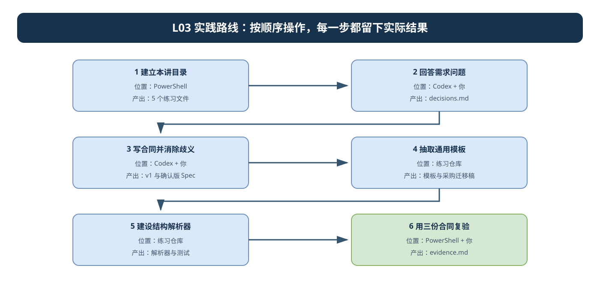
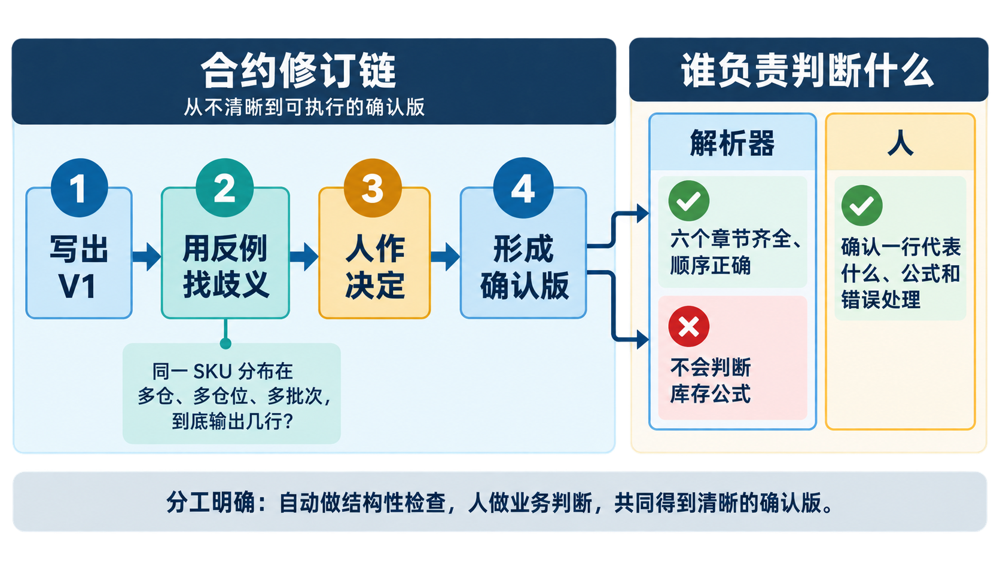
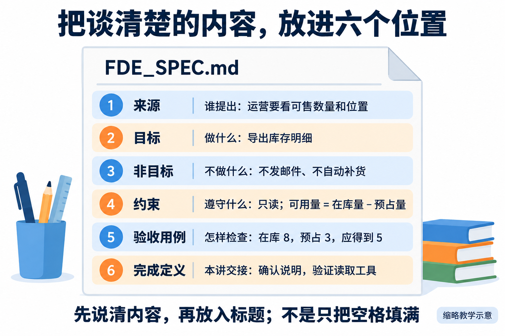
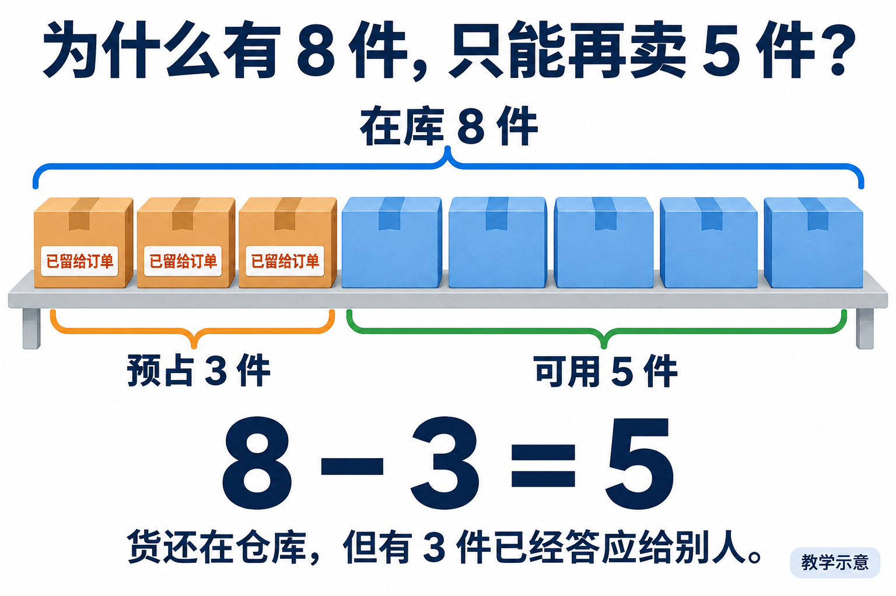
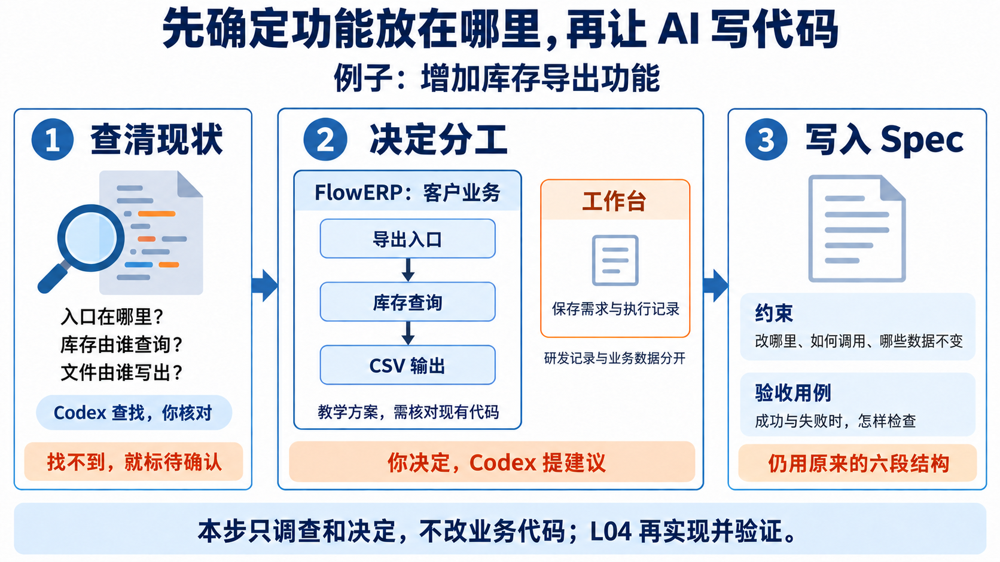
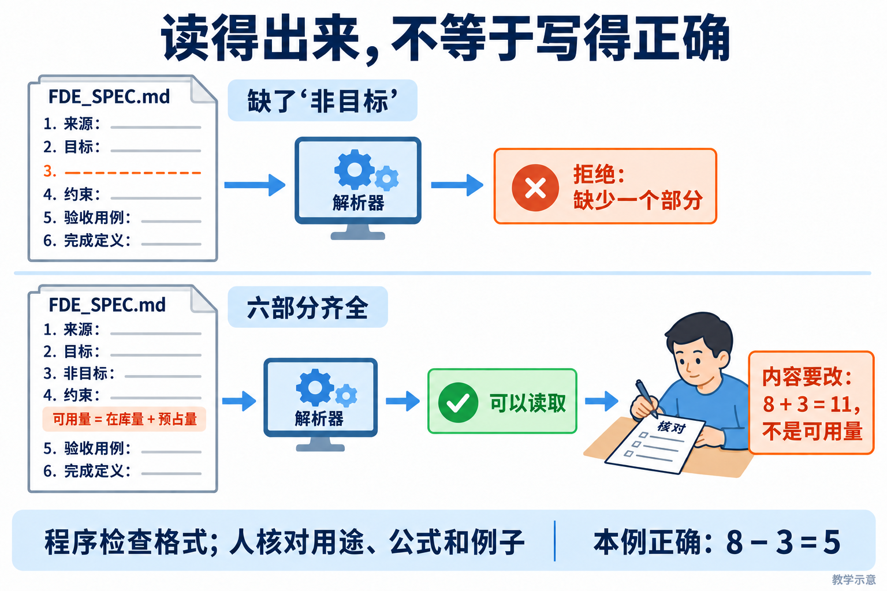
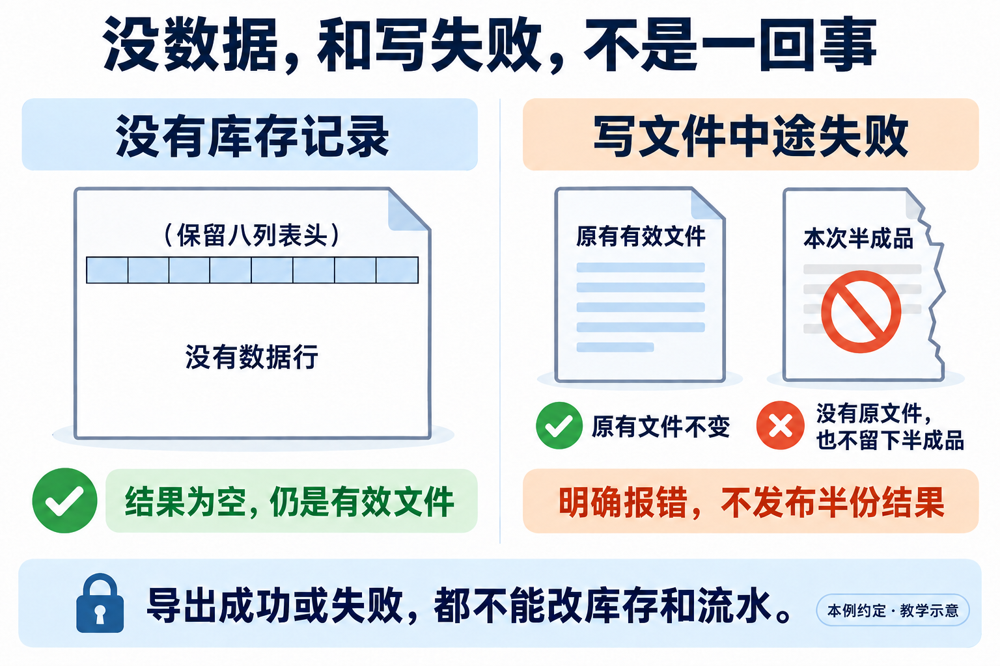

# L03｜把模糊需求变成可验收 Spec

> **终端选择：**本手册同时提供 Windows PowerShell 与 macOS 默认终端 zsh 的操作。每一步只运行自己系统对应的代码块；标为“通用”的 Python、Git 命令两端相同。开始或重开终端时，先按[macOS 环境与路径约定](../../reference/实操手册执行与排错.md#macos-zsh)恢复本讲使用的虚拟环境，再核对当前源码位置。

> 这是一份照着做的手册。不要先把全文看完：完成一步，看到完成标志，再进入下一步。

<a id="lesson-goals"></a>

## 本讲目标与通过要求

从已确认的长期规则出发，把“增加库存导出功能”澄清为六部分合同，再建设工作台模板与结构解析器。FlowERP 本讲得到可交接需求，库存 CSV 到 L04 才实现。

完成时逐项核对：

- 保留首次判断、实际设计调查、来源与本人业务决定，确认字段、粒度、排序、可用量口径和只读失败状态。
- 保留 V1、反例与修订后的确认版；模块、调用、数据归属和最小写集写入六段合同。
- 通用模板用于库存与采购草稿，采购专属口径重新确认；草稿不冒充客户批准。
- 工作台真实入口采用自己的解析实现；正常输入读回六字段，缺项等结构错误被拒绝且原输入保持。
- 对结构完整但公式错误的合同，由人用反例退回；解析成功不证明业务正确。
- 交接引用同一确认版路径、版本、内容指纹与实际结果；保留反馈与采购导出的迁移解释。

### 大纲四项合同

- **核心内容**：目标与非目标、正常与错误路径、边界条件、可执行验收项、最小变更原则。
- **演示结果**：把“增加导出功能”拆成结构化 `FDE_SPEC.md`。
- **课内增量**：由学生在外循环直接监督 Codex 实现 Spec 模板与最小解析器，只生成和校验合同结构，不执行 FlowERP 业务编码。
- **通过标准**：Spec 至少包含目标、非目标、约束、验收用例和来源；缺失必要字段时返回明确错误。

按下面的步骤操作，个人索引用 [SUBMISSION 填写提示](SUBMISSION.md) 核对；它只提供字段，不预填结果。

## 先用一句话看懂本讲

客户只说了一句：**“增加库存导出功能。”**

这句话还不能直接交给 Codex 编码，因为至少有这些问题没有答案：导出哪些列？一行代表一个商品、一个仓库还是一个批次？空库存怎样处理？写文件失败后怎么办？

所以本讲只完成三件事：

```text
模糊需求
   ↓ 你回答问题并作决定
可验收的库存导出合同 FDE_SPEC.md
   ↓ 你和 Codex 建设工作台能力
能检查合同结构的解析器
   ↓ 你用正确、缺章、业务错误三份合同复验
证明“结构检查”和“业务判断”不是一回事
```

**本讲不开发库存导出功能。**真正的业务编码留到 L04。

第一次阅读只记住两项最终成果：

1. 一份已经消除关键歧义的库存导出合同 `FDE_SPEC.md`；
2. 一个只检查合同六段结构、不会冒充业务裁判的解析器。

---

## 你在哪里操作

先在 Codex 中打开你自己的课程练习仓库。后面所有路径都以这个仓库为起点。

```text
〈你的课程练习仓库〉/                 ← Codex 打开这里，终端也从这里开始
├─ AGENTS.md
├─ lesson-01-submission/              ← 以前的材料，不修改
├─ lesson-03-submission/              ← 本讲的个人提交材料
│  ├─ decisions.md                    ← 你作出的业务决定
│  ├─ FDE_SPEC-v1.md                  ← 第 3 步保存的第一版；开始时还不存在
│  ├─ FDE_SPEC.md                     ← 修订后的确认版合同
│  ├─ procurement-draft.md            ← 用模板完成的迁移练习
│  └─ evidence.md                     ← 命令、结果和你的判断
├─ workbench/
│  ├─ templates/SPEC_TEMPLATE.md      ← 本讲新增的通用模板
│  └─ spec.py                         ← 本讲新增或修改的结构解析器
└─ tests/                             ← 解析器测试
```

不要在课程参考仓库中填写个人答案，也不要把 `lesson-03-submission/` 建到仓库外面。

---

## 六步路线



| 步骤 | 你要完成什么 | 完成后留下什么 |
|---|---|---|
| 1 | 建立本讲目录 | 4 个个人记录文件和 1 个工作台模板文件 |
| 2 | 回答需求问题 | `decisions.md` |
| 3 | 写合同并消除歧义 | `FDE_SPEC-v1.md`、`FDE_SPEC.md` |
| 4 | 抽取通用模板 | `SPEC_TEMPLATE.md`、`procurement-draft.md` |
| 5 | 建设结构解析器 | `spec.py`、测试结果 |
| 6 | 用三份合同复验并交接 | `evidence.md` |

---

## 第 1 步：建立本讲目录

> **一句话说明：**在自己的练习仓库建立 L03 专用目录，后续合同、反例和解析器都放在这里。

**在哪里：**练习仓库中的终端（Windows PowerShell / macOS zsh）。

复制下面整个代码块，按一次回车：

**Windows（PowerShell）：**

```powershell
& {
    $repo = git rev-parse --show-toplevel 2>$null
    if ($LASTEXITCODE -ne 0 -or -not $repo) { throw '当前目录不是 Git 练习仓库。' }
    Set-Location $repo.Trim()

    New-Item -ItemType Directory -Force -Path `
        'lesson-03-submission', 'workbench/templates' | Out-Null

    @(
        'lesson-03-submission/decisions.md',
        'lesson-03-submission/FDE_SPEC.md',
        'lesson-03-submission/procurement-draft.md',
        'lesson-03-submission/evidence.md',
        'workbench/templates/SPEC_TEMPLATE.md'
    ) | ForEach-Object {
        if (-not (Test-Path -LiteralPath $_)) {
            New-Item -ItemType File -Path $_ | Out-Null
        }
    }

    python -X utf8 -c "import workbench; from pathlib import Path; print('仓库：', Path.cwd()); print('工作台源码：', workbench.__file__)"
    Write-Host '准备完成：lesson-03-submission'
}
```

**macOS（zsh）：**

```zsh
prepare_l03() {
  local repo
  repo="$(git rev-parse --show-toplevel)" || return 1
  cd "$repo" || return 1
  mkdir -p lesson-03-submission workbench/templates || return 1
  local file
  for file in lesson-03-submission/decisions.md lesson-03-submission/FDE_SPEC.md \
    lesson-03-submission/procurement-draft.md lesson-03-submission/evidence.md \
    workbench/templates/SPEC_TEMPLATE.md; do
    [ -e "$file" ] || touch "$file" || return 1
  done
  python -X utf8 -c "import workbench; from pathlib import Path; print('仓库：', Path.cwd()); print('工作台源码：', workbench.__file__)" || return 1
  printf '准备完成：lesson-03-submission\n'
}
prepare_l03
```

**看到什么才算完成：**最后显示“准备完成”，并且打印的仓库、工作台源码都属于你的练习区。

**如果失败：**

- 提示“不是 Git 练习仓库”：在 Codex 中重新打开自己的练习仓库；
- 提示找不到 `workbench`：恢复 L01 使用的虚拟环境后重试；
- 文件已经存在：不要删除，命令不会覆盖已有内容。

完成后再进入第 2 步。

---

## 第 2 步：先回答八个问题，不写 Spec

> **一句话说明：**先用自己的话回答来源、目标、边界和验收，不要一开始就让 Codex替你写完整合同。

**在哪里：**Codex 对话窗口和 `lesson-03-submission/decisions.md`。

先把下面内容写入 `decisions.md`：

```markdown
# L03 库存导出决定记录

记录人：
日期：
业务确认人：（课堂角色练习就写“角色练习”）

| 必须决定的问题 | 来源或事实 | 我的决定 | 理由 | 状态 |
|---|---|---|---|---|
| 谁使用导出结果，用它作什么决定？ | | | | 待确认 |
| 一行代表商品、仓库、仓位还是批次？ | | | | 待确认 |
| 可用量怎样计算？ | | | | 待确认 |
| 导出哪些列，顺序是什么？ | | | | 待确认 |
| 多行按什么顺序排列？ | | | | 待确认 |
| 没有库存时输出什么？ | | | | 待确认 |
| 写出失败后怎样处理旧文件和半成品？ | | | | 待确认 |
| 成功或失败后，哪些业务数据不能改变？ | | | | 待确认 |
```

然后把下面这段话发给 Codex：

```text
请对“增加库存导出功能”进行需求访谈，先不要修改文件，也不要写代码。
请按 lesson-03-submission/decisions.md 表格中的顺序提问，每次只问一个最关键的问题。
每次说明：这个问题为什么必须由人决定，以及不同答案会产生哪两种实现。
如果仓库中能找到事实，请给出文件路径；找不到就标记“待确认”，不要猜。
```

Codex 每问一个问题，你就回答一个问题，并把结论写回表格。至少亲自打开一个 Codex 引用的文件，确认它确实支持该结论。

本课程采用的可用量示例是：

```text
在库量 8 - 已预占量 3 = 可用量 5
```

这只是需要写进合同的业务口径，不是解析器要计算的内容。

**看到什么才算完成：**八行都有来源或明确的“待确认”；不能把 Codex 建议直接写成“已确认”。

**如果卡住：**未知项保留“待确认”。有关键项待确认时可以写草稿，但不能称为确认版。

完成后再进入第 3 步。

---

## 第 3 步：生成 V1，用反例找歧义，再形成确认版

> **一句话说明：**让 Codex整理第一版合同，再用一个具体反例找出歧义，修改到不同人会得到同一判断。



先沿左侧完成合同修订，再看右侧分工：解析器只能检查六个章节是否齐全、顺序是否正确；一行代表什么、库存公式和错误处理仍必须由人确认。



先按图检查六个部分是否齐全；齐全只代表结构完整，下一步还要用反例检查语义是否明确。



**在哪里：**Codex 对话窗口、`FDE_SPEC.md` 和 `decisions.md`。

本步先完成 3.0 的设计判断，再按下面三小段前进，不要让 Codex 一次完成全部工作：

```text
根据已确认决定写 V1
        ↓
用“多仓库、多仓位、多批次”反例找出歧义
        ↓
你作决定，Codex 按决定修订为确认版
```

### 3.0 先确定功能放在哪里



*从左到右读：Codex 查找现有代码，你核对并决定分工，再把决定写入 Spec。中间是教学方案，需与自己的仓库核对；L04 才实现并验证。*

**在哪里：**同一个 `lesson-03-submission/decisions.md`，本步只读调查已有源码，不修改 FlowERP。

先写下自己的判断：库存数据属于谁，导出入口应调用谁，工作台是否应该复制库存业务逻辑。然后发送：

```text
请只读调查库存导出相关的现有结构，先不改代码。
列出实际入口、库存查询和业务计算、数据访问、CSV 输出的位置；不存在就注明不存在。
每项给出实际仓库、文件、函数与调用依据，区分当前事实和拟新增能力。
核对权限在哪里检查、导出是否可能修改库存，以及失败如何向调用者报告。
若未提供独立 FlowERP 源码，只报告缺少哪些依据，不猜路径和接口。
提出最小方案，说明沿用哪些边界、调整哪些位置及理由，等待我作出决定。
```

你亲自核对至少一处调用。在 `decisions.md` 追加“设计决定”，保存当前与拟调整关系的简图（文本箭头也可以），并填写：

| 设计问题 | 当前依据或待确认项 | 我的选择与理由 | L04 怎样验证 |
|---|---|---|---|
| 模块职责与允许修改范围 | | | |
| 入口到查询、文件输出的调用关系 | | | |
| 数据归属、权限与成功失败后的不变状态 | | | |
| 复用的命名、接口与错误处理示例 | | | |

**完成标志：**能沿图解释一次导出，指出实际与拟新增部分，并说明为什么没有重复库存规则。将已确认决定纳入下一步 Spec 的约束和验收用例。

**遇到缺口：**源码或关键权限、接口约定无法确认时，保留草稿及未知项；补齐来源后再确认，不以 AI 的建议代替事实。不在本步启动重构或创建前端页面。

### 3.1 让 Codex 写第一版

发送下面这段话：

<a id="prompt-clarify"></a>

<details>
<summary>给 Codex 的提示词：澄清并形成可确认合同</summary>

只在本步骤前提满足后复制；填写实际路径，已有决定与授权继续沿用。

~~~~text
本次处于实践手册第 3.1 步：读取 lesson-03-submission/decisions.md，只起草 lesson-03-submission/FDE_SPEC.md 第一版。先返回初稿，待我按后面的命令保存 V1 后，再到第 3.2～3.3 步进行反例审查和确认。模板与采购草稿到第 4 步再做，本轮先不生成。

你正在协助我建设“个人研发自动化工作台”的需求入口。当前任务不是直接开发库存导出，而是把一句模糊诉求转成后续工作台能够解析、审查和交接的执行合同。

【原始需求】
增加库存导出功能。

【本次允许形成的成果】
1. 本需求的来源、问题、未知项和实际决定记录；
2. 六部分确认版 Spec：来源、目标、非目标、约束、验收用例、完成定义；
3. 本次只形成第 3 步合同产物；通用模板与采购草稿留到第 4 步。

【项目边界】
- 先读取仓库中的 AGENTS.md、L03 讲义、实践手册、workbench/spec.py 和相关测试，引用实际文件后再判断；
- 只调查、澄清和起草合同，不修改 FlowERP 业务代码，不实现 CSV 导出，不启动后续执行任务；
- 区分仓库事实、课堂情境、我的实际决定和你的建议；未知项保持未知；
- 你可以提出候选方案，但业务口径和是否确认由我决定；不要代签姓名、日期或确认状态；
- 不额外制造重复 PRD、技术方案或架构附件。调查与采用理由写入现有决定记录，合同写入同一份 Spec。

【先做工作台定位】
先用不超过 8 行说明这份合同在工作台中的调用链：
业务原话 → 决定记录 → 确认版 Spec → workbench.spec → workbench.cli spec → L04 --requirement-spec。
分别说明人在链路中决定什么、Codex 协助什么、L03 建什么、L04 才执行什么。若实际仓库与这条链路不同，先报告差异，不要凭空补齐。

【澄清过程】
先只读调查，再提出最多 5 个会改变验收结果的问题。优先覆盖：
- 导出结果给谁作什么决定；
- 在库量还是可用量；
- 一行代表 SKU、仓位还是其他对象；
- 字段、排序、空集和 CSV 特殊字符；
- 写出失败时是否允许部分文件，以及库存状态必须保持什么。

每个问题说明：如果不回答，可能出现哪两种互相冲突的实现。等待我回答后再起草，不把默认偏好写成已确认要求。

【设计决定】
冻结合同前，只读追踪实际入口、库存查询、数据访问和文件输出，给出文件与函数依据；无源码则标待确认。把当前与拟调整关系简图、模块职责、数据与权限归属、最小修改范围及选择理由写入已有 decisions.md。由学生确认后，将技术约束与对应检查分别纳入六段 Spec 的约束、验收用例，不新增架构章节，不在 L03 实现或重构 FlowERP。

【起草要求】
把我的回答写成六部分 Spec。每条验收用例都写出：给定条件、执行操作、可观察结果、失败后必须保持的状态。来源部分能回指原始诉求、仓库事实和实际决定；完成定义能被下一讲的实现者与复验者共同采用。

完成候选稿后，读取 docs/courses/L03/examples/skills/spec-acceptance-review/SKILL.md 进行审查 进行反例审查。先展示发现和建议，等我决定采用、修订或拒绝后再生成确认版。确认版写明路径、版本、确认人/状态与日期；未确认时明确标为 draft。

【完成报告】
最后只报告：
1. 新增或修改的文件；
2. 原始需求经过哪些实际决定变成合同；
3. Spec 修订前后最关键的差异；
4. 模板与采购草稿待第 4 步验证；
5. 当前状态是 draft 还是 contract_ready；
6. 仍未确认的内容，以及为什么它们阻止进入 L04。
~~~~

</details>


第一版写完后，按自己的终端保存它：

**Windows（PowerShell）：**

```powershell
$v1 = 'lesson-03-submission/FDE_SPEC-v1.md'
if (Test-Path -LiteralPath $v1) {
    throw 'FDE_SPEC-v1.md 已存在。请保留旧证据并换一个版本名。'
}
Copy-Item -LiteralPath 'lesson-03-submission/FDE_SPEC.md' -Destination $v1
```

**macOS（zsh）：**

```zsh
save_l03_v1() {
  local v1='lesson-03-submission/FDE_SPEC-v1.md'
  if [ -e "$v1" ]; then
    printf 'FDE_SPEC-v1.md 已存在，请保留旧证据并换一个版本名。\n'
    return 1
  fi
  cp 'lesson-03-submission/FDE_SPEC.md' "$v1"
}
save_l03_v1
```

如果 `FDE_SPEC-v1.md` 已存在，不要覆盖；改用 `FDE_SPEC-v2.md` 等新名字保存本次版本。

### 3.2 用一个反例检查歧义

把下面问题发给 Codex：

```text
请只读审查 lesson-03-submission/FDE_SPEC.md：
同一个 SKU 分布在两个仓库、三个仓位和两个批次时，
合同究竟要求输出几行？请指出原文中可能产生两种实现的句子。
只指出歧义，不替我决定，也不要修改文件。
```

你根据使用者的真实目的作出决定，把理由写进 `decisions.md`，再让 Codex 按这个决定修改 `FDE_SPEC.md`。

### 3.3 核对合同是否可以验收

确认 `FDE_SPEC.md` 至少明确了：

- 列顺序：`sku,name,site,location,lot_id,on_hand,reserved,available`；
- 在库 8、预占 3 时，可用量为 5；
- 一行代表什么，以及多行怎样稳定排序；
- 空库存时输出表头、空文件还是错误；
- 中文、逗号、引号和换行怎样保真；
- 写出失败后旧文件和半成品怎样处理；
- 成功和失败都不修改库存与流水。

**看到什么才算完成：**`FDE_SPEC-v1.md` 保留原歧义，`FDE_SPEC.md` 已消除该歧义；修改理由能在 `decisions.md` 找到。

**如果合同还有“待确认”：**继续标记为草稿，不要虚构确认人或确认日期。

完成后再进入第 4 步。

---

<a id="template-transfer"></a>

## 第 4 步：把本次合同变成通用模板

> **一句话说明：**从已经验证过的合同中抽出可复用结构，但把本次业务数据和结论留在实例里。

**在哪里：**Codex 对话窗口。

发送下面这段话：

```text
请从 lesson-03-submission/FDE_SPEC.md 抽取通用模板，
写入 workbench/templates/SPEC_TEMPLATE.md。

模板保留“来源、目标、非目标、约束、验收用例、完成定义”六个标题，
每节只写填写提示。删除库存公式、字段、仓位、人员和本次结论。

然后使用这个模板起草“采购申请导出”，写入
lesson-03-submission/procurement-draft.md。
采购对象、状态、字段和权限没有来源时写“待确认”，不要复制库存答案。
```

你只检查两件事：

1. `SPEC_TEMPLATE.md` 中不应出现 `available`、仓位、批次等库存专属答案；
2. `procurement-draft.md` 可以复用六段结构，但不能照抄库存规则。

**看到什么才算完成：**模板可以用于库存和采购两个需求，而采购稿中的未知内容仍是“待确认”。

**如果发现库存答案残留：**只删除具体答案，保留“这里应填写什么”的提示。

完成后再进入第 5 步。

---

## 第 5 步：建设只检查结构的解析器

> **一句话说明：**实现一个只检查六个章节是否存在的最小解析器，不让它假装理解业务语义。



**在哪里：**Codex 对话窗口和练习仓库。

解析器只回答一个问题：**合同的六段结构是否完整？**它不判断库存公式是否正确。

先读[辅导资料的解析示范](辅导资料.md#从一段文本看懂解析器怎样工作)，解释正式标题与代码块示例的区别，以及正文怎样映射为字段。再核对下面的实现要求；两节教学片段不完整，正式复验应使用六节合同。

本步的正确顺序是：

<a id="prompt-parser"></a>

<details>
<summary>给 Codex 的提示词：建设结构解析器</summary>

只在本步骤前提满足后复制；填写实际路径，已有决定与授权继续沿用。

~~~~text
你正在协助我建设“个人研发自动化工作台”的合同闸门。目标是让确认版 Spec 经过同一个工作台入口，变成后续任务能够消费的结构化对象；结构错误必须在进入 L04 执行前被拒绝。

【输入】
- 本人确认版 Spec 路径：<填写实际路径>
- 目标模块：workbench/spec.py
- 工作台入口：python -X utf8 -m workbench.cli spec <SPEC_PATH>
- 允许修改范围：workbench/spec.py、对应测试、workbench/templates/SPEC_TEMPLATE.md；只有实际缺少 CLI 接线时才允许修改 workbench/cli.py，并先说明原因。

【项目边界】
- 本讲仅建设工作台解析器，不修改独立 FlowERP 项目的业务包、客户页面或库存导出实现；
- 不自动提交业务任务，不调用 Harness，不生成 CSV；
- 解析失败时不改写原 Spec，也不产生部分业务状态；
- 保留现有模块的其他职责和兼容接口；不要为了制造红灯删除已有正确能力。

【第一步：确认真实起点】
先读取目标模块、CLI 和测试，画出当前实际调用路径：
workbench.cli spec → load_spec(path) → parse_spec(text) → ParsedSpec.as_dict()。

将现状归入一种状态，并给出文件证据：
A. 解析能力缺失；
B. 解析函数存在，但 CLI 或后续入口没有调用；
C. 已经接入且现有测试通过，但缺少本次要求的证据。

不要把课程参考终态的绿灯写成我的建设成果。若学习任务提供隔离起点，在不清理当前未提交修改的前提下使用该起点；若只能观察终态，如实记录“参考能力复验”。

【第二步：冻结组件合同】
在写代码前先列出接口与失败语义：
1. 输入：UTF-8 Markdown 文本或文件路径；
2. 成功：返回来源、目标、非目标、约束、验收用例、完成定义六个原文字段；
3. 失败：明确指出缺章、空章、重复、乱序、未知标题或未闭合代码围栏；
4. 副作用：只读，不修改输入文件，不启动 FlowERP；
5. 集成：CLI 的 spec 分支必须调用本次验证的 load_spec/parse_spec，不允许复制第二套解析逻辑。

【第三步：先设计验证，再实现】
先写测试并说明每项保护工作台的什么风险：
- 正常输入：六字段和值与原文一致；
- 缺章、空章、重复、乱序、未知标题；
- 代码围栏中的“## 标题”不应被识别为合同章节，未闭合围栏应拒绝；
- load_spec 使用 UTF-8 读取；
- 失败前后原文件哈希不变；
- CLI 集成：正常输入退出 0 并输出六字段，错误输入非 0 且错误能定位；
- 调用路径证明 CLI 使用 workbench.spec，而不是测试只调用了一个无人使用的练习模块。

在授权范围内先运行测试并保存真实输出，再完成最小实现，重跑同一组测试。若起点已经全绿，保留结果，检查是否缺少 CLI 集成、只读性或调用路径证据；没有真实缺口时不要伪造红灯。

【第四步：接回工作台】
若个人实现最初位于练习模块，将它接入 workbench/spec.py 的 parse_spec(text) 与 load_spec(path)，并保持 ParsedSpec.as_dict() 六字段接口。然后从同一个 CLI 入口读取：
1. 库存导出确认版；
2. 采购申请导出草稿；
3. 缺少“约束”章节的副本。

核对前两份合同保留各自原文；第三份必须拒绝。采购草稿结构通过但仍有“待确认”时，只能报告“结构有效、业务未确认”。

【完成报告】
按“工作台项目增量”报告，而不是只说测试通过：
1. 修改文件和允许范围；
2. 修改前、修改后的真实调用路径；
3. 单元测试与 CLI 集成测试的命令、数量、输出和退出码；
4. 正常输入与错误输入的实际结果；
5. 输入文件未改变的证据；
6. 后续 L04 将复用的接口与字段；
7. 当前状态是 parser_only、gateway_connected 还是能力待接入；
8. 仍未验证的事项。
~~~~

</details>

```text
先查看现有入口
    ↓
先写“完整合同通过、缺章合同拒绝”的测试
    ↓
运行测试，保存实现前结果
    ↓
只在允许文件中做最小实现
    ↓
再次运行同一测试，保存实现后结果与 Diff
```


开始修改前先运行一次下面的测试并保存结果；实现完成后再运行同一条命令：

**Windows（PowerShell）：**

```powershell
python -X utf8 -m unittest tests.test_spec_contract tests.test_spec_cli -v
$LASTEXITCODE
```

**macOS（zsh）：**

```zsh
python -X utf8 -m unittest tests.test_spec_contract tests.test_spec_cli -v
printf '退出码：%s\n' "$?"
```

把两次实际命令、测试数量、输出、退出码和修改文件写进 `evidence.md`。如果起点已经通过，就写“现有能力复验”，不要破坏代码制造红灯。

**看到什么才算完成：**测试包含“完整合同通过”和“残缺合同拒绝”两类路径，退出码为 `0`，CLI 确实调用 `workbench/spec.py`。

**以下都不算通过：**运行了 0 条测试、导入了别处的代码、只有环境报错、只凭 Codex 说“已经完成”。

完成后再进入第 6 步。

---

## 第 6 步：用三份合同证明能力边界

> **一句话说明：**分别运行完整合同、缺章节合同和语义含糊合同，证明结构检查通过不等于业务合同合格。



**在哪里：**练习仓库终端（Windows PowerShell / macOS zsh）和 `evidence.md`。

这一阶段不再修改解析器。你只用三份输入回答两个问题：结构是否完整？业务内容是否正确？

### 6.1 准备三份输入

| 输入 | 故意放入什么 | 应得到什么结果 |
|---|---|---|
| `FDE_SPEC.md` | 结构完整、业务口径正确 | 解析通过 |
| `missing-section.md` | 删除“非目标”整节 | 解析拒绝 |
| `wrong-formula.md` | 六段完整，但把可用量写错 | 解析通过，人工拒绝 |

先复制两份故障文件：

**Windows（PowerShell）：**


```powershell
& {
    $source = 'lesson-03-submission/FDE_SPEC.md'
    $missing = 'lesson-03-submission/missing-section.md'
    $wrong = 'lesson-03-submission/wrong-formula.md'

    if ((Test-Path -LiteralPath $missing) -or (Test-Path -LiteralPath $wrong)) {
        throw '故障文件已经存在。请保留旧证据并换新文件名。'
    }
    Copy-Item -LiteralPath $source -Destination $missing
    Copy-Item -LiteralPath $source -Destination $wrong
}
```

**macOS（zsh）：**

```zsh
prepare_l03_faults() {
  local source='lesson-03-submission/FDE_SPEC.md'
  local missing='lesson-03-submission/missing-section.md'
  local wrong='lesson-03-submission/wrong-formula.md'
  if [ -e "$missing" ] || [ -e "$wrong" ]; then
    printf '故障文件已存在，请保留旧证据并换新文件名。\n'
    return 1
  fi
  cp "$source" "$missing" || return 1
  cp "$source" "$wrong"
}
prepare_l03_faults
```

然后手工编辑：

- 在 `missing-section.md` 中删除“`## 非目标`”及该节正文；
- 在 `wrong-formula.md` 中把公式改成“可用量 = 在库量”。

不要修改确认版 `FDE_SPEC.md`。

### 6.2 分别运行解析器

<a id="prompt-verification"></a>

<details>
<summary>给 Codex 的提示词：结构与语义分别复验</summary>

只在本步骤前提满足后复制；填写实际路径，已有决定与授权继续沿用。

~~~~text
请协助我复验 L03 建设的“个人研发自动化工作台需求入口”。你不参与补写业务口径，不替需求负责人签字，也不实现库存导出。

必须分别判断结构检查、语义审查和产品验收，三者不能互相替代。本次只执行结构检查与语义审查；产品验收尚未发生，只能列为后续交付需要证明的事项。

【需要核验的实际对象】
- 确认版库存导出 Spec：<填写路径与版本>
- 采购申请导出草稿：<填写路径>
- 工作台解析模块：workbench/spec.py
- 工作台 CLI：python -X utf8 -m workbench.cli spec <SPEC_PATH>
- 单元测试与 CLI 集成测试：<填写实际路径>
- 本人决定和修订记录：<填写实际路径>

【第一层：证明这是工作台入口，不是孤立练习】
只读检查 CLI 的 import 与调用路径，确认：
workbench.cli spec → load_spec → parse_spec → ParsedSpec.as_dict()。

再核对测试实际导入的模块和 CLI 实际调用的模块是否相同。若测试只验证独立练习文件，或 CLI 仍调用旧实现，立即报告“能力待接入”，不能继续写成工作台已获得能力。

【第二层：程序结构复验】
从真实 CLI 依次运行：
1. 库存导出确认版；
2. 采购申请导出草稿；
3. 缺少必要章节的副本；
4. 另一种结构错误输入。

运行前先写预测。运行后保存命令、输出、退出码，并比较每个输入文件运行前后的 SHA256。完整输入应输出六字段；结构错误应明确拒绝；任何输入都不应被改写。文件不存在、解释器错误或路径错误不算有效的结构拒绝实验。

【第三层：人工语义复验】
构造一份六部分结构完整、但把“可用量 = 在库量 − 预占量”改成“可用量 = 在库量”的反例，其他结构保持不变。先预测：解析器可以接受结构，业务审查者应退回含义。

采用 docs/courses/L03/examples/skills/spec-acceptance-review/SKILL.md 中的流程 审查该反例。用在库 8、预占 3 得到可用 5 的情境指出错误影响哪条约束和验收用例；再换一组数据复验。不要把库存公式硬编码进通用解析器，也不要为人工判断伪造退出码。

【第四层：核对交接版本】
确认交接包中的合同就是本次已确认、已解析、已复验的同一文件，而不是重新从聊天记录生成一份。记录：
- Spec 路径、版本、SHA256、确认人/状态和确认日期；
- 交接包中准备提供给后续受控执行入口的 Spec 路径；
- 解析结果中的六字段如何提供目标、非目标、约束和验收依据；
- 口径变化后必须生成新版本并重新确认；
- 后续交付仍需独立证明的业务结果：CSV 内容、库存不变、错误路径、范围内 Diff、Eval 和人审。

此处只核对 L03 的交接准备，不补写 Harness 或库存导出功能。

【最终结论】
请分四栏报告：
1. 已证明：有实际命令、文件、Diff 或哈希支持的结论；
2. 未证明：结构测试不能证明的业务含义与产品结果；
3. 退回项：合同、组件或接入仍存在的问题；
4. 工作台增量：相较直接把一句话发给 Codex，本次新增了哪一个统一入口、哪一个拒绝点、哪一份可追溯合同，以及它怎样进入后续受控交付。

只有合同已确认、解析器已接入、结构与语义复验完成，而且交接版本与确认版一致时，状态才是 handoff_ready。否则使用 contract_draft、gateway_not_connected 或 review_required，并说明下一步。
~~~~

</details>


**Windows（PowerShell）：**

```powershell
python -X utf8 -m workbench.cli spec lesson-03-submission/FDE_SPEC.md
Write-Host "退出码：$LASTEXITCODE"

python -X utf8 -m workbench.cli spec lesson-03-submission/missing-section.md
Write-Host "退出码：$LASTEXITCODE"

python -X utf8 -m workbench.cli spec lesson-03-submission/wrong-formula.md
Write-Host "退出码：$LASTEXITCODE"
```

**macOS（zsh）：**

```zsh
python -X utf8 -m workbench.cli spec lesson-03-submission/FDE_SPEC.md
printf '退出码：%s\n' "$?"

python -X utf8 -m workbench.cli spec lesson-03-submission/missing-section.md
printf '退出码：%s\n' "$?"

python -X utf8 -m workbench.cli spec lesson-03-submission/wrong-formula.md
printf '退出码：%s\n' "$?"
```

正确现象应是：

```text
确认版：      退出码 0       → 六段结构完整
缺章版：      非零退出码     → 解析器发现结构错误
错误公式版：  退出码 0       → 结构完整，但业务内容仍然错误
```

错误公式版通过解析器不是程序故障。解析器只检查结构；你必须根据“在库 8、预占 3，正确可用量应为 5，而错误公式得到 8”作出人工退回结论。

把三次真实输出和下面三句话写入 `evidence.md`：

```markdown
- 解析器能证明：六段结构完整或残缺。
- 解析器不能证明：库存公式和业务决定正确。
- L03 仍未证明：库存导出功能已经实现；该工作留到 L04。
```

最后运行：

**Windows（PowerShell）：**

```powershell
Get-FileHash -Algorithm SHA256 lesson-03-submission/FDE_SPEC.md
git status --short
```

**macOS（zsh）：**

```zsh
shasum -a 256 lesson-03-submission/FDE_SPEC.md
git status --short
```

记录确认版路径、版本、哈希、确认人、日期和“已确认／待复核”状态。

**看到什么才算完成：**三份输入出现预期的“通过、拒绝、通过但人工退回”，并且你能解释原因。

---

## 最后只检查这 8 项

- [ ] `decisions.md` 区分了仓库事实、Codex 建议和我的决定；
- [ ] `FDE_SPEC-v1.md` 保留了修订前版本；
- [ ] `FDE_SPEC.md` 六段完整，库存口径可以执行和验收；
- [ ] `SPEC_TEMPLATE.md` 没有库存专属答案；
- [ ] `procurement-draft.md` 复用了结构，没有照抄库存规则；
- [ ] 解析器既有通过用例，也有拒绝用例；
- [ ] `evidence.md` 保存了三份输入的真实输出和退出码；
- [ ] 没有声称库存导出功能已经完成。

完成 L03 后，交给 L04 的是：**确认版库存导出合同、通用模板、结构解析器和真实复验证据。**

---

## 常见问题

| 现象 | 现在怎么做 |
|---|---|
| 不知道该填什么 | 写“待确认”，不要猜 |
| Codex 一次问很多问题 | 要求它每次只问一个最关键问题 |
| `spec` 不是有效命令 | 回到第 5 步检查 CLI 接线 |
| 完整合同被拒绝 | 检查六个标题的名称、顺序和空章节 |
| 缺章合同仍通过 | 检查 CLI 是否调用了本次解析器 |
| 错误公式合同通过 | 这是预期结果；由人工业务审查退回 |
| 起点测试已经全绿 | 记录“现有能力复验”，不要制造假红灯 |
| 没有同伴复核 | 标记“待复核”，不要虚构签字 |
