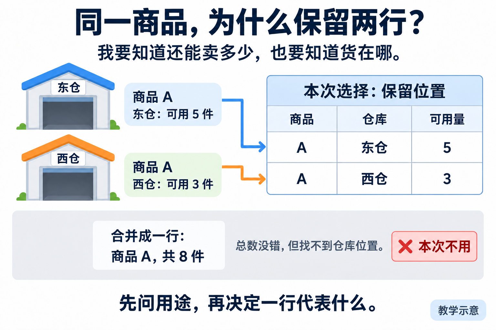
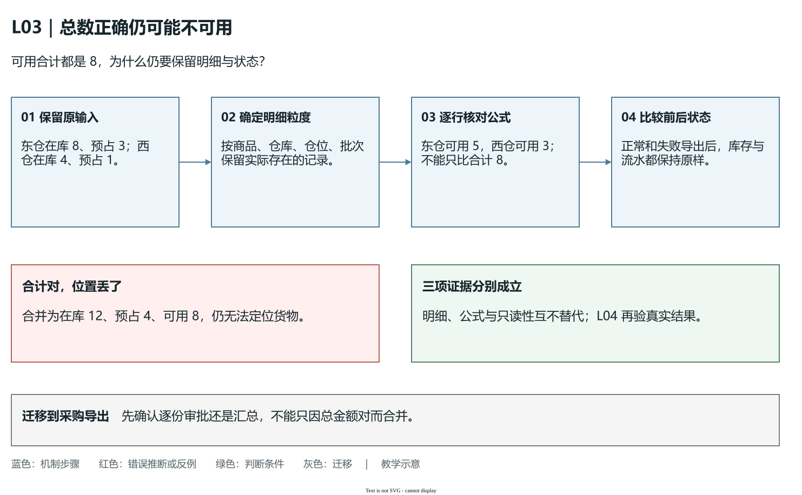

# L03｜把模糊需求变成可验收 Spec

运营说：“增加库存导出功能，我要知道还有多少货能卖。”这句话看似明确，却可以产生不同答案：导出在库还是可用数量，一行表示商品还是库位，空库存要不要生成文件，导出失败能否覆盖昨天的结果？

本讲沿着这一需求完成两件事：由你确认库存导出合同 `FDE_SPEC.md`，再与 Codex 建设通用模板和只检查结构的解析器。L01 学过写清一次需求，L03 把这项方法变成可重复使用的工作台能力。库存导出的业务编码留到 L04。

## 1｜先确定用途，才能确定数字的含义

需求澄清先问使用者拿结果做什么，再讨论文件格式。运营要知道还能承诺销售多少，以及货在哪里。若现有查询已经满足需要，可以先使用查询；本例确认还需要交接一份明细文件，因此选择建设导出。

商品 A 在东仓有 8 件，其中 3 件已留给订单。这 3 件仍在仓库里，却不能再次分配，称为**预占**；其余 5 件称为**可用**。本例可用量＝在库量－预占量。数字用于教学推演。


**图 3-1　先分清在库、预占和可用。**若文件只写“库存 8”，使用者可能把不能再次分配的 3 件也当成可售数量。字段名正确，数字含义仍可能错误。

西仓另有在库 4、预占 1，可用 3。合计可用 8 没有算错，但运营还要找货，所以必须保留东仓 5、西仓 3 两条明细。**一行代表什么，叫数据粒度**。本次以商品、仓库、仓位、批次的明细为粒度，不能为了简洁合并成每个商品一行。



**图 3-2　同一商品仍可有多行。**选择明细付出的代价是文件更长，得到的是位置与批次信息。是否合并取决于使用目的，不是所有导出都必须使用同一种粒度。

把这些取舍记入 `decisions.md`：谁提出、原话是什么、查到了什么、选择哪种口径、为什么放弃另一种方案。客户事实未知时标“待确认”；课堂角色确认要注明练习身份。Codex 可以追问和给建议，业务口径由你确认。

## 2｜目标、非目标和约束分别回答什么

**目标**描述这次完成后使用者能做什么：“得到可定位货物的库存明细文件”。**非目标**排除看似相关、这次却不做的工作：“不发邮件、不自动补货、不修改库存”。**约束**限制完成目标的方法与含义：“按在库减预占计算，复用库存查询，导出成功和失败都不改业务账”。

三者各自必要。只有目标，Codex 可能顺手增加自动补货；只有禁止事项，读者不知道要交付什么；只有约束，仍不知道哪些行为算成功。**最小变更**是在满足完整验收的前提下缩小修改面，而不是只做正常路径、留下错误路径不处理。

沿导出调查三个职责：入口接收参数并核对权限，库存查询提供明细，文件输出处理 CSV 格式与写出失败。**CSV**是以字段和行保存表格的文本格式；逗号、引号、换行需要专门规则，不能简单拼接字符串。


**图 3-3　为本次需求决定局部分工。**图是职责示意。请 Codex 只读追踪实际入口，你打开引用代码核对；不存在的位置标为拟新增。已有查询能满足要求就复用，避免导出再维护一套库存算法。

设计选择与理由保留在 `decisions.md`，确认后的调用关系、写集和错误处理写进 Spec 的约束。工作台保存客户任务合同，库存仍属于独立 FlowERP。完整结构选读见[库存导出架构选读](reference/参考说明.md)。

### Spec 驱动交付：四层判断接力，才能走到客户结果

**Spec 驱动交付**是先把确认的目标、边界和验收组织成合同，再让设计、实现和检查共同依据它推进。它的价值在于减少执行者自行猜测，而不是把自然语言自动变成正确代码。本例要连续完成四层判断；前一层通过，只能成为后一层的输入。

第一层是**业务判断**：运营拿文件决定什么，一行代表什么，可用数量怎样计算。东仓在库 8、预占 3，应报告可用 5；若运营还要找货，就保留位置明细。Codex 可以展示候选解释，但用途和口径由确认者选择。来源不清就继续访谈，把未知标出来，不能用解析器通过消除业务歧义。

第二层是**架构判断**：这份结果该由哪些已有职责协作产生。先看平台边界：工作台保存需求、开发任务和交付证据，独立 FlowERP 管理客户库存与业务账。再调查客户产品中实际的界面或 HTTP 入口、业务服务、数据存储及调用方向，最后聚焦导出。入口组织请求，库存能力提供已确认的明细，输出能力处理文件；它们可以在同一个应用内，无需为分工立即拆服务。若在页面中另算一份可用量，原查询与导出将可能各有一套库存口径。

第三层是**结构判断**：六节是否完整，原文能否被后续程序准确取出。`parse_spec()` 检查章节、顺序与内容，并不调查模块是否真实存在。第四层是**行为判断**：实际候选导出了什么，正常与失败后业务账怎样。后者在 L04 才执行；本讲交接的是能够驱动这项检查的合同，不能用结构通过提前宣告产品已完成。


**图 3-5　合同是判断的连接点。**这是教学示意。L02 从图左侧核对信息来源，本讲沿“当前上下文—Spec—行为检查”阅读。业务与架构决定写入合同，结构检查让程序取到原文，行为检查再检验实现；四层不能由一个绿色状态代替。

读图时把 Spec 写成“导出成功后清除预占”。六节齐全，程序仍可解析；业务判断应退回，因为它改变了导出的只读边界。再把约束写成“工作台直接修改客户库存数据库”，即使数字示例正确，架构判断仍须核对数据归属和授权。若最后候选 CSV 数字错误，则回到实现与行为检查；不必为了一个业务错误扩大通用解析器的职责。

完成判断要能从每项验收回到业务决定，从写集回到实际模块，从结构结果回到合同原文，并明确哪些行为尚未执行。迁移到采购申请导出时，六段模板与这四层接力可以复用，但审批权限、数据粒度和失败后状态都要重新确认。能够复用判断过程，同时替换当前业务答案，才是工作台获得通用能力的原因。

## 3｜把“正确”改成可以反驳的验收项

一项验收用例要包含**准备条件、操作、预期结果和失败后状态**。例如：“东仓在库 8、预占 3，西仓在库 4、预占 1；运行导出，保留两行，可用分别为 5 和 3；导出前后库存及流水不变。”同伴可以据此判断文件里的数字与业务状态。

只写“正确导出库存”不能反驳任何具体错误。“文件存在”也无法发现错误公式或缺失位置。验收项不是再说一遍目标，而是选出能够区分正确与错误方案的输入和比较方法。

沿用同一个导出，再覆盖以下边界：

| 条件 | 预期结果 | 排除的错误方案 |
|---|---|---|
| 多仓、仓位或批次 | 保留明细，按商品、仓库、仓位、批次排序 | 合并后丢失位置，顺序随输入漂移 |
| 没有库存记录 | 生成八列表头，没有数据行 | 空数据时报错或少了列 |
| 中文、逗号、引号、换行 | CSV 读取器读回后字段内容保持完整 | 直接用逗号连接字符串 |
| 写文件中途失败 | 明确报错，原有效文件保留，不留下可被误用的半成品 | 报错同时破坏旧文件 |
| 正常或失败导出 | 库存及流水均不变 | 导出顺手改变业务账 |

八列为 `sku,name,site,location,lot_id,on_hand,reserved,available`，分别表示商品编码、名称、仓库、仓位、批次、在库、预占、可用。完整格式见[库存导出修订样稿](examples/inventory-export-v2.md)。

公式、例子和比较方式需要同时出现。公式可迁移到别的数据，例子使错误容易暴露，比较方式让验收可执行。例如文本比对容易被合法的 CSV 转义误导，读回后逐字段比较更贴近客户要求。

### 总数相同，为什么仍可能交付了错误结果

沿用东仓 8、3 和西仓 4、1：先分别相减，得到 5 与 3；先合并为在库 12、预占 4，再相减，也得到可用 8。因此“文件的可用总数等于 8”只能验证一个总量关系，不能判定运营能否定位货物。数学结果相等，并不表示两份文件可互相替代。

设想三个候选实现，以下仅列与推理有关的结果，均为教学反例，没有实际生成业务文件：

| 候选结果 | 哪项检查可能通过 | 必须由哪项验收退回 |
|---|---|---|
| 商品 A 只有一行，可用 8，东、西仓被合并 | 可用总数等于 8 | 商品、仓库、仓位、批次明细保留 |
| 东仓可用 8，西仓可用 4，位置都有 | 两仓、两行和位置检查 | 可用量必须分别为 5 与 3 |
| 东仓可用 5，西仓可用 3，但导出后清除了预占 | 文件字段与数字检查 | 导出前后库存及流水不变 |

第一种错误是**丢掉信息**：合并以后，文件里无法再推回东仓有 5、西仓有 3。第二种错误是**算错含义**：明细存在，却把不能再次分配的预占当成可用。第三种错误是**改变了任务以外的状态**：输出看似正确，但下一次业务查询已经变了。三者分别需要粒度、公式、前后状态的证据；任何一项都不能包办另外两项。



**图 3-3a　用同一组输入反驳三种错误方案。**这是教学机制示意。上方从东仓 8、3 与西仓 4、1 推到两行 5、3，再核对导出前后状态；反例的合计 8 数学上成立，却丢失了找货需要的位置。[可编辑源图](assets/reading-depth-20261003/mechanism.drawio)。

读图时不要只盯着最后一个数：先问一行代表哪个真实库存明细，再比较这行的在库、预占与可用，最后回到独立 FlowERP 查询业务账有没有变化。“两个仓库、三个仓位、两个批次”也不能直接相乘得到行数；这些维度是否形成组合，要看实际存在的明细记录。不存在的仓位与批次组合不能为凑行数生成。手册第 3.2 步让同伴找多仓歧义，目的正是暴露这一决定，而不是猜一个固定数量。

完成判断应写成能够逐项反驳的句子：“读回八列，东、西仓明细分别为 5、3，位置与批次保留；正常和失败导出后，业务账保持原样。”L03 把它签入合同，L04 再用真实候选检验。迁移到采购申请导出时，先问审批者要看每份申请还是按供应商汇总；若汇总会隐去必须逐份审批的状态，就不能只因总金额正确而接受合并方案。需要保留的明细与状态须重新向使用者确认。

## 4｜把这次决定组织为六段合同

课程的 Spec 固定使用六个二级标题，按顺序填写。它们不是六个空框，而是把来源、结果、边界和检查连起来。

| 章节 | 本例要写清什么 |
|---|---|
| 来源 | 运营原话、使用目的、确认人，课堂练习身份和待确认项 |
| 目标 | 导出可定位货物的库存明细 |
| 非目标 | 不发邮件，不自动补货，不修改库存 |
| 约束 | 八列、计算口径、明细粒度、排序、调用分工与允许修改范围 |
| 验收用例 | 两仓数字、空数据、特殊字符、写出失败及业务账不变 |
| 完成定义 | L03 交接确认合同与可用解析器；L04 再验收实际业务导出 |

先保存 V1，再请同伴或 Codex 用反例找歧义。如果 V1 写“每个商品一行”，同伴指出多仓情形，你就必须决定是否保留明细，而不是让模型自行猜。保留原句、修订句与理由，最后确认一份版本交给下一讲。

模板只抽取六节标题和提问方式，不把“在库减预占”写成所有需求的答案。换成采购申请导出，结构可以沿用，字段、权限和业务规则要重新确认。

<a id="从一段文本看懂解析器怎样工作"></a>

## 5｜解析器怎样检查结构，为什么不裁决业务

**解析器**将文本分成程序能读取的字段。完整合同映射为 `source`、`goal`、`non_goals`、`constraints`、`acceptance`、`done`。它的职责是让后续工作台明确取到哪一段原文。

以两节片段说明切分，片段单独提交仍因缺章而被拒绝：

```markdown
## 目标
导出保留位置的库存明细。
## 非目标
不修改库存，不自动补货。
```

处理时，先识别正式标题的位置，再取相邻标题之间的正文；“目标”的正文止于“非目标”开始处。之后检查六节是否齐全、顺序正确且正文非空。重复标题不能悄悄覆盖，未知二级标题应明确报错。

代码块里可能也有 `## 目标`，但它只是正文示例。解析器需要追踪代码围栏是否打开，只在围栏外识别正式章节；围栏没结束时应拒绝，避免吞掉后面的合同。参考实现 [`workbench/spec.py`](../../../workbench/spec.py) 的 `_contract_headings()` 和 `parse_spec()`承担这些工作，只支持课程合同所用的 Markdown 子集。


**图 3-4　结构有效与业务正确分别检查。**删掉“非目标”应由程序拒绝；结构齐全却写成可用量＝在库量，仍能解析。人用东仓 8、3 的例子算出 5，才能退回业务错误。图中的相加错误也是同一边界的反例。

由你直接监督 Codex 先写结构测试，再实现并接入工作台入口。三份输入分别验证：正确合同读回原文，缺章合同定位错误，业务错误合同结构通过但人工退回。读文件不能改原文，也不能开始客户业务编码。

若完整文件被拒绝，先核对标题、顺序、空章与围栏；若业务错误被接受，先看你检查的是结构还是业务。给通用解析器硬编码库存公式，会让下一种需求无法复用，不能用扩大解析器职责代替业务审查。

## 6｜带着确认版进入实践与交接

按[实践操作手册](实践操作手册.md)完成六步：建立记录、回答需求问题、形成 V1 并修订、抽取模板、建设解析器、用三份输入复验。个人材料在 `lesson-03-submission/`，保留自己的判断、局部分工、Spec 版本、真实检查与同伴反馈，完成要求见[手册中的目标与通过要求](实践操作手册.md#lesson-goals)。

迁移练习仍是“采购申请导出”。请重新说明使用目的、一行代表什么、谁有权限、失败后保留什么，再套用六段结构。能解释为何库存例保留两行、解析通过仍会退回，以及哪些规则不能搬到采购例，才证明你会使用 Spec。

本讲应交接确认版 `FDE_SPEC.md`、设计依据、模板与已接入的结构检查入口。L04 先补齐执行工作台，再根据这份合同交付导出；合同结构通过与客户结果合格各有自己的证据。

[课程学习路线](../../README.md#16-讲学习路线) · [实践操作手册](实践操作手册.md) · [上一讲](../L02/辅导资料.md) · [下一讲](../L04/辅导资料.md)

## 课程大纲中的本讲要求

- **核心内容**：目标与非目标、正常与错误路径、边界条件、可执行验收项、最小变更原则。
- **演示结果**：把“增加导出功能”拆成结构化 `FDE_SPEC.md`。
- **课内增量**：由学生在外循环直接监督 Codex 实现 Spec 模板与最小解析器，只生成和校验合同结构，不执行 FlowERP 业务编码。
- **通过标准**：Spec 至少包含目标、非目标、约束、验收用例和来源；缺失必要字段时返回明确错误。
