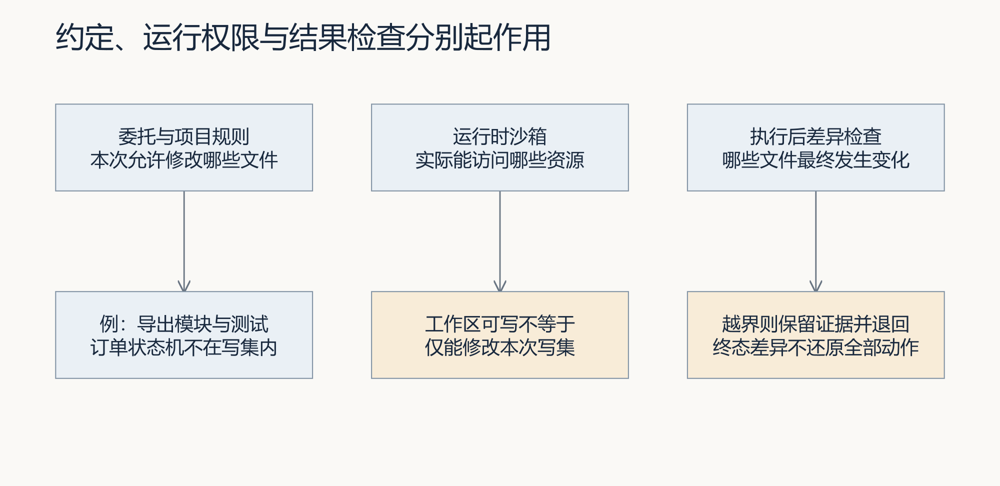
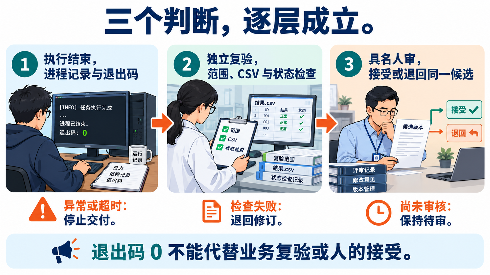
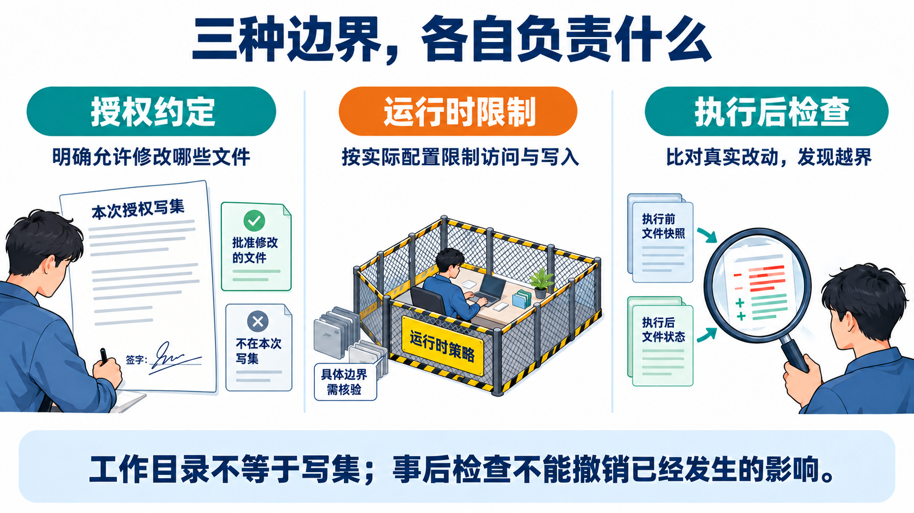
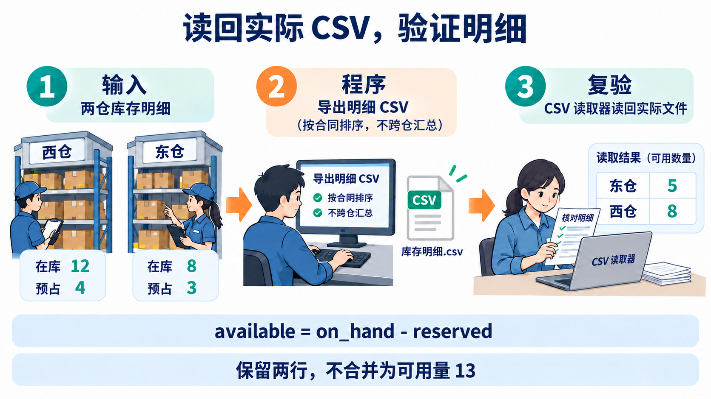
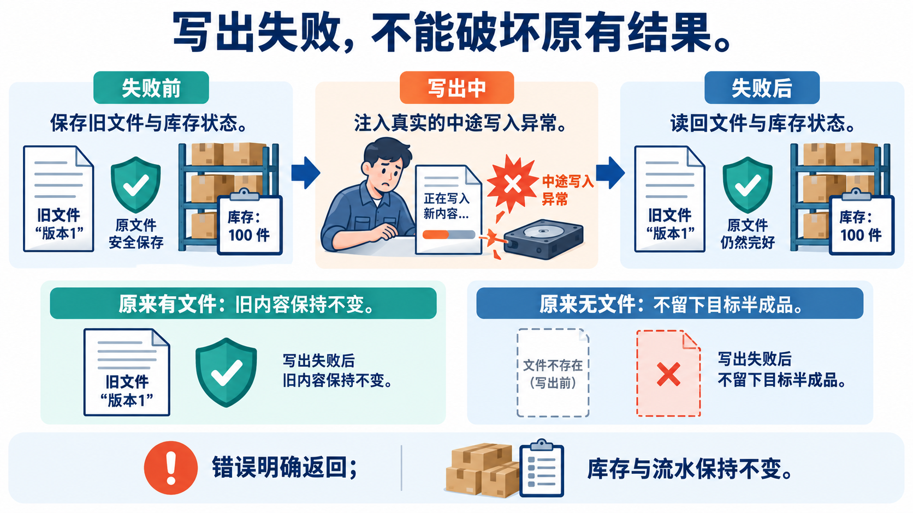
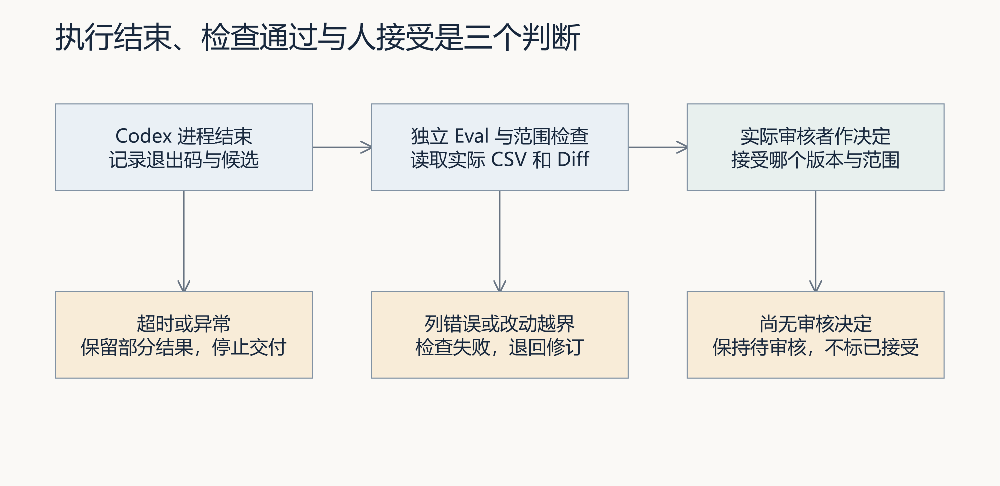

# L04｜委托 Codex 执行一次最小变更

> **终端选择：**本手册同时提供 Windows PowerShell 与 macOS 默认终端 zsh 的操作。每一步只运行自己系统对应的代码块；标为“通用”的 Python、Git 命令两端相同。开始或重开终端时，先按[macOS 环境与路径约定](../../reference/实操手册执行与排错.md#macos-zsh)恢复本讲使用的虚拟环境，再核对当前源码位置。

本讲只做一件事：**先把个人研发工作台 V0 补齐并验收，再用这个工作台交付 FlowERP 的库存导出。**

完成后，你应当留下两张相互独立的任务单：

- **Ticket A：建设工作台。**你直接监督 Codex 补齐受控执行、范围检查、最小 Eval、结果摘要和人工复核入口。
- **Ticket B：使用工作台。**已经通过验收的工作台读取 L03 Spec，在隔离候选中实现库存导出。


> **唯一顺序：A 建设 → A 独立复验 → B 执行 → B 独立复验。**
> A 没有通过，不启动 B；B 自动检查变绿，也不能跳过人工验收。

---

<a id="lesson-goals"></a>

## 本讲目标与通过要求

从 L01 任务与证据账、L02 规则、L03 确认版合同与解析器出发，先直接监督 Codex 补齐 Workbench V0，再由已接受的 V0 组织 FlowERP 库存导出。

完成时逐项核对：

- Ticket A 的增量合同与 Ticket B 的客户合同分开；先调查已有能力，不制造缺口。
- A 接通 Spec、受控执行、写集检查、最小 Eval、摘要与人审；覆盖仅复验、缺写集、失败／超时、越界与待人审。
- 非执行者亲自复验并接受具体 A 版本；A 未接受或控制源码变化时不启动／不继续 B，旧接受失效后重新复验。
- B 绑定有效 A 与 L03 确认版，在工作台创建的同一隔离候选实现；全量 Diff 与写集一致，不含密钥、环境文件或业务数据库。
- 亲自读取真实 CSV，检查八列、多仓位／批次、排序、空集、特殊字符及五组正常／文件失败情境；库存与流水保持只读。
- 执行器结果、自动检查和人工接受分别留证；review 任务先按状态规则返工，不直接重跑。
- 保留 A→B→候选→结果→具名决定的索引、真实失败／失效与修订，以及采购导出的迁移判断。

### 大纲四项合同

- **核心内容**：非交互执行、工作目录、权限边界、结果采集与人工确认点。
- **演示结果**：读取第 3 讲 Spec，委托 Codex 完成一个小型代码变更并运行测试。
- **课内增量**：先由学生直接监督 Codex 补齐并独立验收 Workbench V0 的执行入口、写集检查、最小 Eval 和结果摘要，再由 V0 在授权工作区调用 Codex 交付库存导出；不额外包装为文件读写 MCP。
- **通过标准**：变更能够运行；基础测试通过；摘要包含修改文件、验证命令和剩余风险；密钥和环境文件未提交。

按下面的步骤操作，个人索引用 [SUBMISSION 填写提示](SUBMISSION.md) 核对；它只提供字段，不预填结果。

## 一、开始前先认清三个位置

本讲会看到多个目录，但它们不是三套项目。

```text
你的课程练习仓库/                     ← 你一直操作的控制仓库
├─ AGENTS.md
├─ lesson-03-submission/
│  └─ FDE_SPEC.md                    ← B 的需求合同
├─ lesson-04-submission/             ← 你本讲填写的证据
├─ workbench/                        ← A 要补齐和复验的工作台代码
└─ .runtime/l04-learning/            ← 任务记录，不提交

独立 FlowERP 仓库/                   ← 客户产品的事实来源

工作台为 Ticket B 创建的隔离候选/     ← 临时实现区，路径由任务事件给出
├─ flowerp/
├─ eval/
├─ tests/
└─ .course/                          ← 若实际候选提供课程元数据，在这里核对来源
```

三条边界必须记住：

1. 你始终从**课程练习仓库**发起命令。
2. Ticket B 只修改工作台创建的**隔离候选**，不要把其中的 `flowerp/` 复制回课程练习仓库。
3. `.runtime/` 是运行证据，不是课程源码，不要提交。


---

## 二、全程路线图

```text
第 1 步：准备证据文件
    ↓
第 2 步：写清 Ticket A 的建设合同
    ↓
第 3 步：直接监督 Codex 补齐工作台 V0
    ↓
第 4 步：由另一人独立复验并决定是否接受 A
    ↓ 只有 A 为 completed、approve 且有具名复验者才能继续
第 5 步：让工作台创建并执行 Ticket B
    ↓
第 6 步：独立复验库存导出的正反路径
    ↓
第 7 步：人工接受或打回 B，整理交接证据
```

每一步都提供四个信息：**本步目标、你要做什么、正常结果、异常时怎么办**。不要跨步执行。

---

## 第 1 步：建立本讲证据区

### 本步目标

创建四个只用于记录判断和证据的 Markdown 文件。此时还不改工作台，也不改 FlowERP。

### 你要做什么

在课程练习仓库终端执行：

**Windows（PowerShell）：**

```powershell
New-Item -ItemType Directory -Force lesson-04-submission | Out-Null
@('WB-L04-BOOTSTRAP.md', 'A-evidence.md', 'B-evidence.md', 'handoff.md') |
    ForEach-Object {
        $path = Join-Path 'lesson-04-submission' $_
        if (-not (Test-Path -LiteralPath $path)) { New-Item -ItemType File -Path $path | Out-Null }
    }
```

**macOS（zsh）：**

```zsh
mkdir -p lesson-04-submission
touch lesson-04-submission/WB-L04-BOOTSTRAP.md \
  lesson-04-submission/A-evidence.md lesson-04-submission/B-evidence.md \
  lesson-04-submission/handoff.md
```

确认本讲依赖仍然存在：

**Windows（PowerShell）：**

```powershell
@(
  'AGENTS.md',
  'lesson-03-submission/FDE_SPEC.md',
  'workbench/spec.py'
) | ForEach-Object {
  if (-not (Test-Path -LiteralPath $_)) { throw "缺少必需文件：$_" }
}

python -X utf8 -c "import workbench; print('workbench import ok')"
```

**macOS（zsh）：**

```zsh
check_l04_inputs() {
  local file
  for file in AGENTS.md lesson-03-submission/FDE_SPEC.md workbench/spec.py; do
    if [ ! -f "$file" ]; then
      printf '缺少必需文件：%s\n' "$file"
      return 1
    fi
  done
  python -X utf8 -c "import workbench; print('workbench import ok')"
}
check_l04_inputs
```

### 正常结果

- 出现 `lesson-04-submission/` 和四个文件；首次创建时为空，续做时保留已有内容。
- 终端显示 `workbench import ok`。

### 异常时怎么办

- 缺少 `lesson-03-submission/FDE_SPEC.md`：返回 L03 完成需求合同，不要继续。
- 无法导入 `workbench`：确认当前终端位于课程练习仓库，并恢复 L01 借用的参考仓库虚拟环境；解释器来自参考 `.venv`，源码应来自当前练习区。
- 不要为了“继续上课”新建一个假的 `FDE_SPEC.md`。

**完成标志：**四个证据文件和三个依赖文件都存在。

---

## 第 2 步：写清 Ticket A 到底要补什么

### 本步目标

先写建设合同，再让 Codex 动手。Ticket A 的对象是**工作台 V0**，不是库存导出。



### 你要做什么

打开 `lesson-04-submission/WB-L04-BOOTSTRAP.md`，至少写清以下六项：

```markdown
# WB-L04-BOOTSTRAP

## 来源
L04：委托 Codex 执行一次最小变更。

## 目标
补齐并复验工作台 V0，使其能够绑定 Spec、创建任务、限制写入范围、
调用 Codex、保存执行证据、运行最小 Eval，并把结果停在人工复核前。

## 非目标
- 本 Ticket 不实现库存导出。
- 本 Ticket 不把自动检查通过写成业务验收通过。
- 本 Ticket 不修改独立 FlowERP 仓库。

## 约束
- 必须声明工作目录、允许写集和超时。
- 越界、失败或超时必须停止，并保留证据。
- 已经存在的能力只复验，不重复实现。

## 验收用例
- 正常任务能保存调用、输出、退出码、Diff 和验证命令。
- 越界写入会被拦截或标记失败。
- 命令失败和超时不会被写成成功。
- Eval 通过后状态仍停在人工复核。

## 完成定义
由非执行者核对当前版本、实际 Diff、命令结果和剩余风险，并具名接受。
```

然后让工作台解析这份合同：

**Windows / macOS 通用：**

```text
python -X utf8 -m workbench.cli spec lesson-04-submission/WB-L04-BOOTSTRAP.md
```

### 正常结果

- 命令退出码为 `0`。
- 输出能识别需求编号、目标、约束、验收用例和完成定义。
- 合同中明确写着“本 Ticket 不实现库存导出”。

### 异常时怎么办

- 解析失败：根据错误补齐缺失章节，再运行一次。
- 如果合同同时要求“补工作台”和“做库存导出”，立即拆开；不要把 A、B 合成一张任务单。

**完成标志：**Ticket A 的边界能够被人读懂，也能被工作台解析。

---

## 第 3 步：直接监督 Codex 补齐工作台 V0

### 本步目标

这一阶段还不能依赖尚未验收的工作台。你要**直接监督 Codex**，让它只补齐合同中缺失的能力。

### 先调查，不要立刻改代码
<a id="prompt-build-v0"></a>

<details>
<summary>给 Codex 的提示词：调查并建设 Ticket A</summary>

只在本步骤前提满足后复制；填写实际路径，已有决定与授权继续沿用。

~~~~text
先只读调查并返回缺口与方案；我确认最小计划后，再继续本段实施部分。核对 Spec 绑定、任务创建、仅复验／允许写入、目录／写集／超时、输出／退出码／Diff、失败停止、最小 Eval／摘要与待人审八项能力，逐项引用实际文件或测试。

阅读 L04 讲义、手册和实际仓库，以及我前几讲的 WORKBENCH_SPEC.md、AGENTS.md、Spec 模板与解析器、任务和命令证据账。先给出“前序成果与实际路径 → 已有能力 → V0 缺口 → 来源要求 → 准备修改的入口 → 正反验收情境”的对应表。现在直接协助我依据这些成果完成工作台 V0，不调用尚未验收的工作台替自己签收。将 V0 增量合同与 L03 库存导出业务 Spec 分开，注明前序版本和本轮新增范围。

以最小能力为范围：仅复验不写入；代码执行有明确目录、写集和超时；实际差异可核对；检查失败如实保存；成功后仍待人工接受。先提出能力合同和文件清单，我核对具体方案后，在已授权范围先写测试并运行，再实现并重跑。

按四步接通：Spec 与任务、任务与受控执行、执行与范围检查及最小 Eval、检查与摘要及人工确认。每步复用已有模块，只实现缺口，保留同案前后检查；最后验证整条路径。至少检查有效输入的正常路径，以及“执行退出码 0 但改动越界”的拒绝路径，防止实现退化为一律拒绝。

引用实际模块，说明测试替身与真实调用的区别。已有能力通过时如实记录，不删除功能制造失败。报告真实命令、测试数量、退出码、改动与未验证项，不声称已经完成库存导出。
~~~~

</details>


核对调查结果。只有“有文件或测试依据”的能力才算已存在。

按[辅导资料中的执行链](辅导资料.md#一份委托怎样变成一次受控执行)，把输入核对、实际调用、Diff 检查、Eval 和人审分别对应到调查出的入口。教学委托不是 API 请求格式，应使用现有接口；并区分事前限制、事后检测和停止推进，不把停止误写成自动回滚。

### 再实施最小修改

确认缺口与具体计划后，再向同一任务明确授权实施：

```text
根据 WB-L04-BOOTSTRAP.md 和刚才确认的缺口，补齐 Workbench V0。
要求：
- 你正在 Ticket A 中工作，不得实现库存导出；
- 先补或运行能暴露缺口的测试，再做最小实现，再运行同一组测试；
- 已存在的能力只复验，不重复重写；
- 不得修改独立 FlowERP 仓库；
- 最后报告实际修改文件、修改前失败证据、修改后结果、Diff 摘要，
  以及越界、失败、超时和人工复核边界的证据。
```

本步的提示词见[Ticket A 建设](#prompt-build-v0)；之后在第 4、5、6 步分别使用本页对应提示词，每次只执行当前阶段。

### 复查 Codex 的结果

在课程练习仓库执行：

**Windows（PowerShell）：**

```powershell
python -X utf8 -m unittest tests.test_workbench tests.test_execution_streams tests.test_bootstrap_handoff -v
$LASTEXITCODE
git status --short
git diff --check
```

**macOS（zsh）：**

```zsh
python -X utf8 -m unittest tests.test_workbench tests.test_execution_streams tests.test_bootstrap_handoff -v
printf '退出码：%s\n' "$?"
git status --short
git diff --check
```

将以下内容写入 `lesson-04-submission/A-evidence.md`：

```markdown
## Ticket A 实施证据
- 实际执行者：
- 修改前的失败或能力缺口：
- 实际修改文件：
- 验证命令与退出码：
- Diff 摘要：
- 越界、失败、超时如何处理：
- 仍未证明的事项：
```

### 正常结果

- 相关测试通过，退出码为 `0`。
- `git diff --check` 没有格式错误。
- 实际修改只覆盖 Ticket A 的工作台范围。
- 证据中同时保留“修改前”和“修改后”，而不是只写一句“已完成”。

### 异常时怎么办

- 测试失败：保留输出，继续修 A，不进入第 4 步。
- 出现库存导出代码：说明 A 越界，先撤销该部分后再复验。
- 只看到 Codex 自述、看不到实际 Diff 或命令结果：证据不足，不能送审。

**完成标志：**Ticket A 已实施，但此时只叫“待复验”，还不能叫“已接受”。

---

## 第 4 步：由非执行者独立复验 Ticket A

### 本步目标

让没有执行第 3 步的人根据实际代码和命令作决定。**执行者不能自己批准自己。**



### 启动工作台

打开一个终端并保持运行：

**Windows（PowerShell）：**

```powershell
python -X utf8 -m workbench.cli serve-workbench `
  --host 127.0.0.1 `
  --port 8001 `
  --runtime-dir .runtime/l04-learning
```

**macOS（zsh）：**

```zsh
python -X utf8 -m workbench.cli serve-workbench \
  --host 127.0.0.1 \
  --port 8001 \
  --runtime-dir .runtime/l04-learning
```

浏览器访问 `http://127.0.0.1:8001/`，确认能够看到工作台首页。

再打开第二个终端，先按 [L01 中断恢复](../L01/实践操作手册.md#故障定位与中断恢复)激活原参考仓库的 `.venv`、回到同一练习区，核对解释器与源码路径，再创建 Ticket A 的复验任务。第一个服务终端的激活状态不会传给新终端。

**Windows（PowerShell）：**

```powershell
python -X utf8 -m workbench.cli task-create `
  --runtime-dir .runtime/l04-learning `
  --requirement-id WB-L04-BOOTSTRAP `
  --request '独立复验本讲补齐的 Workbench V0' `
  --spec-path lesson-04-submission/WB-L04-BOOTSTRAP.md `
  --actor '实际构建者姓名'
```

**macOS（zsh）：**

```zsh
python -X utf8 -m workbench.cli task-create \
  --runtime-dir .runtime/l04-learning \
  --requirement-id WB-L04-BOOTSTRAP \
  --request '独立复验本讲补齐的 Workbench V0' \
  --spec-path lesson-04-submission/WB-L04-BOOTSTRAP.md \
  --actor '实际构建者姓名'
```

记下输出中的真实任务编号，例如 `TASK-……`。下文的 `TASK-实际A编号` 必须替换成它。

### 由另一人运行和复核
<a id="prompt-accept-v0"></a>

<details>
<summary>给 Codex 的提示词：准备 Ticket A 独立复验</summary>

只在本步骤前提满足后复制；填写实际路径，已有决定与授权继续沿用。

~~~~text
阅读当前工作台能力合同、原始建设证据和 Diff，帮助整理可供同伴独立复验的材料。按手册生成具体命令，保留真实 Spec 路径及运行目录，未知姓名和编号留待实际人员填写。

先核对只有复验模式、缺少写集、越界、超时、报告失败和源码变化这些边界。指出自动测试实际覆盖什么，还有什么需要同伴亲自检查。

此步骤只准备独立复验，不代替同伴接受，不虚构第二个人。原始构建者、复验者与实际接受人应可追查。A 未真实接受时，不启动 Ticket B。
~~~~

</details>


**Windows（PowerShell）：**

```powershell
python -X utf8 -m workbench.cli task-run TASK-实际A编号 `
  --runtime-dir .runtime/l04-learning `
  --actor '实际复验者姓名'
```

**macOS（zsh）：**

```zsh
python -X utf8 -m workbench.cli task-run TASK-实际A编号 \
  --runtime-dir .runtime/l04-learning \
  --actor '实际复验者姓名'
```

复验者应核对：当前代码版本、实际 Diff、执行命令、退出码、越界与失败证据、未解决风险。

全部满足时才执行：

**Windows（PowerShell）：**

```powershell
python -X utf8 -m workbench.cli task-review TASK-实际A编号 `
  --runtime-dir .runtime/l04-learning `
  --reviewer '实际复验者姓名' `
  --decision approve `
  --note '已核对当前版本、范围、命令、结果和剩余风险'
```

**macOS（zsh）：**

```zsh
python -X utf8 -m workbench.cli task-review TASK-实际A编号 \
  --runtime-dir .runtime/l04-learning \
  --reviewer '实际复验者姓名' \
  --decision approve \
  --note '已核对当前版本、范围、命令、结果和剩余风险'
```

不满足时将 `approve` 改为 `reject`，在说明中写清具体缺口。

### 正常结果

- Ticket A 的 `status` 为 `completed`，`review_decision` 为 `approve`，并保留实际审核者。
- 复验者与实际执行者不是同一人。
- 接受说明能对应到具体 Diff 和命令结果。

### 异常时怎么办

- 找不到非执行者：把 A 保持在待复核状态，停止本讲；不能虚构姓名或代签。
- A 被拒绝：返回第 3 步修复，再产生新的复验结果。
- 仅测试变绿但状态仍为 `review`：这是正确状态，说明还在等人审。

**完成标志：**Ticket A 明确显示 `completed`，且有具名批准记录。只有现在才能启动 B。

---

## 第 5 步：让已验收的工作台执行 Ticket B

### 本步目标

用 Workbench V0 读取 L03 的真实 Spec，在隔离候选中调用 Codex 实现库存导出。

### 先确认 L03 合同没有被偷偷改掉

库存导出至少应规定：

- 八列：`sku,name,site,location,lot_id,on_hand,reserved,available`；
- `available = on_hand - reserved`；
- 每个 SKU、站点、库位、批次一行；
- 按 `sku,site,location,lot_id` 稳定排序；
- 覆盖空库存、特殊字符、文件写入失败和只读性；
- 写明由谁确认需求及其结论。

执行：

**Windows（PowerShell）：**

```powershell
python -X utf8 -m workbench.cli spec lesson-03-submission/FDE_SPEC.md
if ($LASTEXITCODE -ne 0) { throw 'L03 Spec 无效，不能启动 B。' }
Get-FileHash -Algorithm SHA256 lesson-03-submission/FDE_SPEC.md
```

**macOS（zsh）：**

```zsh
check_l03_spec() {
  python -X utf8 -m workbench.cli spec lesson-03-submission/FDE_SPEC.md || return 1
  shasum -a 256 lesson-03-submission/FDE_SPEC.md
}
check_l03_spec
```

把哈希记录到 `B-evidence.md`，用于证明 B 执行和验收依据的是同一份合同。

### 核对本次设计约定

在已有 Ticket B 记录中引用 L03 `decisions.md` 的关系简图和 Spec 约束，核对独立 FlowERP 候选的实际入口、库存查询、数据归属与 CSV 输出位置。只读确认权限与错误返回的现状，再确定最小写集。缺少关键依据时补调查；方案变化时保留旧版、修改理由和重新确认的合同及摘要，再提交。

执行后、第 6 步复验时，逐项记录“约定 → 实际文件或调用 → 检查结果”：至少核对无重复库存规则、无绕过既定权限、成功与写出失败后库存及流水不变。引用同一候选的 Diff 和实际运行证据；未覆盖项写未验证。发现偏离则打回修订，不以测试绿灯替代设计审查。

### 提交并执行 Ticket B
<a id="prompt-ticket-b"></a>

<details>
<summary>给 Codex 的提示词：通过已接受的 V0 执行 Ticket B</summary>

只在本步骤前提满足后复制；填写实际路径，已有决定与授权继续沿用。

~~~~text
请协助我完成 L04 的第二阶段：通过已经建设并独立验收的个人研发工作台 V0，组织 Codex 实现 FlowERP 库存导出，检验这套工作台能否真正组织一次最小交付。

前序建设应当已经完成：L01 的工作台 Spec、任务与命令证据账，L02 的 `AGENTS.md`，L03 的 Spec 模板与解析器，以及本讲 Ticket A 补齐的执行入口、写集检查、最小 Eval、结果摘要和人工确认点。请沿用这些成果，让我看到它们如何在同一次任务中发挥作用。

## 一、先找到这次执行真正采用的输入

读取 L04 讲义、实践手册和实际仓库，核对以下材料，并用简短清单报告实际路径、版本或编号：

- 项目 `AGENTS.md`：本次须遵守的目录边界、禁止事项和验证要求。
- 工作台 V0 能力合同与 Ticket A：已完成哪些能力、谁实际独立复验并接受、当前控制源码是否仍与被接受的版本一致。
- 我的 L03 确认版库存导出 Spec：本次业务目标、非目标、字段口径、边界情境与验收要求。
- 参考路径是 `lesson-03-submission/FDE_SPEC.md`；核对本人实际路径、确认记录和文件摘要。参考文件若仍标注初稿或待确认，先沿用 L03 的决定记录完成口径确认，不能仅凭六字段解析成功启动 B。明确明细粒度、四字段排序，以及 `lot_id` 是内部标识还是业务批次号。
- 控制运行目录、项目 `.venv` 解释器、课程起始版本，以及已有的执行授权。

工作台能力合同用于确认工具资格，库存导出 Spec 用于确定这次客户交付内容，两者分别引用。使用我的真实材料；路径和编号能从当前记录找到时直接核对，无法确定的必要输入再集中向我询问。

若 V0 还有缺口、A 尚未独立接受或控制源码已变化，请指出具体缺口及证据，把下一步落回 Ticket A 的建设与复验，不启动 B，也不绕过工作台直接实现导出。

## 二、把业务 Spec 转成一次有范围的委托

A 有效后，调查实际执行路径，向我说明：

1. 工作台将在哪个独立候选目录执行，从哪个源码起点开始。
2. 本次允许改哪些文件，各自对应哪条 Spec 或必要依赖。
3. 使用哪个验收入口，怎样检查导出结果与库存只读性。
4. 执行超时、实际越界、命令失败或验收失败时，在哪里停止并保留什么记录。

复用已有授权；发现必须扩大范围时，先说明具体原因和新增文件，再取得对应授权。不要顺手增加订单、采购或页面功能。

## 三、通过 V0 实际执行，并展示过程

前提满足且授权有效后，按实践手册使用工作台的 `course-submit --lesson 4 --execute-code` 入口，传入真实的 `--bootstrap-task-id`、`--requirement-spec`、`--actor`、`--runtime-dir` 和 `--execution-timeout`。先核对当前命令参数，所有占位内容替换为实际值再运行。

请在以下关键点给我简短进展，让我能够跟着观察：

- **合同进入任务**：返回实际 B 编号，指出它引用的 A 版本和业务 Spec。
- **候选准备完成**：记录实际候选路径、起始版本、解释器和允许写集；观察实现前检查。只有目标能力缺失才算业务起点红灯，环境错误单独处理，已有能力通过就如实记录。
- **工作台调用 Codex**：保存实际执行事件、命令与退出码；说清已经运行的步骤、当前失败和未执行部分。
- **改动接受检查**：查看新增、修改、删除和重命名，逐项对照写集与需求；在同一候选运行约定检查，保留首次失败和修订后结果。
- **结果回到任务**：查看摘要与当前状态，确认可以从 B 回查 Spec、候选、Diff 和 Eval。

如果真实执行暴露出 V0 的控制缺口，保留失败现场，返回 A 修复并重新独立验收，再判断如何恢复 B。不要一边改控制代码，一边继续借用旧 A 的接受记录。

## 四、留下能看懂、能复查的结果

用实际 CSV 检查确认版 Spec：按列读取数量，检查八列与顺序、多仓位／批次、排序、空集、特殊字符和写出失败；比较成功与失败前后的库存及流水。若某项尚不能验证，明确指出缺少什么。

按实践手册第 6 步，使用 `scripts/check_inventory_delivery.py` 对 B 的实际候选运行内容检查，保留新证据目录和退出码。先核对实际调用链：新版 `ImportExportService.export_csv` 与旧 `ERPService.export_inventory` 的数据入口不同。内容检查脚本只覆盖新版入口，不能证明所有导出入口等价。

按第 6 步运行候选真正文件入口的正常与中途失败检查。文件入口缺失时先报告并在 B 的确认范围内实现，不能拿检查脚本保存 CSV 的动作冒充产品文件发布。测试适配函数只转调产品入口，不能代替产品生成文件或补上保护机制。故障未触发、旧文件被破坏、目标半成品残留或失败未向调用者报告，都保留证据并返工。

本手册约定本地文件入口为 `flowerp.inventory_export.export_inventory_file(store, target_path)`，可用 `python -m flowerp.inventory_export --database 练习数据库路径 --output CSV路径` 调用。候选尚无此模块时，在已确认的 `flowerp/` 范围内实现；底层复用多仓明细服务，明确四字段排序，写入失败抛出异常并保护旧文件。使用手册检查脚本的 `--case all --file-entry flowerp.inventory_export:export_inventory_file` 重跑五组检查，报告和 CSV 必须来自同一个 B 候选。参考终态已有文件不是学生建设证据。

在可以采集截图的环境中，保存关键执行状态、实际 Diff、验证输出和待审核结果；截图附步骤与观察说明，长输出另存原始记录。明确标注命令输出、原生界面或测试替身，不能用示意图代替实际执行截图。无法截图时如实说明，并保留可复查的文本输出。

结束时直接给我一份简短交付说明：

- **V0 是否承担了组织职责**：规则如何限制范围，Spec 如何进入任务，执行、检查和摘要如何接通；每项指向真实记录。
- **FlowERP 实际增加了什么**：候选位置、修改文件、导出结果，以及已通过和未通过的检查。
- **接下来由谁判断什么**：交给真实独立复验者的入口、未验证项和剩余风险。

检查通过后保留待人工审核状态，将同一候选交给下一份独立复验提示词使用。本步骤不代替复验者签收，也不自动合并或发布。
~~~~

</details>


**Windows（PowerShell）：**

```powershell
python -X utf8 -m workbench.cli course-submit `
  --lesson 4 `
  --execute-code `
  --bootstrap-task-id TASK-实际A编号 `
  --requirement-spec lesson-03-submission/FDE_SPEC.md `
  --actor '实际构建者姓名' `
  --runtime-dir .runtime/l04-learning `
  --execution-timeout 900

$LASTEXITCODE
```

**macOS（zsh）：**

```zsh
python -X utf8 -m workbench.cli course-submit \
  --lesson 4 \
  --execute-code \
  --bootstrap-task-id TASK-实际A编号 \
  --requirement-spec lesson-03-submission/FDE_SPEC.md \
  --actor '实际构建者姓名' \
  --runtime-dir .runtime/l04-learning \
  --execution-timeout 900

printf '退出码：%s\n' "$?"
```

记录输出中的真实 B 编号，然后查看详情：

**Windows（PowerShell）：**

```powershell
python -X utf8 -m workbench.cli task-show TASK-实际B编号 `
  --runtime-dir .runtime/l04-learning
```

**macOS（zsh）：**

```zsh
python -X utf8 -m workbench.cli task-show TASK-实际B编号 \
  --runtime-dir .runtime/l04-learning
```

候选创建后再记录起点：本入口默认从课程标签创建 Git 隔离候选，`--requirement-spec` 才是本次采用的个人业务合同。核对详情中的 `isolation.path`、实际基线及模块位置；若有课程来源元数据，再核对其来源和哈希。缺少元数据时记录“来源与哈希待核对”，不能认定本次已组合本机两个仓库的当前源码。



### 正常结果

- A 的编号被记录为 B 的前置验收依据。
- B 的事件中出现隔离候选目录、调用信息、实际写集、验证命令和结果。
- 自动执行结束后，B 停在 `review`，等待独立复验。

### 异常时怎么办

- 提示 A 未接受：不要绕过门闩，返回第 4 步。
- 执行失败或超时：保留任务和输出，不要把状态改写成成功。
- 实际写集越界：直接打回 B；不要手工复制“看起来正确”的文件。
- B 已经显示 `completed`，却没有 `review_decision=approve` 和具名人审：属于状态错误，应先修工作台。

**完成标志：**B 有可定位的隔离候选，状态为 `review`。

---

## 第 6 步：独立复验库存导出

### 本步目标

不相信执行者的总结，直接从 B 的事件中找到候选目录，对 CSV 的正常路径、失败路径和只读性逐项检查。



### 运行课程复验脚本
<a id="prompt-review-b"></a>

<details>
<summary>给 Codex 的提示词：同一候选的独立复验</summary>

只在本步骤前提满足后复制；填写实际路径，已有决定与授权继续沿用。

~~~~text
先读取 Ticket B 保存的 Spec、实际候选位置、执行记录和 Diff。确认检查将运行在该候选，而不是控制工作区或参考终态。

核对每个改动服务哪个要求。实际运行导出并读取 CSV，比较八列、可用量、空集、特殊字符与失败后不变状态。课程已有 Eval 未覆盖的 Spec 条目明确列出，再补对应检查，不以统一绿灯代填。

确认采用本人 L03 确认版 Spec，而非仍标注初稿的参考文件。按实践手册第 6 步，在同一候选运行库存交付检查脚本，核对 `expected.json`、`actual.csv` 与数据库前后记录，说明脚本实际覆盖的导出入口。再按第 6 步调用候选真正文件入口，检查正常写出、有旧文件和无旧文件两种中途失败情境；未实现入口记为缺口，未触发故障不能判通过。不要用测试适配函数实现本应属于产品的文件保护。

从 B 的“已创建课程隔离 Worktree”事件读取候选路径。以该目录运行 `--case all --file-entry flowerp.inventory_export:export_inventory_file`，确认五组结果均为 pass；查看文件失败情境的 `evidence.json`，确认故障确实触发、异常确实传播、数据库未改变且目标得到保护。再亲自运行候选的 `python -m flowerp.inventory_export` 命令读回 CSV；保留实际命令和退出码。

检查报告不会自动更新任务状态。B 已在 `review` 时，不直接重跑同一 `task-run`；有具体缺口由实际审核者打回，再按合法返工流程处理。控制源码变化则暂停 B，按手册第 4 步重新建立并独立接受当前版本 A，保留旧记录。

分别报告执行器结果、业务验收和待人工决定事项。保留失败、来源和真实命令；检查替身不能冒充真实执行。协助整理反馈供我决定，不代替实际审核者签收。最后提出采购申请导出的迁移问题，由我解释新的口径、范围和验收。
~~~~

</details>


在课程练习仓库终端执行整段脚本：

**Windows（PowerShell）：**

```powershell
& {
    $python = (Get-Command python).Source
    $probe = (Resolve-Path 'docs/courses/L04/scripts/check_inventory_delivery.py').Path
    $taskId = Read-Host '输入 B 任务编号'
    $taskText = & $python -X utf8 -m workbench.cli task-show $taskId `
      --runtime-dir .runtime/l04-learning
    if ($LASTEXITCODE -ne 0) { throw '无法读取 B。' }

    $task = $taskText | ConvertFrom-Json
    $event = $task.events |
      Where-Object { $_.detail -eq '已创建课程隔离 Worktree' } |
      Select-Object -Last 1
    if (-not $event.evidence.path) { throw 'B 没有可复验的隔离候选。' }

    $candidate = (Resolve-Path -LiteralPath $event.evidence.path).Path
    $output = Join-Path (Get-Location) `
      ('.runtime/l04-check-' + [guid]::NewGuid().ToString('N'))

    & $python -X utf8 $probe `
      --workspace $candidate `
      --output $output `
      --case all `
      --file-entry flowerp.inventory_export:export_inventory_file

    $exit = $LASTEXITCODE
    Write-Host "候选目录：$candidate"
    Write-Host "证据目录：$output"
    Write-Host "退出码：$exit"

    if (Test-Path -LiteralPath (Join-Path $output 'report.json')) {
        Get-Content -Raw -Encoding UTF8 `
          -LiteralPath (Join-Path $output 'report.json')
    }
    if ($exit -ne 0) {
        throw '库存导出复验失败，请保留报告并打回 B。'
    }
}
```

**macOS（zsh）：**

```zsh
check_l04_delivery() {
  local taskId taskText candidate output probe result
  probe="$PWD/docs/courses/L04/scripts/check_inventory_delivery.py"
  printf '输入 B 任务编号：\n'
  read -r taskId || return 1
  taskText="$(python -X utf8 -m workbench.cli task-show "$taskId" --runtime-dir .runtime/l04-learning)" || return 1
  candidate="$(python -X utf8 -c '
import json, sys
from pathlib import Path
task = json.loads(sys.argv[1])
events = [e for e in task["events"] if e.get("detail") == "已创建课程隔离 Worktree"]
if not events or not events[-1].get("evidence", {}).get("path"):
    raise SystemExit("B 没有可复验的隔离候选。")
candidate = Path(events[-1]["evidence"]["path"])
if not candidate.is_dir():
    raise SystemExit("隔离候选目录不存在。")
print(candidate.resolve())
' "$taskText")" || return 1
  output="$PWD/.runtime/l04-check-$(python -c 'import uuid; print(uuid.uuid4().hex)')"
  if python -X utf8 "$probe" --workspace "$candidate" --output "$output" \
    --case all --file-entry flowerp.inventory_export:export_inventory_file; then
    result=0
  else
    result=$?
  fi
  printf '候选目录：%s\n证据目录：%s\n退出码：%s\n' "$candidate" "$output" "$result"
  [ ! -f "$output/report.json" ] || cat "$output/report.json"
  if [ "$result" -ne 0 ]; then
    printf '库存导出复验失败，请保留报告并打回 B。\n'
    return 1
  fi
}
check_l04_delivery
```

### 人工读懂结果，不要只看退出码

| 场景 | 你必须看到什么 |
|---|---|
| 正常库存 | 表头八列；两行明细；东区 `8-3=5`，西区 `12-4=8` |
| 空库存 | 只有表头，没有伪造数据 |
| 特殊字符 | 名称、站点、库位中的特殊字符被正确保留和转义 |
| 稳定排序 | 顺序固定为 `sku,site,location,lot_id` |
| 文件失败 | 旧文件不被破坏，不留下半个新文件 |
| 只读性 | 所有场景执行前后的库存和业务流水一致 |

另外打开 B 的实际 Diff，确认：

- 没有密钥、`.env`、运行数据库或生成报告；
- 没有修改候选之外的文件；
- 没有为了通过测试而改写 L03 Spec；
- 实际实现与任务摘要一致。



将以下内容写入 `lesson-04-submission/B-evidence.md`：

```markdown
## Ticket B 复验证据
- B 任务编号：
- L03 Spec SHA256：
- 隔离候选目录：
- 实际写集：
- 复验命令与退出码：
- 正常库存结果：
- 空库存结果：
- 特殊字符结果：
- 稳定排序结果：
- 文件失败结果：
- 只读性结果：
- Diff 与范围检查：
- 剩余风险：
```

### 正常结果

- 脚本退出码为 `0`，并生成 `report.json`。
- 表中六个场景都能由报告或实际文件证明。
- Diff 没有越界，导出过程没有改变库存事实。

### 异常时怎么办

- 任一场景失败：保留报告，把 B 打回；不能只修报告文字。
- 没有候选目录：B 没有形成可复验交付，返回第 5 步查执行事件。
- 业务结果正确，但工作台漏记写集、命令、失败或状态：暂停 B，先修复并重新验收 A。

**完成标志：**六类结果、实际 Diff 和只读性均有证据；此时仍未完成人工接受。

---

## 第 7 步：接受或打回 Ticket B，并完成交接

### 本步目标

由非执行者把第 6 步的证据转成明确决定，并留下下一位复验者能够接手的信息。



### 作出具名决定

全部满足时执行：

**Windows（PowerShell）：**

```powershell
python -X utf8 -m workbench.cli task-review TASK-实际B编号 `
  --runtime-dir .runtime/l04-learning `
  --reviewer '实际复验者姓名' `
  --decision approve `
  --note '已核对 Spec、实际 Diff、CSV、失败路径、只读性和剩余风险'
```

**macOS（zsh）：**

```zsh
python -X utf8 -m workbench.cli task-review TASK-实际B编号 \
  --runtime-dir .runtime/l04-learning \
  --reviewer '实际复验者姓名' \
  --decision approve \
  --note '已核对 Spec、实际 Diff、CSV、失败路径、只读性和剩余风险'
```

任何一项不满足时，把 `approve` 改为 `reject`，说明具体失败场景。

### 根据失败位置决定回到哪里

| 发现的问题 | 回到哪里 | 原因 |
|---|---|---|
| CSV 字段、计算、排序或文件处理错误 | 打回 B | 产品实现不符合 L03 Spec |
| 工作台漏记范围、失败、超时或状态 | 暂停 B，修复并重新验收 A | 执行控制本身不可信 |
| A 接受后控制仓库源码又发生变化 | 新建 A 重新复验 | 旧接受结论不再覆盖当前版本 |
| 没有独立复验者或需求确认人 | 保持待处理 | 缺少真实的人审证据 |

返工时不要删除旧任务。旧 B 保留失败证据，新一轮创建新的候选和报告。

### 填写交接文件

在 `lesson-04-submission/handoff.md` 回答五个问题：

```markdown
# L04 交接

1. Codex 如何参与 A 和 B？哪些决定仍由人负责？
2. FlowERP 新增了什么可观察产品状态？
3. 这次交付暴露了什么可重复的工程问题？
4. 工作台新增或验证了什么能力？
5. 哪些证据能证明我可以把这套方法迁移到另一个最小需求？
```

最后确认：

- [ ] A、B 是两张不同任务单。
- [ ] A 先由非执行者接受，B 才启动。
- [ ] L03 Spec 的哈希已经记录。
- [ ] B 只在隔离候选中实现库存导出。
- [ ] 实际写集、Diff、命令和退出码可追溯。
- [ ] 正常、空库存、特殊字符、排序、文件失败、只读性均已复验。
- [ ] 自动绿灯没有替代具名人工验收。
- [ ] 返工没有删除旧失败证据。

### 正常结果

- B 的最终状态为 `completed`，且有具名非执行者的复验与批准记录。
- `A-evidence.md`、`B-evidence.md` 和 `handoff.md` 能让第三人复现判断过程。
- 你能用一句话解释本讲：**先把交付工具本身验收可信，再让它交付客户功能。**

### 异常时怎么办

如果清单中任一项无法勾选，不要写“L04 已完成”。保留当前状态，并回到表中对应的步骤修正。

**完成标志：**A 和 B 都有独立、具名、可追溯的接受证据，本讲才算完成。

---

## 三、你最终应提交什么

只提交课程源码和学习证据，不提交运行产物：

```text
lesson-04-submission/
├─ WB-L04-BOOTSTRAP.md
├─ A-evidence.md
├─ B-evidence.md
└─ handoff.md
```

不要提交：

- `.runtime/` 下的任务库、临时报告和候选目录；
- 密钥、`.env` 或运行数据库；
- 从隔离候选复制回来的 `flowerp/`；
- 只有“已通过”结论、没有命令与事实依据的截图或文字。

本讲的真正产出不是一份 CSV，而是一条可复查的因果链：

```text
L03 的已确认 Spec
  → Ticket A 建设并验收工作台 V0
  → Ticket B 在受控候选中交付库存导出
  → 自动检查提供技术证据
  → 非执行者依据证据作接受或打回决定
```

填写 [SUBMISSION 提交索引](SUBMISSION.md)，回指上述四份个人文件、实际源码版本、失败记录与接受／打回决定。
