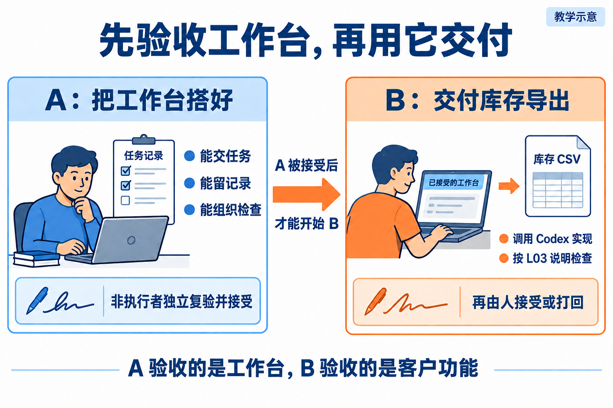
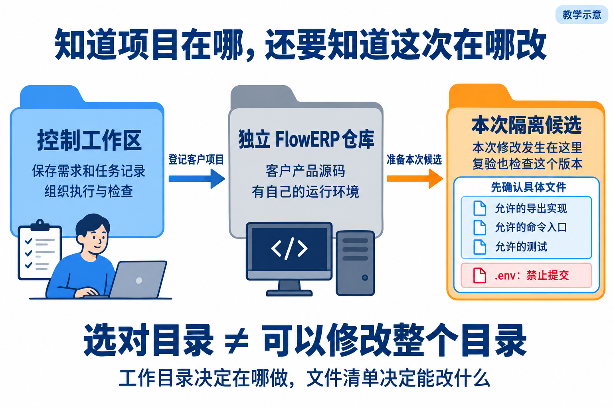
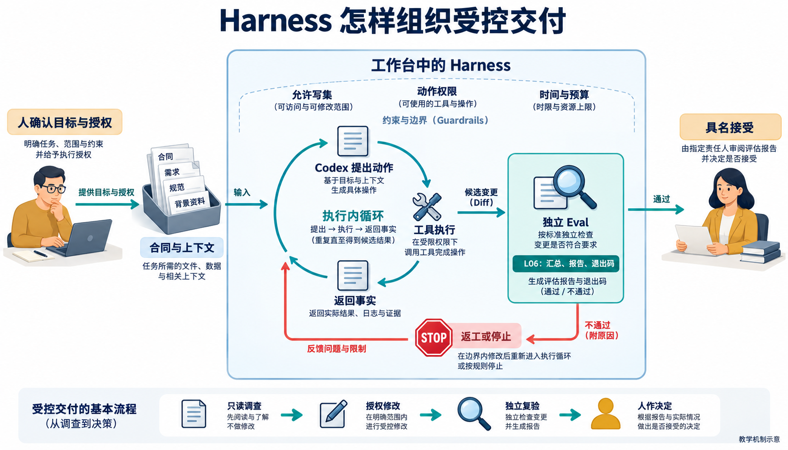
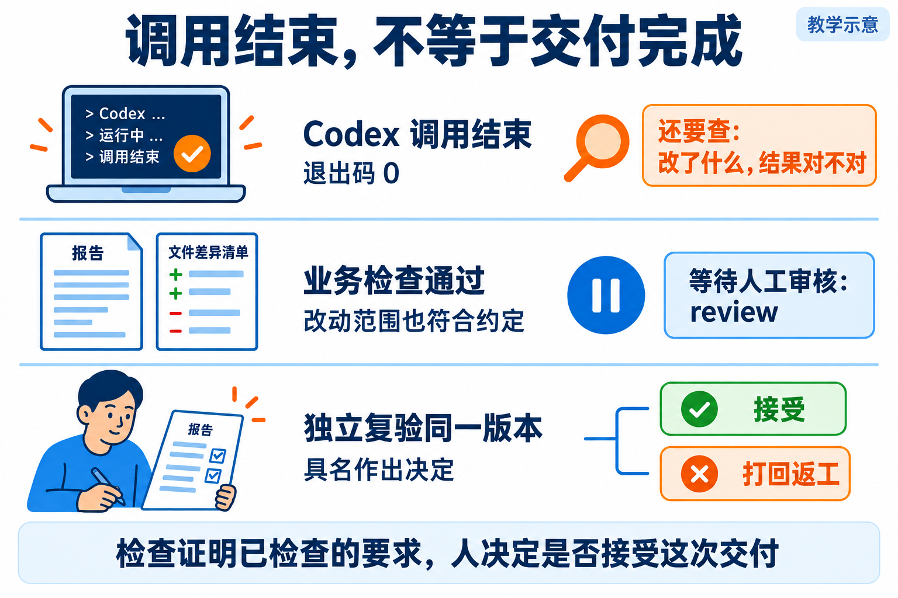
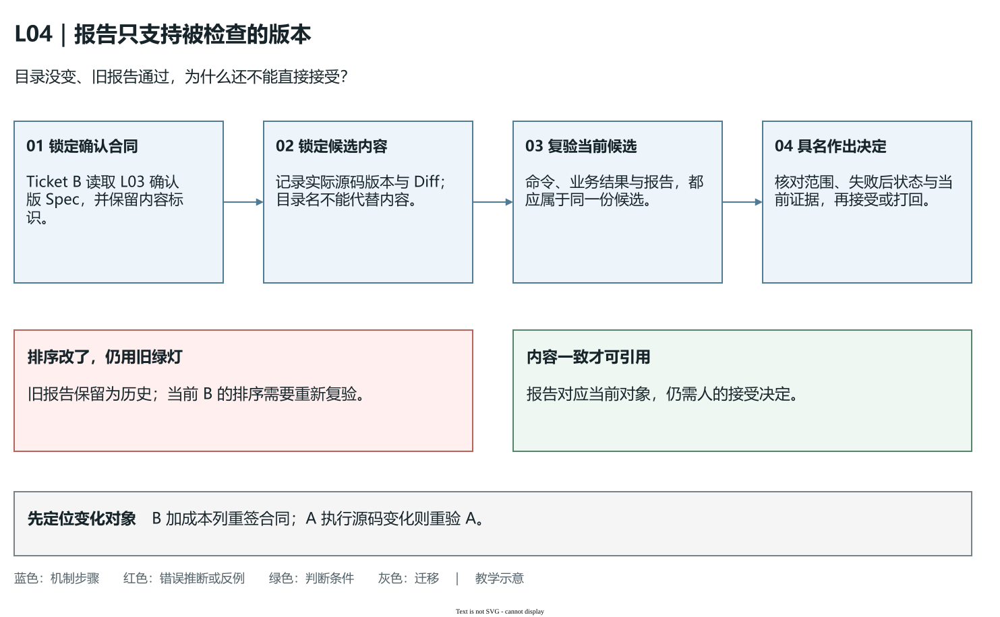

# L04｜委托 Codex 执行一次最小变更

L03 的合同已经能读、能检查结构，但工作台还不能据此组织一次开发。今天先建设并独立验收执行能力，再让它按同一份合同交付 FlowERP 库存导出。这是课程第一次从“直接监督 Codex 建工作台”转入“通过工作台组织人与 Codex 开发客户产品”。

本讲始终有两张工作单：**Ticket A 建设 Workbench V0，Ticket B 通过它交付库存导出。**你决定范围和接受理由；Codex 实现；工作台组织输入、执行与证据；非执行者独立复验。A 被接受后 B 才开始。

## 1｜执行能力由哪些环节组成

L01 提供记录，L02 提供规则，L03 提供合同与解析器。V0 要把它们连成一条可以核对的路径：读取确认合同，确定候选工作目录和授权，调用 Codex，收回实际结果，检查改动范围，运行最小 Eval，形成摘要并等待人工审核。



**图 4-1　先建设并接受 A，再执行 B。**中间箭头的前提是 A 已由非执行者复验并接受。A 的检查通过不表示库存导出已经实现，B 需要自己的证据。

为什么这些环节都要有？只运行检查，无法证明工作台调用了 Codex 修改代码；只收最终回答，无法发现命令失败；只有业务测试，可能漏掉越界修改；只有程序绿灯，仍未产生人的接受决定。

A 的验收因此要覆盖正常调用、工具失败、超时、越界和待审核状态。先保存实现前缺口，再由 Codex 在授权范围补齐已有实现缺少的环节。参考仓库已有能力可以复验，学生自己缺少的能力才需要建设。具体操作见手册第 1～4 步。

## 2｜工作目录、候选和写集怎样共同限定任务

**工作目录**决定程序从哪里读取代码与相对路径；**候选**是本次准备修改和检查、尚未接受的代码副本；**写集**是这一任务允许修改的文件清单。它们分别回答“在哪执行”“检查哪版”“允许改哪里”。目录正确不表示其中任意文件都已授权。



**图 4-2　控制、客户源码与候选分开。**控制工作区保存工作台规则和任务记录，独立 FlowERP 仓库提供客户源码，候选承担本次实现与复验。图中路径是职责示意，需换成实际调查位置。

B 接收 L03 确认版 Spec，并关联已接受的 A 版本。候选创建后记录 Spec 的内容哈希与实际起点，确认实际入口、库存查询和 CSV 输出职责，再选出足以完成验收的最小写集。新增采购页面不属于导出范围；确需增加文件，应交回理由和影响，重新确认后才能继续。

这组约定在课程中称为**能力信封**：一次执行可用的目录、文件、命令、时间和停止条件。提示词说明意图，执行环境限制可访问范围，事后 Diff 核对实际修改。参考执行器使用工作区权限并核对文件变化，不应把逐文件事后检查描述成事前阻止了所有写入。

在 [`workbench/execution.py`](../../../workbench/execution.py) 中可查看 `validate_v0_authorization()`、`normalize_write_scope()` 和 `CodexExecutionRunner`。学生复验应检查自己的入口是否实际使用这些控制或等价能力，而不仅是摘要中写了“范围受控”。

### 分层自主权：可以继续哪些动作，由哪些证据决定

“让 Codex 自动做完”需要先拆成具体动作。**分层自主权**按任务阶段决定它可以调查、修改、检查还是提出接受建议；推进依据是明确授权与实际结果。只读调查库存查询入口，无需因此获得改库存算法的权限；允许修改 CSV 输出，也不能推出允许重写验收标准。这里的分层是本课的设计方法，不是某个产品按钮的名称。

在只读阶段，Codex 追踪入口、说明待确认项，你据此确定写集。进入编码阶段后，它可以在授权候选中实现并运行工具，但超时、工具失败或越界需要停止推进，保存已发生的改动。检查阶段由独立路径对同一候选运行 Eval；检查绿灯后，结果进入具名审核。前一步成功提供下一步的依据，并不把下一步的权限一并交给执行者。

**Harness**把这些约定变成一次执行周围的控制：组织确认合同与上下文，调用 Codex 的工具循环，限定动作、写集和预算，采集结果，让 Eval 反馈决定继续、停止或交回人。内部“提出行动—调用工具—读取结果”可以反复发生，外部仍要核对当前合同、候选与停止条件。不能因为模型打算继续，就默认增加执行时间、允许文件或接受范围。



**图 4-5　自主行动始终处于交付控制之内。**这是教学示意。沿上下文进入 Codex 工具循环，再检查动作边界与 Eval 反馈；停止与人审是推进条件的一部分。图不代表本轮参考代码或学生工作台已经通过所有控制验收。

沿库存导出想一个反例：Codex 发现可用量断言失败，便把预期 5 改成 8。动作发生在测试文件内，也可能没有超出写集，但它改变了已经确认的业务判据。能力信封因此既需要文件边界，也需要动作含义：本次是实现原合同，修订合同须另有理由和确认。另一方面，若只是输出转义写错而判据可靠，可以修输出后继续复验，不必每运行一条命令都重复询问同一个授权。

读图时追问“哪一步有权宣布完成”。执行器退出 0 只说明该次调用正常结束；Eval 通过说明所检查行为满足当前标准；具名接受还要核对失败后状态、范围、版本及未验证项。若工具失败却进入待接受，先修 A 的控制；若控制如实保留红灯，CSV 仍算错，则修 B。参考 `TaskStore.review()` 保存具名决定，学生仍需实际非执行者复验，不能用程序里的姓名字段代替审核发生。

迁移到增加采购成本列时，可以沿用执行、采集与停止机制，但新列的来源、查看权限和验收仍由人重新确认。若任务涉及入库，还须保留采购批准条件，编码授权不等于业务审批。能解释当前允许动作、停止原因和下一位决策者，并用本次记录证明没有跨越这些边界，才说明自主行动受到真实控制。

<a id="一份委托怎样变成一次受控执行"></a>

## 3｜非交互执行怎样变成可核对的记录

**非交互执行**是由程序提交一次明确任务并等待结果，不依赖你逐句输入“继续”。它适合工作台调用，但仍要预先确定授权、超时与失败处理。执行不会因此免除人的责任。

截至 2026-10-01 核对的 [OpenAI 非交互模式文档](https://learn.chatgpt.com/docs/non-interactive-mode)将 `codex exec` 用于脚本调用。普通模式的过程输出与最终消息需要分别采集，JSON 模式可记录事件。具体命令由工作台执行器构造，学生通过手册入口使用并核对调用证据。

工作台应保存本次 Spec、候选起点、实际命令、输出、退出状态、时间、Diff 与 Eval 报告。超时前可能已写了一部分文件，所以“停止”不等于“自动恢复”。先终止并确认相关执行已停，再保存差异，核对候选状态，决定修订或恢复；不能在未知状态下继续推进。

下面是委托信息的教学示意，方括号必须用调查结果替换；它不是可直接提交的 API 格式或执行记录：

```text
依据：[L03 确认版 Spec 的路径与内容标识]
目标：导出八列库存明细，成功和失败均不改变库存。
执行位置：[隔离候选的绝对路径与起点版本]
允许修改：[已确认的具体实现与测试文件]
模式：Codex 实现；只运行检查不能代替本次编码。
复验：[候选中实际可运行的导出验收与回归命令]
停止：超时、工具失败或越界时停止推进，保留输出和已发生改动。
交回：调用记录、Diff、命令结果、Eval 报告与待审核摘要。
```

例如调用退出 0，但 CSV 把在库 8、预占 3 的可用量写成 8。调用结果是“正常结束”，业务结果是“检查失败”。退出码首先说明哪一个程序怎样结束，不能把执行器成功直接当成客户结果正确。这就是要采集分项结果的原因。

## 4｜让库存导出同时接受业务和工程检查

L03 已确定八列、明细、排序和可用公式。手册复验将西仓换为在库 12、预占 4，检查同一规则能否得到 8；东仓仍为在库 8、预占 3，可用 5。以下是教学预期：

```csv
sku,name,site,location,lot_id,on_hand,reserved,available
A,示例商品,东仓,E01,L01,8,3,5
A,示例商品,西仓,W01,L01,12,4,8
```

运行实际导出后，用 CSV 读取器比较列名与字段，不只看文件存在；再检查打乱输入仍按约定排序、空库存只有八列表头、中文和特殊字符可读回。导出前后查询库存和流水，确认只读行为。

写出失败也需要设计。本次合同要求原有效文件保留、不暴露半成品，一种方案是先写同目录临时文件，写成后替换目标；失败时清理临时文件。方案必须由实际正常与失败测试证明，不能只看代码中出现了临时文件名。业务账仍不得变化。

最后把同一候选的 Diff 与写集比较。CSV 正确，却改了无关采购页面，工程约束仍不合格；没有代码改动却只做了复验，也不能充当新功能交付。业务正确性、修改范围和材料完整性应分别报告。

## 5｜报告绑定哪一版，人就审核哪一版



**图 4-3　检查通过后进入待审核。**复验者需要同一份合同、同一候选、实际 Diff 和报告，再决定接受、打回或依据不足。

上午的报告只支持上午检查的代码。下午又改了排序，旧报告可以留作历史，但需要为新候选重新检查。把 Spec、源码版本或内容标识与报告关联，可以防止“拿旧绿灯批准新代码”。

### “仍是同一个目录”，为什么不足以继续接受

设想 Ticket B 上午完成独立复验：东仓可用 5、西仓可用 8，明细按合同排序，报告通过。下午为了整理代码，某人修改排序实现，候选目录名、任务编号和旧报告都没变。此时你知道的是“上午那份源码通过了检查”，当前源码的排序行为已经重新变成未知。改动看起来很小，不能把未知自动填成通过；即使没有新 Git 提交，工作目录中的内容也可能变化。

因此审核所指的对象要比“目录地址”更具体：确认版 Spec、候选源码内容、实际复验命令与报告文件需要相互对应。内容哈希帮助比较前后是否一致；任务编号帮助定位记录；二者都不能自行说明业务正确。若只检查报告 JSON 中的 `pass`，报告本身可能是真实旧报告，却被用于审核另一份源码。

| 变化发生在哪里 | 旧结论还能说明什么 | 应怎样继续 |
|---|---|---|
| B 候选的排序实现变化 | 旧 B 在旧版本上通过 | 留下新 Diff，对当前 B 重新复验，再作决定 |
| B 的 Spec 增加采购成本列 | 旧合同内的导出曾通过 | 确认数据、权限和新写集；建立新候选与报告 |
| A 接受后，控制仓库执行源码变化 | 旧 A 的执行机制曾被接受 | 暂停 B，新建 A 并重新独立复验 |

三种变化的返工对象不同。客户输出发生变化，先查 B；委托机制发生变化，先重新确认 A。若工作台能如实记录 B 的失败，不必因为 CSV 排序错误就改执行器；若工作台漏记失败，再正确的 CSV 也不能补足控制证据。



**图 4-4　旧绿灯只能支持被检查过的版本。**这是教学机制示意。沿合同、候选、复验报告到具名决定阅读；反例中目录未变而源码已变，完成判断要求重新核对内容。迁移部分提醒：A 的执行源码变化和 B 的业务变化，要回到各自的复验对象。[可编辑源图](assets/reading-depth-20261003/mechanism.drawio)。

读图时先找报告属于谁，再找现在要接受谁。参考通用项目报告的 [`report_view()`](../../../workbench/eval_harness.py) 会同时比较当前候选源码内容标识和报告文件摘要；两者一致才标 `current`，不一致为 `stale`。没有绑定信息的历史报告为 `unverified`，读取不到则为 `unavailable`。这些状态说明证据是否仍对应当前对象，`current` 仍不表示已经由人接受。自己的 L04 入口是否提供同样信息，需要实际核对，不能仅凭参考函数宣称本轮已自动拦截。

迁移题里的采购成本列同样如此：即使旧 CSV 的八列全部通过，新列的数据来源与查看权限还没有被旧检查覆盖。先重签本次合同与范围，再对当前候选复验，才能把接受理由落在这次真实结果上。手册第 7 步保留旧任务、为返工建立新候选和报告，让前后结果都有明确归属。

人的审核至少回答：目标行为是否成立，失败后状态是否正确，是否越过授权范围，材料是否属于当前版本，还有什么未验证。具名决定需记录人、候选、依据和理由；测试通过不能自动填写接受。

返工时按失败对象回退。CSV 算错而工作台如实报红，修 B 的导出；工具失败却被工作台放行，先停 B，修 A 并重新接受执行机制；没有报告，先查环境、目录与版本。不要因为客户结果不对就同时扩大两边修改。

Ticket A 由你直接监督建设，Ticket B 开始由已接受工作台组织，这就是本讲的**自举换挡**。从首页使用时，入口仍是工作台 `http://127.0.0.1:8001/` 的“事项与决策”；客户业务界面与数据库留在独立 FlowERP。

## 6｜按 A、B 顺序实践，再用新要求检验判断

打开[实践操作手册](实践操作手册.md)：第 1～3 步建设 A，第 4 步非执行者复验并接受 A，第 5 步才执行 B，第 6～7 步独立复验导出并记录决定。摘要交回版本、实际改动、命令结果、审核依据和剩余风险，保留失败，不提交密钥、环境文件或运行数据库。

迁移题是给 CSV 增加采购成本列。它影响 B 的业务合同：先确认数据来源、查看权限和新验收，更新 Spec 与写集后才能执行。A 的受控机制可以沿用，但旧导出报告不能证明新列合格。请同伴核对你把哪些约定复用、哪些重新确认。

本讲应交出已被独立接受的 V0 与有自身复验和人审依据的库存导出。L05 在同一交付路径增加收货时，还要验证检查能够稳定识别错误版本。

[交付机制与故障选读](reference/参考说明.md) · [原有总览图](assets/lesson-overview.png) · [教师执行记录](assets/execution/README.md) · [正文图设计](assets/reading-figures-v1/设计与提示词.md)

[课程学习路线](../../README.md#16-讲学习路线) · [实践操作手册](实践操作手册.md) · [上一讲](../L03/辅导资料.md) · [下一讲](../L05/辅导资料.md)

## 课程大纲中的本讲要求

- **核心内容**：非交互执行、工作目录、权限边界、结果采集与人工确认点。
- **演示结果**：读取第 3 讲 Spec，委托 Codex 完成一个小型代码变更并运行测试。
- **课内增量**：先由学生直接监督 Codex 补齐并独立验收 Workbench V0 的执行入口、写集检查、最小 Eval 和结果摘要，再由 V0 在授权工作区调用 Codex 交付库存导出；不额外包装为文件读写 MCP。
- **通过标准**：变更能够运行；基础测试通过；摘要包含修改文件、验证命令和剩余风险；密钥和环境文件未提交。
