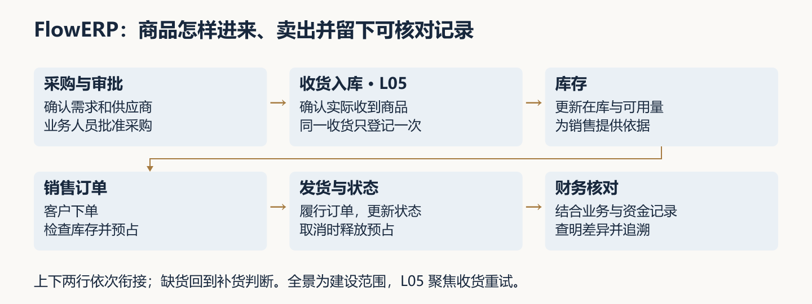
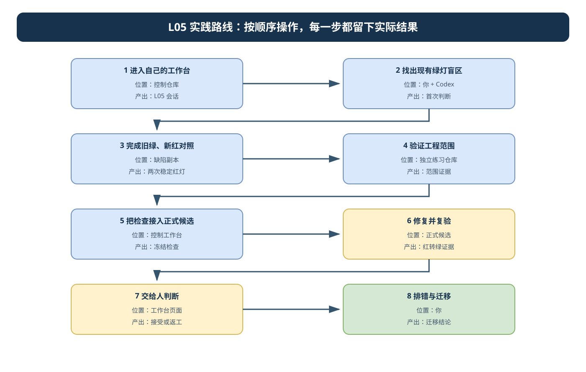
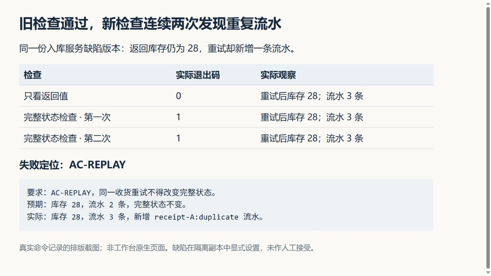
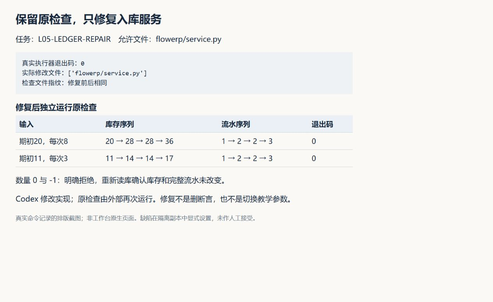
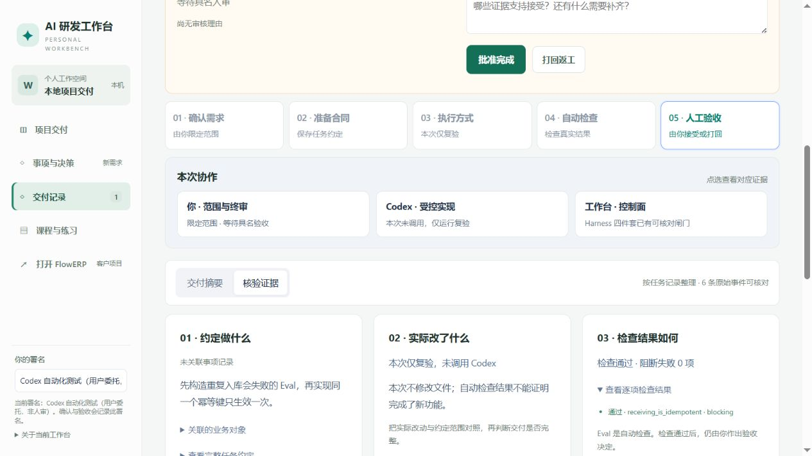

# L05｜先设计失败，再编写 Eval

**实践操作手册｜设计反例并复验修复**

## 开始前：先留下自己的判断

先只看这个现场：**一次收货提交后，页面没有收到响应，操作员再次点击；随后又提交了另一笔收货。**在阅读下方教学答案、填写页面或运行命令前，打开自己的 [SUBMISSION 记录](SUBMISSION.md)，写下：

- 我怎样区分重复操作和另一笔真实收货？
- 现有检查显示绿灯时，我认为已经证明什么，还担心遗漏什么？
- 我准备读取什么实际结果来判断，为什么？

**完成判断：**保留自己的原回答、日期和依据；不知道的内容写“待调查”。Codex 可以整理表述，不替你补答案。下面的教学案例用于对照，后续改变判断时另加修订，不覆盖此稿。

<a id="lesson-goals"></a>

## 本讲目标与完成判断

**FDE 判断提示**：收货重试影响谁，怎样区分同一笔收货与合法的新收货，为什么本次先解决这一风险？执行前保留自己的理由，交接时用产品前后状态说明判断是否成立。详见[实践手册](实践操作手册.md)。

起点：L04 工作台 V0 已独立接受并完成库存导出。继续使用原控制工作区与运行目录。本讲交付两份 Eval，并通过工作台组织幂等入库的构建或修复。

执行顺序：加载本次会话 → 入库对照副本 → 独立 Git 工程反例 → 正式候选与个人检查 → 冻结检查并提交 → 工作台真实修复 → 最终候选复验。三种工作区不可混用；每条命令自动保存新证据文件。正式范围复验读取执行器实际变化记录，准备阶段的文件变化单独说明。可运行支架只解决入口问题，个人仍须增加并解释一条有业务依据的断言或反例。

| 阶段 | 你必须作出的判断 | 现场证据 |
|---|---|---|
| 看旧检查 | 现有绿灯没有观察什么 | 用例源码与自己的遗漏说明 |
| 定要求 | 同一收货与新收货如何区分 | 本人预测、五项业务要求与 ENG-SCOPE 及允许范围 |
| 造反例 | 哪个错误应该被检查发现 | 缺陷来源、冻结检查、连续两次同因失败 |
| 查范围 | 实际变化是否完整取得 | 基线、授权清单、合法与越界正反例 |
| 修候选 | 修复是否保持原来的检查标准 | 最小 Diff、同命令绿灯、失败后状态 |
| 回工作台 | 页面绿灯与个人新增用例是否相同 | 真实任务编号、最终候选与原始输出 |
| 独立复验 | 换输入后结论能否成立 | 同伴实际反馈、本人修订与决定 |

正常路径必须包括首次和独立新请求；失败路径包含重复记账缺陷、非法数量与范围外修改。首次与新收货按独立预期核对流水身份、数量、类型和引用；重放与非法输入前后比较完整库存与流水，失败记录显示具体字段差异。Codex 调查、实现和排错，你决定身份与范围，实际复验者决定接受或返工。

在已有事项和任务记录中保存上述材料，具体命令见[手册](实践操作手册.md)。没有真实复验者就保留待复验。默认用例通过、参考实验通过、页面截图都不能替代个人修复证据。

迁移：将方法用于支付回调，重新确认业务身份、金额与资金流水，不照搬库存常量。

### 本人采用 Skill 的记录

记录实际采用的 failure-first-eval 版本、当前阶段、候选与检查版本。先写自己的预期，再运行；保存误判和修订理由。课堂重复流水夹具用于理解检查盲区，正式课程起点仍须通过默认入库用例验证真实缺陷。

### 当讲合同

对应 CLO-3。以下四项沿用正式大纲。

- **核心内容**：示例测试与 Eval 的区别；逻辑错误、边界缺失、规范违规和危险修改四类失败模式。
- **演示结果**：一个故意带缺陷的基线稳定触发失败。
- **课内增量**：编写一个业务结果 Eval 和一个工程约束 Eval。
- **通过标准**：缺陷基线连续运行两次均失败；失败信息能够定位到具体要求。

### 项目导读检查

在现有事项中说明 FlowERP 的使用岗位与收货所处环节，区分客户产品和个人工作台；用“业务风险 → 旧检查盲区 → 新 Eval → 产品修复”解释本讲 FDE 过程。先保存本人判断，完成实验后对照修订。

按以下步骤操作，证据只在[个人证据索引](SUBMISSION.md)关联已有记录。预置支架、历史报告和参考课件不代替本人实现、真实宿主运行或具名人审。

> **终端选择：**本手册同时提供 Windows PowerShell 与 macOS 默认终端 zsh 的操作。每一步只运行自己系统对应的代码块；标为“通用”的 Python、Git 命令两端相同。开始或重开终端时，先按[macOS 环境与路径约定](../../reference/实操手册执行与排错.md#macos-zsh)恢复本讲使用的虚拟环境，再核对当前源码位置。

本讲沿用 L04 已独立接受的工作台 V0。你要在同一交付事项中设计检查、观察两次稳定失败、保留检查修复真实候选，再交给同伴复验。工作台新增两份有辨识力的 Eval，FlowERP 新增或修复幂等入库。本手册先提供无需填写的完整教学运行路径；运行产生真实命令证据，但预置案例不代表个人原创判断，具名人审仍由实际审核者完成。

第 3 节是入库缺陷副本，第 4 节是独立工程练习仓库，第 5～6 节是正式课程候选，三者分别保留。`tests/test_l05_receiving.py` 与候选外的 `allowed-files.json` 由下方命令自动创建；真实任务采用哪份检查，应在最终候选再次核对。重新执行初始化会自动创建新目录，保留第一次失败。

先看本讲目录地图。四个位置用途不同：

```text
〈CodexFDE 控制仓库〉/                ← 开始位置；运行 session.ps1 / session.zsh 和工作台命令
├─ .venv/                            ← 本地环境存在时使用；L01 隔离区可借用原参考环境
├─ docs/courses/L05/
└─ .runtime/
   ├─ l04-learning/                  ← 沿用的工作台运行数据
   └─ l05-…/                         ← 本讲会话、证据和路径索引

〈独立 FlowERP 仓库〉/               ← 客户源码；有自己的 .venv
〈脚本打印的缺陷副本〉/              ← 第 3 节观察，不是正式候选
〈脚本打印的工程练习目录〉/          ← 第 4 节范围实验，不是正式候选
〈course-submit 返回的候选〉/        ← 第 5～6 节唯一正式修复与复验对象
```

每次切换都以脚本打印的绝对路径为准。未看到明确的 `Set-Location`、`cd` 或工作目录参数时，仍留在 CodexFDE 控制仓库；不要把三个临时目录中的结果相互覆盖。

开始操作前，遇到解释器、路径或输出问题，按[执行与排错说明](../../reference/实操手册执行与排错.md)核对。

## 开始操作前 先找到项目和自己的职责

先读[辅导资料](辅导资料.md)第 1～3 节，尤其是第 3 节中“课堂对照”和“个人课程候选”两条实验路径的区别。FlowERP 是持续建设的电商进销存与财务客户产品；你使用个人研发工作台组织 Codex 开发它。本讲从收货重试暴露的风险出发升级 Eval，不重新搭建 V0。



图 A：教学业务全景。圈定收货入库这一段，后续销售和财务用于解释影响，不作为本讲已经交付的功能。

本次运行使用以下完整教学输入，在现有事项中保存判断，并用个人证据索引关联：

- 业务链：采购收货 → 库存 → 订单预占与发货 → 单据核对。期初库存 20，A 收货 8，A 重试，B 收货 8，预期库存依次为 20、28、28、36。
- 需求：同一收货重试只入账一次，不同收货即使数量相同也应正常入账。
- 范围：顺序调用下的入库身份、库存和流水一致性；本次不增加采购审批或并发处理。
- 分工：命令准备检查与证据，Codex 在限定候选中修复服务，工作台保存执行过程，实际复验者与审核者另行判断。
- 教学判断：只看返回库存会漏掉重复流水；本次增加持久化库存与完整流水的比较。

以上为预置案例和预期，不是你的首次判断或实际运行结果。完成命令后可对照输出理解因果；课程个人能力评价还需本人解释与独立复验，不作为本手册命令运行的前置填空。

## 课堂案例与阅读位置

本讲用一笔收货贯穿现场判断、检查建设、修复与复验。课件从[本讲资料入口](README.md)取得；下表页码对应 30 页讲义同步版，使用其他版本时按案例名称定位。同一案例跨页时仍沿用同一编号。

| 案例 | PPT 页 | 本人要学会的判断 |
|---|---|---|
| 示例 1：同一收货重试 | 7～8 | 用业务身份区分重试与新收货，独立计算库存和流水 |
| 示例 2：返回正确但账错 | 9～15 | 找到旧检查盲区，证明新检查能识别同一缺陷 |
| 示例 3：合法新收货 | 16 | 静默忽略后续请求会吞掉合法新收货 |
| 示例 4：拒绝后的状态 | 17 | 异常被抛出以后，重新读库确认没有部分写入 |
| 示例 5：工程范围 | 19～21 | 采集真实差异，检查新增文件与重命名 |
| 示例 6：删断言转绿 | 24 | 区分实现修复与检查标准被削弱 |
| 示例 7：复验与迁移 | 26～28 | 对同一候选换数值，并重新确认其他业务的身份规则 |

截图分为工作台原生页面和真实命令记录的排版截图。示例输入标明“教学预期”；实际执行结果有原始记录可回查。页面不显示采集日期，时间与版本保留在证据文件中。

## 先看流程图，再开始操作



本讲有缺陷副本、工程练习目录和正式候选三种位置。每一步先按图确认“位置”，不要把课堂对照结果写成正式候选证据。可编辑源文件：[l05-practice-flow.drawio](assets/l05-practice-flow.drawio)。

### 按图执行的完成标志

| 步骤 | 在哪里操作 | 进入下一步前必须留下什么 |
|---|---|---|
| 1. 进入自己的工作台 | 控制仓库 | L05 会话 |
| 2. 找出现有绿灯盲区 | 你 + Codex | 首次判断 |
| 3. 完成旧绿、新红对照 | 缺陷副本 | 两次稳定红灯 |
| 4. 验证工程范围 | 独立练习仓库 | 范围证据 |
| 5. 把检查接入正式候选 | 控制工作台 | 冻结检查 |
| 6. 修复并复验 | 正式候选 | 红转绿证据 |
| 7. 交给人判断 | 工作台页面 | 接受或返工 |
| 8. 排错与迁移 | 你 | 迁移结论 |

## 第 1 步：从自己的工作台进入本讲

<!-- step-guide-1 -->
> **一句话说明：**从自己的工作台登记 L05 原事项；本讲后续由你把 CLI 任务、最终候选和复验结果回填到它的证据中。

本讲从收货重试问题开始，使用上面的教学需求依次完成检查、两次失败、限定范围修复与复验。案例来源固定标记为“教学设置”。

### 1.1 起点检查与自动会话

准备 L04 的控制工作区、运行目录、V0 接受记录与库存导出结果。使用原来的 AGENTS、Spec 模板和 Python 虚拟环境。控制目录运行工作台，候选目录用于业务与检查实现，命令证据保存在候选外。

连续命令支持 **Windows PowerShell 5.1 / 7 与 macOS zsh**，会话数据和验收标准相同。在控制仓库根目录开始，不把全部代码块一次执行。JSON、任务编号、候选路径和会话位置都由命令产生并读取，不需要替换参数。初始化自动读取已有 Git 身份；没有配置时使用明确标记的教学身份，不修改 Git 配置，也不生成审核署名。第 6.1 节需要本机已安装且已登录的 Codex CLI。

先核对项目环境并建立本次会话。脚本优先使用控制仓库自己的 `.venv`；沿用 L01 隔离练习区且该目录没有 `.venv` 时，先按 [L01 中断恢复](../L01/实践操作手册.md#故障定位与中断恢复)激活原参考虚拟环境、回到控制练习区。脚本只接受已激活的 `VIRTUAL_ENV`，不会退回系统 Python，并把实际解释器绝对路径写入 `session.json`。后续记录命令直接使用这个固定解释器。

**Windows（PowerShell）：**

```powershell
. ./docs/courses/L05/examples/session.ps1
$null = Invoke-L05Python '核对控制源码' 0 $l05Control @('-c','import sys,workbench; print(sys.executable); print(workbench.__file__)')
$l05Session | Select-Object actor,identitySource,control,runtime
```

**macOS（zsh）：**

```zsh
source ./docs/courses/L05/examples/session.zsh
l05_python '核对控制源码' 0 "$l05Control" -c 'import sys,workbench; print(sys.executable); print(workbench.__file__)' > /dev/null
printf '%s\n' "$l05Session"
```

输出中的解释器和 workbench 路径应属于控制工作区。教学身份只用于标识本次执行与候选提交，不代表个人原创或人审通过。

会话脚本提供两个记录函数：Windows 的 `Invoke-L05` / Mac 的 `l05_command` 执行完整命令，Windows 的 `Invoke-L05Python` / Mac 的 `l05_python` 使用项目 Python。参数依次是记录名称、预期退出码、工作目录、命令参数。每次调用都生成新的 UTF-8 证据文件，记录实际目录、完整命令、输出、错误与退出码；退出码不符即停止。预期退出 1 仍需人工核对是否真是目标业务失败。

Mac 会话脚本开启 `ERR_RETURN`，遇到不符合预期的结果会停止当前代码块。显示给人的命令结果与返回的 JSON 分开输出，任务与候选信息由 `l05_field` 读取。中断恢复可用 `--latest`，也可用 `source ./docs/courses/L05/examples/session.zsh "自己的 session.json 绝对路径"` 指定原会话；控制区没有本地 `.venv` 时，先激活原参考环境，让脚本只读解析会话。恢复后的命令始终使用 `session.json` 保存的原解释器，即使控制目录后来新增 `.venv`，也不切换环境或改写会话。原解释器缺失、已不是真实虚拟环境或会话属于其他控制目录时停止；不要在 Mac 上载入包含 Windows 解释器路径的会话。

本手册固定沿用控制仓库的 `.runtime/l04-learning`，无需修改配置。若此前使用其他运行目录，本次不会自动导入那里的接受记录；本次脚本跑通不能补证 L04 接受。已有工作台使用该目录时直接打开 `http://127.0.0.1:8001/`；尚未启动时，在**另一个服务终端**恢复同一参考虚拟环境并进入控制仓库根目录，再复制以下完整代码，保持终端不关闭：

**Windows（PowerShell）：**

```powershell
. ./docs/courses/L05/examples/session.ps1 -Latest
Set-Location -LiteralPath $l05Control
& $l05Python -B -X utf8 -m workbench.cli serve-workbench --host 127.0.0.1 --port 8001 --runtime-dir $l05Runtime
```

**macOS（zsh）：**

```zsh
source ./docs/courses/L05/examples/session.zsh --latest
cd "$l05Control"
"$l05Python" -B -X utf8 -m workbench.cli serve-workbench --host 127.0.0.1 --port 8001 --runtime-dir "$l05Runtime"
```

后续步骤在原操作终端继续。中断后，先恢复原参考虚拟环境并回到控制仓库根目录，再执行下列代码，恢复最近初始化的会话。新终端不保留上一次激活状态。不要重新执行已经成功的创建、冻结或提交步骤；原会话与失败记录全部保留。同时只推进一个教学会话，避免将最近会话误认为另一轮实验。

**Windows（PowerShell）：**

```powershell
. ./docs/courses/L05/examples/session.ps1 -Latest
```

**macOS（zsh）：**

```zsh
source ./docs/courses/L05/examples/session.zsh --latest
```

教学预期为库存 20、28、28、36，流水 1、2、2、3。后续输出以实际数据库检查为准。

### 1.2 新建交付事项：按界面逐项填写

在工作台首页点击“新建交付事项”，进入“开始一项新的交付”。下面按页面字段名称和排列顺序给出内容；每个代码块只复制到它上方指定的输入框，不要把整节粘到同一个框。

**页面上方“你的署名”**：已有署名时沿用。仅复现本教学案例且尚无署名时，可复制下方课堂昵称；它只标识教学操作，不表示真实审核人。正式个人交付应使用本人姓名或课堂昵称。

```text
L05课堂练习
```

**“所属项目”**：在下拉框选择 **FlowERP**。

若下拉框没有 FlowERP，先回首页“＋ 添加项目”，选择“本地文件夹”，填写自己的独立 FlowERP 仓库绝对路径，保存后再选择。不要选控制仓库代替客户项目。若 CLI 仍找不到客户仓库，按[客户环境排错](../../reference/实操手册执行与排错.md#product-environment)在操作终端核对；无需重建本次会话。

**“这次想解决什么”**：这是简短的需求标题。删除框中已有的 `http://127.0.0.1:8001`，复制下面这一行：

```text
L05 收货重试幂等检查（教学案例）
```

**“描述遇到的问题”**：复制下面的完整段落：

```text
这是 L05 教学案例。仓库人员在采购收货时，可能因未确认首次提交结果而重复提交同一笔收货。如果系统重复增加库存或重复记录流水，就会造成库存账与实际收货不一致。我们希望同一笔收货无论重试多少次都只入账一次，不同收货即使数量相同也能正常入账。教学输入为：期初库存20，收货A入库8，再次提交A，然后提交新收货B入库8；预期库存依次为20、28、28、36，流水条数依次为1、2、2、3。本次先用检查暴露问题，再限定范围修复，最后核对库存与完整流水。以上是教学输入和预期，不是已经完成的测试结果。
```

**“补充背景与已有判断（可以稍后与 Codex 一起澄清）”**：点击展开，按下面各字段填写。这里虽然可以稍后补充，但本案例涉及库存，应明确选择“库存数量与可用量”，不要保留默认的“局部界面或文案”。

**“效果指标与目标”**：

```text
在本轮顺序调用实验中，同一收货重放后库存和完整流水均不变；新收货正常入账；非法数量被拒绝后状态不变。以上均需通过实际检查验证，不代表生产环境或并发场景已达标。
```

**“来源”**：

```text
L05 实践操作手册中的收货重试教学案例；不是客户现场反馈。
```

**“具体问题”**：

```text
只检查返回库存和重放标记，可能漏掉持久化流水重复。本轮要证明检查能够识别入库缺陷，并区分同一收货重试与数量相同的新收货。
```

**“期望结果”**：

```text
FlowERP 的同一入库幂等键只生效一次，新收货正常处理；工作台保留业务结果检查、工程范围检查、两次同因失败、范围内修复和原检查转绿的证据。本轮修复仅允许修改 flowerp/service.py。
```

**“本次不做”**：保留换行，每行一项。

```text
并发收货处理
采购审批功能扩展
支付回调功能
修改 flowerp/service.py 之外的产品文件
```

**“验收标准”**：保留换行，每行一项。

```text
首次收货A入库8后，库存由20变为28，流水由1条变为2条。
重复提交A后，库存仍为28，完整流水与重放前一致。
新收货B入库8后，库存变为36，流水变为3条。
数量为0或负数时拒绝入库，持久化库存和流水均不变。
缺陷基线连续运行两次均失败，失败信息指向同一具体要求。
冻结检查后只修复 flowerp/service.py，原业务检查与工程检查通过。
改用期初11、收货数量3复验，库存依次为11、14、14、17。
完成实际独立复验与具名审核后，才能作出人工接受决定。
```

**“已有证据”**：此时不填任何文字，输入框保持空白。本段是操作说明，不要复制进输入框；如果已粘贴，请清空。第 3～6 节运行后，再依据实际记录补充，不把教学预期或手册截图当成自己的实测证据。

**“影响范围”**：在下拉框选择 **库存数量与可用量**。

**“验收负责人”**：尚未确定实际负责人时留空，不填写虚构姓名或“已通过”。可以先保存事项；涉及库存规则，进入交付前仍需确定真实验收负责人。页面若提示还需补充负责人，是待办要求，不代表事项保存失败。

最后点击 **“保存事项”**。预期出现“事项已保存，可继续补充或留下决定。”，事项标题为“L05 收货重试幂等检查（教学案例）”。保存只登记需求，不调用 Codex，不代表已执行修复或已验收。

后续第 3～6 节命令不需要从本表手工抄写编号。CLI 产生的任务编号与证据路径由命令直接显示；页面未自动关联该事项时，按“未关联事项记录”理解，不把手工登记当作关联已贯通。

### 1.3 保存之后：在“推进交付”中发起本轮调研

保存后进入事项详情，出现“业务问题 → 产品需求 → 技术方案 → 开发与测试 → 验收与集成 → 效果回收”六个阶段。这是后续进度，不是现在要填完的六张表。页面显示“待开始”和“说明这次要解决的问题”时，按以下步骤操作。

**“原始需求与项目目标”**：这是刚才保存的内容，保持收起，不用再抄一遍。

**“使用已确认的建设合同（工作台 V0）”**：本步骤保持收起，里面的 Spec、工作目录和允许文件均不填。这是另一种任务启动入口；本手册第 5～6 节已经提供生成课程候选与执行修复的完整命令，不在这里重复启动。

**“推进交付” → “补充需求或修改意见”**：只把下面这段复制到该输入框：

```text
请读取本事项已经保存的 L05 收货重试教学需求，开始只读调研，不要让我重复填写原始需求。
本轮只调查和解释，不修改源码、不启动编码、不代替人工验收。
请检查 FlowERP 的入库实现和 receiving_is_idempotent 检查，说明它们分别观察了返回值、持久化库存和哪些流水字段，是否存在只看返回结果而漏掉账目变化的风险。
固定教学输入：期初库存20，收货A入库8，重复提交A，再提交新收货B入库8。预期库存依次为20、28、28、36，流水条数依次为1、2、2、3。同一收货依据同一幂等键识别；不同收货使用不同键，即使数量相同也应正常入账。数量为0或负数时应拒绝且状态不变。
本轮只讨论顺序调用；不增加并发处理、采购审批或支付回调。后续产品修复只允许修改flowerp/service.py，检查将在修复前冻结。
请区分当前参考源码和课程缺陷起点：当前实现若已正确，应如实说明，不制造当前系统已发生故障的结论。手册第3节提供重复流水教学副本，第5节准备正式课程缺陷候选，第6节通过工作台CLI组织真实修复。
请返回源码依据、现有检查的观察范围、业务检查与工程范围检查的建议，以及仍未验证的情境。现在尚无本轮两次失败或修复后的证据，实际验收负责人也尚未确定；不要编造这些信息。调研结束后停留在讨论或待确认阶段，继续执行手册第2～5节。
```

点击输入框下方的 **“让 Codex 开始调研”**。这次会实际调用 Codex 调研；与前面的“保存事项”不同。等待本轮结束，查看“本轮调研结论”和“讨论记录”。调研文字不是已经运行的检查结果。

如果出现 **“ValueError: 方案没有可核对的源码依据”**，说明工作台未能将调研引用的文件与本轮源码快照对应起来，不是上述教学需求填写错误，也不能计为第 3～5 节要求的业务失败。已发现的一种原因是旧版 `.gitignore` 将整个 `docs/` 忽略，导致实际存在的 L05 手册和实验 Python 文件未进入快照；修正版只纳入 `docs/` 下的 `examples/`、`skills/` 目录内容、`README.md`、`行动卡.md` 和文件名含“操作”的资料，并保留缓存、密钥等通用忽略规则。本节实践操作手册和实验脚本可以进入快照，仍会拒绝不存在或未纳入快照的引用。

先确认运行工作台的控制仓库已包含该修复。在原服务终端按 Ctrl+C 停止服务，再使用**原启动命令和原 runtime-dir**重启；不要重新创建事项，也不要重新初始化教学会话。回到原事项的“推进交付”，在“补充需求或修改意见”中只复制以下内容，点击 **“带着反馈重新调研”**：

```text
请沿用本事项已经保存的 L05 教学需求和上一轮只读调研请求重新调研，不让我重复填写。请重新核对当前源码及引用路径，保留旧失败记录。本轮只调查和解释，不修改源码、不启动编码、不代替人工验收；完成后停在讨论或待确认阶段。
```

旧错误属于上一轮记录，刷新页面不会把它改成成功。以新一轮是否生成调研结论为准。若仍报同类错误，按新错误列出的路径核对项目目录、文件是否存在及 Git 忽略规则；不要删除引用来凑成通过，也不要把调研故障当成入库缺陷的两次失败证据。

如果出现“找不到 Codex CLI”，先不要重复提交。工作台已支持从 PATH 或本机 Windows Codex 安装目录自动查找 CLI；修改后的 Python 代码需要重启服务才能生效。已安装且已登录的机器不必重新安装或输入密钥。在原工作台服务终端按 Ctrl+C 停止服务，再沿用该服务原来的启动命令，保留原 runtime-dir。只有原服务确实按第 1.1 节启动时，才直接重用第 1.1 节命令；不要把当前服务的 .runtime 换成 .runtime/l04-learning，否则会打开另一套事项数据。回到原事项，补充需求框复制“请沿用已保存的只读调研请求重试，不修改源码。”，点击“带着反馈重新调研”，旧失败记录继续保留。若仍失败，查看最新错误；不能将启动故障计为业务红灯。

### 1.4 调研后出现的字段：按阶段处理

如果页面显示 **“你的回答或范围调整”**，且追问的是本案例的业务范围、检查办法或下一步安排，可复制下面的完整答复，再点 **“发送给 Codex”**：

```text
本案例范围已固定：按幂等键识别同一收货，数量相同的新键仍是新收货；只验证顺序调用，不扩展并发、采购审批或支付回调。检查必须观察持久化库存与完整流水，非法输入被拒绝后也要重新读库确认状态不变。业务预期按已保存的20、28、28、36执行；换数值复验使用11、14、14、17。
当前尚未运行本轮故障实验，也尚未确定真实验收负责人；请将这些信息保留为待补证或待确认，不要替我填写。后续使用手册第5节生成课程起点，第6节通过工作台CLI执行，不从本事项另起一轮编码。请汇总已有调研结论并停在待确认状态。
```

这段答复只处理上述固定范围。若 Codex 报告实际环境错误或提出未约定的新业务问题，先按实际问题判断，不能用这段话假装问题已经解决。

其余字段在当前阶段这样处理，表内是操作说明，不要粘贴进输入框：

| 界面位置或字段 | 当前怎么处理 | 何时需要填写或点击 |
|---|---|---|
| 方案与范围 → 确认效果指标与目标 | 查看自动整理的内容；当前不点“确认 PRD” | 采用页面交付流程时，核对当前版本目标后再确认；本手册本轮修复使用第6节命令 |
| 方案与范围 → 验收负责人 | 尚未确定实际负责人时留空 | 确定实际审核者后填写其本人署名，不能用教学昵称代替他人 |
| 确认技术方案与验收负责人 | 当前不点 | 采用页面交付流程且实际方案、范围和负责人都明确时才确认 |
| 授权工作台执行本轮方案 | 当前不点 | 本手册由第6节命令组织修复，不能同时再从此处启动另一候选 |
| 结果与证据 → 验收依据 | 留空 | 实际候选完成并由审核者核查之后，记录其真实观察；没有固定的“通过”答案可预填 |
| 接受本轮候选、确认集成到项目源码 | 当前不点 | 实际验收与集成决策发生时分别操作 |
| 实际发布版本、发布环境、发布证据及效果回收字段 | 全部留空 | 真实发布和观察发生后才登记；本教学实验不自动产生这些结果 |
| 留下你的决定 → 决定、决定理由、再评估条件 | 本轮不操作 | 这是另一组事项决策控件，不是保存后必须立即填写的表单 |

**当前页面步骤到只读调研结束即可。接着阅读第 2 节、执行第 3～5 节实验，再按第 6 节命令发起修复。** 本手册目前的网页事项与课程 CLI 任务尚未自动关联：网页停在待确认，不代表 CLI 实验失败；CLI 检查通过，也不会自动把这张事项页面变成人工验收完成。

这次采用人工接力：保留第 1.2 节原事项的标题和所属项目，CLI 返回真实任务后记录 Task ID 与最终候选，第 7 节再将实际结果索引补到原事项的“已有证据”。不要从页面同时启动另一轮编码。

## 2. 回看首次判断，调查现有绿灯漏掉什么

<!-- step-guide-2 -->
> **一句话说明：**打开开头已保留的首次判断，对照现有检查调查遗漏；教学答案和运行结果形成的新认识另加修订。

打开“交付记录”，选择自己的任务，再点“核验证据”和“查看逐项检查结果”。参考界面如下：

如果这里只有 L04 任务或列表为空，不是第 1 节事项保存失败：事项不自动生成 L05 Task，本轮真实修复任务到第 6 节才创建。此处可先阅读下方参考图和源码，继续第 3 节；不要为了看到这张图提前提交编码任务。


本图是 L05 合同的原生参考任务 `TASK-DC0060EA39`，仅复验参考仓库，未调用 Codex，未人工接受。找到 `receiving_is_idempotent` 后阅读 `eval/cases.py` 中对应函数。它目前只检查返回库存与重放标记。教学分析是：它没有完整比较持久化流水。第 3 节直接运行对照检查验证这个盲区；[提示词 01](实践操作手册.md#codex-prompt-1)留作课后讨论材料，不需要填写后才能运行。
<a id="codex-prompts"></a>
<a id="codex-prompt-1"></a>
<details>
<summary>给 Codex 的提示词 1：01 从现有绿灯反推检查遗漏</summary>

先填写本步骤的实际路径、事实与范围，再复制到 Codex 对话。下文是委托正文。

~~~~text
本次处于 L05 检查设计阶段。沿用 L04 已接受的工作台 V0，先调查，不改产品源码。

先核对我对项目的理解：FlowERP 服务哪些岗位，收货影响哪段业务；工作台如何组织研发，哪些决定必须由人作出。依据讲义项目导读纠正混淆，再把本次收货风险与要新增的 Eval 对应起来。

读取实际 AGENTS、本讲合同、入库服务、流水表与现有 Eval。报告实际文件与观察范围，区分已实现、检查未覆盖和业务未决定。重点回答：现有 receiving_is_idempotent 通过时，库存流水、新业务和非法数量后状态分别是否被验证？

先核对我的预测：期初20、A入库8、A重试、B入库8。请解释20、28、28、36及流水数量的依据，不能调用被测函数产生期望。把同键异内容的决定单列，不擅自增加基础范围。

为 AC-FIRST、AC-REPLAY、AC-NEW、AC-INVALID、AC-UNCHANGED、ENG-SCOPE 写观察矩阵。业务调用真实服务并读持久化状态，工程使用真实候选差异。给出一个应失败的最小反例，也给出合法新请求和合法修改，说明如何防止过度拒绝。

输出本轮最小文件范围、真实运行入口、缺陷来源、两次失败应有的差异与未覆盖项。将这些与已有事项编号关联。若材料里只有参考绿灯，不能声称已完成个人实现。

采用 failure-first-eval 的检查设计阶段，先输出“本人预测—已有覆盖—遗漏—最小反例”四列材料。参考案例：返回库存28，但重试多写一条流水；请说明为什么返回值检查发现不了它。
~~~~

</details>


至少确认 AC-FIRST、AC-REPLAY、AC-NEW、AC-INVALID、AC-UNCHANGED、ENG-SCOPE。每条都要有起点、动作、观察、预期和失败解释。库存来自持久化结果，流水比较完整内容，允许文件来自执行前的授权。

## 3. 先做“旧绿、新红”的课堂对照

<!-- step-guide-3 -->
> **一句话说明：**在同一个缺陷副本上证明“旧检查仍绿、新检查稳定变红”，看清旧绿灯为什么不可信。

这一节只理解检查盲区。准备器复制真实 flowerp 包到本次目录，显式加入“重放时多记一条流水”的教学缺陷。它不创建 Git 仓库，也不是正式交付起点。

### 3.1 按教学预期准备副本

**运行前确认：** 本节准备器从独立 FlowERP 创建缺陷副本，并在副本的 `.course/experiment-source.json` 记录来源与哈希。先完成[客户环境检查](../../reference/实操手册执行与排错.md#product-environment)，再使用新输出目录执行下面命令。旧返回值检查应通过，完整合同应报两项业务失败；修复必须在自己的候选中进行。

教学预期：返回库存都是 28，持久化流水却多一条，旧检查通过，完整检查失败。直接执行：

**Windows（PowerShell）：**

```powershell
$null = Invoke-L05Python '建立入库副本' 0 $l05Control @((Join-Path $l05Examples 'prepare_receiving_fixture.py'),'--output',$l05Fixture)
$l05Check = Join-Path $l05Examples 'receiving_contract_eval.py'
```

**macOS（zsh）：**

```zsh
l05_python '建立入库副本' 0 "$l05Control" "$l05Examples/prepare_receiving_fixture.py" --output "$l05Fixture" > /dev/null
l05Check="$l05Examples/receiving_contract_eval.py"
```

成功输出本次副本路径。目录存在会拒绝覆盖；续做时确认这是已经完成的准备步骤，不删除旧副本重新制造首次运行。

### 3.2 同一缺陷：旧检查通过，新检查失败两次

**Windows（PowerShell）：**

```powershell
$l05Old = Invoke-L05Python '只看返回值' 0 $l05Control @($l05Check,'--candidate',$l05Fixture,'--return-only')
$l05Red1 = Invoke-L05Python '完整检查第一次红灯' 1 $l05Control @($l05Check,'--candidate',$l05Fixture)
$l05Red2 = Invoke-L05Python '完整检查第二次红灯' 1 $l05Control @($l05Check,'--candidate',$l05Fixture)
```

**macOS（zsh）：**

```zsh
l05Old="$(l05_python '只看返回值' 0 "$l05Control" "$l05Check" --candidate "$l05Fixture" --return-only)"
l05Red1="$(l05_python '完整检查第一次红灯' 1 "$l05Control" "$l05Check" --candidate "$l05Fixture")"
l05Red2="$(l05_python '完整检查第二次红灯' 1 "$l05Control" "$l05Check" --candidate "$l05Fixture")"
```

预期退出码依次为 0、1、1。读取两份实际输出：

**Windows（PowerShell）：**

```powershell
$l05Red1.stdout | ConvertFrom-Json | Select-Object -ExpandProperty failures
$l05Red2.stdout | ConvertFrom-Json | Select-Object -ExpandProperty failures
```

**macOS（zsh）：**

```zsh
l05_field "$(l05_field "$l05Red1" stdout)" failures
l05_field "$(l05_field "$l05Red2" stdout)" failures
```

两次应出现相同的失败要求集合：AC-REPLAY 发现流水从 2 条变 3 条，AC-NEW 发现重复流水仍残留。库存正确不能证明账正确。临时键和时间可以不同；模块缺失、语法错误不计作业务红灯。每次运行均创建独立数据库，证据文件自动使用不同名称。



这是历史检查版本的真实记录排版图，不是你的执行结果；当前脚本的字段诊断以本次输出为准。

### 3.3 观察修复证据，明确下一阶段

阅读 `assets/latest/executor-record.json`，核对参考实验只修改 flowerp/service.py、检查指纹保持不变。以下图片也是历史参考：



本次正式修复统一在第 6 节执行。这里保留故障副本，用于解释旧检查遗漏了什么；不把复制正确源码或看过参考截图计为本人交付。

## 4. 在独立 Git 仓库验证工程范围

<!-- step-guide-4 -->
> **一句话说明：**用独立 Git 仓库验证检查器能识别合法修改、越界新增和重命名，而不是只检查文件名。

工程检查需要独立 Git 仓库及执行前提交。本节创建一个只含练习文本的仓库，练习识别路径变化，不接触正式候选。

### 4.1 创建仓库，固定授权与基线

**Windows（PowerShell）：**

```powershell
if (Test-Path -LiteralPath $l05ScopeRepo) { throw '工程练习目录已存在；续做请使用原基线，重新实验则建立新会话' }
New-Item -ItemType Directory -Path (Join-Path $l05ScopeRepo 'flowerp'),(Join-Path $l05ScopeRepo 'web') | Out-Null
$l05ScopeFile = Join-Path $l05ScopeRepo 'flowerp/service.py'
'# 工程范围教学文本，不运行此文件' | Set-Content -LiteralPath $l05ScopeFile -Encoding utf8
$null = Invoke-L05 '初始化工程仓库' 0 $l05Control @('git','init',$l05ScopeRepo)
$null = Invoke-L05 '暂存初始文件' 0 $l05ScopeRepo @('git','add','--','flowerp/service.py')
$null = Invoke-L05 '保存工程起点' 0 $l05ScopeRepo @('git','-c','user.name=L05 scope fixture','-c','user.email=fixture@example.invalid','commit','-m','Explicit teaching fixture')
$l05ScopeBase = (Invoke-L05 '读取工程基线' 0 $l05ScopeRepo @('git','rev-parse','HEAD')).stdout.Trim()
$l05ScopeBase | Set-Content -LiteralPath (Join-Path $l05Run 'scope-base.txt') -Encoding utf8
'["flowerp/service.py"]' | Set-Content -LiteralPath $l05Allow -Encoding utf8
$l05ScopeCheck = Join-Path $l05Examples 'write_scope_eval.py'
$l05ScopeArgs = @($l05ScopeCheck,'--repo',$l05ScopeRepo,'--base',$l05ScopeBase,'--allow-file',$l05Allow)
```

**macOS（zsh）：**

```zsh
if [[ -e "$l05ScopeRepo" ]]; then
  print -u2 '工程练习目录已存在；续做使用原基线，重新实验请建立新会话。'
  false
fi
mkdir -p "$l05ScopeRepo/flowerp" "$l05ScopeRepo/web"
l05ScopeFile="$l05ScopeRepo/flowerp/service.py"
printf '# 工程范围教学文本，不运行此文件\n' > "$l05ScopeFile"
l05_command '初始化工程仓库' 0 "$l05Control" git init "$l05ScopeRepo" > /dev/null
l05_command '暂存初始文件' 0 "$l05ScopeRepo" git add -- flowerp/service.py > /dev/null
l05_command '保存工程起点' 0 "$l05ScopeRepo" git -c 'user.name=L05 scope fixture' -c 'user.email=fixture@example.invalid' commit -m 'Explicit teaching fixture' > /dev/null
l05BaseRecord="$(l05_command '读取工程基线' 0 "$l05ScopeRepo" git rev-parse HEAD)"
l05ScopeBase="$(l05_field "$l05BaseRecord" stdout)"
printf '%s\n' "$l05ScopeBase" > "$l05Run/scope-base.txt"
printf '["flowerp/service.py"]\n' > "$l05Allow"
l05ScopeCheck="$l05Examples/write_scope_eval.py"
l05ScopeArgs=("$l05ScopeCheck" --repo "$l05ScopeRepo" --base "$l05ScopeBase" --allow-file "$l05Allow")
```

这里的 Git 作者只标记教学夹具，不代表本人提交或人审。授权清单位于仓库外，只允许修改 flowerp/service.py。续做时从 scope-base.txt 读取原提交值，保持同一授权清单；不要把修改之后的 HEAD 当作原基线。

### 4.2 合法修改、越界新增、重命名分别验证

先做授权修改，预期通过：

**Windows（PowerShell）：**

```powershell
'# 本次授权内修改' | Add-Content -LiteralPath $l05ScopeFile -Encoding utf8
$null = Invoke-L05Python '授权修改应通过' 0 $l05Control $l05ScopeArgs
```

**macOS（zsh）：**

```zsh
printf '# 本次授权内修改\n' >> "$l05ScopeFile"
l05_python '授权修改应通过' 0 "$l05Control" "${l05ScopeArgs[@]}" > /dev/null
```

再创建一个属于本次练习的未授权文件，连续检查两次：

**Windows（PowerShell）：**

```powershell
$l05Unexpected = Join-Path $l05ScopeRepo 'web/l05-unexpected.txt'
if (Test-Path -LiteralPath $l05Unexpected) { throw '文件已存在，先核对来源，不覆盖' }
'本次工程反例' | Set-Content -LiteralPath $l05Unexpected -Encoding utf8
$null = Invoke-L05Python '越界新增第一次红灯' 1 $l05Control $l05ScopeArgs
$null = Invoke-L05Python '越界新增第二次红灯' 1 $l05Control $l05ScopeArgs
```

**macOS（zsh）：**

```zsh
l05Unexpected="$l05ScopeRepo/web/l05-unexpected.txt"
if [[ -e "$l05Unexpected" ]]; then
  print -u2 '文件已存在，先核对来源，不覆盖。'
  false
fi
printf '本次工程反例\n' > "$l05Unexpected"
l05_python '越界新增第一次红灯' 1 "$l05Control" "${l05ScopeArgs[@]}" > /dev/null
l05_python '越界新增第二次红灯' 1 "$l05Control" "${l05ScopeArgs[@]}" > /dev/null
```

两次 unexpected 均应包含 web/l05-unexpected.txt。保存输出后，仅移除刚由本步骤创建的文件，预期转绿：

**Windows（PowerShell）：**

```powershell
Remove-Item -LiteralPath $l05Unexpected
$null = Invoke-L05Python '撤销本次越界后通过' 0 $l05Control $l05ScopeArgs
```

**macOS（zsh）：**

```zsh
rm -- "$l05Unexpected"
l05_python '撤销本次越界后通过' 0 "$l05Control" "${l05ScopeArgs[@]}" > /dev/null
```

最后验证重命名。移动前确认目标不存在；复验后移回原路径，保留两次结果。

**Windows（PowerShell）：**

```powershell
$l05Renamed = Join-Path $l05ScopeRepo 'web/renamed.py'
if (Test-Path -LiteralPath $l05Renamed) { throw '重命名目标已存在' }
Move-Item -LiteralPath $l05ScopeFile -Destination $l05Renamed
$null = Invoke-L05Python '重命名到未授权路径' 1 $l05Control $l05ScopeArgs
Move-Item -LiteralPath $l05Renamed -Destination $l05ScopeFile
$null = Invoke-L05Python '恢复授权路径' 0 $l05Control $l05ScopeArgs
```

**macOS（zsh）：**

```zsh
l05Renamed="$l05ScopeRepo/web/renamed.py"
if [[ -e "$l05Renamed" ]]; then
  print -u2 '重命名目标已存在。'
  false
fi
mv "$l05ScopeFile" "$l05Renamed"
l05_python '重命名到未授权路径' 1 "$l05Control" "${l05ScopeArgs[@]}" > /dev/null
mv "$l05Renamed" "$l05ScopeFile"
l05_python '恢复授权路径' 0 "$l05Control" "${l05ScopeArgs[@]}" > /dev/null
```

失败时 changed 应包含旧、新两个路径。这个 Git 检查覆盖最终差异及未忽略的新文件，不覆盖已撤销写入、忽略文件、仓库外写入和子模块内部变化。无效基线退出 2，应修正材料，不能算 ENG-SCOPE 反例成功。

## 5. 把自己的检查接入正式候选

<!-- step-guide-5 -->
> **一句话说明：**把自己的检查放进正式隔离候选，固定检查版本和起点，避免修复者改动裁判。

### 5.1 生成课程起点并核对源码

以下命令由控制工作区启动，自动保存准备结果；后续直接从结果读取候选路径。

**Windows（PowerShell）：**

```powershell
$null = Invoke-L05 '核对课程标签' 0 $l05Control @('git','rev-parse','--verify','course/l05-start')
$null = Invoke-L05Python '生成本讲合同' 0 $l05Control @('-m','workbench.cli','course-spec','--lesson','5','--output',(Join-Path $l05Run 'FDE_SPEC.md'))
$l05PrepRecord = Invoke-L05Python '准备正式候选' 0 $l05Control @('-m','workbench.cli','course-prepare','--lesson','5','--task-id',('TASK-PREP-L05-'+$l05Session.stamp),'--runtime-dir',$l05Runtime)
$l05PrepRecord.stdout | Set-Content -LiteralPath (Join-Path $l05Run 'prepare.json') -Encoding utf8
$l05Prepare = Get-Content -LiteralPath (Join-Path $l05Run 'prepare.json') -Raw -Encoding utf8 | ConvertFrom-Json
$l05Candidate = $l05Prepare.path
$null = Invoke-L05Python '核对准备候选源码' 0 $l05Candidate @('-c','import pathlib,flowerp.service; p=pathlib.Path(flowerp.service.__file__).resolve(); print(p); assert p == pathlib.Path("flowerp/service.py").resolve()')
```

**macOS（zsh）：**

```zsh
l05_command '核对课程标签' 0 "$l05Control" git rev-parse --verify course/l05-start > /dev/null
l05_python '生成本讲合同' 0 "$l05Control" -m workbench.cli course-spec --lesson 5 --output "$l05Run/FDE_SPEC.md" > /dev/null
l05PrepRecord="$(l05_python '准备正式候选' 0 "$l05Control" -m workbench.cli course-prepare --lesson 5 --task-id "TASK-PREP-L05-$l05Stamp" --runtime-dir "$l05Runtime")"
l05_field "$l05PrepRecord" stdout > "$l05Run/prepare.json"
l05Prepare="$(cat "$l05Run/prepare.json")"
l05Candidate="$(l05_field "$l05Prepare" path)"
l05_python '核对准备候选源码' 0 "$l05Candidate" -c 'import pathlib,flowerp.service; p=pathlib.Path(flowerp.service.__file__).resolve(); print(p); assert p == pathlib.Path("flowerp/service.py").resolve()' > /dev/null
```

课程运行时没有第三方依赖，本节明确复用 `session.json` 中已核对的课程虚拟环境解释器，**以候选为工作目录加载源码**，不在两个目录之间反复安装覆盖解释器。每次换候选均核对导入位置。运行器禁用字节码写入，减少历史起点中已跟踪缓存的变化。

准备器删除旧课程门槛并生成 .course/student-start.json，这些是准备证据，不是执行者本轮修改。因此，正式修复的范围复验采用第 6 节执行器的实际变化记录；本节不把原始 `git diff HEAD` 直接当作执行者越界结论。

### 5.2 复制完整检查

课程附件提供可运行支架：业务检查覆盖首次、新收货、重放与非法输入后的完整状态；工程检查覆盖合法及越界路径。先复制到准备候选，已有文件时停止并读取，不覆盖个人成果。

**Windows（PowerShell）：**

```powershell
$l05Copies = @{
    'test_receiving_starter.py' = 'tests/test_l05_receiving.py'
    'test_scope_starter.py' = 'tests/test_l05_scope.py'
    'write_scope_eval.py' = 'eval/l05_scope.py'
}
foreach ($source in $l05Copies.Keys) {
    $target = Join-Path $l05Candidate $l05Copies[$source]
    if (Test-Path -LiteralPath $target) { throw "检查已存在，请读取后续做：$target" }
    Copy-Item -LiteralPath (Join-Path $l05Examples $source) -Destination $target
}
$l05BusinessArgs = @('-m','unittest','tests.test_l05_receiving','-v')
$l05EngineeringArgs = @('-m','unittest','tests.test_l05_scope','-v')
```

**macOS（zsh）：**

```zsh
for mapping in 'test_receiving_starter.py:tests/test_l05_receiving.py' \
  'test_scope_starter.py:tests/test_l05_scope.py' 'write_scope_eval.py:eval/l05_scope.py'; do
  sourceFile="$l05Examples/${mapping%%:*}"
  targetFile="$l05Candidate/${mapping#*:}"
  if [[ -e "$targetFile" ]]; then
    print -u2 "检查已存在，请读取后续做：$targetFile"
    false
  fi
  cp "$sourceFile" "$targetFile"
done
l05BusinessArgs=(-m unittest tests.test_l05_receiving -v)
l05EngineeringArgs=(-m unittest tests.test_l05_scope -v)
```

这三份附件可直接运行，用来确认入口与已知反例。本人完成本讲还须在冻结前增加并解释至少一条有业务依据的断言或反例，保留自己的首次期望与检查 Diff；可在 `tests/test_l05_receiving.py` 内增加，使后续原命令同时运行它。此时不修复 `flowerp/service.py`。新断言的期望须来自已确认要求，不能调用被测函数生成；随后把本人版本连同原检查连续运行两次并冻结。直接复制附件只能证明支架运行，不计作本人检查设计。


<a id="codex-prompt-2"></a>
<details>
<summary>给 Codex 的提示词 2：02 先保存检查，再由工作台组织修复</summary>

先填写本步骤的实际路径、事实与范围，再复制到 Codex 对话。下文是委托正文。

~~~~text
本次采用已确认的 L05 检查设计。请从当前消息和工作区判断处于下面哪一阶段，不把两阶段混成先修复再补测试。

当前可执行入口见实践手册：Windows 使用 session.ps1，macOS zsh 使用 session.zsh 保存和恢复同一轮会话；第 4 节建立独立 Git 工程练习仓库；第 5 节建立正式候选。三份可运行检查支架不等于本人已经完成检查设计，需由本人增加并解释至少一条业务断言或反例。修复前冻结 tests/test_l05_receiving.py、tests/test_l05_scope.py、eval/l05_scope.py；本轮修复只允许改变 flowerp/service.py，检查修订须作为单独阶段留理由并重新建立红灯。

先区分实验：课堂 examples/prepare_receiving_fixture.py 生成“重复流水但返回值正确”的副本，用于揭露旧检查盲区；正式课程准备候选则须满足默认用例起点失败。不能把课堂副本直接冒充 course-submit 已接受的课程起点。

检查建设阶段：在已指定隔离候选内编写业务结果和工程约束 Eval。开始前核对基线、写集、独立数据与实际模块路径。保持明确缺陷和同一检查连续运行两次，各自保留输出、退出码、时间和版本，确认都定位同一业务要求。环境报错不计入反例。对已经正确的实现如实说明，教学注入写明位置与来源。

保存含本人检查的缺陷提交，记录完整提交值。先确认默认 receiving_is_idempotent 也因入库缺陷失败，不能仅用教学调用方脚本红灯作为课程执行起点。确认该提交在控制仓库可解析并位于 course/l05-start 之后，供后续 --session-baseline-ref 使用。不要让新候选丢掉未提交的检查，不修改课程标签或控制数据库。

业务修复阶段：已有检查有效且我已授权修复后，按手册通过原工作台 course-submit --lesson 5 --execute-code --allowed-file flowerp/service.py 组织最小变更。保存返回的任务和最终候选。在该候选确认新增检查存在，保持业务期望运行同一命令，再检查真实 Diff 与相关阻断用例。不要给 L05 传 --requirement-spec。

检查自身改变时解释业务依据，保留旧版并重建反例。不要删除断言、扩大授权或切换到另一目录求绿。输出区分默认课程检查与新增检查的覆盖，回指事项与原始证据；不代替实际复验者接受或发布。
~~~~

</details>


### 5.3 两次业务红灯与独立工程检查

**Windows（PowerShell）：**

```powershell
$null = Invoke-L05Python '本轮业务检查第一次红灯' 1 $l05Candidate $l05BusinessArgs
$null = Invoke-L05Python '本轮业务检查第二次红灯' 1 $l05Candidate $l05BusinessArgs
$null = Invoke-L05Python '本轮工程检查' 0 $l05Candidate $l05EngineeringArgs
$null = Invoke-L05Python '核对课程默认起始红灯' 1 $l05Candidate @('-m','eval.harness','--suite','blocking','--case','receiving_is_idempotent','--report-path',(Join-Path $l05Run 'default-start.json'))
```

**macOS（zsh）：**

```zsh
l05_python '本轮业务检查第一次红灯' 1 "$l05Candidate" "${l05BusinessArgs[@]}" > /dev/null
l05_python '本轮业务检查第二次红灯' 1 "$l05Candidate" "${l05BusinessArgs[@]}" > /dev/null
l05_python '本轮工程检查' 0 "$l05Candidate" "${l05EngineeringArgs[@]}" > /dev/null
l05_python '核对课程默认起始红灯' 1 "$l05Candidate" -m eval.harness --suite blocking --case receiving_is_idempotent --report-path "$l05Run/default-start.json" > /dev/null
```

业务支架在正式起点会指出“合法重放应完成，实际触发唯一键冲突”；默认检查也应因相同入库缺陷失败。它与第 3 节“返回正确但多记流水”的缺陷不同。两次输出均应找到同一业务失败及实际测试数量，不能把零测试或 ImportError 当作红灯。工程用例整体退出 0，表示其中正常与拒绝路径都符合预期；第 4 节已经单独保存 ENG-SCOPE 的两次真实失败。

### 5.4 冻结检查并保存会话提交

先查看实际差异。只将本讲服务缺口和三份检查加入提交，保留准备元数据及其他差异供解释。不要添加整个目录。

**Windows（PowerShell）：**

```powershell
$null = Invoke-L05 '查看准备候选差异' 0 $l05Candidate @('git','status','--short')
$l05Frozen = Join-Path $l05Run 'frozen-checks.json'
$null = Invoke-L05Python '冻结本轮检查' 0 $l05Control @((Join-Path $l05Examples 'check_delivery.py'),'freeze','--candidate',$l05Candidate,'--output',$l05Frozen)
$null = Invoke-L05 '暂存本讲文件' 0 $l05Candidate @('git','add','--','flowerp/service.py','tests/test_l05_receiving.py','tests/test_l05_scope.py','eval/l05_scope.py')
$null = Invoke-L05 '核对暂存清单' 0 $l05Candidate @('git','diff','--cached','--name-only')
```

**macOS（zsh）：**

```zsh
l05_command '查看准备候选差异' 0 "$l05Candidate" git status --short > /dev/null
l05Frozen="$l05Run/frozen-checks.json"
l05_python '冻结本轮检查' 0 "$l05Control" "$l05Examples/check_delivery.py" freeze --candidate "$l05Candidate" --output "$l05Frozen" > /dev/null
l05_command '暂存本讲文件' 0 "$l05Candidate" git add -- flowerp/service.py tests/test_l05_receiving.py tests/test_l05_scope.py eval/l05_scope.py > /dev/null
l05_command '核对暂存清单' 0 "$l05Candidate" git diff --cached --name-only > /dev/null
```

屏幕清单应只有以上四个文件。这些文件来自本轮准备和完整教学附件，缺陷仍在；下方提交身份已自动取得，不需要配置或填写：

**Windows（PowerShell）：**

```powershell
$null = Invoke-L05 '保存含检查的缺陷提交' 0 $l05Candidate @('git','-c',('user.name='+$l05Session.gitName),'-c',('user.email='+$l05Session.gitEmail),'commit','-m','L05: retain failing receipt baseline and teaching checks')
$l05SessionRef = (Invoke-L05 '记录会话提交' 0 $l05Candidate @('git','rev-parse','HEAD')).stdout.Trim()
$l05SessionRef | Set-Content -LiteralPath (Join-Path $l05Run 'session-ref.txt') -Encoding utf8
$null = Invoke-L05 '控制仓库可解析提交' 0 $l05Control @('git','rev-parse','--verify',($l05SessionRef+'^{commit}'))
$null = Invoke-L05 '确认课程祖先关系' 0 $l05Control @('git','merge-base','--is-ancestor','course/l05-start',$l05SessionRef)
```

**macOS（zsh）：**

```zsh
l05_command '保存含检查的缺陷提交' 0 "$l05Candidate" git -c "user.name=$l05GitName" -c "user.email=$l05GitEmail" commit -m 'L05: retain failing receipt baseline and teaching checks' > /dev/null
l05RefRecord="$(l05_command '记录会话提交' 0 "$l05Candidate" git rev-parse HEAD)"
l05SessionRef="$(l05_field "$l05RefRecord" stdout)"
printf '%s\n' "$l05SessionRef" > "$l05Run/session-ref.txt"
l05_command '控制仓库可解析提交' 0 "$l05Control" git rev-parse --verify "$l05SessionRef^{commit}" > /dev/null
l05_command '确认课程祖先关系' 0 "$l05Control" git merge-base --is-ancestor course/l05-start "$l05SessionRef" > /dev/null
```

祖先检查退出 0 时通常没有正文输出。失败时先核对控制仓库与候选归属；不改标签凑通过。冻结后确需修改检查，使用新文件名保存冻结记录、重新保留两次红灯，再提交新版本。

## 6. 通过工作台组织真实修复并复验

<!-- step-guide-6 -->
> **一句话说明：**通过工作台组织真实修复，并在同一候选上重新运行原检查和换数值检查。

### 6.1 发起修复，保留真实任务

确认署名和控制运行目录正确。这里会实际调用本机 Codex CLI，最长允许 900 秒。失败或超时会保留过程；先按错误返工，不反复覆盖同一任务。课程合同给出目录上限；以下命令通过 --allowed-file 将本次执行收窄到 flowerp/service.py，并由后续独立复验再次核对。

这条命令采用固定 L05 课程合同，本次个人断言由已提交并冻结的检查承载；它没有读取网页事项的个人 Spec 或第 5 节手工修改的 Spec 文件。不要据此声称个人 Spec 已被执行器采用。当前 `--requirement-spec` 仅支持 L04、L15/L16；本讲先完成这一条课程实践路线。

**Windows（PowerShell）：**

```powershell
$l05SessionRef = (Get-Content -LiteralPath (Join-Path $l05Run 'session-ref.txt') -Raw -Encoding utf8).Trim()
'["flowerp/service.py"]' | Set-Content -LiteralPath $l05Allow -Encoding utf8
$l05SubmitRecord = Invoke-L05Python '工作台执行真实修复' 0 $l05Control @('-m','workbench.cli','course-submit','--lesson','5','--execute-code','--allowed-file','flowerp/service.py','--session-baseline-ref',$l05SessionRef,'--actor',$l05Actor,'--runtime-dir',$l05Runtime,'--execution-timeout','900')
$l05SubmitRecord.stdout | Set-Content -LiteralPath (Join-Path $l05Run 'submission.json') -Encoding utf8
```

**macOS（zsh）：**

```zsh
l05SessionRef="$(cat "$l05Run/session-ref.txt")"
printf '["flowerp/service.py"]\n' > "$l05Allow"
l05SubmitRecord="$(l05_python '工作台执行真实修复' 0 "$l05Control" -m workbench.cli course-submit --lesson 5 --execute-code --allowed-file flowerp/service.py --session-baseline-ref "$l05SessionRef" --actor "$l05Actor" --runtime-dir "$l05Runtime" --execution-timeout 900)"
l05_field "$l05SubmitRecord" stdout > "$l05Run/submission.json"
```

若命令退出不符，记录函数会停止。打开刚打印的证据文件，读取其中 stdout 的真实任务编号、状态和错误；即使没有生成 submission.json，原始返回仍保留。状态为失败或返工时不能继续宣称成功，按第 8 节处理。

**失败后的续做**：先保留打印出的证据路径，重新加载第 1 节的会话；不要重跑副本创建、冻结和提交步骤。在证据 JSON 中查看 `stdout` 内的任务返回，再查看该任务目录的执行记录。若出现 `timed out negotiating with the code-mode host`，这是 Codex 子进程的工具连接失败，不能计为业务红灯。不要用禁用 code_mode_host 作为修复：本机 CLI 在禁用后无法执行工具。先恢复可运行的 Codex CLI 工具环境，再重新执行本小节命令；它会生成新任务，原失败任务与原始记录继续保留。新任务成功后才进入 6.2；不得把旧失败返回改写为成功。

如果个人插件或 MCP 配置干扰子进程，且使用 OpenAI 登录与 Python 3.11 以上，可在本操作终端先执行下面一行，再重跑 6.1。这个可选模式只影响工作台随后启动的 Codex CLI：沿用模型、推理强度、服务档位和 Windows 沙箱设置，使用已有登录，不加载个人配置中的插件、MCP、通知与 Hook。仓库规则和工作台的 workspace-write 限制仍保留；需要个人 Hook 或自定义模型提供方的流程应修复原配置，不采用此模式。

**Windows（PowerShell）：**

```powershell
$env:WORKBENCH_CODEX_CONFIG_MODE='isolated'
```

**macOS（zsh）：**

```zsh
export WORKBENCH_CODEX_CONFIG_MODE='isolated'
```

完成本次修复后，在原操作终端恢复默认启动方式；Windows 与 macOS 分别执行下面对应的一组。不要修改全局 Codex 配置来凑通过。

**Windows（PowerShell）：**

```powershell
Remove-Item Env:WORKBENCH_CODEX_CONFIG_MODE -ErrorAction SilentlyContinue
```

**macOS（zsh）：**

```zsh
unset WORKBENCH_CODEX_CONFIG_MODE
```

### 6.2 从返回结果取得最终候选

**Windows（PowerShell）：**

```powershell
$l05Submission = Get-Content -LiteralPath (Join-Path $l05Run 'submission.json') -Raw -Encoding utf8 | ConvertFrom-Json
$l05Final = $l05Submission.isolation.path
$l05Task = $l05Submission.task.id
if (-not $l05Final -or -not $l05Task) { throw '返回结果缺少候选或任务编号，先查看原始证据' }
$null = Invoke-L05Python '核对最终候选源码' 0 $l05Final @('-c','import pathlib,flowerp.service; p=pathlib.Path(flowerp.service.__file__).resolve(); print(p); assert p == pathlib.Path("flowerp/service.py").resolve()')
$null = Invoke-L05Python '复验执行范围与检查指纹' 0 $l05Control @((Join-Path $l05Examples 'check_delivery.py'),'verify','--submission',(Join-Path $l05Run 'submission.json'),'--runtime',$l05Runtime,'--allowed',$l05Allow,'--frozen',(Join-Path $l05Run 'frozen-checks.json'))
```

**macOS（zsh）：**

```zsh
l05Submission="$(cat "$l05Run/submission.json")"
l05Final="$(l05_field "$l05Submission" isolation.path)"
l05Task="$(l05_field "$l05Submission" task.id)"
if [[ -z "$l05Final" || -z "$l05Task" ]]; then
  print -u2 '返回结果缺少候选或任务编号，先查看原始证据。'
  false
fi
l05_python '核对最终候选源码' 0 "$l05Final" -c 'import pathlib,flowerp.service; p=pathlib.Path(flowerp.service.__file__).resolve(); print(p); assert p == pathlib.Path("flowerp/service.py").resolve()' > /dev/null
l05_python '复验执行范围与检查指纹' 0 "$l05Control" "$l05Examples/check_delivery.py" verify --submission "$l05Run/submission.json" --runtime "$l05Runtime" --allowed "$l05Allow" --frozen "$l05Run/frozen-checks.json" > /dev/null
```

复验器读取工作台自身生成的 evidence.json，核对实际候选、执行前后变化清单、文件现状和三份冻结检查。它不采用模型自报的文件列表，也不把准备阶段的门槛删除和元数据生成判为本轮越界。预期 changed 仅含 flowerp/service.py，unexpected 与 issues 均为空。它不能证明从未发生被撤销的写入，也不能替代运行时隔离或人审。

### 6.3 原检查与换数值复验

**Windows（PowerShell）：**

```powershell
$null = Invoke-L05Python '最终候选本轮业务检查' 0 $l05Final @('-m','unittest','tests.test_l05_receiving','-v')
$null = Invoke-L05Python '最终候选本轮工程检查' 0 $l05Final @('-m','unittest','tests.test_l05_scope','-v')
$null = Invoke-L05Python '最终候选课程默认检查' 0 $l05Final @('-m','eval.harness','--suite','blocking','--case','receiving_is_idempotent','--report-path',(Join-Path $l05Run 'default-final.json'))
$env:L05_OPENING='11'
$env:L05_QUANTITY='3'
try {
    $null = Invoke-L05Python '换数值独立复验' 0 $l05Final @('-m','unittest','tests.test_l05_receiving','-v')
} finally {
    Remove-Item Env:L05_OPENING -ErrorAction SilentlyContinue
    Remove-Item Env:L05_QUANTITY -ErrorAction SilentlyContinue
}
```

**macOS（zsh）：**

```zsh
l05_python '最终候选本轮业务检查' 0 "$l05Final" -m unittest tests.test_l05_receiving -v > /dev/null
l05_python '最终候选本轮工程检查' 0 "$l05Final" -m unittest tests.test_l05_scope -v > /dev/null
l05_python '最终候选课程默认检查' 0 "$l05Final" -m eval.harness --suite blocking --case receiving_is_idempotent --report-path "$l05Run/default-final.json" > /dev/null
L05_OPENING=11 L05_QUANTITY=3 l05_python '换数值独立复验' 0 "$l05Final" -m unittest tests.test_l05_receiving -v > /dev/null
```

换数值后预期库存为 11、14、14、17，流水为 1、2、2、3；首次与新收货还检查业务字段，重放与非法输入检查完整状态。最后运行相关阻断套件：

**Windows（PowerShell）：**

```powershell
$null = Invoke-L05Python '最终候选完整阻断套件' 0 $l05Final @('-m','eval.harness','--suite','blocking','--report-path',(Join-Path $l05Run 'blocking-final.json'))
```

**macOS（zsh）：**

```zsh
l05_python '最终候选完整阻断套件' 0 "$l05Final" -m eval.harness --suite blocking --report-path "$l05Run/blocking-final.json" > /dev/null
```

若其他阻断用例失败，单列其要求、当前状态和来源，不擅自扩展修复范围。默认检查、本人检查、完整阻断套件和人工决定是四份不同证据；任何一个绿灯都不能替代其余材料。

## 7. 在页面里展示结果，交给人作判断

<!-- step-guide-7 -->
> **一句话说明：**在页面中展示可下钻的真实报告，由实际负责人决定接受还是返工。



参考截图仅展示如何辨认“仅复验”和“等待具名人审”，采用 L05 课程合同，但仍不能当成本讲个人编码交付。自己的任务必须能回指入库合同、真实编码、实际候选和检查。

在控制目录可用下列入口读取同一任务：

**Windows（PowerShell）：**

```powershell
$null = Invoke-L05Python '读取同一交付任务' 0 $l05Control @('-m','workbench.cli','task-show',$l05Task,'--runtime-dir',$l05Runtime)
```

**macOS（zsh）：**

```zsh
l05_python '读取同一交付任务' 0 "$l05Control" -m workbench.cli task-show "$l05Task" --runtime-dir "$l05Runtime" > /dev/null
```

实际操作按“交付记录 → 选择任务 → 核验证据 → 展开逐项检查”进行。自己新增检查尚未出现在网页报告时，单列原始输出和版本，不宣称已经自动接入。L01 命令证据账可继续保存输出，但其记录编号与这里的交付任务编号不同，应明确交叉引用。

以下属于正式课程的人工评价，不影响完整命令运行，也不要求你代填审核信息。同伴按[提示词 03](实践操作手册.md#codex-prompt-3)对同一最终候选复验：更换数量，核对新业务没有被吞掉、失败后状态未变、合法改动没有误报。实际审核者填写本人观察和署名，选择批准或返工。没有同伴则保持待独立复验。

### 7.1 把实际结果回填到原事项

**操作位置：**工作台首页。先在个人 [SUBMISSION 索引](SUBMISSION.md)连接第 1 节原事项、`session.json`、真实 `$l05Task`、`$l05Final`、冻结检查、红绿输出和实际人审记录。没有发生的复验或接受写“待完成”，不补造结论。

1. 回到“事项与决策”，选择第 1.2 节保存的“L05 收货重试幂等检查（教学案例）”，核对所属项目为 FlowERP。
2. 展开“原始需求与项目目标”中的“补充背景与已有判断”，在“已有证据”末尾追加真实 Task ID、最终候选绝对路径、个人 SUBMISSION 绝对路径与当前结论。每行一条，已有证据保留；实际审核者已确定时再填写“验收负责人”。
3. 点击“保存事项”，看到保存成功后重新打开同一事项，核对刚才的编号、路径和结论仍在。然后回“交付记录”核对同一 Task ID，确保没有把另一任务的绿灯填入本事项。

**完成判断：**从原事项的“已有证据”能找到同一任务、最终候选和完整索引；从个人索引能回到原事项标题与项目。保存只是人工登记结果，网页与 CLI 仍未自动绑定，执行器仍采用第 6.1 节说明的固定课程合同。原事项内的“接受本轮候选”控件属于另一条页面工作流，不能用于接受这次未关联的 CLI 候选。

**失败处理：**保存失败时保留索引并重开原事项核对，不重复新建。若该事项已经作过具名决定，导致“已有证据”只读或“保存事项”不可用，在同一个人索引标记“原事项回填待处理”，保留原事项与真实任务的对照，不绕过编辑限制。没有实际人审时保持待独立复验；回填不会把 `review` 改成已接受。

<a id="codex-prompt-3"></a>
<details>
<summary>给 Codex 的提示词 3：03 审查同一候选并准备独立复验</summary>

先填写本步骤的实际路径、事实与范围，再复制到 Codex 对话。下文是委托正文。

~~~~text
请复核已有 L05 事项、任务和候选证据，不增加功能。核对控制目录、最终候选、缺陷基线与检查版本；逐条比较两次失败和修复后的同命令结果。

从本次 session.json 恢复目录，从 submission.json 读取实际任务与最终候选。按手册第 6.2 节运行 check_delivery.py，核对执行器采集的本轮变化及冻结检查；不要将准备阶段生成的 .course 元数据、删除的旧课程门槛或历史缓存直接认作执行者越界。工程反例仍使用第 4 节独立 Git 仓库的原基线。冻结检查指纹只统一 CRLF/LF 换行，其他内容变化必须解释。

业务检查核对首次、新请求、相同身份重试、非法输入及拒绝后持久化状态。工程检查核对实际差异来源、授权清单版本、新文件和重命名，指出未覆盖的写入类型。单独审查测试 Diff，识别删断言、改期望、换模块与零测试形成的假绿。

在工作台展开逐项检查，分别列出页面实际包含的用例与仅在终端运行的新增检查。记录 TASK 编号和实际候选路径；未绑定首页事项的关联缺口如实记录。参考仅复验任务不能证明产品实现。

说明哪些命令亲自执行、哪些只读了历史输出、哪些仍未执行。为实际同伴给出换数值或换顺序的复验步骤，仍针对同一最终候选。最后提供接受建议、原始依据与风险，正式决定由实际审核者署名。旧失败记录继续保留。

采用 failure-first-eval 的独立交接阶段。以期初11、每笔3作为数值迁移：库存应为11、14、14、17，流水为1、2、2、3；还要检查数量0与−1拒绝后的完整状态。若尚未授权实际运行，先给出所需输入；已有授权就完成核查，不重复询问。
~~~~

</details>


### 应保存的四组画面

| 画面 | 要让复验者看到 | 还必须关联的原始材料 |
|---|---|---|
| 事项与范围 | 问题、本人判断、允许修改范围 | 需求版本与任务编号 |
| 两次失败 | 相同要求、相同差异、两份输出 | 命令、退出码、缺陷与检查版本 |
| 修复与检查 | 实际 Diff、当前候选、通过结果 | 原检查、业务和工程完整输出 |
| 人工决定 | 真实复验者与接受或返工理由 | 复验输入、命令、剩余风险 |

截图应来自自己的实际界面或终端，保留任务身份，隐藏凭据。文字转成的结果卡只能标成报告图，不能称为原生工作台截图。失败后仍需保留旧输出。

## 8. 排错、skill 与迁移

<!-- step-guide-8 -->
> **一句话说明：**复盘本次假绿原因和修复方法，再判断同样的方法能否迁移到另一个业务检查。

先读现象，再判断修改对象。产品错修产品、检查漏补检查、控制失效修工作台；环境未就绪先修环境。不要看到红灯就让 Codex 同时重写全部三层。


| 现象 | 下一步判断 |
|---|---|
| 两次失败原因不同 | 检查版本、临时数据起点和实际加载的模块 |
| 非零退出但找不到模块 | 先修环境，不计为业务反例 |
| 输出失败但退出 0 | 修正报告与退出码的不一致 |
| 默认用例通过、新用例失败 | 对照观察范围，调查遗漏 |
| 新候选没有本人用例 | 核对会话基线是否包含检查提交 |
| 工程检查漏掉新文件 | 检查采集源与忽略规则，不扩大授权凑绿 |
| 仅复验任务被说成已修复 | 回查 execution_mode、Diff 和实际编码事件 |
| 改前已正确 | 如实标记起点，使用有来源的隔离缺陷对照 |

后面的 skill 讨论与迁移用于课后学习；执行主流程不需要补充提示词或安装 skill。需要审查材料时，下面的命令会自动生成包含本轮路径的完整提示词。

迁移到支付回调时重新定义身份、金额、状态和资金流水。最终现场展示自己的工作台怎样从问题组织到复验，解释两份检查分别防住什么、产品真正修了什么、哪些情境仍未证明。

**交接时回到使用现场**：请业务确认者核对收货身份和数量，再由同伴改变数量或请求顺序，检查库存与流水；分别保存原始失败、修订结果和接受理由。迁移到支付回调时重新确认交易身份与资金状态，沿用反例设计方法并注明来源；未在后续任务运行时写“尚未验证复用”。沿用本讲已有证据位置，不另交重复表格。

### 8.1 课后讨论：一次 skill 采用示例

完成第 6 节后，复制下列代码生成审查提示词，无需补路径。命令将文件内容打印出来，可整段复制给 Codex：

**Windows（PowerShell）：**

```powershell
$l05ReviewPrompt = @"
请只读审查本轮 L05 教学实验，不修改文件，不提交人工验收。
流程材料：$(Join-Path $l05Control 'docs/courses/L05/examples/skills/failure-first-eval/SKILL.md')
Spec：$(Join-Path $l05Run 'FDE_SPEC.md')
最终候选：$l05Final
检查：$(Join-Path $l05Final 'tests/test_l05_receiving.py')
基线：$((Get-Content -LiteralPath (Join-Path $l05Run 'session-ref.txt') -Raw -Encoding utf8).Trim())
允许范围：$l05Allow
命令证据：$(Join-Path $l05Run 'evidence')
任务返回：$(Join-Path $l05Run 'submission.json')
请读取实际材料，判断两次红灯是否同因、检查是否被冻结、修复是否在范围内。
再分析三个教学情境：返回库存28但流水从2条变3条；删掉流水断言后转绿；新收货与旧收货数量相同。
教学预期：识别持久化遗漏、拒绝削弱检查、允许合法新收货。以上预期不是实测结果。
缺少证据时明确指出，保留待独立复验和具名审核状态。
"@
$l05PromptFile = Join-Path $l05Run ('review-prompt-' + [guid]::NewGuid().ToString('N') + '.txt')
$l05ReviewPrompt | Set-Content -LiteralPath $l05PromptFile -Encoding utf8
Get-Content -LiteralPath $l05PromptFile -Raw -Encoding utf8
```

**macOS（zsh）：**

```zsh
l05PromptFile="$l05Run/review-prompt-$("$l05Python" -c 'import uuid; print(uuid.uuid4().hex)').txt"
cat > "$l05PromptFile" <<EOF
请只读审查本轮 L05 教学实验，不修改文件，不提交人工验收。
流程材料：$l05Control/docs/courses/L05/examples/skills/failure-first-eval/SKILL.md
Spec：$l05Run/FDE_SPEC.md
最终候选：$l05Final
检查：$l05Final/tests/test_l05_receiving.py
基线：$(cat "$l05Run/session-ref.txt")
允许范围：$l05Allow
命令证据：$l05Run/evidence
任务返回：$l05Run/submission.json
请读取实际材料，判断两次红灯是否同因、检查是否被冻结、修复是否在范围内。
再分析三个教学情境：返回库存28但流水从2条变3条；删掉流水断言后转绿；新收货与旧收货数量相同。
教学预期：识别持久化遗漏、拒绝削弱检查、允许合法新收货。以上预期不是实测结果。
缺少证据时明确指出，保留待独立复验和具名审核状态。
EOF
cat "$l05PromptFile"
```

实际响应仍需对照原始材料核查，不能用模型自述替代真实运行或人审。

### 8.2 正式课程个人能力评价（不作为命令运行前置条件）

展示自己的需求与首次预测；说明两份 Eval 各保护什么；打开两份同因失败；展示范围内源码修复及原命令绿灯；由实际同伴在同一候选换输入复验。解释一种仍未覆盖的情境及下一步如何检查。沿用已有事项和任务记录，不额外提交重复模板。
