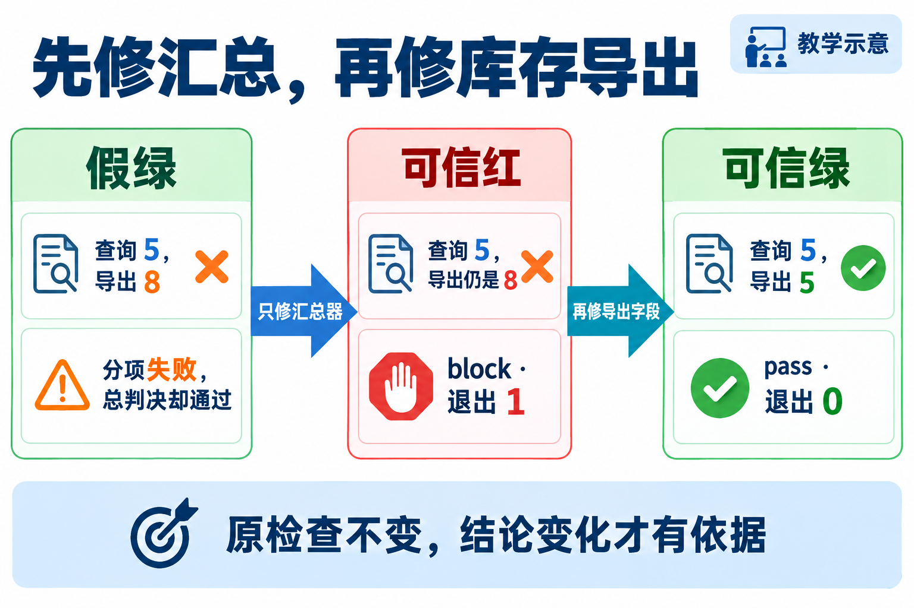

# L06｜用 Harness 汇总证据和等级

L05 已经把收货与修改范围写成可重复运行的检查。现在维护 FlowERP 的库存出口：在库 8、预占 3，查询应显示可用 5，CSV 导出也应显示 5。检查数量增加以后，只知道“运行过测试”不够，还需要确认运行了哪些项、谁能阻断、总结果有没有如实反映分项。

本讲在另建的隔离候选中设置两个教学缺陷：导出把可用量写成在库数，运行器又漏算阻断失败。L04 已接受的库存导出不用人为改坏。你先修好工作台的判断入口，再让 Codex 修产品口径；两次修改各有可观察的结果，最终才能说明绿色来自哪项修复。

## 1｜先确定哪个数字才对

**在库**是实际存放的数量，**预占**是留给订单、尚未出库的数量，**可用**是还能供其他订单使用的数量。本例不引入其他冻结或分仓因素，规则是可用＝在库－预占，因此 8−3＝5。预占改变分配，不表示仓库已经少了三件实物。


**图 6-1　同一份库存的查询与导出口径**

图中查询与导出都是同一状态的出口，正确结果均为 `[在库8，预占3，可用5]`。隔离副本的查询给出 5，CSV 却写 8。销售人员若按导出表承诺六件，就会把已经留给另一订单的货再卖一次。所以本次修复有明确的业务后果，不能只把一个字段“改到测试喜欢的数字”。

检查的正确答案要由输入和业务规则独立计算。仅比较“查询等于 CSV”不足以验收：两处一起写成 8，也能相等；直接用查询返回值当导出的答案，同样可能共享错误。应分别让两个出口与 8、3、5 对照。

实践用预置服务建立“已经预占三件”的测试条件。这个条件是本讲支架，不表示学生已交付 L07 的订单草稿或 L08 的整单预占。本讲只新增库存口径的一项检查，L04 的多仓明细、CSV 特殊字符与文件保护仍须保留原检查。

## 2｜一项检查要观察什么

库存检查首先在临时数据库中建立商品、入库 8 件，再为已有订单预占 3 件。它读取查询字段，解析 CSV 对应商品的一行，将两组观察分别与独立预期 `[8,3,5]` 比较。CSV 行数也要检查，避免“第一行正确，另有重复行”被忽略。

然后创建一个请求六件的新订单，在调用预占前保存库存、流水、订单头和明细。因为可用量只有五件，预占应被拒绝，并且这四类状态保持不变。这样正常路径验证出口口径，失败路径验证超额请求不会污染数据。正确拒绝会让 Eval 通过；接受超额请求或拒绝后仍有写入才是检查失败。

当这些检查进入统一入口时，首先遇到的是**用例发现**：运行器怎样知道有什么检查？本讲采用显式登记清单，每项登记“唯一名称、等级、可调用函数”。名称供命令选择和报告追溯，函数真正执行操作与断言。它不会因为某个文件叫 test 就自动知道那是本次必须运行的验收项。

候选的登记清单保留四项：`l06_stock_consistency`、原 L05 收货、原 L05 范围，以及 `help_image` 教学观察项。前三项为 blocking，最后一项为 observing。这里的观察项只是刻意保留的非阻断告警，不代表实际缺少配图。登记后还要验证选择结果：名称写错、选择为空、等级与套件不符、名称重复，都应暴露配置错误，不能返回“零项通过”的绿灯。

显式清单的代价是新增检查要记得注册；收益是能够审查本次要求与实际执行项是否一致。自动按文件名发现也可以采用，但仍要核对发现数量、身份和选择规则。本课程先使用容易检查的清单，把“检查存在”和“检查实际运行”分开验证。

## 3｜检查已经失败，总结果为什么仍然通过

**Eval Harness** 是统一运行这些检查、记录结果并计算判决的程序。它在本讲承担质量汇总；完整研发 Harness 还涉及执行范围、预算、授权和人审，不能因有一个运行器就认定那些能力齐备。

### 先看完整 Harness，再定位本讲建设的部分

完整的研发 Harness 要组织一次有边界的行动。人在工作台确认“查询与 CSV 都显示可用 5”、允许修改的文件和接受条件；工作台把当前 Spec、候选来源和失败材料交给 Codex。Codex 可以提出下一步，工具实际读取文件、修改代码或运行命令，把观察结果返回。随后根据检查与执行事实决定继续、停止或交给人处理。这个“提出行动—工具执行—事实返回”的循环，使 AI 能做事；范围、时限、独立检查和人审决定，使这件事成为可判断的交付。


**图 6-4　完整 Harness 的执行与交接，本讲建设其中的质量判断部分（教学示意）**

先看图中的任务边界，再看上下文、Codex 与工具之间的行动循环，最后读到独立 Eval、停止和具名接受。范围与停止条件应在执行前明确，不能等模型说完成后才补。图中的检查反馈可以支持下一步判断；反例是 Codex 说“已修好”却没有当前候选的检查，这仍只有一个待核查的陈述。

上下文的作用是帮助 Codex 判断这次该做什么。库存案例需要公式、实际候选、查询 5 而 CSV 8 的失败和允许文件；把大量旧绿报告塞进去，反而可能让它引用另一版本。工具提供的事实也要分清：命令启动成功只说明能运行，退出 0 只表达该命令约定的结果，数据库和分项报告才让人追查本次业务判断。工具具备某种能力，并不表示本次任务已经授权使用它。

本讲实现的 **Eval Harness** 位于这个流程的判断与反馈位置：它接收检查清单，运行、分级、保存证据，并把可信结论交给调用者。它不负责替人扩大写集、不自动批准业务单据，也不因一份 block 报告就自行建立完整修复循环；后续 L09、L10 再建设有范围的修复任务和有停止条件的返工。只修汇总器时仍应得到库存红灯，恰好说明反馈现在能够把真实失败传回。

核对当前工作台的[执行器](../../../workbench/execution.py)，`validate_v0_authorization` 检查候选、逐文件允许清单与时限，`_build_prompt` 提供任务和 Spec，执行后保存进程与差异；[事项工作流](../../../workbench/initiative_workflow.py)另外处理复验与具名接受。这些是现有支架的责任划分，提示词约束和事后差异检查仍不能当作覆盖所有工具副作用的系统隔离。迁移到新的导出格式时，沿同一结构重新确认上下文、权限、检查与交接，而不只是复制一个运行命令。

一次最小执行的机制是：验证登记与选择 → 依次调用函数 → 捕获断言或执行异常 → 保留名称、等级、原因和耗时 → 按等级汇总 → 写报告 → 返回退出码。捕获异常是为了保留故障并继续收集其他分项，不能把异常转换成通过。业务断言失败说明观察违背要求；依赖不可用说明业务结果尚未查明，两者都要保留原始原因。

等级表达失败对交付的影响，`passed` 表达这次实际结果。**阻断级**用于事先约定必须满足的要求，如可用量正确、既有收货不回退、修改不越界；任一失败就不能放行。**观察级**用于保存暂不作为放行条件的信息；它可以失败，但必须留下告警。不能因为阻断项暂时修不好，就把它临时降级。

本讲坏运行器把 `blocking_failed` 固定为 0，因此分项已发现“查询5、CSV8”，摘要仍写 pass、命令仍返回 0。这不是产品修好了，而是判断程序没有忠实传递失败。汇总也不能采取多数投票：三个阻断项中两个通过、一个失败，仍然应当 block。

```text
阻断失败数＝所有 level 为 blocking 且 passed 为 false 的项数
观察失败数＝所有 level 为 observing 且 passed 为 false 的项数
阻断失败数大于 0：decision 为 block，业务运行器退出非零
阻断失败数为 0：decision 为 pass，业务运行器退出 0，保留观察告警
```

**退出码**是命令结束交给调用者的状态数字，后续 Hook 与 CI 根据它处理成功或失败。屏幕打印“BLOCK”而返回 0，或报告写 pass 而返回非零，都会使上层误判。统一的是同一业务运行器的约定，并非强迫所有工具拥有同一种退出含义；报告复核工具成功确认一份红报告是真实的，完全可以退出 0。

## 4｜第一次只修汇总，保留业务红灯

先按[实践操作手册](实践操作手册.md)观察 `02-false-green.json`：四项是否齐全，库存项是否确实失败，摘要与进程退出是否一致。再让 Codex 只修候选的 `eval/l06_runner.py`。产品、检查函数及等级保持不变，这次期望得到可信的红色业务结论。



**图 6-2　先修汇总，再修库存导出**

中间阶段仍是查询 5、CSV 8。区别是运行器现在统计出一个阻断失败、一个观察告警，decision 为 block，业务退出 1。这恰好证明第一次修复奏效。九项运行器合同测试通过与业务仍红并不矛盾：前者检查裁判是否如实工作，后者检查产品是否符合库存规则。

报告采用 **JSON**，即用固定字段表达对象、列表、数字与布尔值的数据格式，供程序读取，而非让下游猜一句中文的含义。下面是教学失败项的结构示例，耗时为示意值，不是执行记录，也不是可提交的完整报告：

```json
{
  "name": "l06_stock_consistency",
  "level": "blocking",
  "passed": false,
  "duration_ms": 12,
  "evidence": "AC-AVAILABLE: expected=[8,3,5], query=[8,3,5], csv=[8,3,8]",
  "error": {"type": "AssertionError", "message": "AC-AVAILABLE: CSV 可用量不符合独立预期"}
}
```

程序可以依据 `name` 关联要求，依据 `level` 和 `passed` 统计阻断失败，再将 `error` 交给修复调查；不必猜测“似乎有一点问题”意味着什么。整份报告还保留生成时间、所选套件、请求的检查及摘要。耗时帮助发现某项异常变慢，时间帮助区分运行，二者都不能单独证明报告属于当前源码。

读取机器报告也要进行检查。消费者应重算分项统计，核对必需项是否齐全，再比较摘要与真实退出码。否则一份格式合法、内容矛盾的 JSON 仍可能制造假绿。本讲的 `review` 还核对候选来源和指纹；它接受可信红报告，表示证据一致，业务是否返工仍看 decision。

把这段机制展开成一次审核。这里使用本讲 `all` 集合的四个登记项，假定原 L05 两项仍通过，库存项仍观察到查询 5、CSV 8，教学观察项仍告警。表中是应有的分项推演，不是学生报告。

| 分项身份 | 事先确认的等级 | 本次应有的 `passed` | 对总判决的影响 |
|---|---|---|---|
| `l06_stock_consistency` | blocking | false | 增加一个阻断失败 |
| `l05_personal_receiving` | blocking | true | 保留原收货回归通过 |
| `l05_personal_scope` | blocking | true | 保留原工程范围通过 |
| `help_image` | observing | false | 增加一个观察告警 |

由四行重新算得 `total=4`、`passed=2`、`blocking_failed=1`、`observing_failed=1`，因此 `decision=block`，业务进程应退出 1。两个通过项不能抵消库存阻断失败；观察告警也不能把业务阻断变成一般提醒。坏汇总器虽然如实保留这四行，却把阻断失败数写为 0。消费者若只读 summary，就会再次相信同一个错误；它必须从分项独立重算，才能拒绝这份矛盾报告。


**图 6-3　先核对必需项，再重算判决与退出码（教学机制示意）**

[可编辑源图](assets/reading-depth-20261003/mechanism.drawio)。

沿图依次检查身份、分项、汇总和进程，不能只从第三步开始。身份检查的依据来自这次任务事先约定的清单。如果库存项根本没有运行，余下两项通过、一个观察告警，分项统计可以完全自洽，甚至没有阻断失败；但它只能证明那三项，不能证明库存口径。本讲 `eval/report_contract.py` 因而将调用者要求的身份与报告对照，个人 `review` 还核对等级没有被改动。

这里有两个独立问题：“报告有没有如实表达本次检查”和“产品是否满足交付条件”。只修汇总之后，报告如实写 block、业务退出 1，`review` 成功退出 0，表示前一个问题得到肯定，后一个仍是否定。再修导出后，原四项中三个阻断项通过，观察项仍失败，所以 `passed=3`，decision 为 pass，业务退出 0；不必为了消除最后一条告警而改动它的等级或删除它。

迁移到新增库存要求时，先更新经确认的必需项清单，再增加对应检查。直接沿用“报告自己列出的全部项”作审核依据，会让漏注册的新要求永远无法被发现。这正是质量入口需要明确登记与独立复核的原因。

若出现依赖异常，先修环境，不能改库存公式消除环境红灯。若报告写入失败，本次证据没有完整生成，应保留命令错误，换新输出位置后重跑；目录里上一轮的文件不能代替本次报告。手册使用新文件名并拒绝覆盖，目的是让每次运行和失败都可追查。

## 5｜第二次修导出，再换一组库存数据

确认可信红以后，只让 Codex 修同一候选的 `flowerp/service.py` 导出字段。正确查询、超额预占保护、原检查和已修运行器保持不变。再运行应得到三个阻断项通过、一个观察告警、decision 为 pass、业务退出 0。这样的绿色可以解释为“产品在原标准下修好”，而不是改松了裁判。

再换输入为在库 13、预占 4，两个出口都应给出可用 9，请求 10 应被拒绝且状态不变。这排除把 available 写死为 5 的实现。它也说明迁移不是换一个数字就结束：新增冻结、分仓或可用量算法时，要重新确认哪些库存算可售，再建立独立预期。

旧红报告应保留为历史，但源码已改变后，它不能证明当前候选。手册此时让 review 拒绝旧来源，是正常的证据边界；不要删除旧失败来让目录看起来全绿。复验者用新文件名独立运行 run、review 和合同测试，再依据真实材料给出验收意见。

## 6｜怎样把这些检查带到 L07

L06 的小运行器是 `eval/l06_runner.py`，L07 的统一命令入口是 `eval.harness`。复用不是把文件改名，也不是复制绿色报告；应把个人 L05、L06 检查函数与运行器合同登记到下一讲的入口，再确认它们实际执行。

[检查接入手册](../L07/实践操作手册.md#l07-connect)先核对 L06 当前绿报告、来源与修改范围，再把检查复制到独立 L07 候选并注册。它不替学生复制并验收 FlowERP 产品修复。当前控制仓库的 `eval.harness` 默认检查工作台，业务用例需按候选登记或显式选择，不能用控制仓库默认绿灯推断客户产品通过。

当学生确认库存口径与等级，Codex 完成两个限定文件的修复，工作台关联候选和报告，复验者核查原标准与真实状态，本讲才形成“业务需求促成可信汇总，可信汇总支持产品交付”的因果链。商品整批导入留作[选读案例](reference/商品导入选读.md)，不并入本讲主线。

## 本讲留下什么，下一讲怎样接着用

本讲留下统一库存口径的候选，以及能如实发现、分级、记录、传播失败的最小 Harness。L07 接着解决什么时候自动调用这个入口；先接入原检查，再选择触发事件。源码细节可按需查[参考说明](reference/参考说明.md)。本地实验和参考检查通过不自动产生工作台人审记录。

[课程学习路线](../../README.md#16-讲学习路线) · [实践操作手册](实践操作手册.md) · [上一讲](../L05/辅导资料.md) · [下一讲](../L07/辅导资料.md)

## 课程大纲中的本讲要求

- **核心内容**：用例发现、统一退出码、阻断级与观察级指标、机器可读报告。
- **演示结果**：Harness 输出分项结果、阻断结论和 JSON 报告。
- **课内增量**：实现最小 Harness，将第 5 讲用例纳入统一执行。
- **通过标准**：阻断用例失败时返回非零退出码；观察项失败只记录告警；报告保留运行时间和失败原因。

配图为教学示意；来源与提示词：[查看生成提示词](assets/stock-mainline-20260926/生成说明.md)。
