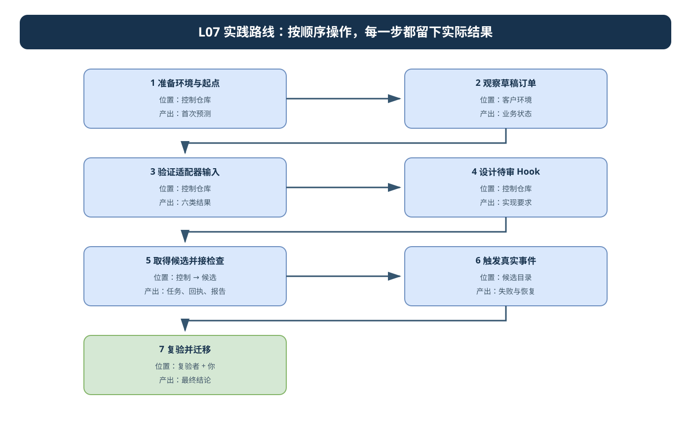
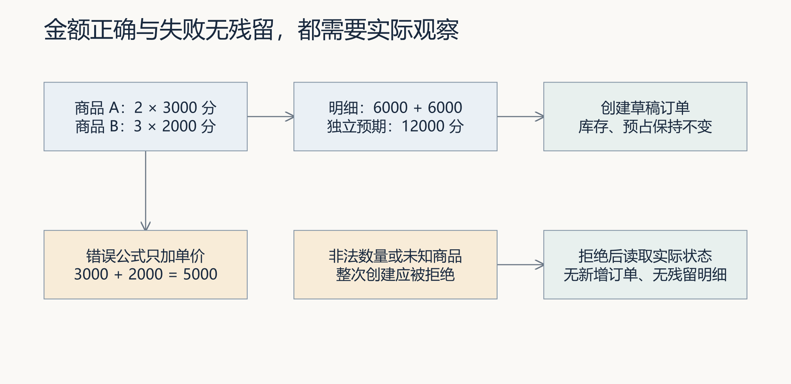
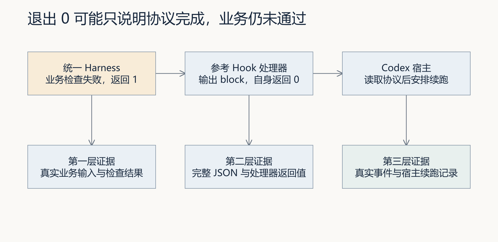
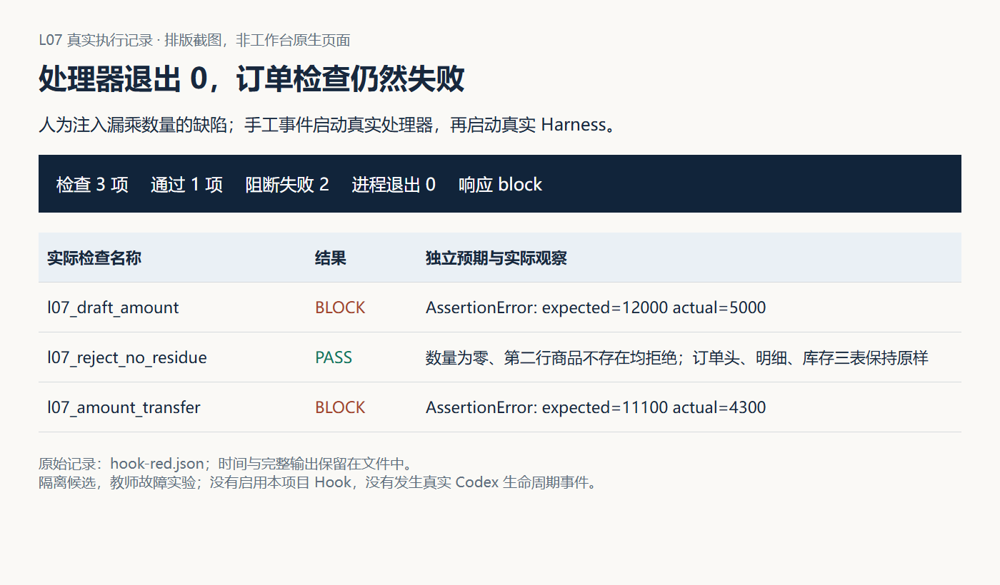
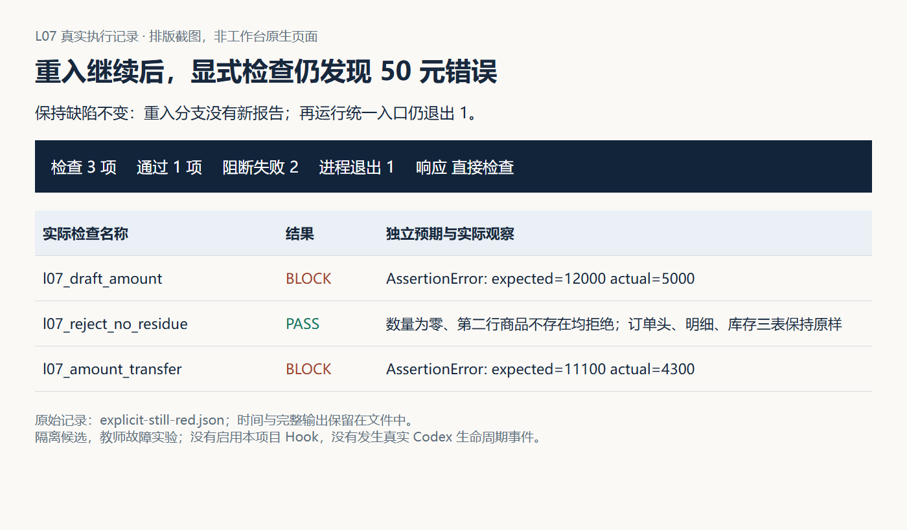
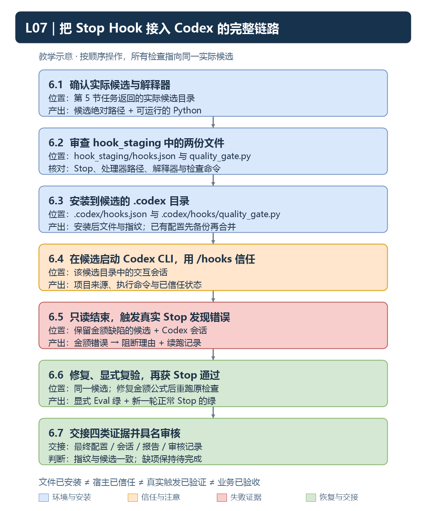
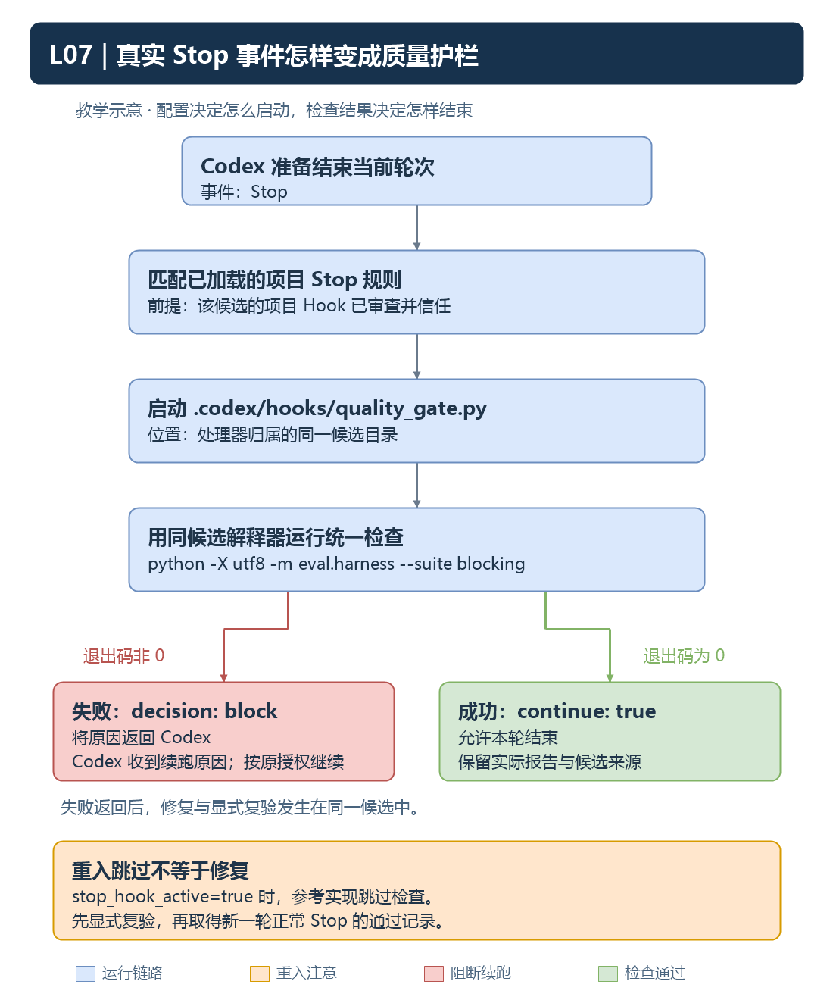

# L07｜用 Codex Hooks 建立本地护栏

**实践操作手册｜让检查真的发生**

> **终端选择：**本手册同时提供 Windows PowerShell 与 macOS 默认终端 zsh 的操作。每一步只运行自己系统对应的代码块；标为“通用”的 Python、Git 命令两端相同。开始或重开终端时，先按[macOS 环境与路径约定](../../reference/实操手册执行与排错.md#macos-zsh)恢复本讲使用的虚拟环境，再核对当前源码位置。

未分系统的终端代码块中，`python`、`git` 和 `codex` 命令两端通用；先激活当前步骤指定项目的 `.venv`，再逐条执行。自然语言提示词复制到 Codex 对话，不能粘到终端。

> 本手册是操作主线。先读讲义理解原因，按本手册完成步骤，所有个人记录放在同一份 SUBMISSION.md 中。

本实践需要区分三种证据：真实业务服务的结果、处理器协议的分支、真实 Codex 事件的触发。阅读[讲义](辅导资料.md)后，先填写[提交模板](SUBMISSION.md)的首次预测，再运行实验。

按“业务要求 → 漏检诊断 → 机制观察与设计 → 生成待审文件 → 安装后真实事件 → 最终复验与效果判断”执行。`hook_staging/` 属于本次候选中的待审产物，不是现成附件；文件生成前不要调用它，也不要直接改活动 Hook 来绕过准备过程。

开始操作前，遇到解释器、路径或输出问题，按[执行与排错说明](../../reference/实操手册执行与排错.md)核对。

### 本讲目录地图

```text
〈CodexFDE 控制仓库〉/                ← 第 1～5 节提交前的命令从这里运行
├─ .venv/                            ← 工作台解释器
└─ .runtime/l07-learning/            ← 控制侧运行记录

〈独立 FlowERP 仓库〉/               ← 客户源码与客户 .venv；不要放进 CodexFDE
〈course-prepare 返回的隔离候选〉/   ← 第 5 节返回后才切换
├─ flowerp/、eval/、tests/
├─ hook_staging/                     ← 本讲待审 Hook 文件
└─ .course/product-source.json       ← 核对客户源码来源
```

看到 `flowerp/...` 这类相对路径时，先判断当前阶段：返回候选后才在实际候选根目录操作。不得在 CodexFDE 根目录新建 `flowerp/`。

<a id="l07-goals"></a>

## 本次交付与个人职责

客户产品增量是草稿订单：两行金额准确，非法输入拒绝后无残留，创建时不预占。工作台增量是让既有 Harness 在合适时点实际运行。你先确定规则、范围和事件，Codex 在暂存区协助实现，审查后安装到真实候选，再以实际事件和最终复验支持人工决定。

**学习成果：**能诊断订单交付中的工程问题，选择 Hook 接入位置，并用真实事件和最终复验解释效果与边界。已有事项能承载首次判断、失败、修改与复验时直接引用，不重复填写材料。案例 1 对应第 2 节；案例 2～5 对应第 3～4 节；案例 6 对应第 5～6 节；案例 7 对应第 7 节。

课程合同：

- **核心内容**：生命周期 Hook、信任边界、超时、失败策略，以及 Hook 与 Git Hook 的区别。
- **演示结果**：Codex 在关键生命周期节点运行质量检查并反馈失败。
- **课内增量**：配置一个项目级质量 Hook，调用统一 Harness，而不是复制另一套质量逻辑。
- **通过标准**：Hook 来源可检查；故意引入违规时流程被阻断；恢复后重新通过。

## 先看流程图，再开始操作



控制实验、候选中的待审 Hook 和宿主真实事件是三类不同证据。按图完成当前产出后再切换位置。可编辑源文件：[l07-practice-flow.drawio](assets/l07-practice-flow.drawio)。

## 第 1 步：准备环境和记录起点

<!-- step-guide-1 -->
> **一句话说明：**先确认环境和候选起点，再写下你认为 Hook 应该拦住哪些失败。

开始本讲 FDE 实践时，先在[提交模板](SUBMISSION.md)的首次判断与需求记录回答：草稿订单交付中漏掉的是哪次检查，影响哪项销售判断，为什么选定这个触发时点？注明来源是实际观察、同伴试用还是教学设置，写下本次选择和暂缓范围，再请 Codex 协助调查。

沿用 L04 已接受的控制工作台及 L06 的统一 eval Harness。先区分两个独立项目：CodexFDE 保存工作台、课程与控制入口；FlowERP 保存客户业务代码 `flowerp/`、业务 Eval 和客户界面。两者各用自己的 `.venv`，CodexFDE 根目录不应新建或恢复 `flowerp/`。

以下环境准备和 `workbench.cli` 命令在 **CodexFDE 根目录**运行；第 5 节返回隔离候选后，再按步骤切换到实际候选目录。先选择 CodexFDE 的虚拟环境。Windows PowerShell：

**Windows（PowerShell）：**

```powershell
. ./.venv/Scripts/Activate.ps1
python -c "import sys; print(sys.executable)"
git rev-parse HEAD
git status --short
```

**macOS（zsh）：**

```zsh
source .venv/bin/activate
python -c "import sys; print(sys.executable)"
git rev-parse HEAD
git status --short
```

输出的 Python 应在本项目 `.venv` 中。尚未安装项目时先完成[学生入口](../../README.md)的环境准备。

记录未提交改动；提交 SHA 不能单独代表含未提交修改的实际候选。运行结果保存在自己的 `.runtime/l07-learning/`，每次编号递增。示例不会创建课程成绩或启用仓库 Hook。

## 2. 先看业务状态

<!-- step-guide-2 -->
> **一句话说明：**先观察真实订单创建的成功和失败状态，再把这些业务事实变成候选中的检查。

**运行前确认：** 在 CodexFDE 中通过项目登记或 `FLOWERP_PROJECT_ROOT` 指定独立 FlowERP 仓库的绝对路径，完成[客户环境检查](../../reference/实操手册执行与排错.md#product-environment)。下面命令仍从 CodexFDE 运行，`order_state_lab.py` 会自动使用独立 FlowERP 的解释器运行业务观察。这里只观察参考服务；自己的检查在第 5.3 节接入返回的候选，并核对实际源码来源。



先手算图中金额，再运行实验。特别检查失败请求没有留下订单或明细，以及创建草稿前后库存不变。

```text
python -X utf8 docs/courses/L07/examples/order_state_lab.py
```

阅读脚本，找到独立预期 `12000`、两行明细和失败后状态的断言。预期草稿订单总额为 12000 分，库存不变，数量为零与第二行不存在分别被拒绝且没有残缺记录。输出是实际参考服务的观察。

将例子改成另一组数量和单价前，先手算金额。不要仅让“总额等于程序返回明细之和”作为唯一检查：如果二者共用错误公式，它们可能一起出错。

本讲允许零库存创建草稿；创建并未预占。不要沿用旧行动卡中的“缺货不能创建任何订单”。库存原子预占属于 L08。

### 2.1 先确定检查要求，不提前操作候选

本节只观察并写下自己的预期。两行金额应为 12000 分；数量为零、第二行商品不存在时，订单头、明细、库存三张表都不应留下残缺状态；创建草稿不预占。迁移输入的独立预期为 3×2500+2×1800=11100 分。

[order_contract_checks.py](examples/order_contract_checks.py)提供三个参考函数，供对照断言。现在不复制、不注册，也不需要一个尚未创建的候选。第 5 节会依次取得候选、准备环境、接入自己的 L06 检查与这三项检查，再作实际诊断。

在提交模板先写假设：问题可能来自断言不足、测错对象、执行故障或结束时漏调用。保留这次预测，等第 5.4 节的真实报告再决定改哪里。

## 3. 检查适配器的六种输入

<!-- step-guide-3 -->
> **一句话说明：**用六种输入检查 Hook 适配器，分清真实失败、空输出、错误格式和运行异常。



本节只验证中间的适配层。输出中的模拟业务结果与模拟事件，都不能替代第 6 节的真实触发记录。

以下命令调用真实参考处理器，但用替身代替其子进程，不执行 Harness，也不启用 Hook：

```text
python -X utf8 docs/courses/L07/examples/hook_protocol_lab.py pass
python -X utf8 docs/courses/L07/examples/hook_protocol_lab.py block
python -X utf8 docs/courses/L07/examples/hook_protocol_lab.py reentry
python -X utf8 docs/courses/L07/examples/hook_protocol_lab.py malformed
python -X utf8 docs/courses/L07/examples/hook_protocol_lab.py timeout
python -X utf8 docs/courses/L07/examples/hook_protocol_lab.py command-error
```

| 模式 | 关键观察 | 你的解释任务 |
|---|---|---|
| pass | 调用 1 次，处理器返回 0，continue 为 true | 区分协议完成与真实业务通过 |
| block | 调用 1 次，处理器返回 0，decision 为 block | 解释为何退出 0 仍要求续跑 |
| reentry | 调用 0 次，返回避免重复续跑信息 | 说明为何不能给当前修复盖绿章 |
| malformed | 调用 0 次，stderr 记录输入错误，stdout 返回 block | 定位输入故障，不能归因金额公式 |
| timeout | stderr 记录 TimeoutExpired，stdout 返回未完成验证的 block | 替身抛错不证明真实宿主超时行为 |
| command-error | stderr 记录 FileNotFoundError，stdout 返回未完成验证的 block | 记录未完成验证，不能借用旧报告 |

包装实验完成观察时本身可以返回 0。要检查 JSON 内的 `handler_return`、`exception`、`response` 与调用次数。当前参考处理器会捕获上述异常并返回合法 block；外层 `exception` 可为 null，原错误仍在 `stderr`。有内部调用时，`subprocess_timeout_configured` 应为 true；重入或输入错误没有调用子进程，此字段为 false 不代表遗漏超时配置。`assets/latest/protocol-*.json` 保留的是历史实现输出，不能覆盖你当前的实际观察。

保留完整 stdout；尝试将其作为一个 JSON 解析。不能从混有日志的字符串里截出看似正确的一段当协议成功。


## 4. 调查并确定 Hook 设计

<!-- step-guide-4 -->
> **一句话说明：**先调查配置与检查入口，确定个人实现要求；第 5 节再通过工作台执行。

本节先确定设计，第 5 节再通过工作台委托实现。没有个人候选时，只读调查控制仓库的参考 `.codex/hooks.json` 和 `.codex/hooks/quality_gate.py`，把下面调查提示词中的目标写明为“参考配置，尚无个人候选”。已有个人候选时调查自己的文件；文件不存在就如实记录，不能把参考文件当作本人已安装的 Hook。

<a id="l07-investigate-prompt"></a>

**复制到 Codex 对话的调查提示词：**先替换方括号为实际路径。本步只调查。

```text
调查对象：[参考控制仓库或已有候选的绝对路径]。任务范围：[订单和 Hook 的实际范围]。
先比较最后一次订单修改与最后一份检查报告，核对覆盖、源码来源和执行是否完成。
列出断言不足、测错对象、环境故障、触发遗漏各有什么文件或报告依据；缺证据就写待确认。
从配置读到处理器和统一 Harness，列明解释器、cwd、配置来源、重入分支与两层超时。
比较 Stop 与 Git Hook，建议最小改进位置。这一步不启用 Hook，不修改文件。
```

从配置沿调用链读到统一 Harness，记录实际命令、解释器、工作目录、来源与内容指纹。审查前不要复制粘贴启用未知脚本。

当前控制仓库参考配置使用项目 `.venv`。个人实现也要明确调用已核对的候选解释器。以下是配置中两个字段的示例，保留现有外层 `hooks/Stop/hooks` 结构；没有自动写入你的项目：

```json
{
  "command": "\"$(git rev-parse --show-toplevel)/.venv/bin/python\" \"$(git rev-parse --show-toplevel)/.codex/hooks/quality_gate.py\"",
  "commandWindows": "powershell -NoProfile -Command \"$r = git rev-parse --show-toplevel; & (Join-Path $r '.venv/Scripts/python.exe') (Join-Path $r '.codex/hooks/quality_gate.py'); exit $LASTEXITCODE\""
}
```

这两个字段只解决解释器与脚本定位。还需要在处理器中验证候选目录，将内部 `subprocess.run` 的 `cwd` 明确指向该候选。不要盲信任事件里任意目录：将解析后的路径与本次授权候选比较，不一致就报告配置问题。

将这些要求写进第 5.1 节的实际 Spec，随工作台任务委托；返回候选后再检查本人实现：保持调用同一 Harness，诊断送 stderr，stdout 只返回当前协议；设计内部超时与外层时限，异常时保留“未验证”原因；明确重入跳过后如何触发最终复验。内部超时值应小于外层时限并留出输出余量，不能只修改一个数字就声称能终止进程树。

对自己的处理器重做六类测试。课程脚本默认读取仓库参考处理器，不会自动测试另一个目录的个人实现；在自己的测试中明确加载个人文件，记录其路径和指纹。另用短时本地等待程序验证真实内部超时与进程结束，将它和替身实验分开记录。

## 5. 取得候选，接入检查并完成诊断

<!-- step-guide-5 -->
> **一句话说明：**通过工作台提交草稿订单任务，并保存真实任务编号和候选路径。

### 5.1 在控制工作台保存要求，准备候选

控制工作区先确认课程要求及起始标签：

```text
python -X utf8 -m workbench.cli course-contract --lesson 7
git rev-parse --verify course/l07-start
```

Spec 写清两行订单金额、非法数量、商品不存在后的无残留以及库存不变，并分别注明控制工作台和独立 FlowERP 仓库的实际路径。草稿订单实现及业务检查归属 FlowERP；工作台负责组织任务、调用检查和保存交付证据。

在控制仓库生成本次 Spec 草稿，再用编辑器填入下面的实际要求。文件名已用过时改下一个编号，并同步修改提交命令中的路径，保留原版本。

```text
python -X utf8 -m workbench.cli course-spec --lesson 7 --output .runtime/l07-learning/FDE_SPEC-01.md
```

<a id="l07-implementation-prompt"></a>

**填写 Spec 时直接使用下面要求：**把诊断和路径填成真实值，随同一工作台事项保存；这段文字不是另一条终端命令。

```text
实际控制工作台：[路径]；独立 FlowERP：[路径]；已确认诊断：[证据与待确认项]。
交付两行草稿订单：金额独立可算，非法数量和商品不存在无残留，创建不预占。
允许修改：[最小文件范围]。Hook 待审产物仅写 hook_staging/hooks.json 和 quality_gate.py。
调用候选统一 Harness，业务断言登记在同一入口，保留 L06 检查；活动 .codex 保持受保护。
核对候选目录与解释器，stdout 只输出合法协议，诊断送 stderr，处理超时、异常与重入。
针对个人处理器测试正常、失败、重入和故障分支，记录 Diff、真实运行与缺失证据。
文件暂存不等于安装或信任，真实宿主触发与人工接受在后续步骤验证。
```

本讲采用一条个人实践路线：先 `course-prepare` 取得候选，接入自己的检查并保存执行前报告，再用 `task-create --spec-path` 冻结个人要求、`task-run` 执行。当前 `course-submit --requirement-spec` 只支持 L04、L15/L16，不能在 L07 用它传入个人要求。

下面显式使用 `--source working-tree`，从当前工作台与已登记的独立 FlowERP 生成带来源与哈希的教学快照，并剥离本讲增量。客户源码检查失败时先补齐登记与环境，不改成测控制仓库。候选只作教学实践，修改不会自动写回独立 FlowERP；不得在控制仓库恢复业务包。

因此，课程投影里的 `flowerp/`、`eval/`、`tests/` 与 `hook_staging/` 都是**相对于返回的隔离候选根目录**的允许写入范围，不是让你修改 `CodexFDE/flowerp/`。实际委托还须进一步列出最小文件。

Codex 将待审查配置与处理器写入 `hook_staging/hooks.json` 和 `hook_staging/quality_gate.py`。暂存目录不会被宿主当成项目 Hook 自动加载；活动 `.codex` 仍受执行保护。先只读检查本次课程范围：

```text
python -c "from workbench.course_mainline import LESSONS; from workbench.execution import normalize_write_scope; print(normalize_write_scope(next(x.write_scope for x in LESSONS if x.number == 7)))"
```

应显示 `flowerp`、`eval`、`tests`、`hook_staging`，含义是上述隔离候选的写入范围。旧版本曾把 `.codex/hooks` 放进写集，导致任务创建即报受保护路径；遇到该错误先更新控制工作台的课程投影。不要取消 `.codex` 全局保护。

在沿用的控制运行目录中准备候选；这一步没有调用 Codex 实施：

```text
python -X utf8 -m workbench.cli course-prepare --lesson 7 --source working-tree --task-id TASK-PREP-L07-PERSONAL-01 --runtime-dir .runtime/l04-learning
```

保存准备命令退出码、返回的 `path`、基线及 `.course/product-source.json`。退出 0 只证明候选已准备，尚无实施结果或 `review` 状态。目录已存在时沿用原候选；需要另一次独立实验才换新的 `--task-id`，保留旧记录。失败先查原错误，不用控制仓库替代缺失候选。

查看返回的 `student_start`：确认 `start_gap_applied` 与实际文件对应，逐项检查 `unapplied_overlays`。未应用的增量剥离先查原因；准备命令退出 0 不能替代有效执行前红灯。

**候选路径取自本次准备结果的 `path`。**下面先准备候选环境，再回控制终端接入检查；实际执行任务在第 5.4 节创建并关联这一路径。

<a id="l07-candidate-environment"></a>

### 5.2 进入返回的候选，准备自己的解释器

**操作位置：另开一个候选系统终端。**第 5.1 节的控制终端留在 CodexFDE 根目录，下一节仍使用它。从返回结果复制 `path`，不加外层引号。下面会询问这个路径；进入后相对命令都在候选根目录运行。

**Windows（PowerShell）：**

```powershell
$hookCandidate = Read-Host '粘贴第5节 path 的完整路径（不加引号）'
Set-Location -LiteralPath $hookCandidate -ErrorAction Stop
Get-Location
if (-not (Test-Path -LiteralPath 'flowerp/service.py') -or -not (Test-Path -LiteralPath 'eval/harness.py')) { throw '不是本次课程候选，请回查 path' }
if (-not (Test-Path -LiteralPath '.venv/Scripts/python.exe')) {
    python -m venv .venv
    if ($LASTEXITCODE -ne 0) { throw '候选环境创建失败，先修复环境' }
}
$hookPython = (Resolve-Path '.venv/Scripts/python.exe').Path
& $hookPython -X utf8 -c "import sys,eval.harness,flowerp.service; print(sys.executable); print(eval.harness.__file__); print(flowerp.service.__file__)"
if ($LASTEXITCODE -ne 0) { throw '候选导入失败，先排错，不继续安装' }
```

**macOS（zsh）：**

```zsh
prepare_l07_candidate() {
  printf '粘贴第5节 path 的完整路径（不加引号）：\n'
  read -r hookCandidate || return 1
  cd "$hookCandidate" || return 1
  pwd
  if [ ! -f flowerp/service.py ] || [ ! -f eval/harness.py ]; then
    printf '不是本次课程候选，请回查 path。\n'
    return 1
  fi
  if [ ! -x .venv/bin/python ]; then python3 -m venv .venv || return 1; fi
  ./.venv/bin/python -X utf8 -c 'import sys,eval.harness,flowerp.service; print(sys.executable); print(eval.harness.__file__); print(flowerp.service.__file__)'
}
prepare_l07_candidate
```

**预期结果：** 当前目录等于本次 `path`；Python 位于该候选 `.venv`，两个模块文件均位于该候选内。先目视核对这三条绝对路径。导入失败、路径落在控制仓库或其他客户仓库时，按[执行与排错说明](../../reference/实操手册执行与排错.md)处理，不能算订单业务失败。重开终端后重新选择原候选和解释器即可，不重新提交任务。

**来源核对：**有 `.course/product-source.json` 时查看客户源目录与文件哈希；标签候选未携带该文件时，保存原任务的隔离记录、基线提交与实际文件路径，并将客户来源哈希缺口标为待核对，不自行补造元数据。

完成后切回原控制终端执行下一节；候选终端留在这里，供第 5.5～6 节使用。

<a id="l07-connect"></a>

### 5.3 回控制仓库，接入自己的 L06 检查

需要自己的 L06 库存实验 session，以及对当前源码复核通过、业务判决 pass 的新报告。旧导入实验 session 不适用，请先按当前 [L06 手册](../L06/实践操作手册.md)完成库存主线。

L07 目标使用第 5.1 节返回、5.2 节已准备好环境的独立候选，必须已有 `eval/harness.py`、`flowerp/`，并配置候选自己的虚拟环境。不要选控制仓库、独立 FlowERP 工作仓库或 L06 原候选。此时订单功能未实现也可以先接入，业务红灯按实际原因记录。

在控制仓库根目录的终端按系统选择命令：

**Windows（PowerShell）：**

```powershell
$controlPython = (Resolve-Path '.venv/Scripts/python.exe').Path
$connector = (Resolve-Path 'docs/courses/L07/examples/connect_l06_checks.py').Path
$sourceSession = Read-Host 'L06 库存 session.json 完整路径'
$sourceReport = Read-Host 'L06 当前绿报告完整路径，例如 07-transfer.json'
$target = Read-Host '独立 L07 候选完整路径'
$handoff = Join-Path (Get-Location) ('.runtime/l07-connection/' + [guid]::NewGuid().ToString('N'))
New-Item -ItemType Directory $handoff | Out-Null
& $controlPython -B -X utf8 $connector --l06-session $sourceSession --l06-report $sourceReport --candidate $target --receipt (Join-Path $handoff 'connection.json')
if ($LASTEXITCODE -ne 0) { throw '接入失败，先看错误，不要继续安装 Hook' }
```

**macOS（zsh）：**

```zsh
connect_l06_checks() {
  controlPython="$PWD/.venv/bin/python"
  connector="$PWD/docs/courses/L07/examples/connect_l06_checks.py"
  printf 'L06 库存 session.json 完整路径（不加引号）：\n'
  read -r sourceSession || return 1
  printf 'L06 当前绿报告完整路径，例如 07-transfer.json（不加引号）：\n'
  read -r sourceReport || return 1
  printf '独立 L07 候选完整路径（不加引号）：\n'
  read -r target || return 1
  handoff="$PWD/.runtime/l07-connection/$("$controlPython" -c 'import uuid; print(uuid.uuid4().hex)')"
  mkdir -p "$handoff" || return 1
  "$controlPython" -B -X utf8 "$connector" --l06-session "$sourceSession" --l06-report "$sourceReport" --candidate "$target" --receipt "$handoff/connection.json"
}
connect_l06_checks
```

脚本先检查 L06 原文件、允许差异、报告来源和分级，再复制 L05 三个原文件、L06 检查、小运行器及其九项合同，并放入 L07 三个订单检查函数。它只在目标 Harness 注册这些函数，不复制已完成的产品实现。保存 `connection.json`，查看复制文件哈希、注册前后哈希和检查名称。

目标已有同名文件或已经注册时会拒绝，避免覆盖个人工作。先核对是否选错候选；如有需要保留的既有改动，人工比较并登记合并过程，不删除文件来绕过保护。接入改动属于 L07 准备阶段，在冻结本轮业务修复范围前记录新的基线。

**仍在控制仓库终端，核对实际加载位置并运行七项指定检查：**

**Windows（PowerShell）：**

```powershell
$candidatePython = Join-Path $target '.venv/Scripts/python.exe'
if (-not (Test-Path $candidatePython)) { throw '先按第5.2节配置该候选的虚拟环境' }
$cases = @('l06_stock_consistency','l05_personal_receiving','l05_personal_scope',
           'l06_harness_contract','l07_draft_amount','l07_rejected_order','l07_amount_transfer')
Push-Location $target
try {
    & $candidatePython -B -X utf8 -c "import eval.harness,eval.l06_checks,flowerp.service; print(eval.harness.__file__); print(eval.l06_checks.__file__); print(flowerp.service.__file__)"
    if ($LASTEXITCODE -ne 0) { throw '导入失败' }
    $argsList = @('-B','-X','utf8','-m','eval.harness','--suite','blocking','--report-path',(Join-Path $handoff 'selected.json'))
    foreach ($caseName in $cases) { $argsList += @('--case',$caseName) }
    & $candidatePython @argsList
    $selectedExit = $LASTEXITCODE
    $selectedExit | Set-Content (Join-Path $handoff 'selected-exit.txt')
} finally { Pop-Location }
$result = Get-Content (Join-Path $handoff 'selected.json') -Raw -Encoding UTF8 | ConvertFrom-Json
$result.results | Format-Table name,level,passed
if (@($result.results).Count -ne 7) { throw '检查数量不符' }
if (Compare-Object ($cases | Sort-Object) ($result.results.name | Sort-Object)) { throw '检查名称不符' }
```

**macOS（zsh）：**

```zsh
check_l07_selected() {
  candidatePython="$target/.venv/bin/python"
  if [ ! -x "$candidatePython" ]; then
    printf '先按第5.2节配置该候选的虚拟环境。\n'
    return 1
  fi
  cases=(l06_stock_consistency l05_personal_receiving l05_personal_scope l06_harness_contract l07_draft_amount l07_rejected_order l07_amount_transfer)
  (
    cd "$target" || exit 1
    "$candidatePython" -B -X utf8 -c "import eval.harness,eval.l06_checks,flowerp.service; print(eval.harness.__file__); print(eval.l06_checks.__file__); print(flowerp.service.__file__)" || exit 1
    argsList=(-B -X utf8 -m eval.harness --suite blocking --report-path "$handoff/selected.json")
    for caseName in "${cases[@]}"; do argsList+=(--case "$caseName"); done
    if "$candidatePython" "${argsList[@]}"; then selectedExit=0; else selectedExit=$?; fi
    printf '%s\n' "$selectedExit" > "$handoff/selected-exit.txt"
  ) || return 1
  "$controlPython" -X utf8 - "$handoff/selected.json" "${cases[@]}" <<'PY'
import json, sys
from pathlib import Path
report = json.loads(Path(sys.argv[1]).read_text(encoding='utf-8-sig'))
results = report['results']
for item in results:
    print(item['name'], item['level'], item['passed'])
if len(results) != 7 or sorted(item['name'] for item in results) != sorted(sys.argv[2:]):
    raise SystemExit('检查数量或名称不符。')
PY
}
check_l07_selected
```

三条源码路径必须位于 `$target` 内。接入后的旧检查将在 L07 产品候选上执行：如果库存或收货发生回退，应如实红灯；订单待实现时，也应报告实际缺陷。不要把它们当成“迁移噪声”删掉。先区分环境错误、旧能力回退与本讲待修的订单缺陷。订单缺陷的红灯要保留，用于后续 Hook 阻断实验；修复后再用新目录或新报告名复验。

九项运行器合同以 `l06_harness_contract` 汇为一个阻断项，报告证据仍包含内部测试输出。观察项 `help_image` 已登记但不在本次 blocking 集合中；需要看告警可使用 `--suite all --case help_image`，不能将其误算为丢失阻断检查。

**再运行完整阻断集合：**

**Windows（PowerShell）：**

```powershell
Push-Location $target
try {
    & $candidatePython -B -X utf8 -m eval.harness --suite blocking --report-path (Join-Path $handoff 'full-blocking.json')
    $fullExit = $LASTEXITCODE
    $fullExit | Set-Content (Join-Path $handoff 'full-exit.txt')
} finally { Pop-Location }
```

**macOS（zsh）：**

```zsh
(
  cd "$target" || exit 1
  if "$candidatePython" -B -X utf8 -m eval.harness --suite blocking --report-path "$handoff/full-blocking.json"; then
    fullExit=0
  else
    fullExit=$?
  fi
  printf '%s\n' "$fullExit" > "$handoff/full-exit.txt"
)
```

打开完整报告，确认刚才七项仍在，并解释其他失败。如果显式七项都过、完整集合失败，应调查其他阻断项，不能用子集绿灯替代完整入口。接入完成的条件是检查确实运行、失败原因清楚，并非业务已经全绿；最终交付才要求全部阻断项通过。命令失败且没有新报告时记录环境错误，不复用旧报告。

### 5.4 根据报告诊断，再核对个人处理器

先记录本次候选、最后一次订单修改的版本与 Diff，对照刚才的报告时间、源码加载路径与真实用例名。再修订第 2.1 节的首次预测：缺断言就补 Eval，测错对象就纠正环境，未完成就修执行故障，漏调用才补事件连接；多种问题并存时写清顺序。

`l07_draft_amount`、`l07_rejected_order`、`l07_amount_transfer` 必须实际运行。课程默认的一行金额用例 `order_total_matches_lines` 不能替代本讲要求。接入后七项子集通过也不能替代完整阻断集合通过。

**先冻结个人要求并执行，随后审查产物。**按实际诊断修订第 5.1 节的六段式 Spec，再在控制终端创建任务。允许文件必须同时符合课程写集与已确认的最小范围；冻结的断言不纳入业务修复授权，活动 `.codex` 仍受保护。

**Windows（PowerShell）：**

```powershell
$l07Spec = (Resolve-Path '.runtime/l07-learning/FDE_SPEC-01.md').Path
$l07Runtime = [IO.Path]::GetFullPath('.runtime/l04-learning')
$l07Actor = Read-Host '填写实际构建者姓名'
$l07Scopes = @((Read-Host '填写已确认的候选相对文件，多项用英文逗号分隔') -split ',' | ForEach-Object { $_.Trim() } | Where-Object { $_ })
& $controlPython -X utf8 -m workbench.cli spec $l07Spec
if ($LASTEXITCODE -ne 0) { throw '先修正 Spec 结构' }
$l07TaskArgs = @('-X','utf8','-m','workbench.cli','task-create','--runtime-dir',$l07Runtime,'--request','按确认Spec交付草稿订单与待审Hook','--requirement-id','L07-PERSONAL','--spec-path',$l07Spec,'--actor',$l07Actor,'--workspace',$target,'--execute-code','--execution-timeout','900')
foreach ($file in $l07Scopes) { $l07TaskArgs += @('--write-scope',$file) }
$l07TaskText = & $controlPython @l07TaskArgs
if ($LASTEXITCODE -ne 0) { throw '任务创建失败，先读原错误' }
$l07TaskId = (($l07TaskText -join "`n") | ConvertFrom-Json).id
& $controlPython -X utf8 -m workbench.cli task-show $l07TaskId --runtime-dir $l07Runtime
```

**macOS（zsh）：**

```zsh
create_l07_task() {
  l07Spec="$PWD/.runtime/l07-learning/FDE_SPEC-01.md"
  l07Runtime="$PWD/.runtime/l04-learning"
  printf '填写实际构建者姓名：\n'
  read -r l07Actor || return 1
  printf '填写已确认的候选相对文件，多项用英文逗号分隔：\n'
  read -r l07ScopesText || return 1
  "$controlPython" -X utf8 -m workbench.cli spec "$l07Spec" || return 1
  l07TaskArgs=(-X utf8 -m workbench.cli task-create --runtime-dir "$l07Runtime" --request '按确认Spec交付草稿订单与待审Hook' --requirement-id L07-PERSONAL --spec-path "$l07Spec" --actor "$l07Actor" --workspace "$target" --execute-code --execution-timeout 900)
  for file in "${(@s:,:)l07ScopesText}"; do l07TaskArgs+=(--write-scope "$file"); done
  l07TaskText=$("$controlPython" "${l07TaskArgs[@]}") || return 1
  l07TaskId=$(printf '%s' "$l07TaskText" | "$controlPython" -c 'import json,sys; print(json.load(sys.stdin)["id"])') || return 1
  "$controlPython" -X utf8 -m workbench.cli task-show "$l07TaskId" --runtime-dir "$l07Runtime"
}
create_l07_task
```

核对任务的 `spec_sha256`、`workspace_path`，逐文件比较任务写集、个人确认版 Spec 与课程合同上限，保存真实 Task ID。通用 `task-create` 会冻结输入并执行通用路径保护，但不会自动替你完成这三者的一致性审查。然后按系统执行：

```powershell
& $controlPython -X utf8 -m workbench.cli task-run $l07TaskId --runtime-dir $l07Runtime --actor $l07Actor
$l07RunExit = $LASTEXITCODE
```

```zsh
if "$controlPython" -X utf8 -m workbench.cli task-run "$l07TaskId" --runtime-dir "$l07Runtime" --actor "$l07Actor"; then l07RunExit=0; else l07RunExit=$?; fi
```

保存原任务结果与退出码，失败沿原任务查原因。任务内置检查来自控制侧选定集合；它进入 `review` 仍不能替代个人七项与完整阻断入口。保留原报告位置，再按系统创建新的输出目录：

```powershell
$l07BeforeReports = $handoff
$handoff = Join-Path $l07Runtime ('l07-post-' + [guid]::NewGuid().ToString('N'))
New-Item -ItemType Directory -Path $handoff -ErrorAction Stop | Out-Null
```

```zsh
l07BeforeReports="$handoff"
handoff="$l07Runtime/l07-post-$("$controlPython" -c 'import uuid; print(uuid.uuid4().hex)')"
mkdir -p "$handoff"
```

在同一候选重复第 5.3 节的“七项指定检查”和“完整阻断集合”两组命令；不再运行接入脚本，不覆盖执行前报告。对照 `$l07BeforeReports` 与新目录中同一断言的结果、本轮 Diff，再决定业务是否修复。

回到已准备好的候选终端，按第 4 节要求审查个人 `hook_staging/`，对该处理器完成六类分支测试及真实内部超时观察，记录加载文件与指纹。文件尚未生成就查原任务，不拿控制仓库参考文件冒充交付。

**完成标志：**已有来源与接入回执、七项与完整报告、明确的业务失败或通过结论、个人处理器测试。若业务已有真实金额失败，保留缺陷用于下一节对照；若已全绿，下一节使用授权教学副本，不改坏正式交付候选。

### 5.5 再看真实子进程，不混淆手工输入与宿主事件

参考 [完整失败记录](assets/latest/hook-red.json)使用手工 Stop 输入启动真实处理器，内部确实运行候选 Harness。它不同于上面的替身实验，但仍不是宿主自动触发。



图 3｜两项金额失败，一项状态检查通过；外层处理器退出 0，响应为 block。先核对内部结果，再解释外层退出码。

先核对第 5 节返回的实际候选及 `hook_staging/quality_gate.py`，审查源码后再调用。若该候选仍有实际业务失败，先显式运行 Harness 确认目标红灯；若已经通过，不要改坏正式交付候选，应另建明确授权的隔离教学副本，保留同版处理器，再注入教学缺陷。记录副本来源、允许文件和预期，手工故障实验与正式任务复验分别留证。在自己的终端切换至本次实验的实际目录，确认解释器与源码位置后运行：

**Windows（PowerShell）：**

```powershell
$taskCandidate = (Get-Location).Path
if (-not (Test-Path -LiteralPath 'hook_staging/quality_gate.py' -PathType Leaf)) { throw '尚未生成个人处理器，请先完成第 5 节并核对实际候选' }
@{ hook_event_name='Stop'; cwd=$taskCandidate; stop_hook_active=$false } | ConvertTo-Json -Compress | & $hookPython -X utf8 hook_staging/quality_gate.py
$LASTEXITCODE
```

**macOS（zsh）：**

```zsh
check_l07_hook() {
  setopt LOCAL_OPTIONS PIPE_FAIL
  local actual
  if [ ! -f hook_staging/quality_gate.py ]; then
    printf '尚未生成个人处理器，请先完成第 5 节并核对实际候选。\n'
    return 1
  fi
  if ./.venv/bin/python -X utf8 -c 'import json; from pathlib import Path; print(json.dumps({"hook_event_name":"Stop","cwd":str(Path.cwd()),"stop_hook_active":False}))' | \
    ./.venv/bin/python -X utf8 hook_staging/quality_gate.py; then actual=0; else actual=$?; fi
  printf '退出码：%s\n' "$actual"
  return "$actual"
}
check_l07_hook
```

这个命令只验证手工输入链路；安装后的真实事件必须另做第 6 节。保持缺陷不变，把输入改为重入，检查个人策略。参考实现会跳过，再显式运行 Harness 仍失败：



图 4｜重入返回 continue 与本图的退出 1 可以同时成立。复核报告指纹和原始输出，不能把跳过改名为通过。

最后在同一实验副本修复公式并运行原检查，保留失败前后来源。参考实验由教师注入并恢复；学生须记录自己的实际操作，参见 [完整证据说明](assets/README.md)。第 6 节回到正式交付候选，核对待安装处理器的版本；教学副本的绿灯不能替它签收。

## 6. 把 Hook 接入 Codex，取得真实失败与恢复证据

<!-- step-guide-6 -->
> **一句话说明：**在本次候选中安装并信任 Hook，让 Codex 正常结束一次；看到自动检查发现错误，再修复、复验并取得通过记录。

这一节回答“Hook 怎么加到 Codex 里”。工作台交付的 `hook_staging/` 是待审文件；安装到候选 `.codex/` 后，Codex 才能发现项目配置。你审查并信任定义后，它才可以在真实 Stop 事件中执行。



图 5｜按 6.1～6.7 顺序执行。图为教学示意，实际路径和状态取自你的任务；[可编辑源图](assets/l07-hook-install-chain.drawio)与[矢量图](assets/l07-hook-install-chain.svg)可用于放大查看。

本节需要第 5 节返回的真实任务编号、`path` 和两个待审文件。先区分三个操作位置：

| 操作位置 | 在这里做什么 | 输入示例 |
|---|---|---|
| 候选目录的系统终端 | 切换目录、准备解释器、安装文件、启动 CLI | `codex --version` |
| 启动后的 Codex CLI 对话 | 审查 Hook、发起本轮只读任务 | `/hooks`、6.5 的提示词 |
| 控制工作台及个人提交记录 | 回查原任务，记录真实结果并交给审核者 | 原 Task ID、`SUBMISSION.md` |

`/hooks` 输入在 Codex CLI 的对话输入框；系统终端收到“命令不存在”不表示 Hook 功能不可用。本节用 CLI 展示可复现操作；工作台网页负责组织交付与查看证据，信任决定在 Codex 中完成。

<a id="l07-hook-environment"></a>

### 6.1 确认仍是同一候选与解释器

**操作位置：候选的系统终端。**沿用第 5.2 节已打开的候选终端。重开过终端时先按[第 5.2 节](#l07-candidate-environment)恢复原候选环境，不重新提交任务。

**Windows（PowerShell）：**

```powershell
Get-Location
& $hookPython -X utf8 -c "import sys,eval.harness,flowerp.service; print(sys.executable); print(eval.harness.__file__); print(flowerp.service.__file__)"
if ($LASTEXITCODE -ne 0) { throw '环境核对失败，先按5.2恢复，不继续安装' }
```

**macOS（zsh）：**

```zsh
pwd
./.venv/bin/python -X utf8 -c 'import sys,eval.harness,flowerp.service; print(sys.executable); print(eval.harness.__file__); print(flowerp.service.__file__)'
```

**完成标志：**目录等于原 `path`，三条路径属于同一候选，已有第 5.3～5.4 节的任务、检查回执与实际报告。路径不符或导入失败时先恢复环境，不能当作订单红灯。

### 6.2 审查即将安装的两个文件

**操作位置：候选目录的编辑器。** 打开 `hook_staging/hooks.json` 和 `hook_staging/quality_gate.py`，沿下图核对调用链。



图 6｜Stop 发生在 Codex 准备结束本轮时。失败返回 `decision: block` 会要求 Codex 续跑；通过返回 `continue: true` 允许结束。重入跳过不产生新的通过结论。图为教学示意；[可编辑源图](assets/l07-hook-runtime-cycle.drawio)与[矢量图](assets/l07-hook-runtime-cycle.svg)。

| 打开的文件 | 你要核对什么 | 可继续的条件 |
|---|---|---|
| `hook_staging/hooks.json` | `hooks.Stop` 下的命令、Windows 的 `commandWindows`、超时 | 指向安装后的候选 `.codex/hooks/quality_gate.py` 和已确认解释器 |
| `hook_staging/quality_gate.py` | 检查命令、执行目录、事件目录校验 | 调用本候选的统一 Harness，执行目录明确且与授权候选一致 |
| 同一处理器的失败与重入分支 | stdout、stderr、异常与超时处理 | stdout 只返回合法协议；异常保持未验证；重入跳过后仍需最终复验 |

待审文件不存在时回查第 5 节原任务；只有工作台默认 Hook 时不能冒充本人的交付。处理器从 `hook_staging/` 移到 `.codex/hooks/` 后仍应定位同一候选，不能因目录层级变化测到其他仓库。改进仍在暂存文件中完成，先对个人实现重做第 3 节的六类测试。

若配置用第 4 节示例中的 Git 根定位脚本，在当前候选终端运行 `git rev-parse --show-toplevel`，结果也须等于本次候选路径。本路线的当前源快照具有独立 Git 根；手工复制的教学副本可能没有自己的 Git 根，此时应把暂存配置改为本次已审查的候选绝对路径，再测试和安装，不能让它回到上级控制仓库。

**完成标志：** 你能指出“哪条命令、哪个 Python、哪个目录、哪套检查”，并在提交模板“项目与授权”中记录实际审查者和待审文件指纹。当前根仓库参考 Hook 运行工作台检查；本讲业务实验要测含本次订单检查的课程候选，二者的报告不能互换。

### 6.3 安装为项目 Hook

**操作位置：仍在同一个候选的系统终端。** 安装后的目录应是：

```text
〈本次 path〉/
├─ .venv/                           ← 6.1 已确认的解释器
├─ eval/harness.py                  ← 已接入个人检查的统一入口
├─ flowerp/                         ← 本候选的业务源码
├─ hook_staging/                    ← 保留待审原件
│  ├─ hooks.json
│  └─ quality_gate.py
└─ .codex/                          ← Codex 读取的项目配置
   ├─ hooks.json
   └─ hooks/quality_gate.py
```

本讲当前源快照通常已带入控制仓库的参考 `.codex` 文件，先检查目标是否存在；存在时直接按下方路线 B 备份、比较与合并。

**路线 A：两个目标文件都不存在。** 逐条运行自己系统的命令；遇到“目标已存在”就转路线 B，不加覆盖参数。

**Windows（PowerShell）：**

```powershell
Get-FileHash -Algorithm SHA256 hook_staging/hooks.json, hook_staging/quality_gate.py
if ((Test-Path -LiteralPath '.codex/hooks.json') -or (Test-Path -LiteralPath '.codex/hooks/quality_gate.py')) { throw '目标已存在，请执行路线B：备份与合并' }
New-Item -ItemType Directory -Path '.codex/hooks' -Force | Out-Null
Copy-Item -LiteralPath 'hook_staging/hooks.json' -Destination '.codex/hooks.json' -ErrorAction Stop
Copy-Item -LiteralPath 'hook_staging/quality_gate.py' -Destination '.codex/hooks/quality_gate.py' -ErrorAction Stop
Get-FileHash -Algorithm SHA256 .codex/hooks.json, .codex/hooks/quality_gate.py
```

**macOS（zsh）：**

```zsh
install_l07_hook() {
  shasum -a 256 hook_staging/hooks.json hook_staging/quality_gate.py || return 1
  if [ -e .codex/hooks.json ] || [ -e .codex/hooks/quality_gate.py ]; then
    printf '目标已存在，请执行路线B：备份与合并。\n'
    return 1
  fi
  mkdir -p .codex/hooks || return 1
  cp hook_staging/hooks.json .codex/hooks.json || return 1
  cp hook_staging/quality_gate.py .codex/hooks/quality_gate.py || return 1
  shasum -a 256 .codex/hooks.json .codex/hooks/quality_gate.py
}
install_l07_hook
```

**预期结果：** 两个安装文件出现，每个文件指纹与对应待审原件相同。继续完成下方统一核对，再进入 6.4。

**路线 B：已有配置或同名处理器。** 在编辑器或文件管理器中完成以下动作：

1. 在候选 `.runtime/l07-learning/` 下新建不重复名称的备份目录，例如 `hook-backup-01`。把已有 `.codex/hooks.json` 和同名处理器复制进去，保留原内容；目录已有就用下一个编号。
2. 打开已有 `.codex/hooks.json`，找到最外层 `hooks` 对象中的 `Stop` 数组。把待审配置 `hooks.Stop` 中本次审查过的那一组对象追加到数组；原有 Stop 和其他事件保留。已经有相同定义就不重复添加。尚无 `Stop` 时，在原 `hooks` 对象里新增这一项。
3. 同名处理器不存在时复制过去；内容相同时沿用。内容不同时先比较冲突，在暂存区为本讲选不重名的处理器文件名，并同步修改配置中的脚本路径、重做测试后安装。不要直接替换已有处理器；后续命令中的文件名也随本次审查结果调整。
4. 合并后的配置指纹会变化，应保存最终版本；处理器与本次待审版本保持一致。若 `.codex/config.toml` 还定义了内联 `[hooks]`，在下一步一并核查来源，避免同一检查重复执行。

**两条路线最后都做统一核对。** 直接运行下面对应系统的代码块，不重新复制安装文件；采用了新处理器文件名时替换哈希命令中的实际文件名。

**Windows（PowerShell）：**

```powershell
& $hookPython -X utf8 -m json.tool .codex/hooks.json
if ($LASTEXITCODE -ne 0) { throw '配置不是合法JSON，请修复后再启动Codex' }
Get-FileHash -Algorithm SHA256 .codex/hooks.json, .codex/hooks/quality_gate.py
```

**macOS（zsh）：**

```zsh
./.venv/bin/python -X utf8 -m json.tool .codex/hooks.json
shasum -a 256 .codex/hooks.json .codex/hooks/quality_gate.py
```

JSON 检查应正常显示完整配置；报解析错误时先修复，不能继续信任。保存两文件最终指纹。此时只完成“文件安装”，还没有证明 Codex 已信任或自动调用。

记录安装者、备份目录、合并决定和最终指纹，并关联原 Task ID。这是人工安装记录，不能写成工作台执行器已修改受保护的 `.codex`。

### 6.4 启动 Codex，再审查和信任

**先在系统终端输入：**

```text
codex --version
codex features list
codex --enable hooks
```

保存实际版本；在功能列表中检查 `hooks`。最后一条命令在当前候选目录启动交互式 Codex，并为本次会话开启 Hooks，不会替你信任定义。若旧版本不识别该功能，先记录版本并更新到支持版本再继续。启动时若要求确认项目信任，先核对显示目录确为本次候选。

**看到 Codex 对话输入框后，在里面输入：**

```text
/hooks
```

在 Hook 列表中选择本次项目的 Stop 定义，逐项核对：

| 核对项 | 应对应什么 |
|---|---|
| 配置来源 | 本候选 `.codex/hooks.json`；全局、插件或其他项目来源单独辨认 |
| 事件与命令 | `Stop`，执行 6.2 审查过的解释器与安装后处理器 |
| 是否启用 | 本次 Stop 定义处于启用状态 |
| 是否已信任 | 由你审查当前定义后完成信任；新建或修改后的定义需要重新审查 |

核对无误后选择当前界面提供的信任操作，返回对话。不同版本的按钮名称可能变化，以实际显示为准。若列表里没有本次配置，先按下方排错表解决，不能直接把根仓库的 Hook 信任为本次业务候选。

**完成标志：** 记录了实际版本、项目来源、启用和信任状态；能从列表定位到本次定义。本节的发现位置、`/hooks` 审查和 Stop 输出语义依据[OpenAI 官方说明](https://learn.chatgpt.com/docs/hooks)，核验日期为 **2026-10-03**。

### 6.5 用一次正常结束验证自动触发和红灯

**前提：** 沿用第 5.5 节中能被显式 Harness 发现的真实金额缺陷。若正式候选已经全绿，先在明确授权的隔离教学副本进行红灯实验，记录来源和最小 Diff，并在该副本重新核对 6.1～6.4；正式交付候选最后单独复验。不降低断言，也不把环境错误当作金额红灯。

保持缺陷和检查不变，在 **Codex CLI 对话**中发送：

```text
本轮仅做只读确认：报告当前工作目录，回复“准备结束本轮”，然后正常完成本轮。
不要修改文件，不要主动运行 Eval。我要观察项目 Stop Hook 是否自动运行。
若随后收到 Hook 失败反馈，只报告失败项与候选路径；修复须等我下一轮明确授权。
```

让 Codex 自然完成本轮，等待 Hook；按 Ctrl+C 或直接关闭终端会中断实验，不能替代正常 Stop。

**依次观察：**

1. Codex 准备结束时，出现本次 Hook 的运行状态或质量反馈；例如配置里的 `statusMessage`，不要求所有版本显示同一行文字。
2. 同候选 Harness 确实执行，并报告与显式检查一致的目标金额失败。回查实际报告或处理器保留的检查输出，不能只看模型说“运行过”。
3. 失败反馈来自 Hook 的 `decision: block`，Codex 因此收到续跑原因。这里阻断的是本轮直接结束；修复授权和最终接受仍由你与审核者决定。

若处理器在续跑后的再次 Stop 显示“重入跳过”，保留这条记录：它说明本次没有重新检查，缺陷可能仍在。到这里可以判断“自动调用发现了目标失败”，还不能判定业务已修复。

保存实际会话关联、Hook 消息及对应检查报告到自己的记录位置，例如候选 `.runtime/l07-learning/event-red-01/`。截图可以辅助说明；命令、报告和会话记录应能对到同一候选。手工输入 Stop JSON 只归第 5.5 节协议实验。

### 6.6 修复同一对象，显式复验，再取得新一轮通过

根据刚才的失败，在同一授权范围内修复业务实现，保留原断言、原检查入口和修复 Diff。修复经工作台原任务的返工流程组织；不要重新提交一个无关任务来丢掉失败链。若使用教学副本，修复与红绿对照留在该副本；回到正式候选时另留最终检查。

**在另一个系统终端按 6.1 选择同一候选。** 使用新的报告名执行完整阻断集合：

**Windows（PowerShell）：**

```powershell
& $hookPython -X utf8 -m eval.harness --suite blocking --report-path .runtime/l07-learning/final-green-01.json
$hookEvalExit = $LASTEXITCODE
Write-Output "Harness退出码：$hookEvalExit"
```

**macOS（zsh）：**

```zsh
./.venv/bin/python -X utf8 -m eval.harness --suite blocking --report-path .runtime/l07-learning/final-green-01.json
hookEvalExit=$?
printf 'Harness退出码：%s\n' "$hookEvalExit"
```

**预期结果：** 退出码为 0，新报告的实际检查非空、包含第 5.3 节的七项指定检查，完整阻断集合全部通过。非零先看实际失败；没有新报告就记录执行未完成，不借用旧绿报告。报告名已经用过时递增编号，保留前一次输出。

再回到 Codex CLI，发送 **新的一轮** 6.5 的只读结束提示词，让新一轮 Stop 再运行检查。若配置或处理器变过，先重启 CLI 并按 6.4 重新核对当前定义与信任。

新一轮应取得同一最终候选的自动检查通过反馈。如果再次只有“重入跳过”，退出当前 CLI 后从同候选重新启动、核对 `/hooks`，发起新的只读轮次再观察。只有显式复验通过时，记录“业务检查通过，恢复后的真实触发待完成”；只看到界面结束时，不能写最终绿灯。

### 6.7 收齐本节结果，再交给复验者

将结果填入原 [SUBMISSION.md](SUBMISSION.md) 对应位置，不另造一套结论：

| 完成判断 | 可回查的真实材料 | 填在哪里 |
|---|---|---|
| 安装完成 | 原任务和候选、备份或合并决定、最终两文件指纹 | 项目与授权 |
| Codex 已加载并允许执行 | 实际版本、`/hooks` 来源、启用与信任状态 | 真实宿主事件开头 |
| 自动触发发现失败 | 红灯会话关联、同候选检查输出、Hook 失败反馈及续跑记录 | 真实宿主事件“故意违规／续跑” |
| 修复与恢复均已验证 | 修复 Diff、完整 Harness 新报告和退出码、新一轮 Stop 通过记录 | “恢复后通过”及最终显式复验 |

前两项不能替代后两项。四项可回查后，把同一候选交给第 7 节的实际复验者；Hook 通过不会自动接受工作台任务。

### 卡住时，先查这一项

| 现象 | 先做的动作 | 看到什么才继续 |
|---|---|---|
| 找不到 `hook_staging` | 回查第 5 节原任务与 `path`，查看待审产物 | 两个个人文件存在，来源与本任务一致 |
| 缺 `.venv` 或导入失败 | 重做 6.1，核对 Python 与模块绝对路径 | 三条路径均属于当前候选，导入成功 |
| 安装命令提示目标已存在 | 按 6.3 路线 B 备份、比较和合并 | 原规则保留，最终 JSON 合法且命令正确 |
| `/hooks` 被终端当成命令 | 先运行 `codex --enable hooks`，进入 CLI 对话再输入 | 能打开当前版本的 Hook 列表 |
| 列表没有本项目 Stop | 核对启动目录、项目 `.codex` 信任、安装文件和功能状态；关闭后从正确候选重启 | 显示来源为本候选的 Stop 定义 |
| 显示待审查或未信任 | 阅读实际命令与文件，完成当前定义的信任 | 当前定义启用且已信任 |
| 自动报告全绿，显式检查却失败 | 对照两次源码路径、检查名称、解释器及报告时间 | 两次确实测同一候选、同一套检查 |
| 只有重入跳过 | 先显式复验，再以新一轮正常结束检查恢复结果 | 新报告与实际自动检查均可回查 |
| 超时、命令不存在或没有合法输出 | 保存原错误，查路径、内部超时和 stdout/stderr | 处理器正常返回协议，检查真实完成 |

当前宿主不支持 Hooks 或始终取不到真实事件时，记录版本、现象及已完成部分，真实事件项保持待完成。不要把手工 JSON、工作台文件匹配状态或模型自述补成真实事件。

## 7. 复验、提炼与迁移

<!-- step-guide-7 -->
> **一句话说明：**由复验者回查订单、Hook 和 Eval，再总结这套提交前拦截方法能否迁移。

请真实同伴按下面提示词重跑同一候选，随后回控制工作台查看同一任务，并沿用 L04 的具名审核流程接受或打回：

```text
python -X utf8 -m workbench.cli task-show TASK-实际编号 --runtime-dir .runtime/l04-learning
```

<a id="l07-review-prompt"></a>

**复制到 Codex 或交给复验者的核对要求：**

```text
审查实际证据包：[位置]；任务：[编号]；最终候选：[绝对路径与版本]。
分别核对业务、适配器、真实子进程、宿主事件和最终交接，每份报告回到同一候选。
检查新增多行金额、失败无残留、库存不变和迁移金额是否实际执行。
识别返回0但内部失败、重入跳过冒充通过、替身冒充事件、控制仓库报告冒充候选报告。
缺原始证据就标缺失。分别判断检查能否发现错误、事件是否调用、最终订单能否接受。
提出一个改变数量或故障位置的迁移反例，实际同伴与本人分别作复验和接受决定。
```

用 [skill](examples/skills/hook-evidence-review/SKILL.md)审查一份真实证据和[反例材料](examples/skills/hook-evidence-review/references/review-cases.md)，保留实际响应、漏判与本人修订。最后为本地模拟邮件发送器选择检查收件人的触发位置，说明为什么发送后 Stop 无法预防误发；本练习不发送真实邮件。

| 常见现象 | 调查方向 |
|---|---|
| 文件存在却没有触发 | 宿主版本、项目来源、信任状态、事件是否发生 |
| 报告总是绿 | 是否测了控制仓库，新增用例是否被选择 |
| JSON 无法解析 | stdout 是否混入日志，异常是否中断输出 |
| 重入后结束但缺陷仍在 | 此分支是否根本没调用检查，补最终显式复验 |
| 外层停止但子进程仍运行 | 真实进程生命周期，不能仅依赖界面状态 |

没有同伴时写自查及待复验，不让 Codex 生成他人签名。完成后把版本、原始失败、改动、复验与反馈写入[提交模板](SUBMISSION.md)。

**交接时回到使用现场**：业务确认者核对草稿金额与库存不变要求，同伴从真实事件回查最终候选，记录遗漏或失败怎样修复，不能用重入跳过当作最终通过。迁移到本地模拟发送器时重新选定副作用前的检查时点，记录所采用方法的来源、版本与真实观察。沿用本讲已有证据位置，不另交重复表格。


### 7.1 用证据回答工作台改进是否有效

完成提交模板中的“改进效果判定”。依次引用：诊断时的显式检查、接入后的真实事件、修复后的最终报告、同伴复验与具名决定。解释哪条证据证明触发有效，哪条证明业务修复；真实事件缺失时，这次接入的效果保持待验证。

线上 30 分钟用同一订单讲清诊断、事件选择和三项证据；六类故障、个人实现、真实事件和同伴复验放到行动课或课后完成。教师依据首次与修订判断，区分规则误判、候选误判、触发误判和接受误判，为下一轮教学调整提供真实记录；不由示例实验推算学员达成率。

<a id="l07-completion"></a>

### 完成判断与提交入口

按第 5.3 节保存七项检查与完整阻断报告，按第 6.7 节交接安装、信任、真实失败与恢复的四组证据，再由本节复验者对同一候选作具名决定。全部结果只在原 [SUBMISSION 提交模板](SUBMISSION.md)中索引；缺真实事件或同伴复验时保持待完成，不能填写本讲已通过。

原行动卡已合并到本手册的目标、操作和完成判断中。首次学习不再另开行动卡或提示词附件。更深的协议与日常独立客户接入边界按需查[参考说明](reference/参考说明.md)。
