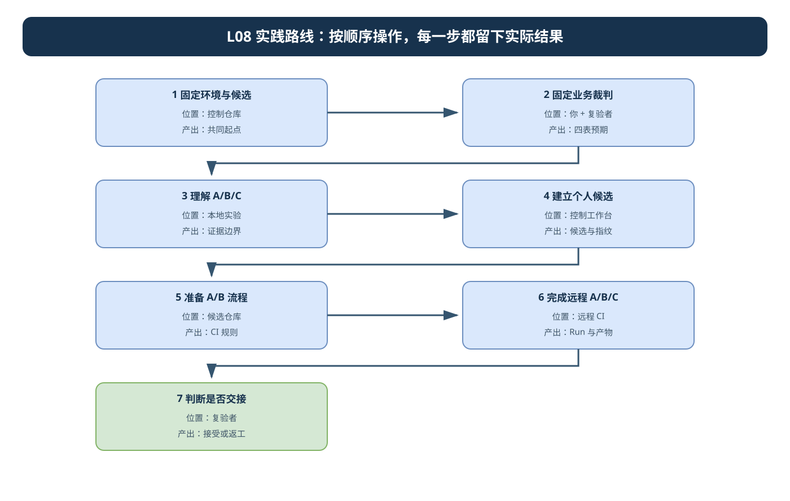
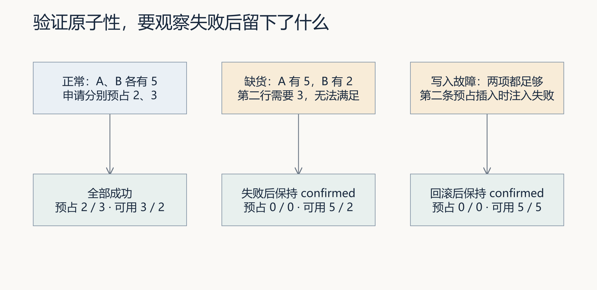
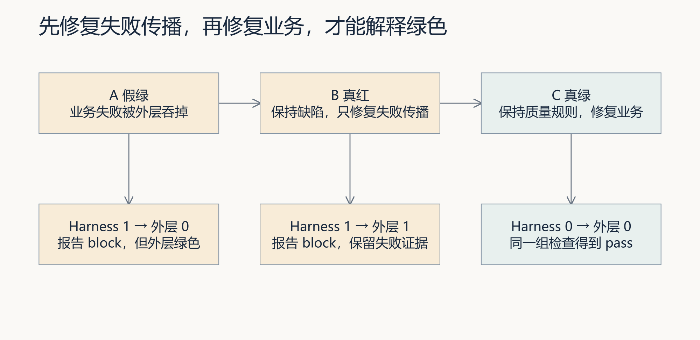
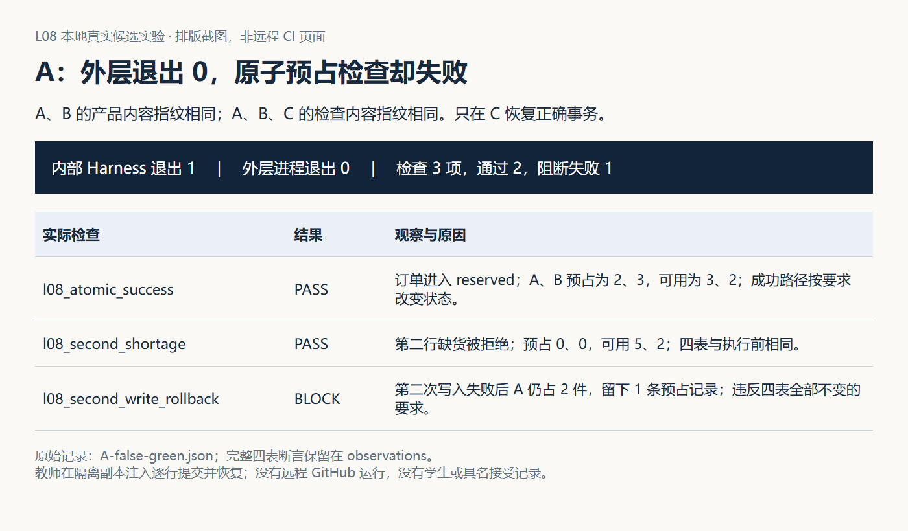

# L08｜把同一套 Eval 接入 CI

**实践操作手册｜候选、退出码和远程报告**

<a id="lesson-goals"></a>
## 本讲目标与完成判断

> **本讲行动目标**：面对订单预占的交付分歧，通过工作台组织独立复验，判断问题出在业务实现还是检查流程，并用同一候选的运行证据支持接受或返工。

原子预占是本次 FlowERP 客户交付；A/B/C 是检验工作台独立复验能力的主实验。交接时必须同时证明“产品正确”和“检查流程可信”。

1. 阅读[讲义](辅导资料.md)，手算两行订单，写出成功、写入前缺货和写入中途失败的四表状态。
2. 固定本次候选、实际产品入口、环境、数据准备和检查集合；若本地与远程不一致，先消除差异，不直接归因于业务或 CI。
3. 通过工作台建立含已知原子预占缺陷和完整反例的隔离候选，运行 **A 假绿**：保留 Harness 的 block 与外层 green，说明为什么不能交接。
4. 保持业务缺陷和检查规则不变，只修失败传播及报告归档，运行 **B 可信红**：证明检查流程修好，业务仍未修好。
5. 保持 B 的 Harness 入口、用例和工作流规则不变，只修原子预占实现，运行 **C 可信绿**：证明业务在同一标准下恢复正确。
6. 下载 B/C 原始报告，逐项核对候选、实际 checkout、检查集合、两层退出码、Run 来源、报告哈希和旧输出风险。
7. 请同伴从平台入口独立复验最终候选并具名接受或打回；CI 通过和自动修复均不直接合并主分支。
8. 用 [skill](examples/skills/ci-candidate-evidence-review/SKILL.md)复核三个反例，再将同一判断方法迁移到数据导入并重新确认业务合同。

线上精讲集中讲“同一候选是否足以交接”和 A/B/C 因果判断，控制在 30 分钟；真实远程实验、修订和同伴复验在行动课及课后完成。用[实践手册](实践操作手册.md)执行，用[提交模板](SUBMISSION.md)保留首次判断、失败、修订、复验与决定；尚无远程运行时明确标记未验证。

- **核心内容**：本地快速反馈与远程可信复验；候选分支、报告归档和人工合并。
- **演示结果**：不合格变更在 CI 中失败，修复后生成通过报告。
- **课内增量**：配置 CI 工作流并上传 Harness 报告。
- **通过标准**：本地与 CI 使用同一入口；非零退出码阻断候选变更；自动修复不直接合并主分支。

按以下步骤操作，证据只在[个人证据索引](SUBMISSION.md)关联已有记录。预置支架、历史报告和参考课件不代替本人实现、真实宿主运行或具名人审。

> **终端选择：**本手册同时提供 Windows PowerShell 与 macOS 默认终端 zsh 的操作。每一步只运行自己系统对应的代码块；标为“通用”的 Python、Git 命令两端相同。开始或重开终端时，先按[macOS 环境与路径约定](../../reference/实操手册执行与排错.md#macos-zsh)恢复本讲使用的虚拟环境，再核对当前源码位置。

未分系统的终端代码块中，`python`、`git` 和 `codex` 命令两端通用；先激活当前步骤指定项目的 `.venv`，再逐条执行。自然语言提示词复制到 Codex 对话，不能粘到终端。

> **本次实践目标**：面对订单预占的交付分歧，通过工作台组织独立复验，判断问题出在业务实现还是检查流程，并用同一候选的运行证据支持接受或返工。

先读[讲义](辅导资料.md)，在[提交模板](SUBMISSION.md)写下首次预测。本实践只围绕一条主线推进：先固定业务裁判和比较对象，再完成 A 假绿、B 可信红、C 可信绿，最后由同伴依据最终候选作出具名接受或打回。原子预占是本次客户交付，CI 是它的独立复验环境，不是两项并列作业。

本讲分开保留本地机制结果、候选业务结果和真实远程 A/B/C 记录。前两类用于理解与准备，不能代替第三类。先核对远程仓库、可用 CI 与授权范围；没有远程条件时继续完成本地实验，把远程部分记为未验证。用本地脚本生成的状态不能代填平台 Run ID、提交值或远程产物。

开始操作前，遇到解释器、路径或输出问题，按[执行与排错说明](../../reference/实操手册执行与排错.md)核对。

### 本讲目录地图

```text
〈CodexFDE 控制仓库〉/                ← 第 1～3 节和工作台命令从这里运行
├─ .venv/
└─ .runtime/l08-…/                   ← 本地机制报告与路径记录

〈独立 FlowERP 仓库〉/               ← 客户项目及其 .venv
〈工作台返回的隔离候选〉/            ← 本地业务修复与复验对象
├─ flowerp/、eval/、tests/
├─ .github/workflows/                ← A/B/C 流程规则
└─ .course/product-source.json       ← 显式源码快照的来源记录

〈远程 Git 仓库与 CI Run〉           ← 远程 A/B/C 证据，不是本地报告
```

默认留在 CodexFDE 控制仓库；只有拿到候选绝对路径后才进入候选。远程运行、候选业务结果和控制仓库中的教学报告分别保存，不能相互冒充。

## 本次交付与个人职责

本讲产品增量是正式销售入口的整单原子预占，工作台增量是同一 Harness 的独立复验与报告归档。你确认四表状态、对照不变量和候选范围，Codex 协助调查、实现与接线，CI 独立运行检查，复验者回查平台与最终候选。已有事项能承载证据时直接引用，不重复填表。

| 实践阶段 | 要回答的问题 | 对应主线 |
|---|---|---|
| 第 1～3 节 | 业务标准、候选、环境与检查集合是否已经固定 | A/B/C 的共同起点 |
| 第 4～5 节 | 候选与 CI 是否能形成受控对照 | A/B 保持业务不变的前提 |
| 第 6 节 | 流程修复和业务修复能否被分别归因 | A 假绿 → B 可信红 → C 可信绿 |
| 第 7 节 | 这些运行是否足以支持接受或返工 | 候选、来源、报告、哈希与具名决定 |

每个步骤都要回答“此次观察来自哪里、在 A/B/C 中补齐哪个证据缺口、支持什么有限结论”。

## 先看流程图，再开始操作



A、B、C 必须使用可比较的候选、环境和检查集合。先按图固定共同起点，再进入远程运行。可编辑源文件：[l08-practice-flow.drawio](assets/l08-practice-flow.drawio)。

## 第 1 步：环境与候选起点

<!-- step-guide-1 -->
> **一句话说明：**先固定三次 CI 运行共同使用的代码、数据和业务裁判，避免事后换标准。

开始本讲 FDE 实践时，先在[提交模板](SUBMISSION.md)回答：部分预占会妨碍谁继续处理订单；为什么本次采用整单原子性；本地与远程结论不同时，应按什么顺序核对候选、环境、检查集合、失败传播和业务实现。注明问题来自实际观察、同伴试用还是教学设置，写下本次选择和暂缓范围，再请 Codex 协助调查。

沿用 L04 接受的控制工作台。在项目根目录，Windows PowerShell 激活环境：

**Windows（PowerShell）：**

```powershell
. ./.venv/Scripts/Activate.ps1
python -c "import sys; print(sys.executable)"
git rev-parse HEAD
git status --short
```

**macOS（zsh）：**

```zsh
source .venv/bin/activate
python -c "import sys; print(sys.executable)"
git rev-parse HEAD
git status --short
```

macOS/Linux 使用 `source .venv/bin/activate`。Python 应来自本项目 `.venv`；未准备好时先完成[学生入口](../../README.md)。记录未提交变更，避免把控制工作区当成后续产品候选。

再核对工作台能否定位独立 FlowERP 客户仓库：

```text
python -X utf8 -c "from workbench.external_project import flowerp_root, python_for; root=flowerp_root(); print(root); print(python_for(root))"
```

预期退出码为 0，并依次显示独立 FlowERP 根目录和该项目 `.venv` 中的 Python。若提示“请在工作台添加独立 FlowERP 仓库”，打开工作台首页 `http://127.0.0.1:8001/`，选择“＋ 添加项目”，添加方式选“本地文件夹”，项目名称填 `FlowERP`，“本地目录”填写你实际克隆的独立客户仓库绝对路径，再点击“添加项目”。不要把 `CodexFDE` 控制仓库填成客户项目。

临时排错时也可以设置 `FLOWERP_PROJECT_ROOT` 指向该独立目录后重跑，但提交记录仍应说明实际项目来源。若第二行显示的客户项目 Python 不存在，进入 FlowERP 仓库创建 `.venv` 并执行 `pip install -e .`；退出码恢复为 0 后再进入第 2 节。

若已在 `.runtime/l04-learning` 的页面登记项目，命令仍报未登记，先按[客户环境排错](../../reference/实操手册执行与排错.md#product-environment)在本终端设置真实客户路径。自定义运行目录中的项目登记不一定被默认解析器读到，不需要反复添加同一个项目。

预测 A 有 5 件、B 有 2 件时预占 2 与 3 的结果。再预测两种库存都足够但第二次写入失败时，四张相关表应保持什么状态。

## 2. 固定三次运行共同使用的业务裁判

<!-- step-guide-2 -->
> **一句话说明：**你和复验者先手算原子预占前后的四张表，作为 A、B、C 三次运行的共同裁判。



先分别写下三列预期，再运行对应模式。两种失败都要检查四张表，不能只看缺货商品或错误消息。

```text
python -X utf8 docs/courses/L08/examples/atomic_reservation_lab.py pass
python -X utf8 docs/courses/L08/examples/atomic_reservation_lab.py shortage
python -X utf8 docs/courses/L08/examples/atomic_reservation_lab.py write-error
```

三条实验均在自己的临时数据库运行。正常预占为 2、3，可用量为 3、2；缺货时预占为 0、0，可用量为 5、2；第二次写入故障时预占为 0、0，可用量为 5、5。后两种都要求四张表完整观察结果不变，订单保持 confirmed。

读代码找到 `before == after`，确认它比较的不是单一缺货行。`write-error` 使用临时触发器使第二条预占记录插入失败；这证明本次中途写入后的回滚，不是并发压力测试。实验本身退出 0 表示符合预期，包括正确拒绝。

将 A 的数量换为 4、B 换为 1，先手算，再复跑自己的版本。新增个人检查应测实际候选的服务，并登记到统一 Harness，不仅运行参考脚本。

完成本节后，在提交模板写下三次远程运行都不得改变的业务要求：多行成功、第二行缺货和中途写入失败的四表预期。若后续 C 通过是因为删掉或弱化其中一项，不得判为业务修复。

### 2.1 读完整前后状态，解释第一行是否残留

实验输出新增 `before` 与 `after`，保留四张表的实际观察。对照 [教师错误实现的原始状态](assets/latest/partial-write-state.json)：A 预占由 0 变 2，存在一条预占记录，第一行已预占数量变 2，但订单仍为 confirmed。正确实现中第二次写入失败后四表应完全不变。

请先解释“订单仍是 confirmed”为何不足以通过，再检查个人测试是否比较了全部相关状态。`atomic_reservation_lab.py` 当前会委托独立 FlowERP 的解释器和源码，默认不会测试个人课程候选；在个人候选中改写为自己的用例，并核对实际导入模块路径，不能用参考结果替代个人代码。

## 3. 用本地实验理解 A/B/C 机制与证据边界

<!-- step-guide-3 -->
> **一句话说明：**先用本地实验看懂 A 假绿、B 可信红、C 可信绿分别证明什么和不能证明什么。



下面的本地实验只验证状态传播关系。把包装进程退出码与内部 Harness 退出码并排记录，不将教学 true-green 写成业务修复完成。

先运行本地适配实验：

**Windows（PowerShell，逐条执行并保存退出码）：**

```powershell
python -X utf8 docs/courses/L08/examples/ci_signal_lab.py false-green
$LASTEXITCODE
python -X utf8 docs/courses/L08/examples/ci_signal_lab.py true-red
$LASTEXITCODE
python -X utf8 docs/courses/L08/examples/ci_signal_lab.py true-green
$LASTEXITCODE
```

**macOS（zsh，逐条执行并保存退出码）：**

```zsh
python -X utf8 docs/courses/L08/examples/ci_signal_lab.py false-green
printf '退出码：%s\n' "$?"
python -X utf8 docs/courses/L08/examples/ci_signal_lab.py true-red
printf '退出码：%s\n' "$?"
python -X utf8 docs/courses/L08/examples/ci_signal_lab.py true-green
printf '退出码：%s\n' "$?"
```

包装进程退出码依次为 0、1、0。PowerShell 在每条运行后立即记录 `$LASTEXITCODE`，macOS/Linux 记录 `$?`。读取输出中的 `harness_exit`、`adapter_exit`、完整报告和原始 Harness 输出。第一种报告仍是 block，第三种只是教学断言通过，不是实际产品修复。

本轮另有 [真实产品 A/B/C 索引](assets/latest/product-abc-index.json)。先比较 A 与 B 的产品指纹，再比较三次检查指纹，最后解释 0/1/0 的外层结果。A、B 使用同一事务缺陷；C 恢复原事务；全部是本地真实子进程，不是远程 CI。



图 3｜先找失败用例，再看两层退出码。教师恢复代码不算学生修复，远程步骤仍按第 6 节实际执行。

接着逐条运行边界实验：

```text
python -X utf8 docs/courses/L08/examples/envelope_boundary_lab.py missing
python -X utf8 docs/courses/L08/examples/envelope_boundary_lab.py missing-identity
python -X utf8 docs/courses/L08/examples/envelope_boundary_lab.py malformed
python -X utf8 docs/courses/L08/examples/envelope_boundary_lab.py empty-report
python -X utf8 docs/courses/L08/examples/envelope_boundary_lab.py tampered
python -X utf8 docs/courses/L08/examples/envelope_boundary_lab.py stale-output
```

核对原始错误、决策为空、哈希不匹配和旧输出仍在的实际观察。身份明确使用 SIMULATED，不能当远程证据。包装实验成功表示完成观察，缺报告模式不因此变成通过。

使用每次新建的结果目录保存输出，不覆盖上一轮失败。自己实现信封消费者时，用本次任务的预期用例和实际进程结果校验报告；参考辅助函数没有替你完成这些判断。

到这里得到的是机制理解，不是真实远程 A/B/C。进入个人候选前，明确区分：教学断言验证包装器分支，真实产品用例验证原子预占，SIMULATED 身份验证信封边界。

## 4. 通过工作台建立个人候选，并冻结对照条件

<!-- step-guide-4 -->
> **一句话说明：**先建立个人隔离候选与完整检查，不在远程 A/B 之前把原子预占缺陷修好。

核对课程合同与标签：

```text
python -X utf8 -m workbench.cli course-contract --lesson 8
git rev-parse --verify course/l08-start
```

先在 CodexFDE 控制仓库激活课程虚拟环境，并核对项目登记指向自己的独立 FlowERP。本步骤显式采用当前两仓源码快照，不等同于课程标签起点；命令剥离本讲增量建立隔离练习。若来源、前置能力或剥离检查失败，先处理原错误，不把环境错误算作业务红灯。

**Windows（PowerShell）：**

```powershell
$l08Python = (Resolve-Path '.venv/Scripts/python.exe').Path
$l08Runtime = (Resolve-Path '.runtime/l04-learning').Path
$l08PrepareId = 'TASK-PREP-L08-' + [guid]::NewGuid().ToString('N')
$l08PreparedText = & $l08Python -X utf8 -m workbench.cli course-prepare --lesson 8 --source working-tree --task-id $l08PrepareId --runtime-dir $l08Runtime
if ($LASTEXITCODE -ne 0) { throw '候选准备失败，先读原错误' }
$l08Prepared = ($l08PreparedText -join "`n") | ConvertFrom-Json
$l08Candidate = $l08Prepared.path
Get-Content -LiteralPath (Join-Path $l08Candidate '.course/product-source.json') -Raw -Encoding UTF8 -ErrorAction Stop
Push-Location $l08Candidate
try {
    & $l08Python -B -X utf8 -c 'from pathlib import Path; import flowerp.service,eval.harness; print(flowerp.service.__file__); print(eval.harness.__file__); assert Path(flowerp.service.__file__).resolve().is_relative_to(Path.cwd().resolve()); assert Path(eval.harness.__file__).resolve().is_relative_to(Path.cwd().resolve())'
    if ($LASTEXITCODE -ne 0) { throw '加载模块不属于当前候选' }
} finally { Pop-Location }
```

**macOS（zsh）：**

```zsh
prepare_l08_candidate() {
  l08Python="$PWD/.venv/bin/python"
  l08Runtime="$PWD/.runtime/l04-learning"
  [[ -d "$l08Runtime" ]] || { print -u2 '先恢复 L04 原运行目录'; return 1; }
  l08PrepareId="TASK-PREP-L08-$("$l08Python" -c 'import uuid; print(uuid.uuid4().hex)')"
  l08PreparedText="$("$l08Python" -X utf8 -m workbench.cli course-prepare --lesson 8 --source working-tree --task-id "$l08PrepareId" --runtime-dir "$l08Runtime")" || return 1
  l08Candidate="$("$l08Python" -c 'import json,sys; print(json.loads(sys.argv[1])["path"])' "$l08PreparedText")" || return 1
  cat "$l08Candidate/.course/product-source.json" || return 1
  (cd "$l08Candidate" && "$l08Python" -B -X utf8 -c 'from pathlib import Path; import flowerp.service,eval.harness; print(flowerp.service.__file__); print(eval.harness.__file__); assert Path(flowerp.service.__file__).resolve().is_relative_to(Path.cwd().resolve()); assert Path(eval.harness.__file__).resolve().is_relative_to(Path.cwd().resolve())')
}
prepare_l08_candidate
```

保存实际候选路径、准备输出、两仓来源与哈希。后续所有相对写入范围都针对该候选；本轮不直接改控制仓库或独立客户源码。新终端须先恢复同一解释器、运行目录和候选变量，不能重新准备来顶替旧失败。
本讲写集上限为 `flowerp/`、`eval/`、`tests/`、`.github/workflows/`、`workbench/ci_evidence.py` 与 `CI_GATE_SPEC.md`；其中客户业务与检查归属须按来源核对。Spec 明确实际入口是正式 `SalesService` 还是还要兼顾入门门面，写清两行成功、第二行缺货、写入中途失败、订单状态与四表结果。先用下面的调查提示词确认实际调用和必要文件。


<a id="codex-prompts"></a>
<a id="codex-prompt-1"></a>
<details>
<summary>给 Codex 的提示词 1：委托一：确定候选与失败</summary>

先填写本步骤的实际路径、事实与范围，再复制到 Codex 对话。下文是委托正文。

~~~~text
我的候选与 Spec：____。请先只读核对实际产品入口、事务边界、默认用例和 CI 工作流。用 A 两件、B 三件的场景，区分写入前缺货与第二次写入失败，说明四张相关表需要观察什么。

检查本地与远程的候选身份、环境、用例、退出传递和报告位置。指出默认检查及信封辅助函数的能力边界。提出 A/B/C 对照与最小允许文件，不将模型推断或参考运行写成真实远程证据。

先比较写入前缺货与第二次写入失败：订单仍为 confirmed 时，库存余额、预占记录和第一行已预占量是否变化？保存完整四表观察，而不只保留错误消息。A 与 B 固定产品内容，三次固定检查，分别解释流程修复和产品修复。
~~~~

</details>


在这个候选中先建设个人检查，再冻结并授权实现：读取实际 `eval/harness.py` 的用例发现入口，将本人新增检查登记到它实际导入的 `EVALS` 集合；当前支架使用 `(名称, 等级, 可调用检查)` 三项。属于独立 FlowERP 的新增名称还要加入 `PROJECT_CASES`，保持默认工作台检查与显式业务检查的分工。先核对组合副本采用的业务模块与委托方式，不能只在控制仓库加一个名字。

对每个新增名称，在候选的解释器与工作目录中用 `python -B -X utf8 -m eval.harness --suite blocking --case 本人实际登记名称 --report-path 本轮新报告绝对路径` 单独执行，再执行不带 `--case` 的完整 blocking；两个占位参数必须换成刚登记的真实值。报告须出现预期名称、等级、原因和实际状态观察；未知名称、零用例、ImportError 或缺报告均先停下修入口。保存检查版本与哈希，后续实现阶段不允许删减、降级或修改业务期望。检查建设的 Diff 单独保留，不算业务修复者越界。

个人检查覆盖多行成功、第二行缺货和第二次写入故障。已知业务缺陷须在同一候选下稳定被发现；如果当前业务已正确，先保留事实，在单独隔离教学候选中明确记录注入的位置、来源与 Diff，再建立 A/B 对照，不能伪称客户事故。

在远程 A 之前冻结下表；准备后的整个候选持续作为 A/B/C 的同案比较对象。

| 对象 | A → B 应保持 | B → C 应保持 |
|---|---|---|
| 业务实现 | 同一已知原子预占缺陷 | 允许只修原子预占 |
| 检查规则 | 同一入口、同一用例、同一等级 | 完全不变 |
| 运行环境与数据 | 同一配置与初始化方式 | 同一配置与初始化方式 |
| 工作流 | 允许只修失败传播和归档 | 失败传播与归档规则不变 |

记录提交、模块来源、检查哈希和真实 Diff。下一步把本地组合候选中的修改按两个项目的原目录拆回各自候选分支，再交给远程 CI 读取；具体接续见第 5 节。

## 5. 配置能从 A 转为 B 的 CI 候选

<!-- step-guide-5 -->
> **一句话说明：**配置 CI，让失败能正确传到流水线状态，并保存报告供独立复验。

[工作流示例](examples/eval-workflow.yml.txt)是供审查的双仓库候选文件，不在活动工作流目录。先接好“本地候选 → 两个远程版本 → 同一次 CI”，再开始 A/B/C：

1. 在自己的课程仓库候选分支保留工作台、Harness 和工作流修改；将组合候选中的 `flowerp/` 业务修改放回自己的独立 FlowERP 候选分支，组合副本的 `.course/product-source.json` 留在本地实验。个人业务断言放在独立产品的实际检查模块中，课程侧用例通过进程边界调用它。将组合候选和拆分后的业务文件、断言、数据准备逐项比较；先在拆分后的两仓环境显式运行同一组业务用例，结果应与组合候选一致。
2. 在课程仓库的 Actions variables 中设置 `L08_FLOWERP_REPOSITORY`（自己的 `拥有者/仓库名`）和 `L08_FLOWERP_SHA`（已发布产品候选的完整 40 位提交 SHA）。A 与 B 使用同一产品 SHA；到 C 才换成仅修业务的新 SHA。记录每次实际值，不用会继续移动的分支名代替固定版本。
3. 将示例改写到课程仓库的 `.github/workflows/eval.yml`。它先 checkout 本次课程提交，再把固定产品提交放到 `_projects/flowERP`，分别建立两套 `.venv`；`FLOWERP_PROJECT_ROOT` 指向这次产品 checkout。两仓模块加载位置、产品实际 SHA 和检查哈希会写入本次来源记录。checkout 参数依据 [官方 v4 说明](https://github.com/actions/checkout/blob/v4/README.md)，核对日期为 2026-10-03。
4. 在示例的显式业务命令中加入本人新增且已登记的每个 `--case 实际名称`，冻结此命令与断言后再运行 A。示例已有 `sales_credit_and_atomic_reservation`，它不会自动包含你的新增用例。当前默认 blocking 只检查工作台；业务是否通过必须查显式业务报告中的名称、数量、来源和四表状态。

示例可直接 checkout 可读取的公开产品仓库；私有产品仓库须在课程仓库配置有权读取它的 `L08_FLOWERP_READ_TOKEN` Actions secret，并在第二个 checkout 的 `with` 中启用示例注释所列 `token`。凭据留在平台 secret 中，不写进 YAML 或提交记录。

拆分时若组合候选使用 `eval/erp_cases.py`，在独立产品中按实际加载入口放回对应检查；课程侧个人用例须登记到 `EVALS` 和产品名称集合 `PROJECT_CASES`，并通过 `workbench.external_project.evaluate_case` 调用产品检查。显式 `--case` 会执行所选产品名称；默认入口不执行它们。找不到名称、加载到旧模块或初始化方式不同，先修接线，再比较业务结果。此处是个人检查建设范围，A/B/C 冻结后不能继续改断言、名称分类或选择命令。

完成判断：远程日志中两仓实际版本与本人的固定来源一致，显式业务报告执行了本人冻结的检查。产品版本未发布、checkout 权限不足或环境失败，先修该项；这些结果不能解释为原子预占的业务红灯。缺少远程条件时保留本地结果，远程项记为待完成。

先读每一步，保留其他必要检查；如果已有同名工作流，审查差异而不是盲目覆盖。根据实际项目依赖、超时与平台版本调整，并解释改动理由。示例使用非隐藏的 `_ci_reports/Run编号-重跑次数/`，以免不同尝试混用输出。

示例在环境建立成功且任务未取消时，即使单测失败仍尝试运行 Harness 收集证据。前面单测失败仍使 Job 失败。归档保存本次业务报告、身份信封和双仓来源记录；报告缺失时信封步骤非零。现有信封绑定课程侧 `GITHUB_SHA`、Run 与报告哈希，产品版本还须核对来源记录和实际业务报告，不能只看信封。进程崩溃或执行器丢失时可能没有业务报告，此时保留真实失败。

当前控制仓库工作流已为 Harness 设置 `if: !cancelled()`，上传也已开启 `include-hidden-files: true`，并 checkout 固定 FlowERP 基线；这些是已有支架。个人候选仍须把产品 SHA 换成自己的冻结版本，显式接入自己的业务检查，并核对活动 YAML、命令与下载文件。

本节只为“失败能否如实影响 Job，并保留本次报告”服务。不要在修复工作流的同时修业务；否则 A → B 失去受控对照，无法证明红色来自失败传播修复。

先为 A 准备单独的演示工作流；B 阶段委托只包含工作流与必要证据实现文件，不含业务服务。下方完整提示词按阶段使用：此时只做失败传播/归档，原子预占修复留到 6.3。

<a id="codex-prompt-2"></a>
<details>
<summary>给 Codex 的提示词 2：委托二：实现预占与远程检查</summary>

先填写本步骤的实际路径、事实与范围，再复制到 Codex 对话。下文是委托正文。

~~~~text
按确认的 Spec：____，在允许范围：____ 内通过工作台实现候选：____。先核对已登记并冻结的多行正常、第二行缺货和中途写入失败检查；本阶段不改断言、用例选择和等级。B 只修失败传播与归档，C 另按业务范围授权后修原子预占，保持同一检查入口。

配置可审查的 CI：明确实际 checkout、项目环境、失败结果、每次独立输出目录和两份报告归档。环境建立失败、检查崩溃及缺报告时保存真实原因，不引用历史绿灯。提交实际 Diff 与复验命令，明确哪些只在本地验证，哪些真实发生在远程。

自动修复不直接合并主分支；候选的发布和合并遵循当前任务的实际授权，不从这份提示词推断额外账户权限。

先阅读本地真实产品对照 [A/B/C 原始索引](assets/latest/product-abc-index.json)：A 与 B 保持业务和检查不变，只修外层失败传播；C 保持检查不变，再修产品事务。参考截图只用于理解，个人执行应保留实际命令、两层退出码、四表前后状态和源文件差异。不得在 C 删除失败检查来换取绿灯。
~~~~

</details>

本节只准备 A 的隔离演示工作流与 B 的修复计划。先完成 6.1 的真实 A，再到 6.2 执行 B 委托，不能提前修掉失败传播。

## 6. 在自己的远程仓库完成 A/B/C

<!-- step-guide-6 -->
> **一句话说明：**在远程仓库依次完成 A、B、C 三次运行，每次只改变一个原因并保存 Run 与产物。

使用你有权限的课程仓库和单独候选分支。PR 的创建与推送是这项实践的一部分；不要把演示用假绿流程合入主分支。发布前确认提交中没有运行数据库、密钥和无关个人文件。

### 6.1 A 假绿：证明颜色可能来自错误流程

保留已知原子预占缺陷和完整检查，在隔离演示工作流中故意吞掉该检查失败。保留业务报告 block、原检查非零与外层绿色的矛盾，注明人为注入。

先列出哪些步骤实际命中同一缺陷；如果完整单测也因此非零，A 的隔离演示须同样保留其原失败，仅故意吞掉外层传播。B 恢复这些失败传播，业务、检查和环境保持一致。无关环境或接线错误先处理，不能混入这个对照；不跳过检查来制造假绿。

预期：Harness 非零、Job 绿色。若 Harness 根本没有发现缺陷，先修检查选择，不得进入 B。A 只证明当前绿色不可信，不支持交接。

### 6.2 A → B：只修失败传播，得到可信红

保持同一业务缺陷、断言、服务入口、环境和数据准备，只恢复正确的失败传播与报告归档。远程应失败，下载失败报告和身份材料。

<a id="l08-delegate"></a>
### 本阶段如何绑定个人候选并委托

确认本阶段的六段式 Spec 后，将它存到控制工作区或原运行目录中的 Markdown 文件。先逐项对照 `course-contract` 的写集上限，再收窄到必要文件；task-create 的通用授权不自动代你检查课程上限。Spec 的允许文件、验收命令和本阶段目标必须与下列实际参数一致；用 L03 的解析入口先查结构。文件级授权只包含必要实现文件，冻结检查不加入业务修复写集。

**Windows（PowerShell）：**

```powershell
$l08Spec = (Resolve-Path (Read-Host '粘贴本阶段已确认的 Spec.md 完整路径')).Path
$l08Actor = Read-Host '填写实际构建者姓名'
$l08Scopes = @((Read-Host '填写已确认的候选相对文件，多项用英文逗号分隔') -split ',' | ForEach-Object { $_.Trim() } | Where-Object { $_ })
& $l08Python -X utf8 -m workbench.cli spec $l08Spec
if ($LASTEXITCODE -ne 0) { throw '先修正 Spec 结构，未创建执行任务' }
$l08TaskArgs = @('-X','utf8','-m','workbench.cli','task-create','--runtime-dir',$l08Runtime,'--request','按本阶段Spec修复CI失败传播或原子预占，保持冻结检查','--requirement-id','L08-PERSONAL','--spec-path',$l08Spec,'--actor',$l08Actor,'--workspace',$l08Candidate,'--execute-code','--execution-timeout','900')
foreach ($file in $l08Scopes) { $l08TaskArgs += @('--write-scope',$file) }
$l08TaskText = & $l08Python @$l08TaskArgs
if ($LASTEXITCODE -ne 0) { throw '任务创建失败，先读原错误' }
$l08TaskId = (($l08TaskText -join "`n") | ConvertFrom-Json).id
& $l08Python -X utf8 -m workbench.cli task-show $l08TaskId --runtime-dir $l08Runtime
```

**macOS（zsh）：**

```zsh
create_l08_task() {
  printf '粘贴本阶段已确认的 Spec.md 完整路径：\n'; read -r l08Spec || return 1
  printf '填写实际构建者姓名：\n'; read -r l08Actor || return 1
  printf '填写已确认的候选相对文件，多项用英文逗号分隔：\n'; read -r l08ScopeText || return 1
  "$l08Python" -X utf8 -m workbench.cli spec "$l08Spec" || return 1
  local -a taskArgs scopes
  local file
  scopes=("${(@s:,:)l08ScopeText}")
  taskArgs=(-X utf8 -m workbench.cli task-create --runtime-dir "$l08Runtime" --request '按本阶段Spec修复CI失败传播或原子预占，保持冻结检查' --requirement-id L08-PERSONAL --spec-path "$l08Spec" --actor "$l08Actor" --workspace "$l08Candidate" --execute-code --execution-timeout 900)
  for file in "${scopes[@]}"; do taskArgs+=(--write-scope "$file"); done
  l08TaskText="$("$l08Python" "${taskArgs[@]}")" || return 1
  l08TaskId="$("$l08Python" -c 'import json,sys; print(json.loads(sys.argv[1])["id"])' "$l08TaskText")" || return 1
  "$l08Python" -X utf8 -m workbench.cli task-show "$l08TaskId" --runtime-dir "$l08Runtime"
}
create_l08_task
```

先阅读 task-show 的实际 `spec_text`、`spec_sha256`、`workspace_path`、`write_scope`，核对当前候选与本阶段范围。创建只冻结任务，不代表已执行。核对无误且本阶段委托已授权后，在控制终端执行：

**Windows（PowerShell）：**

```powershell
& $l08Python -X utf8 -m workbench.cli task-run $l08TaskId --runtime-dir $l08Runtime --actor $l08Actor
$l08TaskExit = $LASTEXITCODE
& $l08Python -X utf8 -m workbench.cli task-show $l08TaskId --runtime-dir $l08Runtime
Write-Output "本次 task-run 退出码：$l08TaskExit"
```

**macOS（zsh）：**

```zsh
if "$l08Python" -X utf8 -m workbench.cli task-run "$l08TaskId" --runtime-dir "$l08Runtime" --actor "$l08Actor"; then l08TaskExit=0; else l08TaskExit=$?; fi
"$l08Python" -X utf8 -m workbench.cli task-show "$l08TaskId" --runtime-dir "$l08Runtime"
printf '本次 task-run 退出码：%s\n' "$l08TaskExit"
```

保存真实任务编号、执行器原始输出、候选 Diff 与检查报告。执行器或环境错误先排查；合法 `review` 只表示等待人审。`task-run` 的默认阻断名称由控制端选择，不能据此断言候选中新登记的名称已执行：仍须在同一候选显式运行个人用例与完整阻断入口，逐项核对报告名称、等级和实际数量。已有 `review` 任务不直接重复 task-run；按 L04 的具名打回与合法返工流程处理。

B 阶段业务仍红时，task-run 可能以非零退出并进入 rework，这是未完成业务交付的真实状态。若执行器成功且差异只限本阶段范围，保留该红报告继续分析；若非零来自执行失败、越界或环境错误，先处理错误，不能称为可信红。


预期：Harness 非零、Job 失败、报告属于本次 Run。若 A 与 B 的产品 Diff 不同，不能声称“只修了流程”。B 证明检查流程可信，仍明确标记业务未修复。

### 6.3 B → C：只修原子预占，得到可信绿

保持 B 的 Harness 入口、用例、等级、失败传播和归档规则不变，只修业务事务，再运行同一组检查。新增用例不能被删除、跳过或降级。

在同一候选中保存 B 的提交和报告，再用[本阶段委托步骤](#l08-delegate)创建一个新任务：Spec 只授权原子预占的实际服务文件，保持工作流与检查冻结。关联 B 的原任务、红报告和源版本，沿用[提示词 2](#codex-prompt-2)的业务修复部分。C 的新增任务不能改写 B 的失败记录，也不能把流程文件重新加入写集。


预期：Harness 0、Job 绿色、四表状态符合共同业务裁判。若工作流或检查集合同时变化，先恢复受控比较再解释结果。C 的技术通过仍不等于具名接受或自动合并。

A、B、C 分别使用可区分的提交与运行，不覆盖前一份报告；A/B 的产品指纹与检查指纹、B/C 的检查指纹与工作流规则都要能回查。A 的故意假绿仅限隔离演示分支，不能成为真实交付的通过依据。

每次保存 Run 链接、Run ID、attempt、事件、分支头、课程与产品两仓实际 checkout SHA、工作流版本、原始检查退出结果、Job 结论和下载 artifact。若平台测试合并结果，记录与 PR 头的关系。缺少远程平台权限时继续本地工作，远程项标为待完成，不能把 SIMULATED 信封换个名称补位。

再做一次“本次报告没有生成”的隔离运行：检查被跳过或进程在写报告前退出时，保存平台日志和失败结论。证明没有引用前一轮 artifact。不要删除旧失败来制造目录干净的假象。

## 7. 判断这些运行是否足以支持交接

<!-- step-guide-7 -->
> **一句话说明：**复验者从远程状态下钻到报告和四表状态，决定原子预占是否可以接受。


<a id="codex-prompt-3"></a>
<details>
<summary>给 Codex 的提示词 3：委托三：下载并核对证据</summary>

先填写本步骤的实际路径、事实与范围，再复制到 Codex 对话。下文是委托正文。

~~~~text
证据入口：____；本次要求：____。从真实运行来源核对候选、事件、Run/attempt、工作流和实际 checkout，区分 PR 头与合并测试提交。

对已授权可读取的报告核对原始字节哈希、实际用例集合、等级、摘要、检查退出与 Job 结果。分别识别上传成功掩盖业务失败、旧文件充当本次输出、模拟信封冒充平台身份。

输出已证实、矛盾、缺失和最小补证步骤。提出一个改变数量或故障位置的迁移问题。只给有限接受建议，不生成他人签名，也不执行合并。

先说明当前审查的是本地进程、业务修复还是远程交付。参考 [A/B/C](assets/latest/product-abc-index.json) 能证明本地因果关系，不能证明远程运行。把平台步骤结果、Job 结果与报告中的分项结果分别核对；若仅有本地材料，就明确已证实的局部机制及远程缺口，不一律否定有效的局部证据。
~~~~

</details>

请同伴用[复核提示词](实践操作手册.md#codex-prompt-3)从 B 的 Run 找到失败依据，再检查 C。对下载的原始报告重算 SHA-256：PowerShell 使用 `Get-FileHash -Algorithm SHA256 文件路径`，macOS/Linux 使用 `shasum -a 256 文件路径`。比较的是解压后的报告文件，不是整个 artifact 压缩包。

核对全部必需用例、摘要、退出码和工作流结果，并解释 PR 头与测试提交的关系。回到控制工作台查看同一任务，沿用 L04 的具名接受/打回流程。CI 检查通过不等于已经授权合并，实际合并由负责者决定并记录。

使用 [skill](examples/skills/ci-candidate-evidence-review/SKILL.md)检查三个反例和真实材料，保留实际响应、本人修订和后续复用状态。没有真实同伴时写自查与待复验，不能自动生成他人签名。

| 现象 | 优先调查 |
|---|---|
| 本地过、远程失败 | 提交内容、实际 checkout、项目环境和数据准备 |
| 没有 Harness 报告 | 前序失败是否跳过、进程是否运行、写入位置 |
| 上传为空 | 隐藏目录策略、实际路径、是否本次生成 |
| 信封存在但本次命令失败 | 是否旧文件、目录是否对应当前 attempt |
| 两个 SHA 不同 | PR 头与合并测试语义，不能先判真假 |
| 远程绿但缺新增用例 | 检查注册、选择和是否真正提交 |

**交接时回到使用现场**：业务确认者核对整单失败后的库存要求；同伴用远程 B/C 的候选、报告和用例验证“流程可信”与“产品正确”两个命题；具名责任人再决定接受、打回或合并。迁移到数据导入时重新确认部分成功是否允许，保留采用的证据核验方法版本与实际结果。沿用本讲已有证据位置，不另交重复表格。
