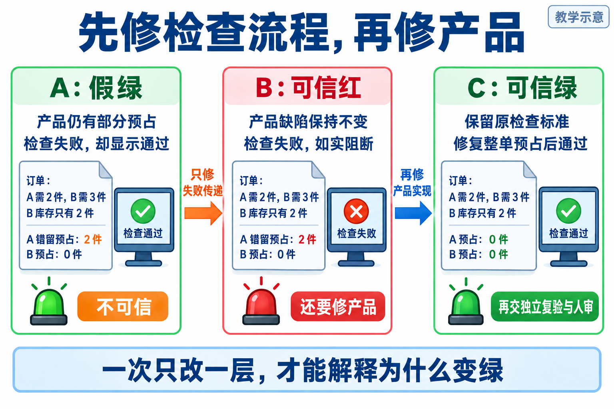
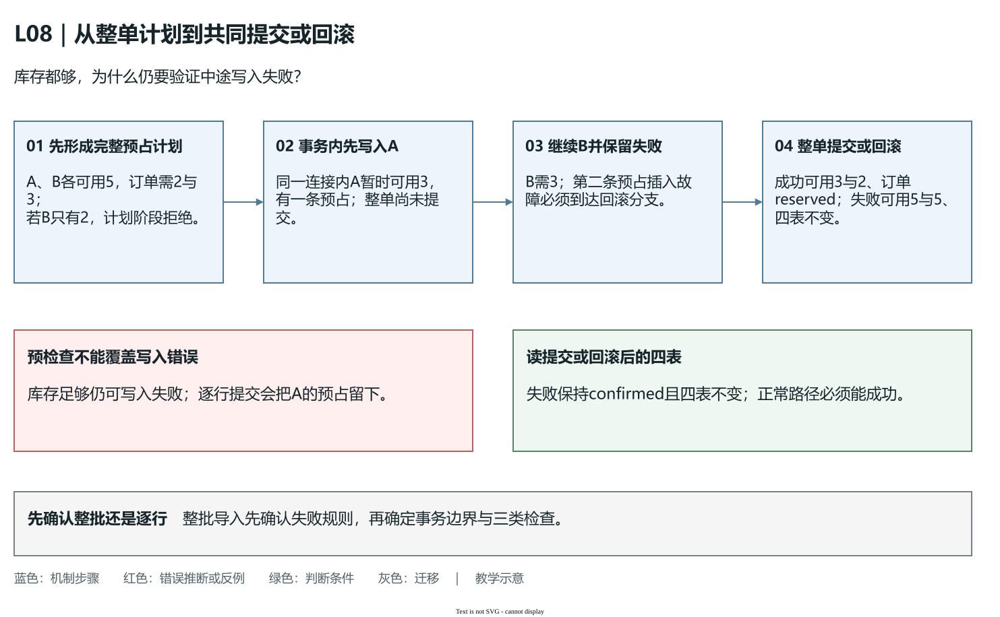
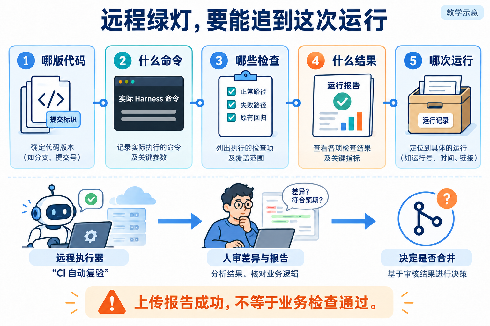

# L08｜把同一套 Eval 接入 CI

L07 的 FlowERP 订单草稿能记录商品和金额，尚未替客户留货。本讲继续交付整单预占：所有商品都够才一起留货；任一行失败，本次不留下部分预占。与此同时，变更需要交给别人审核，你电脑上的一张绿图不足以说明对方拿到的版本已经验证。工作台因此增加可追查的远程复验与报告归档。

你确认业务规则、候选和比较条件，Codex在授权范围修实现与工作流，CI 执行明确版本的同一质量入口，实际审核者查看差异与证据后决定合并。产品正确和检查流程可信是两个要分别证明的命题，不能用一个绿色状态将它们合在一起。

## 1｜页面说失败，为什么库存仍可能被占住

订单需商品 A 两件、商品 B 三件，操作前可用量分别为五件、两件，本订单尚无预占。**预占**是把货留给该订单，还没有实际出库。本次业务选择整单处理：每行都能满足才预占，任何一行不足，本次相关写入不生效。

错误实现依次处理每行，先为 A 预占两件，再发现 B 不足并报错。页面虽然显示失败，A 可用量却由五件降到三件，留下本订单的预占记录，别的订单就少了两件可用货。仅看报错或订单状态，不能发现这份残留。

**图 8-1　整单预占失败后的状态对照**

完整推演应读四类状态：库存余额、预占记录、订单明细、订单头。失败前为 A可用5、B可用2、预占0和0，订单已确认；正确拒绝后四类状态完全不变。预占请求被拒绝，Eval 通过，因为正确的业务行为正是拒绝且不留残留。

本讲参考实验调用正式 `SalesService`，先创建、确认，再预占；L07 使用教学草稿入口。两个入口的状态合同不同，所以失败后应保持 `confirmed`，不能误要求退回草稿。阅读真实候选时先核对服务入口与导入路径，不将参考脚本对独立客户源码的结果当成个人候选结果。

## 2｜把本地的同一条检查交给远程运行

**CI** 是持续集成的检查流程：代码变更触发工作流，由执行环境取源码、准备依赖、运行命令并保存结果。本地检查便于快速定位，远程检查让别人可以回查运行来源，并暴露未提交文件、环境残留或依赖差异。远程机器并不天然可信，流程少跑用例、取错版本或吞掉失败，同样能产生假绿。

“同一入口”意味着本地和远程调用同一个 Harness，并执行同一份确认的检查与等级；不是两端各自写一个名字相似的命令。环境建立可以适配系统差异，业务裁判不能简化。新增的多行与中途写入用例也必须注册并实际执行，不能只跑原有单行检查。

本仓库与 FlowERP 是两个独立项目，各有源码与解释器。远程只取工作台却没有固定客户版本，无法证明客户业务；默认工作台 blocking 绿灯也不等于 ERP 通过。课程组合候选须记录两仓来源与哈希，实际 CI 则明确建立所需环境、固定客户源码版本，并核对检查实际加载位置。

变更先进入**候选分支**，即等待验证与审核的代码版本。提交标识 SHA 标识一份 Git 提交，分支名只是可以继续移动的指针；报告应绑定实际测试版本，不能只写“main”或“我的分支”。若平台测试候选与主分支的合并结果，实际 checkout 与候选分支头可以不同，但二者关系要可追查。

## 3｜为什么第一次修改以后，应当看到红灯

教学对照有两个缺陷：业务留下部分预占，外层工作流又吞掉 Harness 的非零退出码。检查已失败，工作流却绿。如果两处同时修，最终绿色不能说明失败传递是否真正修好。因此安排三个阶段，每次只改变一个原因。

**图 8-2　先修失败传递，再修整单预占**

“阶段 A/B/C”表示运行阶段，“商品 A/B”表示商品，请连同前缀辨认。三阶段保留同一缺货输入和业务裁判。

| 阶段 | 保持与改变 | 内部检查与外层结果 |
|---|---|---|
| 阶段 A，假绿 | 保留业务缺陷与错误传播 | Harness 非零、报告 block，Job 却绿 |
| 阶段 B，可信红 | 业务、检查、输入不变，只修传播与归档 | Harness 非零、报告 block，Job 失败 |
| 阶段 C，可信绿 | 保持 B 的流程与检查，只修业务事务 | 四表符合原合同，Harness 0、报告 pass，Job 绿 |

B 的红灯是第一次修改的正确目标：相同的产品错误现在能够让流程失败。若 A → B 同时改了业务，无法把红色归因于传播修复；若 B → C 删了反例或降级，无法把绿色归因于产品修复。应保存相应提交与差异，使“保持不变”成为可检查的事实。

**Job** 是 CI 中一组步骤的执行单元。命令非零应传播为失败，上传报告是随后独立的动作。典型错误是捕获失败后强行返回 0，或采用允许继续失败的配置而不恢复最后结论；即使日志含 BLOCK，外层仍可能绿。正确做法是在失败后尝试保存本次报告，同时保留原失败状态。报告不存在时也应明确失败，不能借用旧文件补位。

阶段 A 的故意假绿只用于隔离演示候选，不能合入真实交付。CI 如实失败意味着按交付规则不能接受；托管平台是否从操作上禁止合并，还取决于仓库是否将该检查设为必需条件，不能从颜色推定平台配置。

## 4｜再修整单预占，不能只多加一次库存判断

目标是本次相关写入一起成功或一起不生效，这叫**原子性**。数据库**事务**将一组写入作为整体提交或撤销，是实现本例原子性的关键机制。若循环里每一行都单独提交，第二行失败时第一行已生效，后面再抛异常无法自动撤回它。

只在开始时检查库存足够，能够发现本例的写入前缺货，却不能覆盖写入过程中数据库报错。因此实践同时检查三种情形。正常情况下 A、B 各可用五件，预占两件和三件后可用为三件、两件，留下两条正确预占，订单转为 `reserved`。第二行缺货时四表保持原样，订单仍为 `confirmed`。两行都够、第二次预占写入却被教学故障中断时，也应撤回第一行并恢复全部本次状态。

中途故障实验在临时数据库中用触发器使第二条预占插入失败。它验证已开始写入后的回滚，不是并发压力测试，也不覆盖全部宕机场景。把成功、缺货、中途错误都保留，既能排除部分提交，也能排除“拒绝所有订单所以没有残留”的伪修复。

为什么“先检查所有库存”还不够？把两件事按时间分开看。检查阶段回答当前数据能否形成预占计划；写入阶段才修改余额、预占记录和订单。缺货可以在计划阶段被发现，但约束错误或数据库写入失败仍可能发生在计划已经通过之后。因此，预检查减少可提前发现的失败，事务负责已经开始写入后的整体恢复，两者覆盖的故障时点不同。

沿正常起点 A、B 各可用五件推演中途故障：先为 A 预占两件，在同一连接内暂时可见 A 可用三件、A 预占记录一条、第一行已预占两件；整单尚未提交。接着处理 B 三件，第二条预占插入被教学触发器拒绝。这时必须撤销本次整单写入，最终重新读取数据库应为 A、B 各可用五件、预占记录为空、两行预占均为零，订单仍为 `confirmed`。

| 检查情形 | 失败或成功发生在哪里 | 调用结束后必须读取的结果 |
|---|---|---|
| 正常：A、B 各可用五件 | 所有计划和写入都完成 | 可用三件、两件，两条预占，订单 `reserved` |
| 缺货：A 可用五件，B 两件 | B 三件需求无法形成完整计划 | 可用五件、两件，四表不变，订单 `confirmed` |
| 中途错误：A、B 各可用五件 | 已写 A，第二条预占插入失败 | 可用五件、五件，四表不变，订单 `confirmed` |

**图 8-2a　整单事务把暂时写入与最终提交分开（教学机制示意）**

[可编辑源图](assets/reading-depth-20261003/mechanism.drawio)。

图中第二步的 A 可用三件是事务内部的教学推演，不是一次已接受的业务结果；读图时要继续走到提交或回滚后的重新读取。缺货用例经过“尚未完成整单计划”的路径，中途错误用例经过“写入已开始”的路径，二者最终都要求不留下部分预占。正常路径则必须成功，否则“全部拒绝”的实现也会假装拥有完善回滚。

核对当前独立 FlowERP 参考实现，`SalesService.reserve` 将计划、余额更新、预占插入、明细更新和订单状态更新放在同一个 `ERPStore.connect()` 上下文中。该上下文正常退出时 commit，异常退出时 rollback 并继续抛出异常。由此可以定位两类危险修改：循环里为每行另开连接并提交，会使 A 提前成为已生效结果；在事务内部捕获错误后直接正常返回，会让上下文走到提交分支。看到代码里有“事务”字样不够，关键是相关写入是否在同一个提交边界内，以及失败是否到达回滚分支。

迁移到整批导入时，先决定一行失败是否允许其他行成功。若合同要求整批不生效，就把全批相关写入纳入同一边界，并保留写入前失败、写入中失败和正常成功三类检查；若业务确认允许部分成功，则应设计每行结果与重试规则。事务范围来自业务约定，不能仅因本讲整单回滚就替新业务作出决定。

授权 Codex 时给出四表前后状态与当前候选，让它检查事务开始、提交和异常回滚的位置，只修原子预占，保留 B 阶段的工作流与原断言。修复后仍用同一服务、同一数据准备和同一检查入口。事务之外有外部副作用的业务不能仅凭数据库回滚推断全部撤销，迁移前要另确认其边界。

## 5｜远程变绿以后，先查它在证明哪份代码

远程证据要把“代码—环境—命令—检查—报告”连到同一次运行。首先从平台入口找到本次 Run，核对候选分支头和实际 checkout；再读环境准备与实际命令，确认两个项目版本和解释器；随后检查必需用例、等级、摘要、真实 Harness 退出和 Job 状态，最后下载本次报告。

**报告归档**是把运行产物保存为可下载文件，通常称 artifact。它的作用是让另一人检查原始分项，而不只看屏幕摘要。Run ID 标识一次运行，attempt 区分重跑；使用对应的新输出目录，避免前次成功文件在本次检查未执行时仍被上传。环境建立失败或进程在写报告前退出，应留下本次日志与缺失说明，不能伪造业务报告。

**图 8-3　CI 报告来源和人工合并决定**

图中勾选仅是教学示意。**证据信封**是给原始报告附上运行身份和内容指纹的记录。本仓库 `workbench/ci_evidence.py` 记录提交 SHA、Run ID、工作流、系统、Python、套件、报告 SHA-256 与报告判决。SHA-256 是依据文件内容计算的指纹，可用于检查下载后是否仍是同一份文件，不能单独证明命令实际执行。

当前信封辅助程序没有替审核者检查全部必需用例、真实进程退出、实际 checkout 与候选头关系，也没有自动记录所有重跑信息。因此须结合平台日志与下载产物补足核对，不能把“信封能生成”当成可信绿。下载后重算的是原始报告文件哈希，不是 artifact 压缩包哈希。

### 独立复验要让不同证据各自回答一个问题

独立复验的价值，是让没有参与修复的人仍能重建判断。复验者首先问“哪份代码在哪次运行中被检查”，这由实际 checkout、两个项目版本和 Run 身份回答。再问“下载的文件是否仍是同一份”，这由原始报告的内容指纹回答。接着问“这次真的覆盖了交付要求吗”，这需要必需用例、等级、分项、真实退出码和平台日志。最后问“是否接受这个候选”，还要审查差异、剩余风险，并留下负责者的决定。这四个问题可以使用同一组材料，却不能互相替代。

**图 8-4　独立复验将标准、候选、报告与审核连到一起（教学示意）**

这次读图重点看下方的关联：Spec 确认整单规则，候选承载实际修复，报告对应检查，审核指向这份候选和报告。图并不表示平台身份或哈希能够自动保证业务覆盖。一个反例提示是：原子预占的成功项全绿，但第二条写入失败用例没有运行；文件可以来源清楚、哈希一致，仍不足以支持本讲整单回滚的结论。

这个风险在当前辅助程序里有具体位置。[信封构建器](../../../workbench/ci_evidence.py)的 `build_envelope` 包装报告来源与哈希，没有调用完整的报告合同校验。本地[信封边界实验](examples/envelope_boundary_lab.py)使用明确的模拟身份，将 `{}` 作为报告时仍可能生成一个缺少有效业务结论的信封。这说明包装成功与验收通过是两件事；实验没有访问真实平台，也不能代替远程运行。

审核者因而要将“事先要求的检查”与“实际报告的检查”对照，不能让报告自己决定哪些项必需。[报告合同校验](../../../eval/report_contract.py)从调用者要求的身份出发，核对实际项，重算摘要并比较进程退出码；CI 日志还需说明命令确实在本次版本执行。若明细缺失，就先查注册、选择与运行；若文件哈希不符，就保留原件并查来源；若环境失败，就记录业务尚未查明。不同缺口要回到不同原因，不能一概追加一个绿色标签。

在 A/B/C 中，这种复验也使因果关系可以被别人审查：A→B 的差异只修失败传播，产品仍因同一缺陷红；B→C 的差异再修事务，原检查才绿。独立者用新输出目录复跑并取得自己的材料，能够发现作者机器上的残留文件或漏提交依赖；人审继续检查自动化尚未覆盖的范围。迁移到整批导入时，先重新确认整批或逐行成功的合同，再建立必需项和证据关联，不把旧订单绿报告作为新业务的放行依据。

本地与远程结论不同时，先查版本与未提交文件，再查实际加载源码、环境和数据准备，再查用例注册、选择与失败传播，最后分析业务实现。报告缺失先查前序跳过、命令是否运行及写入位置；哈希不符先保留两份原始文件并核对来源，不编辑信封去匹配。这样的失败路径避免把所有远程红都草率归因于“CI 环境问题”。

## 6｜交给另一个人，才看得出材料是否够用

按[实践操作手册](实践操作手册.md)完成本地机制实验，再在有权限的远程候选中执行真实 A/B/C。`ci_signal_lab.py` 是本地传播实验，使用明确的 SIMULATED 身份；真实产品子进程记录也仍是本地运行。它们帮助理解原因，不能替代真实 CI Run。远程权限或环境缺失时，就把远程项保留为待验证。

请复验者从 B 的远程入口找到“业务仍错、流程已能正确报错”的证据，再对 C 核查原正常与失败路径。只给最终绿图，对方无法辨认删了断言、跳过检查还是修好了事务。技术检查通过后，负责者仍需查看差异、范围、未覆盖风险，再具名接受、打回或合并；自动修复继续产生候选，不能直接合入主分支。

迁移输入时，保持本例订单数量，给商品 B 补足至三件，正常预占后 A、B 可用量应为三件、零件，同时保留原缺货和中途故障用例。手册还要求换数量并独立手算，复验本地与远程是否执行同一输入。迁移到整批导入时，要先确认业务允许部分成功还是要求整批回滚，再选择状态观察；整单事务要求不能无理由推广到所有业务。

工作台的新增能力不是“点亮 CI”，而是将确定的候选、独立检查与原始报告交给另一个人复验。FlowERP 的原子预占提供实际场景，流程失败和产品失败都回流到同一事项，才能支持明确返工与验收决定。

## 本讲留下什么，下一讲怎样接着用

本讲留下原子预占候选、同入口工作流及可追查的远程复验材料。L09 将报告中的具体失败转成有范围、复现命令与目标状态的修复任务。更多配置与边界见[参考说明](reference/参考说明.md)。参考材料不是学生的远程运行或人审结果。

[课程学习路线](../../README.md#16-讲学习路线) · [实践操作手册](实践操作手册.md) · [上一讲](../L07/辅导资料.md) · [下一讲](../L09/辅导资料.md)

## 课程大纲中的本讲要求

- **核心内容**：本地快速反馈与远程可信复验；候选分支、报告归档和人工合并。
- **演示结果**：不合格变更在 CI 中失败，修复后生成通过报告。
- **课内增量**：配置 CI 工作流并上传 Harness 报告。
- **通过标准**：本地与 CI 使用同一入口；非零退出码阻断候选变更；自动修复不直接合并主分支。

配图为教学示意；来源与提示词：[查看原配图设计与提示词](assets/reading-figures-v2/设计与提示词.md)、[查看新增配图与完整生成提示词](assets/reading-story-20260926/生成说明.md)。
