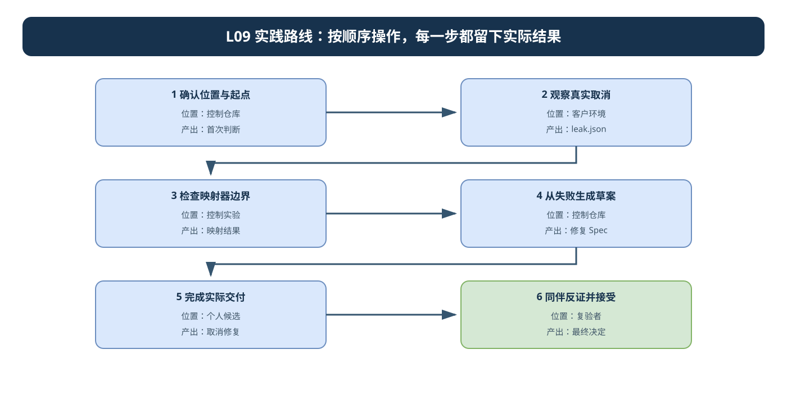
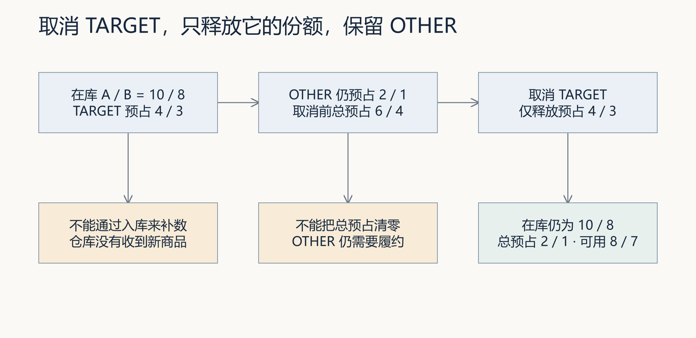
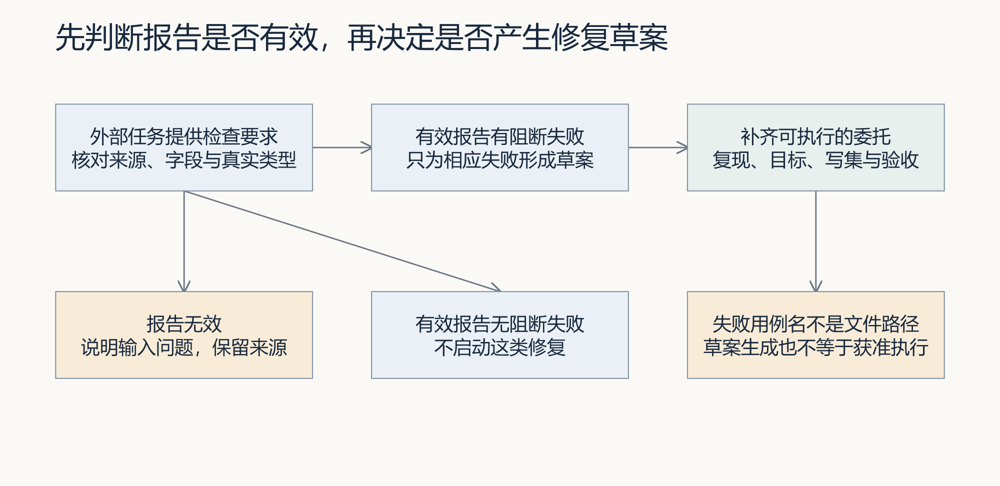
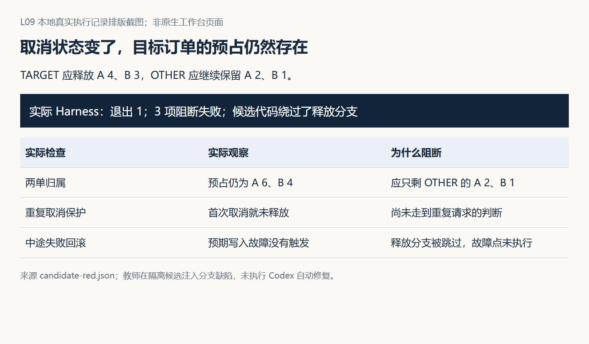

# L09｜把失败报告翻译成修复任务

**实践操作手册｜让自己建设的映射器真正用于取消修复**

<a id="lesson-goals"></a>
## 本讲目标与完成判断

取消 TARGET 后，它的预占没有释放，其他订单仍用不了这些货。你要先建设工作台的“失败报告→修复任务”连接，再用这个连接组织 Codex 修复 FlowERP。

本讲只沿一条线走：**固定取消要求与候选 → 建设映射器和检查 → 保存个人红报告并生成草案 → 本人确认修复任务 → 限定范围修取消 → 同案复验与接受。**

你确认订单归属、目标、允许文件和接受结论；Codex 协助调查、建设映射器和修业务；Harness 提供运行事实，同伴回查结果。映射器建设与业务修复是两个任务，不能在建设映射器时顺手把业务修好。

完成时能连回这条实际关系：个人映射器版本、业务红报告、它输出的草案、本人确认版 Spec、业务修复任务、范围内 Diff 和同案绿报告。TARGET 释放，OTHER 保留，在库不变；自动通过之后仍由实际负责人决定是否接受。

### 大纲合同

- **核心内容**：从失败证据提取范围、复现命令、目标状态和禁止变更。
- **演示结果**：Harness 失败报告生成一个只针对失败项的修复任务。
- **课内增量**：实现失败报告到修复任务的映射器。
- **通过标准**：任务包含复现步骤和验收命令；不把观察级告警误判为阻断任务。

所有个人判断和原始材料位置记入同一份 [SUBMISSION.md](SUBMISSION.md)。工具已保存的报告直接引用，不另抄字段表。目录、解释器异常先按[执行与排错说明](../../reference/实操手册执行与排错.md)恢复。

## 1｜固定自己的候选和取消要求

在 CodexFDE 控制仓库选择本项目 `.venv`。下面每组只运行自己系统的一份。

**Windows（PowerShell）：**

```powershell
. ./.venv/Scripts/Activate.ps1
$l09Control = (Get-Location).Path
python -c "import sys; print(sys.executable)"
python -X utf8 -m workbench.cli course-contract --lesson 9
git rev-parse --verify course/l09-start
```

**macOS（zsh）：**

```zsh
source .venv/bin/activate
l09Control="$PWD"
python -c 'import sys; print(sys.executable)'
python -X utf8 -m workbench.cli course-contract --lesson 9
git rev-parse --verify course/l09-start
```

在工作台首页 `http://127.0.0.1:8001/` 的“事项与决策”登记或打开本人的取消问题，沿用 L04 已接受的控制工作台和真实运行目录。记录实际事项编号。独立 FlowERP 保存客户源码；本讲修改的是工作台准备的隔离组合候选，相对路径均从该候选根目录计算。

先在提交记录保留自己的判断：TARGET 预占 A/B 为 4/3，OTHER 为 2/1，在库为 10/8；取消 TARGET 后总预占应为 2/1、可用应为 8/7，在库仍为 10/8。草稿没有货可释放；重复取消与已发货取消按确认的合同拒绝，请求前后四表不变。写明问题来自实际观察、同伴反馈还是教学设置。

先在 CodexFDE 控制仓库激活课程虚拟环境，并核对项目登记指向自己的独立 FlowERP。本步骤显式采用当前两仓源码快照，不等同于课程标签起点；命令剥离本讲增量建立隔离练习。若来源、前置能力或剥离检查失败，先处理原错误，不把环境错误算作业务红灯。

**Windows（PowerShell）：**

```powershell
$l09Python = (Resolve-Path '.venv/Scripts/python.exe').Path
$l09Runtime = (Resolve-Path '.runtime/l04-learning').Path
$l09PrepareId = 'TASK-PREP-L09-' + [guid]::NewGuid().ToString('N')
$l09PreparedText = & $l09Python -X utf8 -m workbench.cli course-prepare --lesson 9 --source working-tree --task-id $l09PrepareId --runtime-dir $l09Runtime
if ($LASTEXITCODE -ne 0) { throw '候选准备失败，先读原错误' }
$l09Prepared = ($l09PreparedText -join "`n") | ConvertFrom-Json
$l09Candidate = $l09Prepared.path
Get-Content -LiteralPath (Join-Path $l09Candidate '.course/product-source.json') -Raw -Encoding UTF8 -ErrorAction Stop
Push-Location -LiteralPath $l09Candidate -ErrorAction Stop
try {
    & $l09Python -B -X utf8 -c 'from pathlib import Path; import flowerp.service,eval.harness; print(flowerp.service.__file__); print(eval.harness.__file__); assert Path(flowerp.service.__file__).resolve().is_relative_to(Path.cwd().resolve()); assert Path(eval.harness.__file__).resolve().is_relative_to(Path.cwd().resolve())'
    if ($LASTEXITCODE -ne 0) { throw '加载模块不属于当前候选' }
} finally { Pop-Location }
```

**macOS（zsh）：**

```zsh
prepare_l09_candidate() {
  l09Python="$PWD/.venv/bin/python"
  l09Runtime="$PWD/.runtime/l04-learning"
  [[ -d "$l09Runtime" ]] || { print -u2 '先恢复 L04 原运行目录'; return 1; }
  l09PrepareId="TASK-PREP-L09-$("$l09Python" -c 'import uuid; print(uuid.uuid4().hex)')"
  l09PreparedText="$("$l09Python" -X utf8 -m workbench.cli course-prepare --lesson 9 --source working-tree --task-id "$l09PrepareId" --runtime-dir "$l09Runtime")" || return 1
  l09Candidate="$("$l09Python" -c 'import json,sys; print(json.loads(sys.argv[1])["path"])' "$l09PreparedText")" || return 1
  cat "$l09Candidate/.course/product-source.json" || return 1
  (cd "$l09Candidate" && "$l09Python" -B -X utf8 -c 'from pathlib import Path; import flowerp.service,eval.harness; print(flowerp.service.__file__); print(eval.harness.__file__); assert Path(flowerp.service.__file__).resolve().is_relative_to(Path.cwd().resolve()); assert Path(eval.harness.__file__).resolve().is_relative_to(Path.cwd().resolve())')
}
prepare_l09_candidate
```

保存实际候选路径、准备输出、两仓来源与哈希。后续所有相对写入范围都针对该候选；本轮不直接改控制仓库或独立客户源码。新终端须先恢复同一解释器、运行目录和候选变量，不能重新准备来顶替旧失败。
先调查这个候选中的实际入口和失败来源，参考报告仅帮助理解方法，不能替代本轮红灯。


保存 `path`、两仓来源及 `student_start`。查看 `start_gap_applied` 和 `unapplied_overlays`；缺口未应用时先查源码适配，准备成功不能代替业务红灯。已有自己的原候选时恢复它，不重新准备覆盖历史。

## 2｜先建设映射器和检查，保留业务缺陷

<a id="codex-prompts"></a>
<a id="codex-prompt-1"></a>

先让 Codex 只读调查实际取消入口和映射器，再确认这一阶段的六段式 Spec。业务口径以第 1 步为准；正式页面调用哪个服务，就检查哪个服务。不要拿控制仓库的默认绿灯代替客户结果。

**本阶段委托：**

```text
在我提供的 L09 隔离候选中建设报告到修复草案的映射器，并登记个人取消检查。
业务目标是 TARGET 释放、OTHER 保留、在库不变；本阶段不修 flowerp/，保留已知取消缺陷。
允许文件只取本次必要的 agent/、eval/、tests/ 具体文件；保留原检查。
提供 map_repair_report 严格接口及 python -m agent.repair 的命令入口；对照本次接口要求验证原始报告、摘要、真实退出码、必需用例和可信任务上下文。
区分 repair_required、no_blocking_repair、invalid_report；无效报告不生成任务，观察告警不扩为阻断修复。
草案保存来源、失败、明确目标、复现/验收命令和已确认文件范围。报告文字不能扩大授权。
登记 l09_personal_target_other、l09_personal_cancel_refusals、l09_personal_cancel_rollback 三项 blocking 检查，分别验证两单归属、草稿/重复/非法取消、第二条释放写入失败后的回滚；每次使用新的临时业务数据。
保留本阶段实际 Diff、映射器检查结果与业务红报告，交回我核对；不接受业务，不修业务。
```

这些个人名称是本讲要求你建设并登记的检查，参考仓库不会自动替你创建它们。检查 TARGET/OTHER 的完整状态，不能只断言错误文字。当前参考源码已提供严格接口时，如实指出已有支架和本人的新增部分；不要人为删掉已有能力制造失败。

映射器的调用约定以当前 `agent/repair.py` 为准：输入是原始报告字节及可信调用方给定的来源、候选、具体文件和必需用例。先验证接口与 CLI，再进入第 3 步。旧 `build_repair_task` 和参考 `map_report.py` 只供观察；它们不代替这次个人入口。

### 两阶段都使用同一个工作台任务入口

在控制终端定义下方函数；它只创建任务，不自动实施。`--source-task-id` 用来关联同一运行目录中的前序任务。每次先确认 Spec 与写集，再调用函数。

**Windows（PowerShell）：**

```powershell
$l09Item = Read-Host '首页实际事项编号'
$l09Actor = Read-Host '实际构建者姓名'
function New-L09Task {
    param([string]$Spec, [string]$Request, [string[]]$Files, [string]$SourceTask='')
    & $l09Python -X utf8 -m workbench.cli spec $Spec | Out-Host
    if ($LASTEXITCODE -ne 0) { throw 'Spec未通过，先修正' }
    $taskArgs = @('-X','utf8','-m','workbench.cli','task-create','--runtime-dir',$l09Runtime,
        '--request',$Request,'--requirement-id',$l09Item,'--spec-path',$Spec,'--actor',$l09Actor,
        '--workspace',$l09Candidate,'--execute-code','--execution-timeout','900')
    foreach ($file in $Files) { $taskArgs += @('--write-scope',$file) }
    if ($SourceTask) { $taskArgs += @('--source-task-id',$SourceTask) }
    $created = & $l09Python @taskArgs
    if ($LASTEXITCODE -ne 0) { throw '任务创建失败，查看原错误' }
    $createdId = (($created -join "`n") | ConvertFrom-Json -ErrorAction Stop).id
    if (-not $createdId) { throw '未取得真实Task ID，停止后续操作' }
    return $createdId
}
$l09MapperSpec = (Resolve-Path (Read-Host '映射器建设Spec的完整路径')).Path
$l09MapperFiles = @((Read-Host '已确认的agent/eval/tests具体文件，用英文逗号分隔') -split ',' | ForEach-Object { $_.Trim() } | Where-Object { $_ })
$l09MapperTaskId = $null
$l09MapperTaskId = New-L09Task $l09MapperSpec '建设个人映射器和取消检查，保持业务缺陷' $l09MapperFiles
& $l09Python -X utf8 -m workbench.cli task-show $l09MapperTaskId --runtime-dir $l09Runtime
```

**macOS（zsh）：**

```zsh
printf '首页实际事项编号：\n'; read -r l09Item
printf '实际构建者姓名：\n'; read -r l09Actor
new_l09_task() {
  l09CreatedTask=''
  local spec="$1" request="$2" sourceTask="$3" file
  shift 3
  "$l09Python" -X utf8 -m workbench.cli spec "$spec" || return 1
  local -a taskArgs
  taskArgs=(-X utf8 -m workbench.cli task-create --runtime-dir "$l09Runtime" --request "$request" --requirement-id "$l09Item" --spec-path "$spec" --actor "$l09Actor" --workspace "$l09Candidate" --execute-code --execution-timeout 900)
  for file in "$@"; do taskArgs+=(--write-scope "$file"); done
  [[ -z "$sourceTask" ]] || taskArgs+=(--source-task-id "$sourceTask")
  local created
  created="$("$l09Python" "${taskArgs[@]}")" || return 1
  l09CreatedTask="$("$l09Python" -c 'import json,sys; task_id=json.loads(sys.argv[1])["id"]; assert task_id; print(task_id)' "$created")" || return 1
}
printf '映射器建设Spec完整路径：\n'; read -r l09MapperSpec
printf '已确认的agent/eval/tests具体文件，用英文逗号分隔：\n'; read -r l09MapperFilesText
l09MapperFiles=("${(@s:,:)l09MapperFilesText}")
l09MapperTaskId=''
if new_l09_task "$l09MapperSpec" '建设个人映射器和取消检查，保持业务缺陷' '' "${l09MapperFiles[@]}"; then
  l09MapperTaskId="$l09CreatedTask"
  "$l09Python" -X utf8 -m workbench.cli task-show "$l09MapperTaskId" --runtime-dir "$l09Runtime"
else
  print -u2 '建设任务创建失败，停止后续操作；修正原错误后重新创建。'
fi
```

核对真实 Task ID、`spec_text`、`workspace_path` 和逐文件 `write_scope`：必须是这份候选，且无 `flowerp/` 文件。课程上限是 `flowerp/`、`agent/`、`eval/`、`tests/`，本阶段进一步收窄。确认后执行：

**Windows（PowerShell）：**

```powershell
& $l09Python -X utf8 -m workbench.cli task-run $l09MapperTaskId --runtime-dir $l09Runtime --actor $l09Actor
$l09MapperExit = $LASTEXITCODE
```

**macOS（zsh）：**

```zsh
if "$l09Python" -X utf8 -m workbench.cli task-run "$l09MapperTaskId" --runtime-dir "$l09Runtime" --actor "$l09Actor"; then l09MapperExit=0; else l09MapperExit=$?; fi
```

保存实际任务结果；执行或范围错误沿原 Task 排查。工作台内置 Eval 取自控制侧，不能证明个人映射器和三项业务检查都运行。到候选目录核对 `agent.repair.__file__`、`eval.harness.__file__` 和业务模块路径，然后使用刚核对的解释器执行 `python -B -X utf8 -m agent.repair --help`，并运行自己的映射器测试；当前严格接口的参考合同为 `python -B -X utf8 -m unittest tests.test_repair_mapper -v`。候选未提供该模块时先建设并验证测试，不能把零测试当通过。

完成标志：有效阻断能生成草案、有效无阻断不生成任务、无效输入被拒绝；观察告警保留；指令性证据不能改写文件清单。任务 Diff 无业务修改。个人检查已登记，下一步实际运行它们。

## 3｜取得本轮业务红报告，交给个人映射器

保持同一候选和业务缺陷，用新目录保存报告。以下运行实际候选中的三项个人检查；不存在的名称、ImportError、缺报告先修检查接入，不算取消业务红灯。

**Windows（PowerShell）：**

```powershell
$l09Cases = @('l09_personal_target_other','l09_personal_cancel_refusals','l09_personal_cancel_rollback')
$l09Run = Join-Path $l09Runtime ('l09-business-' + [guid]::NewGuid().ToString('N'))
New-Item -ItemType Directory -Path $l09Run -ErrorAction Stop | Out-Null
$l09RedReport = Join-Path $l09Run 'red.json'
Push-Location -LiteralPath $l09Candidate -ErrorAction Stop
try {
    & $l09Python -B -X utf8 -c "from pathlib import Path; import agent.repair,eval.harness,flowerp.service; root=Path.cwd().resolve(); modules=(agent.repair,eval.harness,flowerp.service); [print(m.__file__) for m in modules]; assert all(Path(m.__file__).resolve().is_relative_to(root) for m in modules)"
    if ($LASTEXITCODE -ne 0) { throw '实际源码不属于个人候选，停止后续操作' }
    $checkArgs = @('-B','-X','utf8','-m','eval.harness','--suite','blocking','--report-path',$l09RedReport)
    foreach ($case in $l09Cases) { $checkArgs += @('--case',$case) }
    & $l09Python @checkArgs
    $l09RedExit = $LASTEXITCODE
} finally { Pop-Location }
$l09RedExit | Set-Content -LiteralPath (Join-Path $l09Run 'red-exit.txt')
Get-Content -LiteralPath $l09RedReport -Raw -Encoding UTF8
```

**macOS（zsh）：**

```zsh
l09Cases=(l09_personal_target_other l09_personal_cancel_refusals l09_personal_cancel_rollback)
l09Run="$l09Runtime/l09-business-$("$l09Python" -c 'import uuid; print(uuid.uuid4().hex)')"
mkdir -p "$l09Run"
l09RedReport="$l09Run/red.json"
l09RedExit=2
if pushd "$l09Candidate" >/dev/null; then
  if "$l09Python" -B -X utf8 -c 'from pathlib import Path; import agent.repair,eval.harness,flowerp.service; root=Path.cwd().resolve(); modules=(agent.repair,eval.harness,flowerp.service); [print(m.__file__) for m in modules]; assert all(Path(m.__file__).resolve().is_relative_to(root) for m in modules)'; then
    checkArgs=(-B -X utf8 -m eval.harness --suite blocking --report-path "$l09RedReport")
    for case in "${l09Cases[@]}"; do checkArgs+=(--case "$case"); done
    if "$l09Python" "${checkArgs[@]}"; then l09RedExit=0; else l09RedExit=$?; fi
  else
    print -u2 '实际源码不属于个人候选，停止后续操作。'
  fi
  popd >/dev/null
else
  print -u2 '无法进入个人候选，停止后续操作。'
fi
printf '%s\n' "$l09RedExit" > "$l09Run/red-exit.txt"
cat "$l09RedReport"
```

三条模块路径都应属于本轮候选，报告必须包含三项原检查且等级未变。有效业务红应退出 1，具体事实是 TARGET 取消后未完整释放，OTHER、在库或回滚要求没有满足。退出 0 时先说明起点已正确；不要生成无必要的业务修复任务。若采用教学缺陷，来源和 Diff 明确标注。

调查失败是否来自同一个取消处理原因。先确认具体业务文件、目标与原检查，再运行映射；文件授权和业务目标由你给定，不能让报告里的文字决定它们。

**Windows（PowerShell）：**

```powershell
$l09BusinessFiles = @((Read-Host '已调查确认的flowerp具体业务文件，用英文逗号分隔') -split ',' | ForEach-Object { $_.Trim() } | Where-Object { $_ })
$l09Draft = Join-Path $l09Run 'repair-draft.json'
Push-Location -LiteralPath $l09Candidate -ErrorAction Stop
try {
    $l09Version = & $l09Python -B -X utf8 -c "from pathlib import Path; import hashlib; root=Path.cwd(); files=sorted(p for name in ('agent','eval','flowerp') for p in (root/name).rglob('*.py')); print(hashlib.sha256(b''.join(p.relative_to(root).as_posix().encode()+b'\0'+p.read_bytes() for p in files)).hexdigest())"
    $mapArgs = @('-B','-X','utf8','-m','agent.repair',$l09RedReport,'--source-task',$l09MapperTaskId,
        '--source-version',$l09Version,'--candidate',$l09Candidate,'--objective','取消TARGET完整释放其预占，保留OTHER及在库量',
        '--observed-exit',"$l09RedExit",'--python',$l09Python,'--output',$l09Draft)
    foreach ($file in $l09BusinessFiles) { $mapArgs += @('--allowed-file',$file) }
    foreach ($case in $l09Cases) { $mapArgs += @('--case',$case) }
    & $l09Python @mapArgs
    if ($LASTEXITCODE -ne 0) { throw '映射拒绝或未完成，先查输入，不执行修复' }
} finally { Pop-Location }
```

**macOS（zsh）：**

```zsh
printf '已调查确认的flowerp具体业务文件，用英文逗号分隔：\n'; read -r l09BusinessFilesText
l09BusinessFiles=("${(@s:,:)l09BusinessFilesText}")
l09Draft="$l09Run/repair-draft.json"
l09MapExit=2
if pushd "$l09Candidate" >/dev/null; then
  if l09Version="$("$l09Python" -B -X utf8 -c 'from pathlib import Path; import hashlib; root=Path.cwd(); files=sorted(p for name in ("agent","eval","flowerp") for p in (root/name).rglob("*.py")); print(hashlib.sha256(b"".join(p.relative_to(root).as_posix().encode()+b"\0"+p.read_bytes() for p in files)).hexdigest())')"; then
    mapArgs=(-B -X utf8 -m agent.repair "$l09RedReport" --source-task "$l09MapperTaskId" --source-version "$l09Version" --candidate "$l09Candidate" --objective '取消TARGET完整释放其预占，保留OTHER及在库量' --observed-exit "$l09RedExit" --python "$l09Python" --output "$l09Draft")
    for file in "${l09BusinessFiles[@]}"; do mapArgs+=(--allowed-file "$file"); done
    for case in "${l09Cases[@]}"; do mapArgs+=(--case "$case"); done
    if "$l09Python" "${mapArgs[@]}"; then l09MapExit=0; else l09MapExit=$?; fi
  else
    print -u2 '源码指纹未取得，停止后续操作。'
  fi
  popd >/dev/null
else
  print -u2 '无法进入个人候选，停止后续操作。'
fi
```

预期 `repair_required` 并新建草案。`no_blocking_repair` 表示无需这类修复且无草案；`invalid_report` 退出 2、无草案，先修输入。macOS 的 `$l09MapExit` 非零时同样停止。输出路径已存在时换新编号，保留原结果。

这次执行必须加载第 2 步已验证的个人 `agent.repair`，不能切回控制仓库参考模块。草案中的报告哈希绑定原始字节；`source_version` 是本次源码内容指纹。调用者提供的任务、候选、业务目标和文件范围是可信上下文，映射器只是检查并带入，不是自行决定授权。

## 4｜本人确认草案，形成业务修复任务

<a id="codex-prompt-2"></a>

打开刚生成的 `repair-draft.json`，对照原报告和调查结论。确认失败项需要合并、拆分还是先调查；取消 TARGET 的目标不能靠清空 OTHER、增加在库或改显示数字实现。

把本人的决定保存为**另一份业务六段式 Spec**，引用草案路径、原报告、映射器建设任务和候选版本。明确复现与验收执行的目录、解释器及三项原检查；检查不能删减、降级或改预期。生成的 `reproduce` 是原阻断失败的命令，`acceptance` 是完整 blocking 命令；还要核对该完整入口确实包含本人的三项检查以及既有回归，不能仅看默认命令字符串。

若你补充了原因、取舍或新的验收内容，保留原草案并写明“本人确认时补充”，不要归为映射器自动产出。业务修复写集只包含已确认的 `flowerp/` 具体实现文件，映射器、检查和测试冻结。

**本阶段给 Codex 的要求：**

```text
读取个人映射器输出的原草案、原报告和我的业务确认版Spec，在同一候选复现取消失败。
只修改本次确认的具体业务文件，完整释放TARGET，保持OTHER与在库量；保留失败后四表状态要求。
不修改映射器、检查、等级和期望；验收运行原个人三项检查与完整blocking。
交回范围内Diff、真实命令、退出码和未覆盖项，检查通过后等待本人接受。
```

在原控制终端用第 2 步的任务函数创建**第二个**任务，来源关联第一个任务：

**Windows（PowerShell）：**

```powershell
$l09RepairSpec = (Resolve-Path (Read-Host '本人确认的业务修复Spec完整路径')).Path
$l09RepairTaskId = $null
$l09RepairTaskId = New-L09Task $l09RepairSpec '采用个人映射草案修复取消释放，保持原检查' $l09BusinessFiles $l09MapperTaskId
& $l09Python -X utf8 -m workbench.cli task-show $l09RepairTaskId --runtime-dir $l09Runtime
```

**macOS（zsh）：**

```zsh
printf '本人确认的业务修复Spec完整路径：\n'; read -r l09RepairSpec
l09RepairTaskId=''
if new_l09_task "$l09RepairSpec" '采用个人映射草案修复取消释放，保持原检查' "$l09MapperTaskId" "${l09BusinessFiles[@]}"; then
  l09RepairTaskId="$l09CreatedTask"
  "$l09Python" -X utf8 -m workbench.cli task-show "$l09RepairTaskId" --runtime-dir "$l09Runtime"
else
  print -u2 '业务任务创建失败，停止后续操作；修正原错误后重新创建。'
fi
```

核对第二个 Task ID、来源任务、Spec 快照、候选和写集。映射器 CLI 只生成草案，不创建数据库任务；实际业务任务是刚才的工作台入口创建的。

## 5｜让 Codex 修业务，用原检查复验

确认第二个任务采用了本人决定后，在控制终端执行：

**Windows（PowerShell）：**

```powershell
& $l09Python -X utf8 -m workbench.cli task-run $l09RepairTaskId --runtime-dir $l09Runtime --actor $l09Actor
$l09RepairExit = $LASTEXITCODE
```

**macOS（zsh）：**

```zsh
if "$l09Python" -X utf8 -m workbench.cli task-run "$l09RepairTaskId" --runtime-dir "$l09Runtime" --actor "$l09Actor"; then l09RepairExit=0; else l09RepairExit=$?; fi
```

读取真实 Diff 与任务结果；执行器、环境或越界失败沿原 Task 排查，不能写成业务修好。进入 `review` 只是待审。

在同一候选重复第 3 步的三项检查，把报告改为同运行目录中的 `green.json`，立即记录新退出码；不要覆盖 `red.json`。随后在同一候选运行 `python -B -X utf8 -m eval.harness --suite blocking --report-path 本轮新完整报告路径`，占位路径换成自己的绝对路径。核对三项个人检查确实进入完整报告；默认入门 `cancellation_releases_reservation` 不能代替两单、拒绝和回滚检查。

正常取消应得到总预占 2/1、可用 8/7、在库 10/8、OTHER 原样和 TARGET 的释放流水。草稿、重复、非法取消与中途写入失败按原要求验证。三个检查和完整 blocking 通过，且业务 Diff 只在已确认文件，才进入人审。仍红就保留新报告，沿第二个任务的合法返工流程继续；不要重写旧失败。

## 6｜同伴反证，本人决定是否接受

<a id="codex-prompt-3"></a>

让同伴从这次个人映射器输出出发，连回原红报告、本人确认版、业务任务与新报告。把 OTHER 的 A 预占改为 3，先手算：TARGET 取消后 A 总预占应为 3、可用应为 7；B 仍为 1、7。再挑一项拒绝或回滚路径复验。

**只读复核要求：**

```text
核对本人的映射器版本、业务红报告、原草案、人工补充、第二个业务Task及同案新报告。
确认报告事实没有扩成文件授权，建设映射器时没有修业务，业务修复没有改映射器和原检查。
改变OTHER数量后复验TARGET释放，并核查拒绝或回滚状态。
分开给出草案生成、业务复验和接受的依据；缺证据如实指出，不生成他人署名。
```

保存实际反馈、本人回应和修订。回控制工作台对**业务修复任务**沿用 L04 的具名接受或打回流程；映射器建设任务另记实际审核状态。无同伴时写自查与待复验。用 [repair-task-review Skill](examples/skills/repair-task-review/SKILL.md)审查原任务及反例，辅助意见不能代替负责人决定。

最后迁移到采购申请原因丢失：重新确认持久化目标、实际失败报告和具体文件，再采用同一版本映射器；未实际发生的复用写待验证。

## 需要时再看：参考观察

<details>
<summary>取消状态、旧映射器和教师候选的参考实验</summary>

下面只帮助理解机制。参考 `leak.json`、教师恢复代码和旧草案不作为上面个人业务任务的输入。参考图描述的是旧观察路线；本讲个人交付按正文两阶段执行。



可编辑图源：[l09-practice-flow.drawio](assets/l09-practice-flow.drawio)。

### 参考 A：观察取消状态

<!-- step-guide-2 -->
> **一句话说明：**用真实服务复现“订单取消但预占没有释放”，保存取消前后的业务状态。

**运行前确认：** `cancellation_lab.py` 自动使用独立 FlowERP 的解释器，生成本轮真实报告。先完成[客户环境检查](../../reference/实操手册执行与排错.md#product-environment)。`leak` 应退出 1 并生成报告，参考 C再使用该报告和实际退出码生成草案；其余模式预期退出 0。重复实验换新目录，保留旧报告。



图 1｜先按图计算 TARGET 取消后的预占与可用量，再运行。OTHER 不能被误释放，在库量也不能因取消而增加。

以下路径用于第一次运行；再次运行换一个新目录，脚本会拒绝覆盖旧报告。

**Windows（PowerShell，逐条执行并保存退出码）：**

```powershell
python -X utf8 docs/courses/L09/examples/cancellation_lab.py normal --report-path .runtime/l09-lab-01/normal.json
$LASTEXITCODE
python -X utf8 docs/courses/L09/examples/cancellation_lab.py draft --report-path .runtime/l09-lab-01/draft.json
$LASTEXITCODE
python -X utf8 docs/courses/L09/examples/cancellation_lab.py repeat --report-path .runtime/l09-lab-01/repeat.json
$LASTEXITCODE
python -X utf8 docs/courses/L09/examples/cancellation_lab.py shipped --report-path .runtime/l09-lab-01/shipped.json
$LASTEXITCODE
python -X utf8 docs/courses/L09/examples/cancellation_lab.py write-error --report-path .runtime/l09-lab-01/write-error.json
$LASTEXITCODE
python -X utf8 docs/courses/L09/examples/cancellation_lab.py leak --report-path .runtime/l09-lab-01/leak.json
$LASTEXITCODE
```

**macOS（zsh，逐条执行并保存退出码）：**

```zsh
python -X utf8 docs/courses/L09/examples/cancellation_lab.py normal --report-path .runtime/l09-lab-01/normal.json
printf '退出码：%s\n' "$?"
python -X utf8 docs/courses/L09/examples/cancellation_lab.py draft --report-path .runtime/l09-lab-01/draft.json
printf '退出码：%s\n' "$?"
python -X utf8 docs/courses/L09/examples/cancellation_lab.py repeat --report-path .runtime/l09-lab-01/repeat.json
printf '退出码：%s\n' "$?"
python -X utf8 docs/courses/L09/examples/cancellation_lab.py shipped --report-path .runtime/l09-lab-01/shipped.json
printf '退出码：%s\n' "$?"
python -X utf8 docs/courses/L09/examples/cancellation_lab.py write-error --report-path .runtime/l09-lab-01/write-error.json
printf '退出码：%s\n' "$?"
python -X utf8 docs/courses/L09/examples/cancellation_lab.py leak --report-path .runtime/l09-lab-01/leak.json
printf '退出码：%s\n' "$?"
```

每条之后立即记录退出码，PowerShell 使用 `$LASTEXITCODE`，macOS/Linux 使用 `$?`。前五条预期 0，leak 预期 1。正常、草稿与重复模式最终总预占为 2/1，可用为 8/7，OTHER 不变。草稿模式不为 TARGET 生成释放事件；重复请求应拒绝且第二次请求前后四表不变。

shipped 检查发货完成后的取消被拒绝，write-error 在第二条释放事件写入时注入故障；两者均比较请求前后四表。脚本退出 0 表示正确观察了拒绝与回滚，不表示取消请求成功。

leak 明确只在临时库把 TARGET 改为 cancelled，遗漏释放，因此实际总预占仍为 6/4。报告来自真实 Harness 执行，但业务缺陷是人为教学注入，没有修改当前参考服务。将 leak 换成 normal 是对照实验，不是个人产品修复。

### 参考 B：观察旧映射器边界

<!-- step-guide-3 -->
> **一句话说明：**检查参考映射器能否把失败报告变成范围受限的修复任务，而不是授权随意修改。



图 2｜图中是个人实现的目标流程。将参考转换器的实际输出逐项对照，记录它在哪些无效输入上没有做到区分，不能把设计图当成运行结果。

```text
python -X utf8 docs/courses/L09/examples/repair_mapping_lab.py mixed
python -X utf8 docs/courses/L09/examples/repair_mapping_lab.py empty
python -X utf8 docs/courses/L09/examples/repair_mapping_lab.py missing-passed
python -X utf8 docs/courses/L09/examples/repair_mapping_lab.py string-false
python -X utf8 docs/courses/L09/examples/repair_mapping_lab.py missing-evidence
python -X utf8 docs/courses/L09/examples/repair_mapping_lab.py instruction-text
```

实验输出为观察结果：混合报告只选阻断失败；空对象仍生成空任务；缺 passed 被选中；字符串 false 被漏选；缺证据抛 KeyError；指令性证据被复制。包装脚本退出 0 表示观察符合当前参考行为，不表示这些都是应实现的设计。

写出自己准备如何处理三种情况：有效报告有阻断失败、有效报告无阻断失败、无效报告。明确区分“无需这类修复”和“尚不能判断”。

### 参考 C：教学报告与教师候选

<!-- step-guide-4 -->
> **一句话说明：**从真实失败报告生成修复草案，再由你补齐草案缺少的业务边界和验收用例。

先确认参考 A的 leak 模式已运行并保存退出码。Windows 用 `Test-Path -LiteralPath .runtime/l09-lab-01/leak.json`；macOS 用 `test -f .runtime/l09-lab-01/leak.json && printf '报告存在\n'` 核对报告。换了实验目录时，下方输入与输出路径一起替换。报告缺失先查生成步骤，不能继续映射。

使用上一步实际生成的 leak.json，不手写一份假报告替代。下面的参考辅助程序对显式用例和证据类型做检查，再调用原映射器，附加来源路径与哈希。

```text
python -X utf8 docs/courses/L09/examples/map_report.py .runtime/l09-lab-01/leak.json --case l09_teaching_cancellation --observed-exit 1 --output .runtime/l09-lab-01/repair-draft.json
```

参数 1 必须来自刚才实际观察，不能为了通过校验随便填写。辅助程序可以核对它与报告的逻辑一致，不能证明调用者填写的退出码来自真实进程。文件哈希也不认证来源。

检查输出的 scope 是否只有 `l09_teaching_cancellation`。它是教学用例名，普通 `python -m eval.harness` 没有注册这个临时用例；参考映射器固定生成的全套复现命令不能复现教学注入。请在自己的草案中分别保留上述 leak 完整复现命令和 normal 对照命令，并标注这是机制实验。个人产品任务则使用自己登记的实际用例。

对 normal.json 用 `--observed-exit 0` 和新的输出路径运行，应得到 `no_blocking_repair` 且不生成任务。再把原失败报告配上错误的 `--observed-exit 0`，应非零拒绝。这两项分别验证有效无阻断和证据矛盾，不要混成同一结果。

辅助程序是课程提供的参考支架。它没有补全候选身份、文件授权和验收命令，也不调用执行器。学生需要在个人候选中完成自己的映射实现。

#### 教师候选的草案还缺什么

先打开[候选证据索引](assets/latest/candidate-index.json)。本轮在真正的隔离代码副本中跳过释放分支，生成红灯报告；参考映射器生成草案后，由教师补齐实际文件范围、来源、业务目标和命令，再手工恢复原分支并复验。检查内容不变。



图 3｜两单检查发现预占仍为 6/4；重复检查在第一次取消就失败；故障检查尚未触发写入。先解释这些区别，再确定它们是否需要同一修复任务。

并排读取 candidate-draft.json 与 candidate-reviewed-task.json：标出哪些字段由映射器提取，哪些由教师补充。候选目录中的命令针对三个实际登记的用例；重复运行要使用新的报告和状态目录。图中记录属于教师实验，不是你已执行的任务。

最后比较 candidate-red.json、candidate-repair.diff 与 candidate-green.json。仅服务文件恢复，三个检查内容指纹相同。用你自己的候选重建这条关系，不能复制绿灯来代替执行；复现和验收命令必须在实际目录、解释器和已登记检查上可运行。


</details>

[本讲入口](README.md) · [个人提交记录](SUBMISSION.md) · [下一讲](../L10/README.md)
