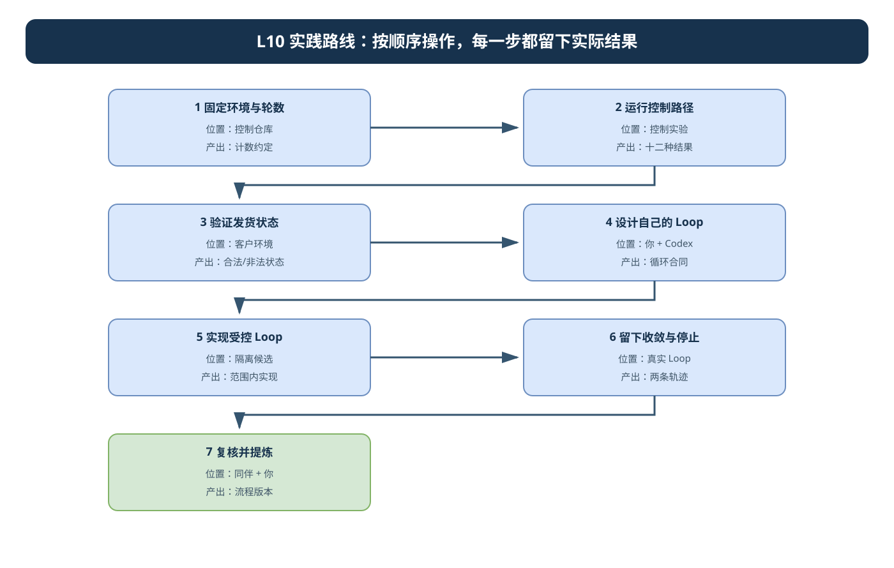
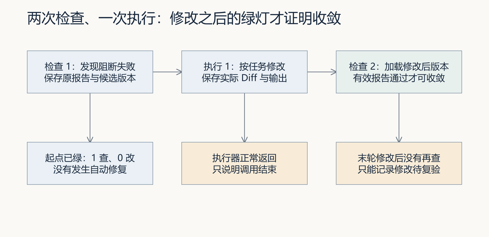
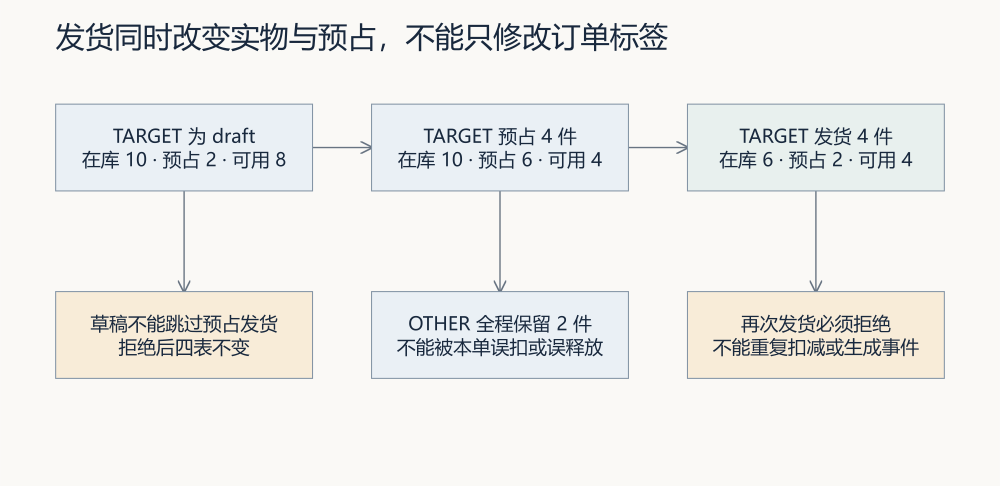
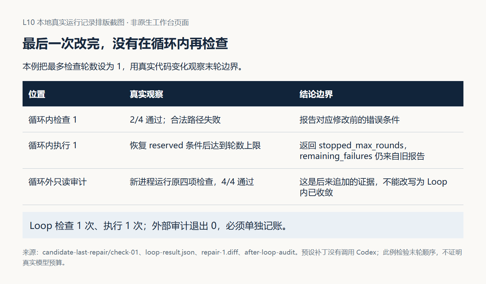

# L10｜建立有停止条件的修复 Loop

**实践操作手册｜先建循环，再让循环修订单**

<a id="lesson-goals"></a>
## 本讲目标与完成判断

FlowERP 需要合法发货成功，草稿、已取消和重复发货被拒绝，OTHER 的库存与预占受到保护。你先建一个能依据检查继续或停止的工作台 Loop，再让它在授权候选中组织 Codex 修这个问题。

本讲分两阶段：**建设并验证 Loop，保留业务红灯 → 用新 Loop 执行业务修复与安全停止。**第一阶段只改工作台控制器和检查，不能提前把发货修好。

你确认业务目标、文件范围、轮数与预算；Codex 建设 Loop 并在第二阶段接受逐轮业务委托；Harness 检查具体版本，同伴回查轨迹，负责人最后接受。最多三轮按“检查及下一步决定”计数；每次修改必须为下一次检查留位置。

完成时留下同一新版 Loop 的两条实际轨迹：一份从真实业务红灯经模型修复、后置复验得到通过；另一份在相同红起点、只有一次检查机会时安全停止，实际检查、零次编码、保留失败并交回人处理。第二份证明停止规则有效，业务仍未完成。

### 课程四项合同

- **核心内容**：最大轮数、达标即停、无进展检测、时间与 Token 预算、安全退出。
- **演示结果**：修复循环成功收敛一次，并展示一次未收敛退出。
- **课内增量**：串联“执行 → Eval → 生成修复任务 → 再执行”。
- **通过标准**：最多三轮；达标即停止；无进展或预算耗尽时输出剩余失败，不宣称成功。

首次判断、两阶段任务、运行结果和接受理由只记在同一份 [SUBMISSION.md](SUBMISSION.md)。已保存的报告直接引用。需要解释机制时看[辅导资料](辅导资料.md)；路径和解释器异常先按[执行与排错说明](../../reference/实操手册执行与排错.md)恢复。

## 1｜准备一个仍有发货缺陷的个人候选

以下命令从 CodexFDE 控制仓库运行，只选自己系统的一份。沿用 L04 已接受的工作台，在首页“事项与决策”登记或打开本人的订单状态问题，填写真实事项编号、构建者和运行目录。

**Windows（PowerShell）：**

```powershell
. ./.venv/Scripts/Activate.ps1
$l10Control = (Get-Location).Path
$l10Python = (Resolve-Path '.venv/Scripts/python.exe').Path
$l10Item = Read-Host '首页实际事项编号'
$l10Actor = Read-Host '实际构建者姓名'
$l10Runtime = [IO.Path]::GetFullPath((Read-Host '工作台原运行目录'))
& $l10Python -X utf8 -m workbench.cli course-contract --lesson 10
$l10PrepId = 'TASK-PREP-L10-' + [guid]::NewGuid().ToString('N')
$prepared = & $l10Python -X utf8 -m workbench.cli course-prepare --lesson 10 --source working-tree --task-id $l10PrepId --runtime-dir $l10Runtime
if ($LASTEXITCODE -ne 0) { throw '准备失败，先查原错误' }
$l10Candidate = (($prepared -join "`n") | ConvertFrom-Json).path
Get-Content -LiteralPath (Join-Path $l10Candidate '.course/product-source.json') -Raw -Encoding UTF8
```

**macOS（zsh）：**

```zsh
source .venv/bin/activate
l10Control="$PWD"
l10Python="$PWD/.venv/bin/python"
printf '首页实际事项编号：\n'; read -r l10Item
printf '实际构建者姓名：\n'; read -r l10Actor
printf '工作台原运行目录：\n'; read -r l10Runtime
l10Runtime="$("$l10Python" -c 'from pathlib import Path; import sys; print(Path(sys.argv[1]).resolve())' "$l10Runtime")"
"$l10Python" -X utf8 -m workbench.cli course-contract --lesson 10
l10PrepId="TASK-PREP-L10-$("$l10Python" -c 'import uuid; print(uuid.uuid4().hex)')"
l10Prepared="$("$l10Python" -X utf8 -m workbench.cli course-prepare --lesson 10 --source working-tree --task-id "$l10PrepId" --runtime-dir "$l10Runtime")"
l10PrepareExit=$?
l10Candidate="$("$l10Python" -c 'import json,sys; print(json.loads(sys.argv[1])["path"])' "$l10Prepared")"
cat "$l10Candidate/.course/product-source.json"
```

退出 0、候选存在且两仓来源可回查才继续。查看准备结果的 `student_start`：缺口未成功应用时先修来源适配。这里明确采用当前两仓源码快照，不是从旧标签再次取一套参考 Loop。新的候选保留本讲发货缺陷；实际业务红灯还须由原检查证明。

## 2｜本人确定目标、检查和停止规则

<a id="prompt-design"></a>

先独立计算：商品 A 在库 10，OTHER 预占 2，TARGET 预占 4；TARGET 发货后在库／总预占／可用应为 6／2／4，OTHER 不变。草稿、已取消和已发货再次请求，应拒绝且四表不变。写明当前观察来自真实问题、反馈还是教学设置。

让 Codex 只读调查候选的实际服务、检查入口与控制器，再确认两份六段式 Spec：**Loop 建设 Spec**只授权必要 `agent/`、`eval/`、`tests/` 文件；**业务修复 Spec**只授权调查确认的 `flowerp/` 实现文件，保留原检查。两份 Spec 引用同一个事项和业务目标，不能用一份大写集同时建设控制器和修业务。

**设计委托：**

```text
核对我提供的实际候选、发货服务和个人目标，先不修改业务。
设计最多三次“检查与下一步决定”：有效通过即停；报告无效、执行器异常、范围不符或资源未知时交回；稳定失败按已确认进展策略停止。
没有下一次检查位置时不得启动新的业务修改。因此max_rounds=1应真实检查一次、零次编码、保留失败后停止。
确定每轮的报告、草案、执行任务、Diff、实际用量和候选版本怎样关联；为执行和后置检查分配剩余时间。
说明当前参考入口哪些能力已有、哪些接线尚未实现，提出本次具体文件与验收方法。
```

## 3｜建设新 Loop，保持发货仍红

<a id="candidate-environment"></a>
<a id="prompt-implement"></a>

把下列接线落实到 **Loop 建设 Spec**，然后通过工作台执行。它们是本讲要完成的实现要求，当前参考 CLI 还没有全部具备：

- 个人入口仍使用现有 `--max-rounds`、`--timeout`、`--token-budget`、`--codex` 参数；不要写不存在的 `--case` 或 `--runtime-dir`。
- 建设并登记 `l10_personal_legal_ship`、`l10_personal_draft_refusal`、`l10_personal_cancelled_refusal`、`l10_personal_repeat_refusal` 四项 blocking 检查，每次用新数据，包含 OTHER 保护。控制器显式选择这四项并核对实际报告，不能让默认工作台检查替代它们。
- 在 Spec 固定既有完整回归的实际命令与覆盖项。只有修改后的原四项检查和该回归都通过，控制器才能输出 `converged`；回归失败仍保留失败报告，不能先宣称成功再交人改判。各自报告保留，按同一轮的检查决定计数，不增加末轮编码机会。
- 个人入口读取本候选 `.runtime/l10-run-context.json`，验证实际候选、控制工作台、父任务、业务 Spec、逐文件写集和必需用例。第 4 步由本人确认后生成该上下文；参考程序目前没有这个读取能力，须在本阶段实现并测试。
- 每次修改经**控制工作台**现有 `task-create --workspace ... --source-task-id ...` 和 `task-run` 组织；从控制目录、控制解释器调用，关联本轮源报告和已确认业务 Spec。不得直接套用参考 `_run_codex` 的宽泛 workspace-write 当逐文件授权。
- 复用已验证的严格报告映射，核对报告及上下文后形成草案。报告存入本次候选的新运行目录，各轮不覆盖；实际执行输出由控制工作台保留。无报告、未知用量、异常或越界都停止，不改写旧结果。

**本阶段实施委托：**

```text
按已确认Loop建设Spec实现以上接线和停止条件，只改必要agent/eval/tests具体文件，不改flowerp/。
先验证控制分支、上下文拒绝和文件范围，再让新控制器接入四项个人发货检查；保留业务缺陷和原业务期望。
业务编码必须经控制工作台的实际任务入口，读取本次上下文；建设期间不运行业务编码。
max_rounds=1时真实检查后停止且零次编码；最多三轮时每次修改之后必须再检查，缺少后置结果写待复验。
原四项通过后仍须运行Spec冻结的完整回归，二者都通过才输出converged；回归失败或缺失时保持失败或待复验。
保存实际Diff、个人测试结果和业务仍红的报告，说明预置支架与本次新增接线。
```

在控制终端创建 Loop 建设任务，只填本阶段具体文件：

**Windows（PowerShell）：**

```powershell
$l10BuildSpec = (Resolve-Path (Read-Host 'Loop建设Spec的完整路径')).Path
$l10BuildTaskId = $null
$l10BuildFiles = @((Read-Host '已确认agent/eval/tests具体文件，用英文逗号分隔') -split ',' | ForEach-Object { $_.Trim() } | Where-Object { $_ })
& $l10Python -X utf8 -m workbench.cli spec $l10BuildSpec
if ($LASTEXITCODE -ne 0) { throw '先修正Spec' }
$taskArgs = @('-X','utf8','-m','workbench.cli','task-create','--runtime-dir',$l10Runtime,
    '--request','建设个人Loop和发货检查，保留业务缺陷','--requirement-id',$l10Item,
    '--spec-path',$l10BuildSpec,'--actor',$l10Actor,'--workspace',$l10Candidate,
    '--execute-code','--execution-timeout','900')
foreach ($file in $l10BuildFiles) { $taskArgs += @('--write-scope',$file) }
$created = & $l10Python @taskArgs
if ($LASTEXITCODE -ne 0) { throw '任务创建失败，先查原错误' }
$l10BuildTaskId = (($created -join "`n") | ConvertFrom-Json -ErrorAction Stop).id
if (-not $l10BuildTaskId) { throw '未取得真实Task ID，停止后续操作' }
& $l10Python -X utf8 -m workbench.cli task-show $l10BuildTaskId --runtime-dir $l10Runtime
```

**macOS（zsh）：**

```zsh
printf 'Loop建设Spec的完整路径：\n'; read -r l10BuildSpec
printf '已确认agent/eval/tests具体文件，用英文逗号分隔：\n'; read -r l10BuildFilesText
l10BuildFiles=("${(@s:,:)l10BuildFilesText}")
new_l10_build_task() {
  l10BuildTaskId=''
  "$l10Python" -X utf8 -m workbench.cli spec "$l10BuildSpec" || return 1
  local file created
  local -a taskArgs
  taskArgs=(-X utf8 -m workbench.cli task-create --runtime-dir "$l10Runtime" --request '建设个人Loop和发货检查，保留业务缺陷' --requirement-id "$l10Item" --spec-path "$l10BuildSpec" --actor "$l10Actor" --workspace "$l10Candidate" --execute-code --execution-timeout 900)
  for file in "${l10BuildFiles[@]}"; do taskArgs+=(--write-scope "$file"); done
  created="$("$l10Python" "${taskArgs[@]}")" || return 1
  l10BuildTaskId="$("$l10Python" -c 'import json,sys; task_id=json.loads(sys.argv[1])["id"]; assert task_id; print(task_id)' "$created")" || return 1
}
if new_l10_build_task; then
  "$l10Python" -X utf8 -m workbench.cli task-show "$l10BuildTaskId" --runtime-dir "$l10Runtime"
else
  print -u2 'Loop建设任务创建失败，停止后续操作；修正原错误后重新创建。'
fi
```

核对真实任务、Spec、候选和写集，确认没有业务实现文件；通用任务入口不会代你判断课程上限。确认后运行 `task-run`，任务 ID 使用刚才的实际值：

**Windows（PowerShell）：**

```powershell
& $l10Python -X utf8 -m workbench.cli task-run $l10BuildTaskId --runtime-dir $l10Runtime --actor $l10Actor
$l10BuildExit = $LASTEXITCODE
```

**macOS（zsh）：**

```zsh
if "$l10Python" -X utf8 -m workbench.cli task-run "$l10BuildTaskId" --runtime-dir "$l10Runtime" --actor "$l10Actor"; then l10BuildExit=0; else l10BuildExit=$?; fi
```

保存本阶段结果，检查个人控制器测试和实际 Diff；业务文件不能出现在本阶段修改清单。用实际候选的解释器核对 `agent.loop.__file__`、`eval.harness.__file__` 和业务源码，检查个人入口 `--help`，并运行个人控制器的测试。替身可以验证停止分支，但要明确标注，不能当真实业务轨迹。

最后在该候选显式运行四项个人检查，保存**实际业务红报告和即时退出码**。四项名称须真实登记且等级为 blocking；红灯必须来自发货状态规则，不是缺模块或路径。起点已正确时先回查剥离记录；不要一边建设 Loop 一边修完发货。完成标志是“新 Loop 接线已验证，业务缺陷仍被固定检查发现”。

## 4｜把同一新版 Loop 和红起点带入两份实验

从刚完成第 3 步的候选复制两份新的隔离目录：一份收敛，一份停止。二者必须拥有同一新版 `agent/`、冻结 `eval/` 和 `tests/`、相同未修复 `flowerp/`。不能再次 course-prepare 从控制仓库拿一套旧 Loop。

下面只复制已确认来源并保存指纹，不运行 Codex、不修业务。排除运行目录、虚拟环境、数据库和 Git；沿用控制解释器，在各自工作目录导入复制的源码。新目录已存在时停止，换运行编号并保留原证据。

<details>
<summary>复制和指纹核对命令：只选自己的系统</summary>

**Windows（PowerShell）：**

```powershell
$l10Experiments = Join-Path $l10Runtime ('l10-two-runs-' + [guid]::NewGuid().ToString('N'))
$l10CopiesText = @'
import hashlib, json, shutil, sys
from pathlib import Path
source, output = (Path(value).resolve() for value in sys.argv[1:3])
if not source.is_dir() or output.exists() or source == output or source in output.parents:
    raise SystemExit("来源或新输出目录不符合要求")
excluded = {".git", ".venv", ".runtime", ".tmp", "__pycache__", ".pytest_cache", ".mypy_cache"}
def ignored(name):
    return name in excluded or name.startswith(".env") or name.endswith((".db", ".sqlite", ".sqlite3"))
def ignore(folder, names):
    return [name for name in names if ignored(name)]
def manifest(root):
    result = {}
    for top in ("agent", "eval", "tests", "flowerp"):
        for path in sorted((root / top).rglob("*")):
            relative = path.relative_to(root)
            if any(ignored(part) for part in relative.parts):
                continue
            if path.is_symlink():
                raise SystemExit("源码包含链接，先核对实际来源")
            if path.is_file():
                result[relative.as_posix()] = hashlib.sha256(path.read_bytes()).hexdigest()
    return result
baseline = manifest(source)
if not baseline or "agent/loop.py" not in baseline or "eval/harness.py" not in baseline:
    raise SystemExit("没有取得已建设的 Loop 和检查入口")
output.mkdir(parents=True, exist_ok=False)
paths = {}
for mode in ("converge", "stop"):
    target = output / (mode + "-candidate")
    shutil.copytree(source, target, ignore=ignore)
    copied = manifest(target)
    if copied != baseline:
        raise SystemExit("复制后实现或检查指纹不一致，不运行")
    (output / (mode + "-manifest.json")).write_text(json.dumps(copied, indent=2), encoding="utf-8")
    paths[mode] = str(target)
(output / "source-manifest.json").write_text(json.dumps(baseline, indent=2), encoding="utf-8")
result = {"source": str(source), "same_loop_checks_business": True, **paths}
(output / "copies.json").write_text(json.dumps(result, indent=2), encoding="utf-8")
print(json.dumps(result))
'@ | & $l10Python -B -X utf8 - $l10Candidate $l10Experiments
if ($LASTEXITCODE -ne 0) { throw '复制或指纹核对失败，不运行' }
$l10Copies = ($l10CopiesText -join "`n") | ConvertFrom-Json
$l10Converge = $l10Copies.converge
$l10Stop = $l10Copies.stop
$l10Copies
```

**macOS（zsh）：**

```zsh
l10Experiments="$l10Runtime/l10-two-runs-$("$l10Python" -c 'import uuid; print(uuid.uuid4().hex)')"
l10CopiesText="$("$l10Python" -B -X utf8 - "$l10Candidate" "$l10Experiments" <<'PY'
import hashlib, json, shutil, sys
from pathlib import Path
source, output = (Path(value).resolve() for value in sys.argv[1:3])
if not source.is_dir() or output.exists() or source == output or source in output.parents:
    raise SystemExit("来源或新输出目录不符合要求")
excluded = {".git", ".venv", ".runtime", ".tmp", "__pycache__", ".pytest_cache", ".mypy_cache"}
def ignored(name):
    return name in excluded or name.startswith(".env") or name.endswith((".db", ".sqlite", ".sqlite3"))
def ignore(folder, names):
    return [name for name in names if ignored(name)]
def manifest(root):
    result = {}
    for top in ("agent", "eval", "tests", "flowerp"):
        for path in sorted((root / top).rglob("*")):
            relative = path.relative_to(root)
            if any(ignored(part) for part in relative.parts):
                continue
            if path.is_symlink():
                raise SystemExit("源码包含链接，先核对实际来源")
            if path.is_file():
                result[relative.as_posix()] = hashlib.sha256(path.read_bytes()).hexdigest()
    return result
baseline = manifest(source)
if not baseline or "agent/loop.py" not in baseline or "eval/harness.py" not in baseline:
    raise SystemExit("没有取得已建设的 Loop 和检查入口")
output.mkdir(parents=True, exist_ok=False)
paths = {}
for mode in ("converge", "stop"):
    target = output / (mode + "-candidate")
    shutil.copytree(source, target, ignore=ignore)
    copied = manifest(target)
    if copied != baseline:
        raise SystemExit("复制后实现或检查指纹不一致，不运行")
    (output / (mode + "-manifest.json")).write_text(json.dumps(copied, indent=2), encoding="utf-8")
    paths[mode] = str(target)
(output / "source-manifest.json").write_text(json.dumps(baseline, indent=2), encoding="utf-8")
result = {"source": str(source), "same_loop_checks_business": True, **paths}
(output / "copies.json").write_text(json.dumps(result, indent=2), encoding="utf-8")
print(json.dumps(result))
PY
)"
l10CopyExit=$?
l10Converge="$("$l10Python" -c 'import json,sys; print(json.loads(sys.argv[1])["converge"])' "$l10CopiesText")"
l10Stop="$("$l10Python" -c 'import json,sys; print(json.loads(sys.argv[1])["stop"])' "$l10CopiesText")"
printf '%s\n' "$l10CopiesText"
```

</details>

复制命令退出 0、`same_loop_checks_business` 为 true 才继续。三份 manifest 在 `$l10Experiments` 下，核对的是 Loop、检查和业务源文件的内容指纹，不能仅靠目录名认定相同。业务数据由冻结检查每次重新准备，二者都用第 2 步的 TARGET/OTHER 输入。

取得两个实际目录后，分别确认业务修复 Spec，写明对应候选绝对路径和同一业务写集。保留建设任务为父任务。现在由本人核对一次授权上下文；下面格式是**第 3 步个人入口要支持的约定，不是参考 CLI 的已有能力**。

```json
{
  "control_root": "控制工作台绝对路径",
  "control_python": "控制工作台Python绝对路径",
  "workbench_runtime": "原工作台运行目录绝对路径",
  "source_task_id": "实际Loop建设任务编号",
  "requirement_id": "实际事项编号",
  "actor": "实际构建者",
  "candidate": "本次实验候选绝对路径",
  "business_spec": "对应候选的本人确认版业务Spec绝对路径",
  "allowed_files": ["调查确认的flowerp具体文件"],
  "required_cases": ["l10_personal_legal_ship", "l10_personal_draft_refusal", "l10_personal_cancelled_refusal", "l10_personal_repeat_refusal"]
}
```

让 Codex 只整理你已确认的这些值，分别保存到两个候选的 `.runtime/l10-run-context.json`；核对绝对路径、四项检查、对应 Spec 和逐文件业务范围。此操作不运行业务编码。个人入口读取不存在、路径不符、Spec或写集冲突的上下文时必须停止。若这些检查尚未实现，回第 3 步完成，不能直接运行宽泛参考执行器。

## 5｜在收敛候选中运行真实修复

首先只检查收敛候选，用新报告保存执行前业务红；不能先让 Codex手工修掉缺陷。

**Windows（PowerShell）：**

```powershell
Push-Location -LiteralPath $l10Converge -ErrorAction Stop
try {
    & $l10Python -B -X utf8 -c "from pathlib import Path; import agent.loop,eval.harness,flowerp.service; root=Path.cwd().resolve(); modules=(agent.loop,eval.harness,flowerp.service); print(root); [print(m.__file__) for m in modules]; assert all(Path(m.__file__).resolve().is_relative_to(root) for m in modules)"
    if ($LASTEXITCODE -ne 0) { throw '实际源码不属于收敛候选' }
    & $l10Python -B -X utf8 -m eval.harness --suite blocking --case l10_personal_legal_ship --case l10_personal_draft_refusal --case l10_personal_cancelled_refusal --case l10_personal_repeat_refusal --report-path .runtime/before-loop.json
    $l10BeforeExit = $LASTEXITCODE
} finally { Pop-Location }
```

**macOS（zsh）：**

```zsh
l10BeforeExit=2
if pushd "$l10Converge" >/dev/null; then
  if "$l10Python" -B -X utf8 -c 'from pathlib import Path; import agent.loop,eval.harness,flowerp.service; root=Path.cwd().resolve(); modules=(agent.loop,eval.harness,flowerp.service); print(root); [print(m.__file__) for m in modules]; assert all(Path(m.__file__).resolve().is_relative_to(root) for m in modules)'; then
    if "$l10Python" -B -X utf8 -m eval.harness --suite blocking --case l10_personal_legal_ship --case l10_personal_draft_refusal --case l10_personal_cancelled_refusal --case l10_personal_repeat_refusal --report-path .runtime/before-loop.json; then l10BeforeExit=0; else l10BeforeExit=$?; fi
  else
    print -u2 '实际源码不属于收敛候选，停止后续操作。'
  fi
  popd >/dev/null
else
  print -u2 '无法进入收敛候选，停止后续操作。'
fi
```

源码位置正确、四项检查实际运行，退出 1 且原报告说明发货目标失败，才授权真实 Loop。退出 0 表示没有待修目标；退出 2、缺报告或导入错误先排错，不进入编码。

**Windows（PowerShell）：**

```powershell
Push-Location -LiteralPath $l10Converge -ErrorAction Stop
try {
    & $l10Python -B -X utf8 -m agent.loop --max-rounds 3 --timeout 900 --token-budget 30000 --codex
    $l10ConvergeExit = $LASTEXITCODE
} finally { Pop-Location }
```

**macOS（zsh）：**

```zsh
l10ConvergeExit=2
if pushd "$l10Converge" >/dev/null; then
  if "$l10Python" -B -X utf8 -m agent.loop --max-rounds 3 --timeout 900 --token-budget 30000 --codex; then l10ConvergeExit=0; else l10ConvergeExit=$?; fi
  popd >/dev/null
else
  print -u2 '无法进入收敛候选，停止后续操作。'
fi
```

这次应调用本人建设的控制器，逐轮通过控制工作台创建实际业务修复任务；每个任务的候选和写集都应指向收敛副本，来源连到建设任务或本运行前一任务。冻结检查不能进入业务写集。执行器范围、认证或真实用量缺失时停止并保留待完成，不拿替身记录补位。

收敛不能预设必然发生。只有真实目标失败、至少一次实际模型修复 Diff、修改后原四项检查及既有完整回归通过，才记录 `converged` 和退出 0。若三轮内未达标，按实际停止结论保留失败；调查后在新授权、同样可回查的起点续做，不把它改名为成功。合法发货必须达到 6/2/4、OTHER 不变；三种非法请求拒绝后四表不变。

## 6｜在相同红起点验证安全停止，再交给同伴

停止候选仍是第 4 步冻结的副本，不接受收敛候选修好的业务文件。先切换到 `$l10Stop`，按第 5 步同样方法核对模块路径，并用同四项检查保存它自己的执行前报告。它应得到与收敛候选**修复前**相同的业务失败；不同则先核对业务与检查指纹、数据准备和实际入口。

确认本次停止候选授权后，把检查轮数收窄为 1：

**Windows（PowerShell）：**

```powershell
Push-Location -LiteralPath $l10Stop -ErrorAction Stop
try {
    & $l10Python -B -X utf8 -m agent.loop --max-rounds 1 --timeout 900 --token-budget 30000 --codex
    $l10StopExit = $LASTEXITCODE
} finally { Pop-Location }
```

**macOS（zsh）：**

```zsh
l10StopExit=2
if pushd "$l10Stop" >/dev/null; then
  if "$l10Python" -B -X utf8 -m agent.loop --max-rounds 1 --timeout 900 --token-budget 30000 --codex; then l10StopExit=0; else l10StopExit=$?; fi
  popd >/dev/null
else
  print -u2 '无法进入停止候选，停止后续操作。'
fi
```

按第 2 步确认的策略，预期真实检查 1 次、编码 0 次、业务指纹不变，输出 `stopped_max_rounds`、剩余失败和“没有后置复验轮次，交回负责人”，退出非零。`--codex` 允许控制器在条件满足时发起委托，不要求它必须编码；此时没有检查位置，正确动作是停止。当前参考 Loop 可能末轮仍修改，不能满足本次要求，须先在第 3 步修好个人控制器。

如果实际仍发起修改或只列旧失败，保留原输出、已发生的 Diff 和待复验状态，判定停止规则未达要求；先修控制器、用新的同版红起点重验。不得把后来循环外的绿报告回填成这次内部成功。

<a id="prompt-review"></a>

让同伴读取两条运行及复制清单，按时间核对：同一新版 Loop和冻结检查是否被采用；收敛中的实际业务任务是否绑定正确候选；每次修改后的报告是否覆盖新版本；停止运行是否真实检查且未编码。再改变 OTHER 的数量，独立手算并复验合法发货及一项非法拒绝。

负责人分别决定业务修复能否接受、控制器停止是否有效，记录实际姓名、理由和剩余风险。没有同伴时保留自查与待复验，不生成署名。用 [loop-stop-review Skill](examples/skills/loop-stop-review/SKILL.md)辅助反证，再把停止规则迁移到一个新修复问题，重新确认业务目标、预算和权限。

## 需要时再看：参考机制观察

<details>
<summary>控制替身、参考业务和预设补丁实验</summary>

下方实验用于理解分支与时间顺序，不是个人真实 Loop。旧路线图描述参考观察；个人交付按正文“先建设、后使用”执行。预设补丁、合成用量与教师报告不能替代第 5 步真实模型修复或第 6 步真实停止。



可编辑图源：[l10-practice-flow.drawio](assets/l10-practice-flow.drawio)。

### 参考 A：十二种控制路径

<!-- step-guide-2 -->
> **一句话说明：**运行十二种控制路径，观察通过、继续修复、到限停止和异常停止分别长什么样。



图 1｜对照图中的三种轨迹，先预测每项实验的检查次数、执行次数与最后已验证版本。

分别运行下列命令，不调用真实 Codex：

```text
python -X utf8 docs/courses/L10/examples/loop_control_lab.py already-green
python -X utf8 docs/courses/L10/examples/loop_control_lab.py converge
python -X utf8 docs/courses/L10/examples/loop_control_lab.py repeated
python -X utf8 docs/courses/L10/examples/loop_control_lab.py changed-reason
python -X utf8 docs/courses/L10/examples/loop_control_lab.py oscillating
python -X utf8 docs/courses/L10/examples/loop_control_lab.py last-repair
python -X utf8 docs/courses/L10/examples/loop_control_lab.py token-budget
python -X utf8 docs/courses/L10/examples/loop_control_lab.py missing-usage
python -X utf8 docs/courses/L10/examples/loop_control_lab.py time-budget
python -X utf8 docs/courses/L10/examples/loop_control_lab.py executor-error
python -X utf8 docs/courses/L10/examples/loop_control_lab.py empty-report
python -X utf8 docs/courses/L10/examples/loop_control_lab.py dry-run
```

输出包含每次检查与替身调用。包装脚本退出 0 表示符合参考行为，不能据此把其中的 stopped 状态当成产品通过。

| 模式 | 核对重点 |
|---|---|
| already-green | 一次检查、零次执行，没有修复 |
| converge | 两次检查、一次执行，第二次才通过 |
| repeated / changed-reason | 都在第二次检查后停止，比较名称与原因 |
| oscillating | A/B/A 交替，到三轮上限而非提前无进展 |
| last-repair | 替身已改变状态，停止前却没有再检查 |
| token-budget | 合成使用 150，大于预算 100，剩余归零 |
| missing-usage | 缺正用量，停止核算而非当成免费 |
| time-budget | 替身时钟超时，不是真实等待或进程终止 |
| executor-error | 真实 Loop 抛异常，包装器记录观察 |
| empty-report | 替换生产者的接口反例，不是默认 Harness 输出 |
| dry-run | 只生成任务，没有调用执行器 |

为每项记录自己原来的判断和实际区别。阅读代码中的 suite_runner、executor 和时钟替身，解释为什么不能将它们当成真实模型修复与真实 Token 消耗。

### 参考 B：合法和非法发货

<!-- step-guide-3 -->
> **一句话说明：**用真实订单验证合法发货成功、非法状态迁移被拒绝，并保存失败后的不变状态。

**运行前确认：** 业务观察自动使用独立 FlowERP 的解释器；候选循环实验从两个仓库创建隔离副本，并记录 `.course/experiment-source.json`。先完成[客户环境检查](../../reference/实操手册执行与排错.md#product-environment)。候选内的业务 Eval 检查该副本，修复与未修复模式均须核对报告中的状态，不能只看外层命令退出 0。



图 2｜先分别计算在库、总预占和可用量，再检查状态标签。不能用“全部拒绝”代替恢复合法发货。

以下用全新报告目录；再次运行换目录，避免覆盖已有报告。

**Windows（PowerShell，逐条执行并保存退出码）：**

```powershell
python -X utf8 docs/courses/L10/examples/order_transition_lab.py legal --report-path .runtime/l10-order-01/legal.json
$LASTEXITCODE
python -X utf8 docs/courses/L10/examples/order_transition_lab.py draft-ship --report-path .runtime/l10-order-01/draft-ship.json
$LASTEXITCODE
python -X utf8 docs/courses/L10/examples/order_transition_lab.py cancelled-ship --report-path .runtime/l10-order-01/cancelled-ship.json
$LASTEXITCODE
python -X utf8 docs/courses/L10/examples/order_transition_lab.py double-ship --report-path .runtime/l10-order-01/double-ship.json
$LASTEXITCODE
python -X utf8 docs/courses/L10/examples/order_transition_lab.py refuse-all --report-path .runtime/l10-order-01/refuse-all.json
$LASTEXITCODE
```

**macOS（zsh，逐条执行并保存退出码）：**

```zsh
python -X utf8 docs/courses/L10/examples/order_transition_lab.py legal --report-path .runtime/l10-order-01/legal.json
printf '退出码：%s\n' "$?"
python -X utf8 docs/courses/L10/examples/order_transition_lab.py draft-ship --report-path .runtime/l10-order-01/draft-ship.json
printf '退出码：%s\n' "$?"
python -X utf8 docs/courses/L10/examples/order_transition_lab.py cancelled-ship --report-path .runtime/l10-order-01/cancelled-ship.json
printf '退出码：%s\n' "$?"
python -X utf8 docs/courses/L10/examples/order_transition_lab.py double-ship --report-path .runtime/l10-order-01/double-ship.json
printf '退出码：%s\n' "$?"
python -X utf8 docs/courses/L10/examples/order_transition_lab.py refuse-all --report-path .runtime/l10-order-01/refuse-all.json
printf '退出码：%s\n' "$?"
```

每条后立即保存退出码，PowerShell 用 `$LASTEXITCODE`，macOS/Linux 用 `$?`。前四条预期 0，refuse-all 预期 1。合法发货后在库／总预占／可用为 6／2／4，OTHER 不变；三种拒绝比较完整四表；refuse-all 是人为错误修复，使合法路径失败。

将 OTHER 的数量改为另一组，先手算后运行自己的实验。新增个人用例应加载实际候选，并登记到统一 Harness。实验中的临时名称不是默认套件中的注册项。

### 参考 C：预设补丁的三条轨迹

<!-- step-guide-4 -->
> **一句话说明：**对照真实代码轨迹，写清自己的 Loop 每轮读取什么、能改什么和何时停止。

前面的控制实验使用合成反馈。接下来让真实 Harness 在新进程中检查实际代码变化。下面命令只在新目录复制候选并运行预设补丁，不调用 Codex；修改的不是根仓库产品。

```text
python -X utf8 docs/courses/L10/examples/candidate_loop_lab.py repair --run-dir .runtime/l10-candidate-01/repair
python -X utf8 docs/courses/L10/examples/candidate_loop_lab.py no-change --run-dir .runtime/l10-candidate-01/no-change
python -X utf8 docs/courses/L10/examples/candidate_loop_lab.py last-repair --run-dir .runtime/l10-candidate-01/last-repair
```

再次执行必须使用新的目录。先预测每条命令的循环检查次数、动作次数和最后已验证位置，再对照输出。脚本的退出 0 表示实验观察符合预期，三条循环结论并不相同。

| 模式 | 循环内检查／执行 | Loop 结论 | 循环外审计 |
|---|---|---|---|
| repair | 2／1 | converged | 原四项通过 |
| no-change | 2／1 | stopped_no_progress | 仍有两项失败 |
| last-repair | 1／1 | stopped_max_rounds，修改待复验 | 后来单独检查才通过 |



图 3｜先辨认最后报告在补丁之前还是之后，再判断新版本。图中循环外审计是实验另加的步骤，不属于原 Loop 的轮次，也不是负责人接受。

每个运行目录内，先读 `index.json` 与 `loop-result.json`，再按时间读 `check-01/report.json`、`execution-1.json`、`repair-1.diff` 以及存在时的 `check-02/report.json`。`after-loop-audit` 单独保存结束后的审计。`check-*/states` 记录实际状态；错误版本的重复用例在第一次发货时就失败，尚未到达后续快照，因此不能把缺失快照补写为“重复请求已验证”。

三条候选实验的检查内容不变。repair 的服务条件恢复，no-change 的内容不变，last-repair 的修复发生在最后一份内部报告之后。教师参考材料在[证据目录](assets/README.md)，个人记录必须来自自己的新运行。

适配器将 `use_codex=True` 用于进入执行分支，但实际注入的是预设补丁函数；用量 1 明确为合成协议占位。识别真实执行器必须看调用对象和实际命令，不能只凭参数名。此处不评价真实 Token 预算，原控制实验的预算用量也仍是合成数据。


</details>

[本讲入口](README.md) · [个人提交记录](SUBMISSION.md) · [下一讲](../L11/README.md)
