# L11｜用 Codex 原生 Subagents 并行处理独立任务

> **终端选择：**本手册同时提供 Windows PowerShell 与 macOS 默认终端 zsh 的操作。每一步只运行自己系统对应的代码块；标为“通用”的 Python、Git 命令两端相同。开始或重开终端时，先按[macOS 环境与路径约定](../../reference/实操手册执行与排错.md#macos-zsh)恢复本讲使用的虚拟环境，再核对当前源码位置。

未分系统的终端代码块中，`python`、`git` 和 `codex` 命令两端通用；先激活当前步骤指定项目的 `.venv`，再逐条执行。自然语言提示词复制到 Codex 对话，不能粘到终端。

这次练习围绕一件事：**申请采购商品 A 七件，申请要保存下来，但库存不能增加。** 你要让 Codex 安排两个子代理同时检查这项功能：甲补测试，乙查风险。等两者结束，再由主 Agent 修复问题、统一检查，由你和复验者判断是否接受。

先分清前后两段。第 1～3 步及第 4.1 节运行课程提供的小实验，帮助你看懂“哪些工作能同时做”和“为什么测试通过仍可能有问题”；第 4.2 节开始，才准备自己的练习副本并组织真实子代理协作。前一段程序会自动演示，后一段需要你确认分工、发送提示词、查看实际结果。

本讲产品成果是正确的采购申请；工作台新增或验证的能力，是组织两项互不干扰的工作，并把各自发现带回最终验收。你的学习成果则是能说明为什么这样分工、怎样处理分歧，并在另一个场景重新作出判断。

终端操作按 **Windows PowerShell / macOS zsh** 分别提供。标为 `powershell` 或 `zsh` 的代码块在对应终端执行；通用命令前会注明操作位置，提示词则发给 Codex。每次只执行当前步骤，看完结果再继续。

第一次阅读只需认清三个称呼：**控制仓库**是你保存课程和工作台的 CodexFDE 文件夹；**客户仓库**是独立的 FlowERP 文件夹；**候选**是工作台为本次任务创建的练习副本。第 1～4 步的准备命令始终在控制仓库运行，第 5 步才明确切换到候选。

如果你只想先把练习跑通，按下面这条最短阅读线前进：

1. 每一步先看开头的“本步只做什么”；
2. 再看图，确认当前位置、输入和产出；
3. 一次只执行一个代码块；
4. 对照“看到什么算正常”；
5. 结果不符时停在本步，不用后面的绿灯覆盖当前异常。

> **最容易出错的边界：**第 1～4 步在控制仓库；第 5～6 步必须进入工作台返回的隔离候选。课程提供的实验只用于理解机制，不等于已经完成真实子代理协作。

开始操作前，遇到解释器、路径或输出问题，按[执行与排错说明](../../reference/实操手册执行与排错.md)核对。

### 本讲目录地图

```text
〈CodexFDE 控制仓库〉/                ← 声明实验、业务观察和任务提交
├─ .venv/
├─ agent/                            ← 调度能力来源
└─ .runtime/l11-…/                   ← 会话与证据

〈独立 FlowERP 仓库〉/               ← 采购业务源码来源
〈工作台返回的隔离候选〉/            ← 子代理协作和主任务整合的位置
├─ agent/、flowerp/
├─ eval/、tests/
└─ .course/                         ← 按实际准备方式核对；标签候选不保证有实验来源元数据
```

两个子代理和主任务必须引用同一个候选绝对路径；允许文件可以不同，但不能一个改控制仓库、另一个改候选。只有手册明确要求进入候选后，才在该目录启动 Codex CLI。

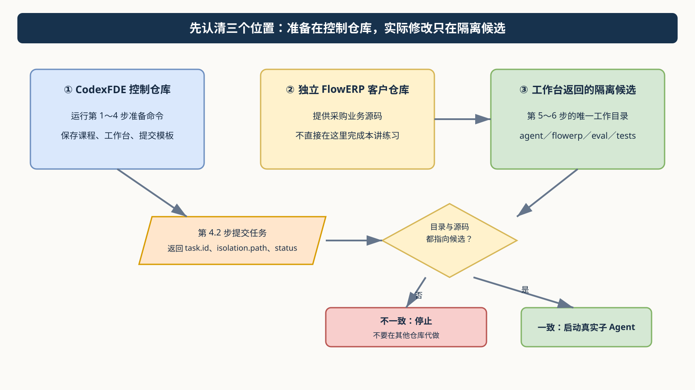

图 1｜先看位置，再执行命令。没有取得并核对本次候选 `path`，就不要启动真实子 Agent。可编辑源文件：[05-workspace-boundary.drawio](assets/diagrams/05-workspace-boundary.drawio)。

<a id="lesson-goals"></a>

## 本讲目标与完成判断

`course-submit --execute-code` 从固定起始标签创建 Git Worktree；`course-prepare --source working-tree` 的当前源快照才组合独立 FlowERP 并写 `.course/product-source.json`。以本次 Task ID、返回候选路径、基线和实际模块路径核对；标签没有来源元数据时将客户来源与哈希标为待核对，不把目录名或元数据缺失单独当作候选无效。

人先固定采购接口与两份子任务合同，主 Agent 组织测试补全和只读风险审查，收回原始结果后串行整合。

| 建设对象 | 本讲目标与因果关系 |
|---|---|
| 工作台 | 保存共同输入、读写集与共享资源判断，组织真实原生子任务，并追溯主结论的来源。 |
| FlowERP | 采购申请保留 SKU、数量、原因和稳定身份；合法申请成功，非法输入无残留，申请不改变库存。 |
| 学生证据 | 先保留个人判断；在真实失败、修订、复验与迁移中说明工作台改进怎样影响客户结果。 |

**交付前核对：**

- 两份合同明确输入、输出、验收、读写集与副作用；实际活动与共同输入版本可回查。
- 共享写集或读写依赖被拒绝，整合由主 Agent 串行完成；每条结论关联原始子报告。
- 最终候选覆盖字段、库存不变与拒绝后状态；没有公平单 Agent 对照时不宣称提效。

**课程四项合同：**

- **核心内容**：可并行任务识别、上下文隔离、结果汇总、冲突风险与额外 Token 成本。
- **演示结果**：测试补全与风险审查并行执行，由主 Agent 汇总结论。
- **课内增量**：为两个无文件写入冲突的任务定义清晰输入、输出和验收标准。
- **通过标准**：子任务边界清晰；主 Agent 能追溯每个结论；有写入冲突的任务不强行并行。


## 先看流程图，再开始操作

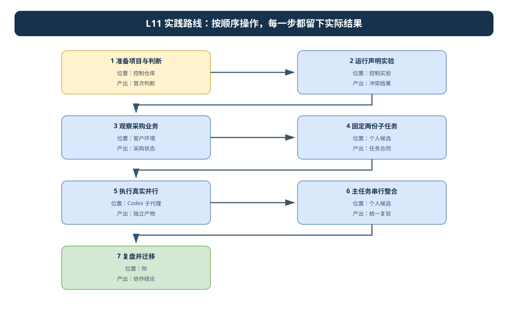

图 2｜两个子任务可以并行，主任务整合必须串行。所有角色都使用同一个候选绝对路径，并分别记录允许文件和实际改动。可编辑源文件：[l11-practice-flow.drawio](assets/l11-practice-flow.drawio)。

## 第 1 步：准备项目与首次判断

<!-- step-guide-1 -->
> **一句话说明：**先确认自己站在正确的项目目录，再写下“实验前我认为会发生什么”。这一步不改业务代码。

### 本步只做什么

| 输入 | 动作 | 产出 |
|---|---|---|
| 控制仓库、辅导资料、提交模板 | 确认环境，留下实验前判断，读取课程合同与 Spec | 一份没有被后续实验覆盖的“首次判断” |

**不要做：**不要启动子 Agent，不要修改采购业务代码，不要把参考仓库已有功能写成本人的实现。

开始本讲 FDE 实践时，先在[提交模板](SUBMISSION.md)的首次判断与需求记录回答：采购申请涉及哪些业务与研发职责，哪两项工作确实独立，为什么本次值得并行？注明来源是实际观察、同伴试用还是教学设置，写下本次选择和暂缓范围，再请 Codex 协助调查。

在项目根目录使用已有 `.venv`。PowerShell 运行 `.\.venv\Scripts\Activate.ps1`；macOS/Linux 运行 `source .venv/bin/activate`。项目尚未安装时，激活环境后运行 `python -m pip install -e .`。下面的路径都以项目根目录为起点。

激活后先运行下面的检查。终端应显示你的 CodexFDE 根目录，Python 应来自该项目的 `.venv`。保留这个终端，后面继续使用。

**Windows / macOS 通用：**

```text
python -X utf8 -c "import sys; from pathlib import Path; print('当前目录:', Path.cwd()); print('Python:', sys.executable)"
```

如果当前目录不对，Windows 用 `Set-Location -LiteralPath '你的 CodexFDE 绝对路径'`，macOS 用 `cd '你的 CodexFDE 绝对路径'`；引号内替换为自己的路径，保留引号以兼容空格和中文。切换后重新激活该目录的 `.venv` 并核对 Python。若激活失败或没有 `.venv`，按[环境准备](../../reference/实操手册执行与排错.md)处理后再继续。

先阅读[讲义](辅导资料.md)，在[提交模板](SUBMISSION.md)中写下三项判断：采购申请成功后库存是否变化；业务实现被修改时测试是否还能独立进行；两个局部测试都通过是否能直接接受整合版本。保留首次答案，实验后追加修订。

查看当前课程合同和建设范围：

```text
python -X utf8 -m workbench.cli course-contract --lesson 11
python -X utf8 -m workbench.cli course-spec --lesson 11
```

第一条显示课程合同；第二条生成文件并返回 `spec_path`，不会执行交付。返回后在编辑器打开该路径阅读，再继续第 2 节。它不是本人已确认的 Spec；默认输出会写到固定路径，已有个人修改时先保留版本，再用 `--output` 指定新路径生成。

预期看到采购申请、读写冲突与串行集成目标。采购服务的业务维护来源是独立 FlowERP，调度能力属于工作台。后续默认 `course-prepare` 候选从起始标签创建，业务代码对应标签中的实际版本；当前工作树源快照才组合当前客户源码。按本次候选基线、模块路径与可取得的来源记录区分 `flowerp/`、`agent/`、`eval/` 和 `tests/`；路径均相对于返回候选。本次任务再收敛到实际需要的文件，保留个人起点、目标失败和改动。

## 2 先学会判断：两项工作会不会互相干扰

<!-- step-guide-2 -->
> **一句话说明：**运行十个很小的例子，看看哪些任务可以同时做，哪些必须一个做完再做另一个。本步只是学习判断，不会真的启动子 Agent。

### 本步只做什么

运行十种“任务声明”小实验，学习判断能否并行。这里检查的是你申报的读写范围，**不会启动子 Agent，也不会自动锁文件**。

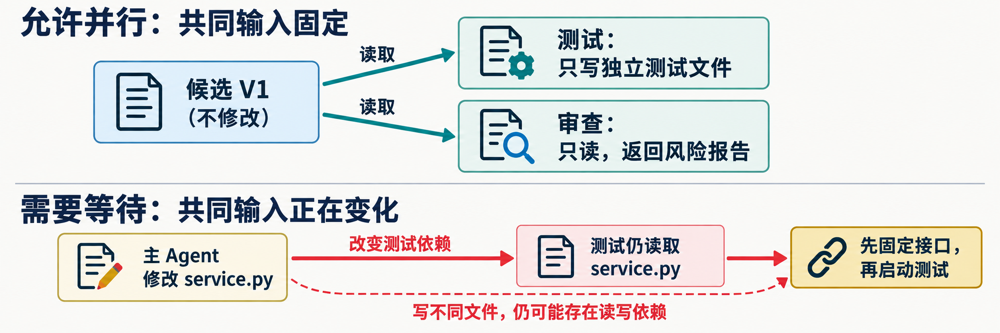

先只看这张图：上半部分可以同时做，因为两个任务只读取同一个不再变化的版本；下半部分必须等待，因为主 Agent 正在修改测试要读取的文件。**写不同的输出文件，不代表一定没有输入依赖。**

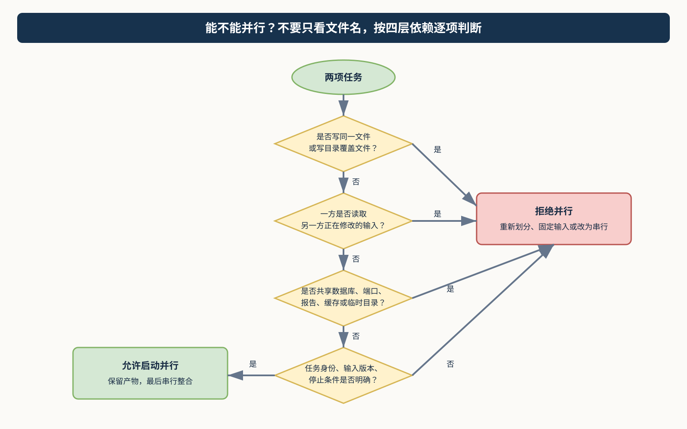

图 3｜从上到下逐项判断：文件写入、共同输入、共享运行资源、任务合同。任意一项不满足，就先拒绝并行。可编辑源文件：[06-parallel-decision.drawio](assets/diagrams/06-parallel-decision.drawio)。

### 十种模式先看这张速查表

| 模式 | 看到什么算正常 | 一句话理解 |
|---|---|---|
| independent | `allowed`，退出 0 | 固定共同输入，输出互不覆盖 |
| same-write | `rejected`，退出 0 | 两项任务写同一文件 |
| read-write | `rejected`，退出 0 | 一方读取另一方正在修改的输入 |
| directory | `rejected`，退出 0 | 写目录会覆盖目录内被读取文件 |
| path-alias | `rejected`，退出 0 | 路径写法不同也不能隐藏同一目标 |
| shared-report | `rejected`，退出 0 | 业务文件不同，但报告输出相同 |
| undeclared-read | `allowed`，退出 0，但不安全 | 漏报真实读取造成假安全 |
| read-only | `allowed`，退出 0 | 两边只读同一固定文件 |
| invalid-path | `rejected`，退出 0 | 路径越出明确项目范围 |
| duplicate-name | `rejected`，退出 0 | 子任务身份无法区分 |

> **如何读结果：**`observed` 回答“允许还是拒绝”；退出码 0 回答“实验是否按预期完成”。所以 `rejected + 退出 0` 是正确识别冲突，不是程序失败。

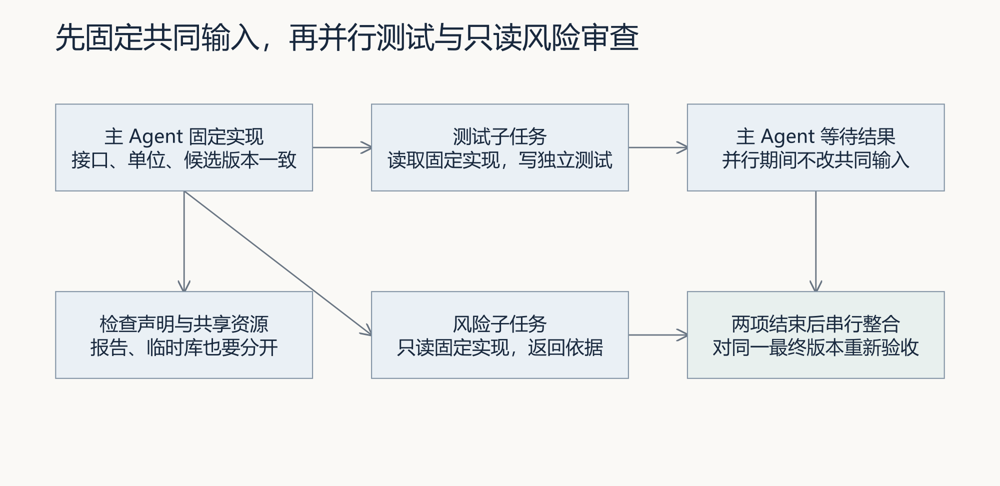

图 4｜对照图预测：测试与只读审查可以共享哪份输入，主 Agent 哪些修改必须等两者结束。

这里的“声明”就是告诉检查器：每项工作会看哪些文件、会改哪些文件。先做下面一例：测试只改自己的测试文件，审查者只读业务代码。你先猜它是否允许并行，再执行：

```text
python -X utf8 docs/courses/L11/examples/schedule_lab.py independent
```

在输出里找到 `observed`。本例应为 `allowed`，表示检查器根据所填清单允许这种安排。然后再运行两条，比较区别：

**Windows（PowerShell）：**

```powershell
python -X utf8 docs/courses/L11/examples/schedule_lab.py read-write
$LASTEXITCODE
python -X utf8 docs/courses/L11/examples/schedule_lab.py undeclared-read
$LASTEXITCODE
```

**macOS（zsh）：**

```zsh
python -X utf8 docs/courses/L11/examples/schedule_lab.py read-write
printf '退出码：%s\n' "$?"
python -X utf8 docs/courses/L11/examples/schedule_lab.py undeclared-read
printf '退出码：%s\n' "$?"
```

`read-write` 应显示 `rejected`：一方要修改另一方正在读的代码。`undeclared-read` 却显示 `allowed`：因为清单漏填了读取关系，检查器不知道有冲突。这次“允许”不能作为真正执行的依据。

两条退出码都应为 0，意思是**实验观察符合预期**。判断能否并行要看 `observed`，不能只看退出码。程序只检查清单，不启动子代理，也不会替你锁住文件。接着把命令末尾的模式名换成下表其余七项，逐项记录到提交模板第 2 节。

| 模式 | 预期观察 | 你要解释的原因 |
|---|---|---|
| independent | 允许 | 测试独立写入，风险只读同一固定实现 |
| same-write | 拒绝 | 共享写文件 |
| read-write | 拒绝 | 测试读取正在修改的实现 |
| directory | 拒绝 | 写目录覆盖被读取文件 |
| path-alias | 拒绝 | 大小写、斜杠和点前缀不能隐藏重叠 |
| shared-report | 拒绝 | 业务文件不同，报告文件相同 |
| undeclared-read | 允许 | 声明漏报了真实读取，不能据此执行 |
| read-only | 允许 | 共同读取固定文件 |
| invalid-path | 拒绝 | 父目录跳转不是明确项目范围 |
| duplicate-name | 拒绝 | 子任务身份重复 |

到这里，你应能解释：忘记填写读取关系不会消除真实依赖。自己的两项任务将在第 4 步填入清单并检查；现在先保存十种实验的预测、输出与解释。

## 3 运行真实采购业务实验

<!-- step-guide-3 -->
> **一句话说明：**亲自验证采购申请的业务规则：申请可以保存，但商品还没到货，所以库存不能增加。

### 本步只做什么

| 先验证 | 再验证 | 故意制造的失败 |
|---|---|---|
| 正常申请被保存，但库存不增加 | 五种非法申请被拒绝，失败前后五表不变 | `premature-stock` 提前加库存，应退出 1 |

**不要误判：**前六项退出 0 是检查通过；最后一项退出 1 是检查成功发现故意注入的问题。它不证明个人候选真的存在该缺陷。

**运行前确认：** 采购观察自动使用独立 FlowERP 的解释器；整合实验从两个仓库创建隔离副本，并记录 `.course/experiment-source.json`。先完成[客户环境检查](../../reference/实操手册执行与排错.md#product-environment)，再按下面命令运行。整合实验使用副本内的业务检查；观察首次整合失败、修订后通过及工程范围违规，重复运行使用新目录。

在当前终端输入客户仓库的实际路径，再检查环境：

**Windows（PowerShell）：**

```powershell
$env:FLOWERP_PROJECT_ROOT = (Read-Host '独立 FlowERP 仓库绝对路径').Trim().Trim('"')
python -X utf8 -m workbench.cli environment-check --product
$LASTEXITCODE
```

**macOS（zsh）：**

```zsh
printf '独立 FlowERP 仓库绝对路径（不加引号）：\n'
read -r FLOWERP_PROJECT_ROOT
export FLOWERP_PROJECT_ROOT
python -X utf8 -m workbench.cli environment-check --product
printf '退出码：%s\n' "$?"
```

看到 `ok: true` 且退出码为 0 后继续。接下来先在纸上写下预期：在库 10 件，已被订单预占 2 件，可用 8 件；申请再买 7 件之后，仍然是 10、2、8，因为货尚未收到。

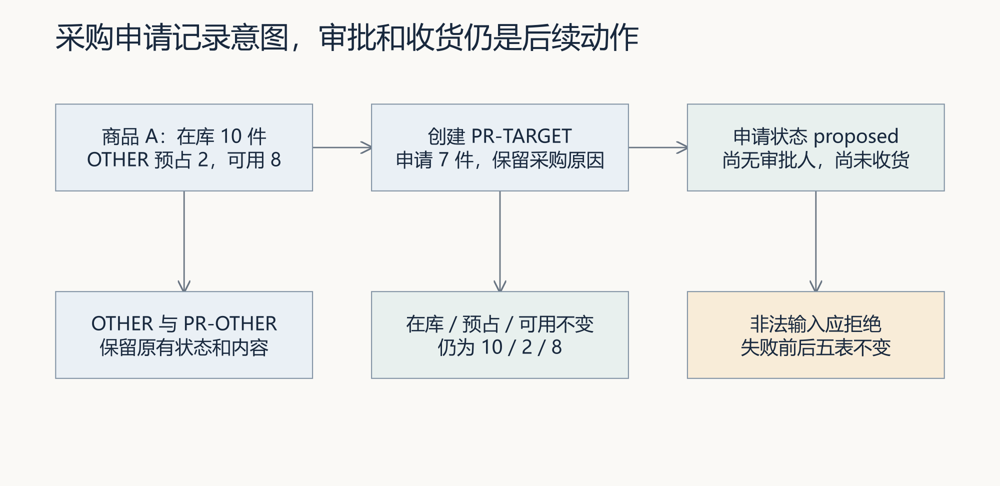

图 5｜先手算图中的库存不变条件，再对照实验报告。成功申请和收到货是两个不同的业务事实。

下面每条使用新报告路径；再次实验换目录，不覆盖旧报告。实验自动创建并清理临时数据库，不改个人产品候选。

**Windows（PowerShell）：**

```powershell
python -X utf8 docs/courses/L11/examples/purchase_request_lab.py normal --report-path .runtime/l11-purchase-01/normal.json
$LASTEXITCODE
python -X utf8 docs/courses/L11/examples/purchase_request_lab.py zero --report-path .runtime/l11-purchase-01/zero.json
$LASTEXITCODE
python -X utf8 docs/courses/L11/examples/purchase_request_lab.py negative --report-path .runtime/l11-purchase-01/negative.json
$LASTEXITCODE
python -X utf8 docs/courses/L11/examples/purchase_request_lab.py blank-reason --report-path .runtime/l11-purchase-01/blank-reason.json
$LASTEXITCODE
python -X utf8 docs/courses/L11/examples/purchase_request_lab.py unknown-sku --report-path .runtime/l11-purchase-01/unknown-sku.json
$LASTEXITCODE
python -X utf8 docs/courses/L11/examples/purchase_request_lab.py duplicate-id --report-path .runtime/l11-purchase-01/duplicate-id.json
$LASTEXITCODE
python -X utf8 docs/courses/L11/examples/purchase_request_lab.py premature-stock --report-path .runtime/l11-purchase-01/premature-stock.json
$LASTEXITCODE
```

**macOS（zsh）：**

```zsh
python -X utf8 docs/courses/L11/examples/purchase_request_lab.py normal --report-path .runtime/l11-purchase-01/normal.json
printf '退出码：%s\n' "$?"
python -X utf8 docs/courses/L11/examples/purchase_request_lab.py zero --report-path .runtime/l11-purchase-01/zero.json
printf '退出码：%s\n' "$?"
python -X utf8 docs/courses/L11/examples/purchase_request_lab.py negative --report-path .runtime/l11-purchase-01/negative.json
printf '退出码：%s\n' "$?"
python -X utf8 docs/courses/L11/examples/purchase_request_lab.py blank-reason --report-path .runtime/l11-purchase-01/blank-reason.json
printf '退出码：%s\n' "$?"
python -X utf8 docs/courses/L11/examples/purchase_request_lab.py unknown-sku --report-path .runtime/l11-purchase-01/unknown-sku.json
printf '退出码：%s\n' "$?"
python -X utf8 docs/courses/L11/examples/purchase_request_lab.py duplicate-id --report-path .runtime/l11-purchase-01/duplicate-id.json
printf '退出码：%s\n' "$?"
python -X utf8 docs/courses/L11/examples/purchase_request_lab.py premature-stock --report-path .runtime/l11-purchase-01/premature-stock.json
printf '退出码：%s\n' "$?"
```

每条之后立即记录退出码，PowerShell 用 `$LASTEXITCODE`，macOS/Linux 用 `$?`。前六条预期 0，premature-stock 预期 1。报告中的临时用例名是 `l11_teaching_purchase`，只在此实验进程注册，不是默认套件的永久新增项。

其中 `zero` 等五项是在检查“错误申请有没有被正确拒绝”，所以拒绝成功时测试通过、退出 0。最后的 `premature-stock` 故意制造提前入库，退出 1 才说明检查发现了问题；保留这份失败报告即可，不要为了把它变绿修改实验脚本。若最后一项退出 0，先核对是否选对模式，再检查报告实际运行了什么。

报告就在控制仓库的 `.runtime/l11-purchase-01/`。用编辑器打开对应 JSON，结合终端结果，将实际观察与退出码填入提交模板第 2 节；记录文字无法代替原报告。

normal 新增一张 proposed 申请，原因去掉首尾空白，编号可再次查询；库存仍为 10／2／8，OTHER 与 PR-OTHER 不变。五项失败检查比较采购申请、库存、库存流水、订单、订单明细五表；duplicate-id 的当前异常是 `sqlite3.IntegrityError`，不能把它描述为“幂等返回原成功结果”。

premature-stock 人为在申请后增加库存，证明独立业务预期能发现申请字段以外的错误。它没有证明个人候选存在这个缺陷，也没有调用 Codex 修复。自己的新增测试应加载实际候选的服务，并纳入统一验收。

## 4 固定候选与两份子任务合同

<!-- step-guide-4 -->
> **一句话说明：**创建一份只属于本次练习的隔离副本，并把“补测试”和“查风险”分别写成两张清楚的任务卡。

### 本步只做什么

```text
先观察“局部绿、完整红、修复后同版绿”
        ↓
登记本人事项，准备隔离候选并取得 path
        ↓
固定两份子任务合同：甲补测试，乙只读查风险
        ↓
主 Agent 核对读写集和共享资源；通过后才进入真实并行
```

本步结束前必须能回答四个问题：候选在哪里？共同输入是哪一版？甲能写哪里？乙读哪些固定材料？其中任何一项不清楚，都不要进入第 5 步。

### 4.1 先观察一次“测试通过，业务仍有错误”

仍在控制仓库运行下面命令。它使用课程实验副本，还不是稍后要交给两个子代理的个人候选：

```text
python -X utf8 docs/courses/L11/examples/integration_lab.py --run-dir .runtime/l11-integration-01
```

命令复制服务，教师脚本注入提前入库，再顺序运行三次检查并恢复；不启动原生子代理。每次重跑更换目录，不覆盖旧过程。包装程序预期退出 0，但内部三次检查的退出码依次为 0、1、0：原检查通过、补充业务检查失败、修复后的整合检查通过。

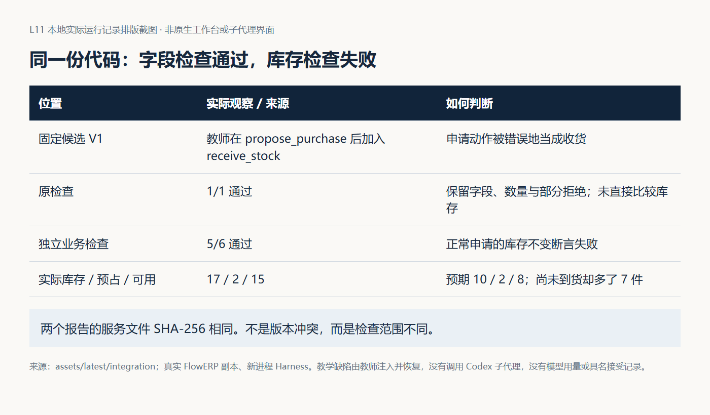

图 6｜先找两次 V1 的 `process.json`，比较服务指纹；再读检查内容。两份报告可以同时成立，不能把风险发现直接解释为“测试子代理出错”。

在 `02-complete-v1/states/normal.json` 对照库存与流水的 before／after。手写预期 10／2／8 与实际 17／2／15 的差异，指出哪一条新增动作使尚未到货商品进入库存。然后读 `restored.diff` 和 `03-integrated-v2/report.json`，确认实际修复以及七项检查通过。五种拒绝后的五表快照也要核对。

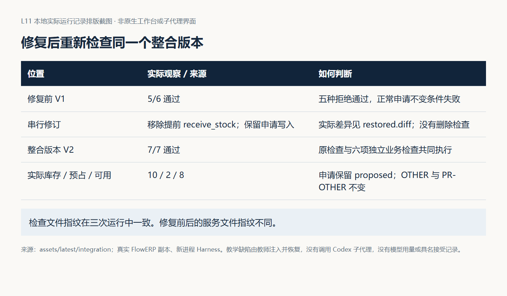

图 7｜服务版本变了，检查内容未变。先保存原始失败，再给修复后的 V2 新结论；不要把顺序复验截图写成真实子代理并行。

完成这个实验后，再进行以下本人建设与实际委派。实验给出“怎样回查”的支架，不替代子代理补测试与独立审查的产物。

### 4.2 通过工作台创建本人的交付任务

先在工作台首页“事项与决策”登记或打开本人的采购申请交付需求，记录首页事项编号和运行目录。打开第 1 步生成的 `.runtime/course/L11/FDE_SPEC.md`，保存个人采购申请、范围与并行协作决定。下面只准备隔离候选，不调用执行器；L11 的课程提交不支持 `--requirement-spec`，第 5 步把这份个人 Spec 全文与版本明确交给候选内的 Codex。

**Windows（PowerShell）：**

```powershell
$l11Item = Read-Host '首页实际事项编号'
$l11PrepId = 'TASK-PREP-L11-' + [guid]::NewGuid().ToString('N')
$l11Runtime = [IO.Path]::GetFullPath((Read-Host '工作台原运行目录'))
.\.venv\Scripts\python.exe -X utf8 -m workbench.cli course-prepare --lesson 11 --task-id $l11PrepId --runtime-dir $l11Runtime
$LASTEXITCODE
```

**macOS（zsh）：**

```zsh
printf '首页实际事项编号：\n'
read -r l11Item
l11PrepId="TASK-PREP-L11-$(./.venv/bin/python -c 'import uuid; print(uuid.uuid4().hex)')"
printf '工作台原运行目录（不加引号）：\n'
read -r l11Runtime
l11Runtime="$(./.venv/bin/python -c 'from pathlib import Path; import sys; print(Path(sys.argv[1]).resolve())' "$l11Runtime")"
./.venv/bin/python -X utf8 -m workbench.cli course-prepare --lesson 11 --task-id "$l11PrepId" --runtime-dir "$l11Runtime"
printf '准备退出码：%s\n' "$?"
```

保存退出码、返回的 `path`、基线与首页事项编号。退出 0 且候选存在才继续；失败先按原路径排查并保留输出。准备命令不创建任务、不执行编码或人审，返回路径与原事项记录关联。

真实子代理协作需要可用执行器与认证、下述显式委派和实际活动记录。

将首页事项编号、候选 `path`、基线与当前事项状态记入提交模板顶部。只有取得真实路径，才能安排后续工作；准备完成仍需后续实现、检查与审核。

### 4.3 为两个子代理写清楚分工

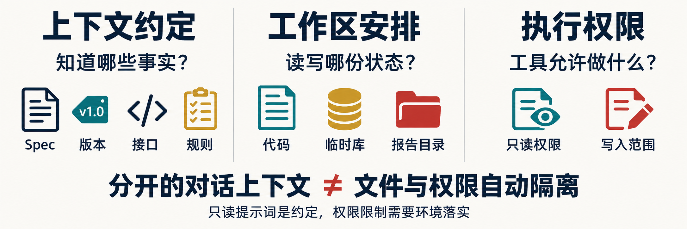

先看图中的三栏：两边要知道同一份 Spec、版本、接口和规则；运行数据与报告目录要分开；“只读”必须由实际文件权限和写入范围落实，不能只写在提示词里。

在第 5 步进入候选并启动 Codex 后，先发送[设计提示词](实践操作手册.md#prompt-design)的正文，并附上任务编号、候选绝对路径及确认后的 Spec。先让主 Agent 核对最小实现、给出以下两份任务说明，确认后再启动子代理。这里“固定输入”表示并行期间暂不修改双方要读取的代码，并保存当前版本和差异，方便核对。

<a id="prompt-design"></a>

### 本步给 Codex 的完整提示词：确定接口与读写集

先填入本次真实路径、任务、对象和允许范围，沿用已确认的授权；输出完成后按本步预期复核。

```text
请基于当前项目与我的 L11 采购申请 Spec，帮助我确认业务和任务边界。先读取项目规则、当前实际服务、默认 Eval 和我的目标，区分已有支架与本次要实现的增量。

采购申请必须保存 SKU、数量、原因和稳定身份；创建申请不增加库存；非法输入拒绝后状态不变。请明确重复编号的当前语义，不把稳定身份自动解释成幂等成功。

先完成并固定最小实现与接口，再拟定测试补全和只读风险审查两份合同。每份说明输入版本、目标、读集、写集、运行副作用、输出、验收和停止条件。检查目录覆盖、读写依赖、默认报告路径以及接口或单位依赖。用实际 agent.schedule 检查声明，解释它不能验证的内容。

本阶段先返回可审查的合同与依赖判断。发现关键业务语义未定时列出具体待决问题，不凭猜测替我改变目标。
```


| 要交代的内容 | 子代理甲：补测试 | 子代理乙：查风险 |
|---|---|---|
| 共同目标 | 保存采购申请，库存不变；非法输入拒绝后数据不变 | 同左 |
| 看哪些材料 | 固定业务代码、Spec、接口、既有测试约定 | 同一份业务代码、Spec、接口、指定调用方 |
| 可以修改哪里 | 确认后的独立测试文件，如 `tests/test_l11_purchase.py` | 不修改项目文件 |
| 交回什么 | 新增测试、修改差异、运行命令与结果 | 问题位置、触发条件、理由、待验证项 |
| 运行数据放哪里 | 独立临时数据库与报告目录 | 如需运行检查，也须独立临时目录 |
| 何时停下 | 需要改接口、超出范围或发现共享写入 | 同左；回报问题，由主 Agent 后续处理 |

把确认后的说明填入提交模板第 3 节。让主 Agent 按实际文件填写 `Subtask`，调用 `assert_parallel_safe` 检查，并返回原始输出；额外检查数据库、端口、报告和缓存是否共享。若检查拒绝，先调整范围或先后顺序，再检查。测试文件如果已存在且会被另一任务读取，须先调整安排。

填写两份合同：测试补全只写一个尚未被其他任务使用的测试文件；风险审查保持只读。它们读取相同固定实现。主 Agent 在并行期间负责观察任务状态、记录问题，不修改这两个任务正在读取的业务文件，也不读取一份尚在改写的测试文件并据此提前下结论。

合同写清目标、输入版本、接口、读写范围、运行副作用、输出、验收和停止条件。若风险审查要覆盖测试文件，必须等测试完成后再审，或仅审固定的既有测试，不能笼统声明“全部 tests/”后忽略读取冲突。

## 5 在 Codex 中执行真实并行

<!-- step-guide-5 -->
> **一句话说明：**现在才真正启动两个子 Agent：甲补测试，乙只读查风险；主 Agent 在旁边等待，不修改共同业务代码。

### 本步只做什么

```text
主 Agent：固定输入与任务合同，不改共同业务代码
          ├─ 子代理甲：只写指定测试文件 → 测试、命令、结果
          └─ 子代理乙：只读固定实现     → 风险、位置、依据
两者都完成 ─────────────────────────→ 主 Agent 收回原始产物
```

### 启动前四项检查

- 当前目录等于准备命令返回的真实 `path`；
- `workbench`、`eval`、`flowerp` 都从该候选导入；
- 甲、乙引用同一输入版本，数据库与报告目录互相隔离；
- 主 Agent 承诺等待，不在并行期间修改共同业务实现。

只要有一项不成立，就停下修正，不要用“已经出现两个角色名”代替真实活动证据。

现在才切换目录。以下命令在控制仓库终端中按系统选择：提示时粘贴第 4 步准备命令返回的 `path`，先保存控制虚拟环境的 Python 路径，供后面复验使用。

**Windows（PowerShell）：**

```powershell
$l11Control = (Get-Location).Path
$l11Python = (Resolve-Path '.venv/Scripts/python.exe').Path
$l11Candidate = (Read-Host '粘贴 course-prepare 返回的 path').Trim().Trim('"')
Set-Location -LiteralPath $l11Candidate -ErrorAction Stop
Get-Location
& $l11Python -X utf8 -c "from pathlib import Path; import workbench,eval,flowerp; root=Path.cwd().resolve(); files=[workbench.__file__,eval.__file__,flowerp.__file__]; print(*files,sep='\n'); assert all(Path(p).resolve().is_relative_to(root) for p in files)"
$LASTEXITCODE
```

**macOS（zsh）：**

```zsh
enter_l11_candidate() {
  l11Control="$PWD"
  l11Python="$PWD/.venv/bin/python"
  [ -x "$l11Python" ] || return 1
  printf '粘贴 course-prepare 返回的 path（不加引号）：\n'
  read -r l11Candidate || return 1
  cd "$l11Candidate" || return 1
  pwd
  "$l11Python" -X utf8 -c "from pathlib import Path; import workbench,eval,flowerp; root=Path.cwd().resolve(); files=[workbench.__file__,eval.__file__,flowerp.__file__]; print(*files,sep='\n'); assert all(Path(p).resolve().is_relative_to(root) for p in files)"
}
enter_l11_candidate
```

当前目录必须等于返回的候选路径，退出码为 0，三个源码位置也应在该候选中。导入失败或指向参考仓库时，按[解释器与源码核对](../../reference/实操手册执行与排错.md)修正后再继续。候选里没有 `.venv` 时，使用刚才保存的控制环境解释器。重开终端先回原控制仓库恢复环境并重做本段，再进入原候选。


在这里启动已安装的 Codex CLI：

```text
codex
```

进入 Codex 对话后，先提供个人 Spec 全文、绝对路径和版本，完成第 4.3 节的两份任务合同；此时只调查、设计与确认，不启动并行。保存确认稿后退出对话，回原候选终端运行下面的任务冻结段，再在同一候选恢复 Codex 对话，将正式 Task ID、冻结 Spec 与两份合同附在实施提示词后。

### 冻结个人 Spec 为正式交付任务

将上面的实现约束落实到已确认的六段式 Spec，保存最终文件。允许清单只能填写课程合同内、本次确需修改的候选相对文件；测试补全可写本次确认的独立测试文件，风险审查保持只读；业务整合文件只能由主 Agent 串行使用。以下命令回到保存的控制侧目录创建任务，候选路径保持原值。

**Windows（PowerShell）：**

```powershell
$l11Spec = (Read-Host '确认版六段式 Spec 的绝对路径').Trim().Trim('"')
$l11Actor = Read-Host '实际构建者姓名'
$l11Scopes = @((Read-Host '已确认的候选相对文件，多项用英文逗号分隔') -split ',' | ForEach-Object { $_.Trim() } | Where-Object { $_ })
Push-Location -LiteralPath $l11Control
try {
  $l11TaskArgs = @('-X','utf8','-m','workbench.cli','task-create','--runtime-dir',$l11Runtime,'--request','按本人确认Spec组织原生子代理协作','--requirement-id',$l11Item,'--spec-path',$l11Spec,'--actor',$l11Actor,'--workspace',$l11Candidate,'--execute-code','--execution-timeout','900')
  foreach ($file in $l11Scopes) { $l11TaskArgs += @('--write-scope',$file) }
  $l11TaskText = & $l11Python @l11TaskArgs
  if ($LASTEXITCODE -ne 0) { throw '任务创建失败，请查原错误' }
  $l11TaskId = (($l11TaskText -join "`n") | ConvertFrom-Json).id
  & $l11Python -X utf8 -m workbench.cli task-show $l11TaskId --runtime-dir $l11Runtime
} finally { Pop-Location }
```

**macOS（zsh）：**

```zsh
create_l11_task() {
  printf '确认版六段式 Spec 的绝对路径（不加引号）：\n'
  read -r l11Spec || return 1
  printf '实际构建者姓名：\n'
  read -r l11Actor || return 1
  printf '已确认的候选相对文件，多项用英文逗号分隔：\n'
  read -r l11ScopesText || return 1
  l11TaskArgs=(-X utf8 -m workbench.cli task-create --runtime-dir "$l11Runtime" --request '按本人确认Spec组织原生子代理协作' --requirement-id "$l11Item" --spec-path "$l11Spec" --actor "$l11Actor" --workspace "$l11Candidate" --execute-code --execution-timeout 900)
  for file in "${(@s:,:)l11ScopesText}"; do l11TaskArgs+=(--write-scope "$file"); done
  l11TaskText=$(cd "$l11Control" && "$l11Python" "${l11TaskArgs[@]}") || return 1
  l11TaskId=$(printf '%s' "$l11TaskText" | "$l11Python" -c 'import json,sys; print(json.load(sys.stdin)["id"])') || return 1
  (cd "$l11Control" && "$l11Python" -X utf8 -m workbench.cli task-show "$l11TaskId" --runtime-dir "$l11Runtime")
}
create_l11_task
```

核对返回的 `spec_sha256`、`workspace_path` 与逐文件写集，保存真正的 `$l11TaskId`。首页事项编号、隔离准备编号与正式 Task ID 分别记录，不能互相替代。

本讲随后在候选内组织原生子代理交互，没有执行 `task-run`。此正式任务此时仍是 `queued`，用于冻结个人 Spec、范围和候选关联；对话、并行活动、复验与具名决定须另有真实材料。不得把 `queued` 改写为已经执行、评测或审核，也不得把交互记录冒充自动任务结果。


<a id="prompt-implement"></a>

### 本步给 Codex 的完整提示词：并行测试与风险审查

先填入本次真实路径、任务、对象和允许范围，沿用已确认的授权；输出完成后按本步预期复核。

```text
请使用两个 Codex 原生 Subagents，执行已确认的两份独立任务合同。共同输入为我指定的固定候选、Spec 和接口约定；实际路径、写集和验收标准以合同为准。

任务 A 补全采购申请正常与失败测试，只修改指定独立测试文件，使用独立临时库和报告目录，不改业务实现。测试应验证申请字段与库存不变，并能够发现提前增加库存的错误。

任务 B 只读审查固定业务实现、数据结构和指定调用方，检查申请、审批、库存与失败状态的边界。逐项给出文件位置、触发条件、影响、证据和未验证项，不读取任务 A 正在改写的文件，不直接修复。

等待两者完成。在并行期间主 Agent 不修改两者正在读取的共享实现。保存实际子任务身份、活动、原始输出、命令与产物。接口变化、范围不足或冲突时停止受影响部分并回报，保留已有工作；没有实际子代理能力时如实说明，不能用两段普通摘要替代。

两份结果返回后先核对版本和依据，再提出串行整合步骤，按既定授权范围继续执行。
```


在 Codex 对话中输入 `/agent` 查看子任务，不是在终端中输入。此入口依据 [OpenAI 官方说明](https://learn.chatgpt.com/docs/agent-configuration/subagents)于 2026-09-19 核对；实际可用性以本机客户端为准。记录本机版本和实际入口。

保存子任务身份、开始结束时间、原始响应、命令和产物。界面出现两个角色名不足以证明原生并行，应能回查实际子任务活动及时间重叠。若客户端不支持、没有可用认证或无法取得活动记录，如实标明具体缺项，先保留已完成的本地实验。

把这些材料的实际位置填入提交模板第 4 节。离开本步前，应能分别打开甲的测试与运行结果、乙的原始风险说明，并看出两项工作的活动时间有重叠。主 Agent 口头说“已并行”还需对应这些记录。

发现接口变化、范围不足或共享状态冲突时，停止冲突部分，保留已产生文件和输出，重新划分。不要让两个任务同时修改同一文件来“演示冲突”。异常结束也不能被主摘要写成完成；应说明部分产物是否可接受，哪些仍需补做。

## 6 主 Agent 串行整合与复验

<!-- step-guide-6 -->
> **一句话说明：**两个子 Agent 完成后停止并行，由主 Agent 一个接一个地核对、修复和重新测试。

### 本步只做什么

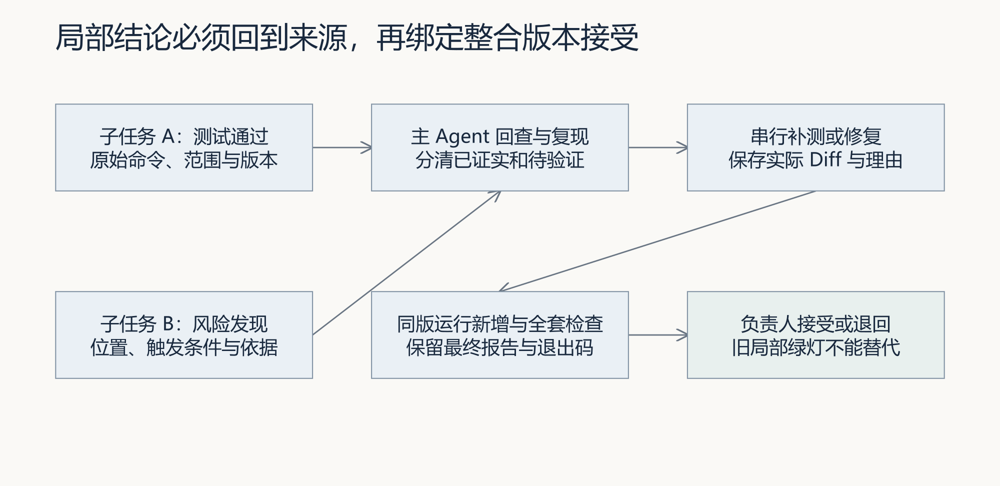

图 8｜两个局部结论先回到来源，再由主 Agent 串行补测或修复；最终接受只看同一整合版本的新增测试和全套检查。

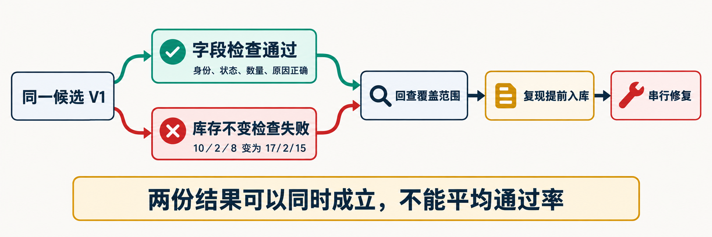

先不要争论“谁对谁错”。图中两个结果检查的范围不同，所以可以同时成立：字段检查通过，不代表库存不变也通过。主 Agent 要先复现两份结果，再决定补测试还是修业务。

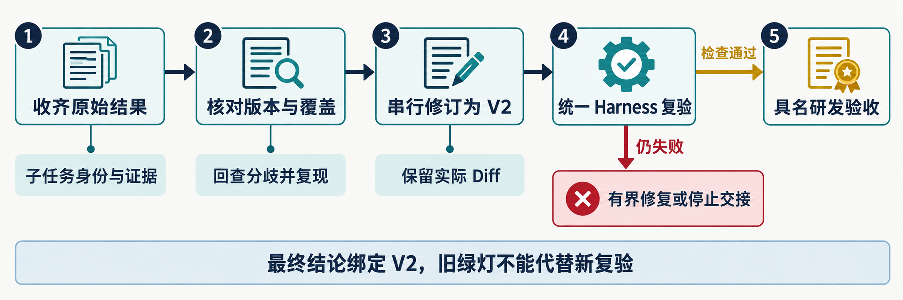

最终只认图中的完整链条：收齐原始结果 → 核对版本和覆盖范围 → 串行修订 → 统一复验 → 具名负责人决定接受或退回。

```text
子任务原始结果
    ↓ 回查命令、范围、输入版本
分成：已证实 / 待验证 / 需求未定
    ↓ 主 Agent 串行补测或修复
同一整合版本运行新增测试 + 指定 Eval + 全套阻断 Eval
    ↓
实际负责人：接受或退回
```

使用[汇总提示词](实践操作手册.md#prompt-review)，先核对两份结果属于哪个版本，再逐条回查发现。测试缺失、实现缺陷和需求未定要分别处理；需要修改接口时，由主 Agent 串行修改并更新受影响测试。

<a id="prompt-review"></a>

### 本步给 Codex 的完整提示词：追溯结论与同版复验

先填入本次真实路径、任务、对象和允许范围，沿用已确认的授权；输出完成后按本步预期复核。

```text
请核对两份原生子任务结果与整合候选。每条主结论关联子任务身份、原始响应、文件或报告依据，区分已复现缺陷、待验证风险和需求未定。测试全绿只说明实际执行范围，不能用它否定未覆盖的风险。

若输入版本相同而结论不同，比较实际检查内容。例如字段检查通过、库存不变检查失败，可以同时成立；应回查申请前后库存与流水，不能因为版本一致就删除风险。若材料只有顺序复验命令，保留业务观察并标明原生协作证据缺失，不把它包装为并行完成。

检查所有 Diff 和声明范围，解释接口变化影响了哪些原结论。由主 Agent 串行修订并整合；保存双方产物，不静默覆盖。然后在同一最终候选运行个人新增测试、purchase_request_preserves_reason、write_sets_reject_conflict 和全套阻断 Harness，记录命令、退出码与新报告。

汇总申请字段、库存与订单不变、非法输入失败后状态，以及协作中的冲突和分歧处理。将未完成或无法取得的证据明确列出。若没有公平的单 Agent 对照，不声称已经证明并行提效；实际用量缺失则保留缺失。最后给出供实际负责人判断的接受或返工依据。
```


在整合候选中运行个人新增测试。例如实际文件为 `tests/test_l11_purchase.py` 时：

在另一个终端中先重新激活第 1 步的控制仓库环境，再进入第 4 步返回的候选路径；或退出 Codex，回到刚才的终端。重新核对当前目录与源码位置，然后逐条执行：

**Windows（PowerShell）：**

```powershell
python -X utf8 -m unittest tests.test_l11_purchase -v
$LASTEXITCODE
python -X utf8 -m eval.harness --suite blocking --case purchase_request_preserves_reason --case write_sets_reject_conflict --report-path .runtime/l11-review-01/selected.json
$LASTEXITCODE
python -X utf8 -m eval.harness --suite blocking --report-path .runtime/l11-review-01/blocking.json
$LASTEXITCODE
```

**macOS（zsh）：**

```zsh
python -X utf8 -m unittest tests.test_l11_purchase -v
printf '退出码：%s\n' "$?"
python -X utf8 -m eval.harness --suite blocking --case purchase_request_preserves_reason --case write_sets_reject_conflict --report-path .runtime/l11-review-01/selected.json
printf '退出码：%s\n' "$?"
python -X utf8 -m eval.harness --suite blocking --report-path .runtime/l11-review-01/blocking.json
printf '退出码：%s\n' "$?"
```

第一条要求你已实际创建对应测试模块。运行前，Windows 用 `Test-Path -LiteralPath tests/test_l11_purchase.py`，macOS 用 `test -f tests/test_l11_purchase.py && printf '测试文件存在\n'` 核对；文件不存在就先停止。若文件名不同，使用真实模块名。确认整合候选中包含测试补全者的文件和版本，再运行，不能在另一目录用旧测试代验。默认采购 Eval 和冲突 Eval 是课程入口；新增库存、流水、失败状态检查也必须实际执行，不能只检查默认绿灯。保存整合版本、命令、报告和退出码。运行全套阻断检查后，由实际负责人作接受或返工决定。

同伴复验请挑一条“测试通过”和一条“风险发现”，从主摘要回查子任务、文件和原始报告。再换一组库存与数量，先推导预期后复验。不能回查或结论超过覆盖范围时，补证据或缩小结论，而不是删除失败记录。

这三条都应退出 0，且第一条确实运行了新增测试。看到 `Ran 0 tests`、模块不存在或报告没有目标检查时，先修正测试入口。若有真实失败，把命令、退出码和失败报告交回同一主 Agent，限定范围修复后重新执行；复验使用新报告目录，如 `.runtime/l11-review-02/`。保留旧报告，把整合版本、最新结果和实际负责人的决定填入提交模板第 5 节。

## 7 复盘、挑战与 Skill 迁移

<!-- step-guide-7 -->
> **一句话说明：**最后用自己的实际记录回答：这次并行有没有帮助，下次哪些任务仍适合并行，哪些应该改成串行。

### 本步只做什么

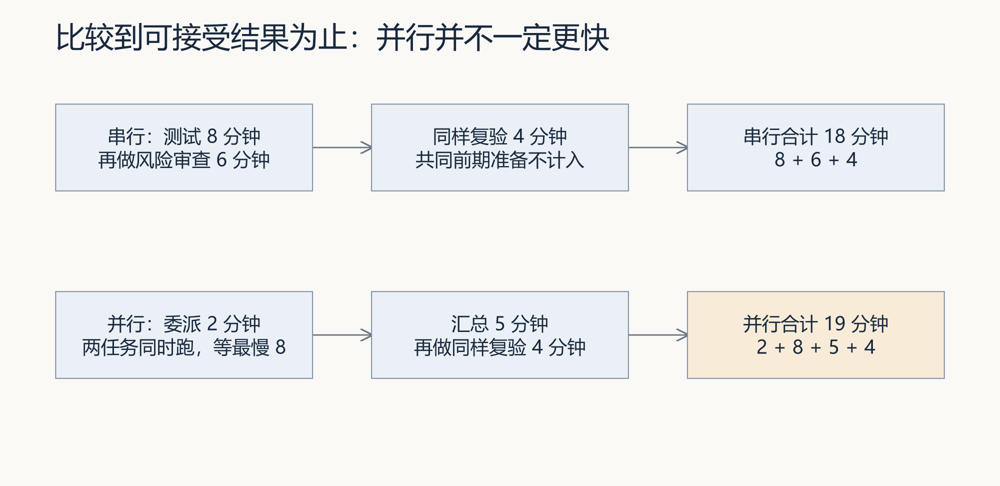

图 9｜比较必须算到可接受结果为止。委派、等待、汇总、返工和复验都属于并行成本；图中的分钟数只是教学算例，不是本次实测。

基础任务只要求保存真实协作证据并说明下次如何划分。单 Agent 耗时对照和 Token 对照属于挑战任务；没有真实测量就写“未测量”，不要估算效率提升。

基础提交保存个人判断、两份任务合同、冲突拒绝、真实子任务活动、原始结果、主 Agent 追溯与同版复验。单 Agent 对照属于挑战：对相同起点和范围运行一次单 Agent，再与并行的准备、执行、汇总、返工、复验总耗时及实际用量比较。没有真实用量就记缺失，不填估计值。

打开 [parallel-task-review Skill](examples/skills/parallel-task-review/SKILL.md)，把其中的审查规则和反例逐个交给 Codex，记录实际回答：漏报读取、共享报告、不同版本局部通过、同版不同覆盖、顺序进程冒充并行。若回答漏掉问题，保留原回答，再修订自己的审查规则并重试。将改进后的规则保存到个人练习目录，记录文件位置。

接着换成自己项目中的“业务接口修改与页面实现”：先写哪些工作可同时做、哪些必须等接口确定，再请同伴指出隐藏依赖；保留初答、反馈和修订，填入提交模板第 6 节。完成后按[本讲目标与完成判断](实践操作手册.md#lesson-goals)核对。第 7 节耗时与用量对照是挑战任务，可以明确标记未完成。

若进一步声称工作台已经形成跨事项闭环，还须保存来源事项、经验版本及有效状态、后续事项的召回与采用理由、流程版本、本次执行与 Eval、人审和复用失败的处置。真实需求仍从工作台首页“事项与决策”进入。当前[闭环建设规格](../../architecture/工作台范式与闭环建设.md)尚未完成实现，不能把手工登记或 Skill 格式通过写成已经自动贯通。

## 常见问题

先按下面的异常路线处理，再看详细表格：

```text
命令没有运行 → 查目录、解释器、导入路径
命令运行但结果不符 → 查模式、输入版本、报告内容
声明允许但实际覆盖 → 查漏报读取和共享数据库／报告／缓存
两个局部结果无法合并 → 查接口、版本、单位和隐含依赖
只有主摘要没有子任务记录 → 证据不足，如实标记缺项
```

| 现象 | 首先核对 | 下一步 |
|---|---|---|
| 测试文件不同仍被拒绝 | 是否读取另一任务正在改的实现 | 固定输入或调整顺序 |
| 声明通过，实际发生覆盖 | 是否漏报报告、缓存或写入 | 修正声明和实际执行边界 |
| 两份结果无法组合 | 输入版本、接口、单位是否一致 | 重跑受影响部分 |
| 子任务说全绿，整体失败 | 实际测试范围和整合后 Diff | 同版复现并定位交互 |
| 找不到子任务记录 | 本机能力、实际委派与活动入口 | 标明缺项，不用摘要充当记录 |
| 并行比串行更慢 | 启动、重复和汇总成本 | 依据任务规模决定下次安排 |

**交接时回到使用现场**：业务确认者核对申请与审批、入库的边界；主 Agent 整合后，同伴在同一候选复验，保留冲突、修订与实际人的决定。后续需求采用分工方法时重查读写依赖，记录来源版本、整合成本和实际冲突；未测量时不填写效率提升结论。沿用本讲已有证据位置，不另交重复表格。
