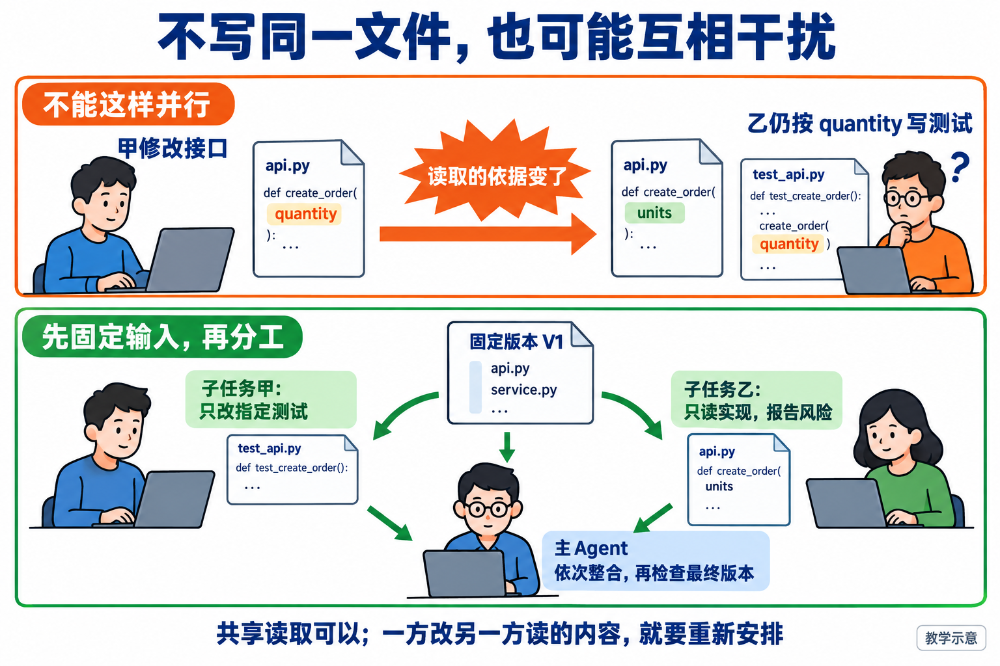
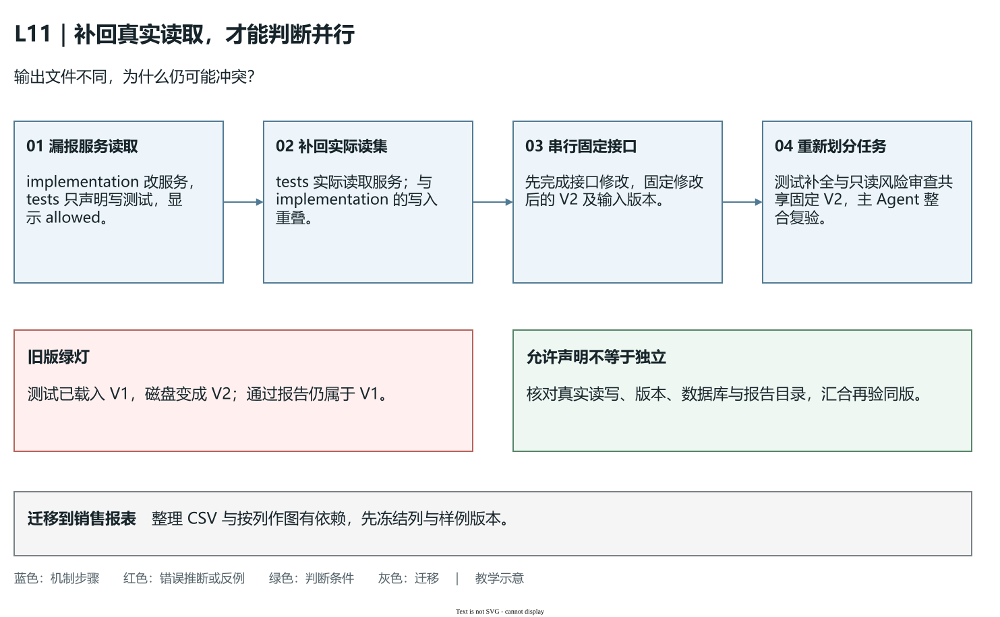
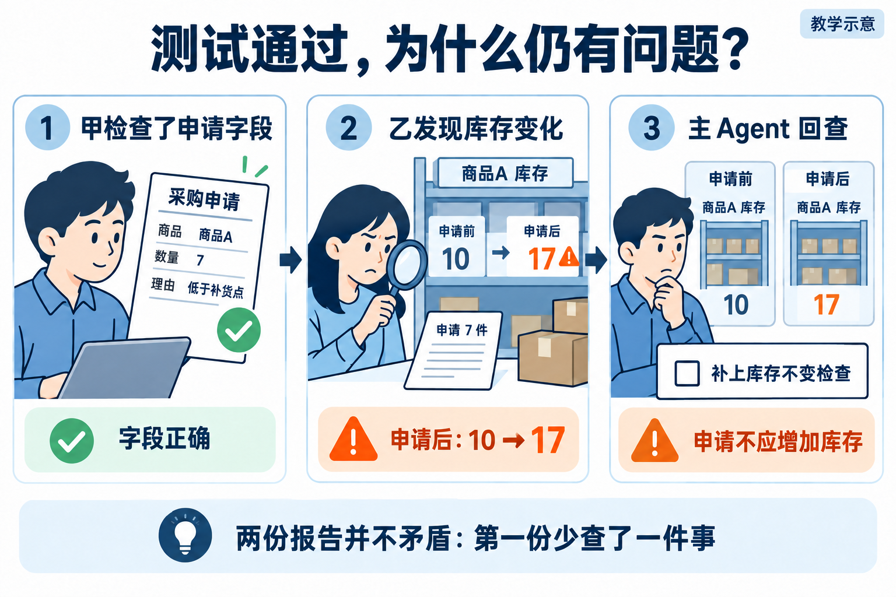
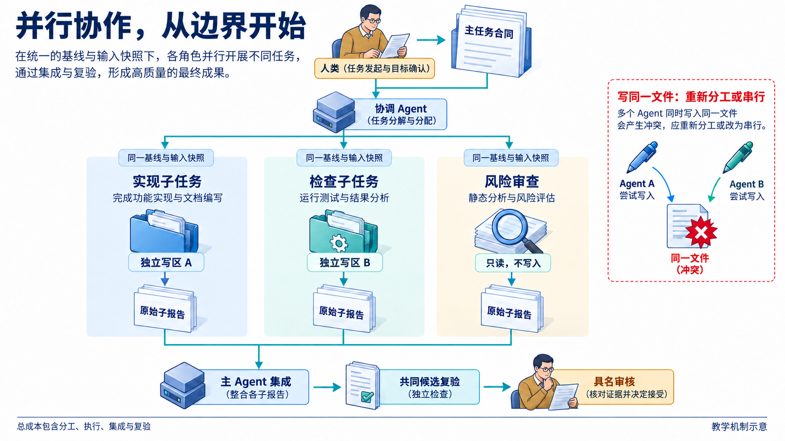

# L11｜用 Codex 原生 Subagents 并行处理独立任务

订单能够预占、取消和发货以后，业务提出补货需求。FlowERP 先要保存采购申请：想买什么、买多少、为什么买；批准与实际收货留到 L12。你和 Codex 已有一版待检查实现，交付前还缺完整测试与风险审查。两项工作是否值得同时做，取决于它们是否真的独立。

**Agent** 在本讲指接收任务、使用工具并交回结果的 AI 执行角色；主 Agent 负责整体交付，受它委托完成局部任务的子 Agent 叫 **Subagent**。并行让两项工作在时间上重叠，主 Agent 最后仍要串行整合和复验。人确认采购规则、分工与接受标准，工作台保存任务与证据，Codex 执行委托。这条分工服务于正确的采购申请，不能以得到两篇报告代替产品交付。

## 1｜先让两位助手知道，我们共同要交付什么

沿用手册中的对象。商品 A 在库 10 件，OTHER 已预占 2 件，可用为 8；另有采购申请 PR-OTHER。现在创建 PR-TARGET，商品 A，数量 7，理由“低于补货点”。7 是已确认的业务输入，不是程序根据库存自动算出的采购建议。

输入经过校验、商品编号规范化和理由去除首尾空白，保存一张 proposed（待审批）申请，可按 PR-TARGET 查询。尚未批准、尚未收到货，所以在库、预占、可用仍为 10/2/8；库存流水、OTHER 和 PR-OTHER 保持原样。把“提出想买”和“已经到货”分开，是这次实现与所有检查的共同依据。

失败路径也应提前确定：数量为零或负数、理由全为空格、商品不存在、申请编号已存在时拒绝，并且请求前后采购申请、库存、库存流水、订单、订单明细五表不变。当前参考服务的重复编号会触发 `sqlite3.IntegrityError`，表示唯一性冲突；它没有约定“返回原申请的成功结果”，不能把重复拒绝称作幂等成功。

两位助手围绕同一组规则做不同工作：甲把规则变成可运行测试，乙沿实现找出可能违反规则的路径。若接口尚未确定，例如申请函数究竟接收 quantity 还是 units，先由你与主 Agent 确认并固定，再分出去。测试对未知接口的猜测，不能成为并行的稳定输入。

## 2｜原本的分工为什么会打架

假设甲改业务接口，把 quantity 改成 units；乙只写测试文件，仍按 quantity 调用。两人没有写同一文件，却产生了读写依赖：乙的依据被甲改变。解决方法是先串行确定接口，再让测试补全与只读风险审查共享不再变化的实现 V1。



**图 11-1　输入的变化也会造成冲突。** 写入文件不同，只排除了一种覆盖风险；还要看另一任务读取什么。

**读集**是任务依赖的文件或资料，**写集**是任务会修改的内容。用 R 表示读集、W 表示写集，两项任务 A、B 至少要检查：

```text
W_A 与 W_B 不重叠：不会互相覆盖输出
W_A 与 R_B 不重叠：A 不改变 B 的依据
W_B 与 R_A 不重叠：B 不改变 A 的依据
```

两项任务都只读同一份固定 Spec 与实现，一般可以共享它们；一项写业务实现、另一项读取这个实现，就有先后依赖。写整个目录也会覆盖其中的文件，大小写或斜杠不同可能仍指向同一目标。除文件外，还要查运行资源：两个测试各写不同源码，却共用一份 SQLite 数据库、报告路径或监听端口，也可能互相清理数据或覆盖结果。

本例调整后的分工是：甲读取采购 Spec、固定 V1 和已有测试，只写指定的采购测试文件；乙读取同一 Spec、V1 的服务与存储逻辑，只输出风险说明；主 Agent 等两项完成后才修改共同实现。甲使用自己的临时数据库和报告目录，乙不把甲正在变化的测试当成已确定依据。若乙需要运行验证，也给它独立的数据与输出位置。

固定 V1 需要可核查的版本身份：候选绝对路径、Git 提交以及未提交修改，或有关文件的内容哈希。哈希是比较内容是否变化的校验值。大家在提示词里都写“V1”，不代表实际导入的代码相同；执行前应核对解释器和源码位置都指向该候选。

### 声明显示 allowed，遗漏的读取怎样制造假独立

手册的 `undeclared-read` 特意声明：implementation 写 `flowerp/service.py`，tests 只写 `tests/test_l11_purchase.py`，没有填写读取服务文件。检查器看到的是两处不同输出，因此显示 allowed。但测试要调用采购服务，实际依赖并没有因漏填清单而消失。下面这张表把“声明给程序看的事实”与“任务真正需要的事实”并排放置；路径相对于课程组合候选，真实业务源码仍归独立 FlowERP 所有。

| 任务 | 声明的写入 | 声明的读取 | 实际依赖 |
|---|---|---|---|
| implementation | `flowerp/service.py` | 未填写 | 修改采购调用接口 |
| tests | `tests/test_l11_purchase.py` | 未填写 | 读取并调用 `flowerp/service.py` |

假设测试进程先载入 V1，仍按 `quantity` 调用；implementation 随后把磁盘上的接口改成 V2 的 `units`。接下来可能出现两种结果：测试重新加载 V2，因旧参数而失败；测试进程已经持有 V1 的实现，继续检查 V1 并得到绿灯，而主 Agent 看到的磁盘代码已经是 V2。后一种更难发现，因为两个输出文件都存在、报告也写通过，错误在于**结论引用的输入不是准备交付的输入**。这是解释风险的时间顺序推演，`schedule_lab.py` 本身没有启动这两个任务或复现接口修改。



**图 11-1a　清单遗漏不会消除真实依赖。** 从左侧漏报读集到第二步补回服务读取，原来的 allowed 应变成拒绝；右侧先串行固定修改后的 V2，再让测试补全和只读风险审查读取同一 V2。下方的旧版绿灯说明为什么汇合时还要检查报告对象。图为任务机制示意。[可编辑源图](assets/reading-depth-20261003/mechanism.drawio)。

修正不是给 tests 加一句“注意别冲突”，而是把服务路径补进它的 read_set，再用 `read-write` 对照观察拒绝；随后先串行完成接口修改并固定 V2，才把测试补全与只读风险审查委托出去。两位子 Agent 的输入分别核对到同一候选，临时数据库和报告目录分别使用；主 Agent 汇合时再次核对输入版本与运行源码。版本字段只有非空值才能相互比较，实际读取路径与内容还要核查，不能把两份空版本清单视为已经冻结。

这也给迁移提供了一条具体动作：甲整理 CSV 列，乙按列名画销售报表。即使甲乙各写不同文件，只要乙读取甲正在改变的 CSV，就要先固定列名、含义和样例版本，或让乙等待。若两人用的是独立固定副本，可以并行，但主 Agent 必须在最终合并版本上重做共同验收，不能拼接两份各自正确的旧结论。

## 3｜怎样把工作交出去，才能接得回来

**上下文**是 Agent 作判断时拿到的目标、规则、代码与已有发现。上下文隔离意味着每个子任务有自己明确的输入和职责：测试任务知道要把哪些规则变成检查，风险任务知道要沿哪些实现找反例。把全部聊天记录分别复制给两位助手，容易让它们都去“顺手修实现”，职责随之重叠；只给一句“你负责测试”又会让它猜入口与标准。


**图 11-2　共同事实固定，局部任务分别完成，再回到整体。** 分出去的是可独立执行的工作，汇合时必须收回原始产物与依据。

给甲的任务可以这样写：

> 在候选的真实绝对路径中，读取已固定的采购 Spec、V1 服务和已有测试。只修改指定测试文件，用自己的临时库和报告目录。
>
> 检查 PR-TARGET 正确保存，申请前后库存、预占、流水和其他单据不变；检查五种非法输入拒绝后五表一致。交回测试 Diff、真实命令与结果、未覆盖项；需要改实现时先返回原因。

给乙的任务则是：

> 读取同一候选、同一 Spec 和 V1 的服务、存储逻辑，业务代码只读，不依赖甲尚在修改的测试。
>
> 查找提前入库、覆盖旧申请和异常后部分写入的风险。每项发现给出位置、触发输入、预期、事实依据与待验证部分；交回原始风险说明和实际运行记录。

这两份委托还要填上真实任务身份、允许文件、解释器、输出位置与验收要求。输入、输出和完成判断形成**子任务合同**：主 Agent 不需要猜产物在哪，也能判断子任务是完成、失败还是仍有未验证项。任务太宽会重叠，太碎又会把大量时间花在解释与整合；本例以一组采购规则的测试和同版实现的风险审查为两个完整单元，便于独立交回。

上下文隔离解决的是“各自知道什么、承担什么”，文件与运行资源隔离解决的是“实际能动什么”。两者要分别确认。两个子任务即使各有自己的任务记录，也可能访问同一工作区；主 Agent 必须核对实际读取、Diff 和生成位置，不能凭角色名称推断权限已经分开。

真实并行还应能回查各自的身份、收到的任务、活动时间、原始输出和产物，并看到活动有重叠。本讲的本地实验用于理解声明与证据，不会启动原生子代理。具体客户端能力以实际运行记录为准；没有子任务记录时，就保留已完成的本地实验与明确缺项，不能由主摘要补写“已并行”。

## 4｜一个说通过，一个说有问题，听谁的

假设甲交回：“申请编号、商品、数量和理由的测试都通过。”乙交回：“申请后调用了入库，可能提前加库存。”这不是投票问题。主 Agent 应先问两份结果各自证明了什么，再核查它们是否针对同一 V1。



**图 11-3　局部通过与业务失败可以同时成立。** 字段正确不包括库存正确；风险提示也要由具体输入与状态确认。

核对可以顺着一条线做。先打开甲的测试和原始输出，确认真实运行数量与覆盖范围，不把“全部通过”扩成“全部需求通过”。再定位乙指出的调用，用同一 V1、同一输入 PR-TARGET 在独立临时库复现。若实际在库从 10 变为 17、预占仍为 2、可用变为 15，并多出一笔入库流水，就证实申请发生了不该有的副作用。

此时，甲的字段结论可以成立，但它漏了合同要求的库存不变检查，子任务尚不完整；乙的发现由复现变成已证实缺陷。若乙只是看到一个可疑函数名，却不能找到被调用路径或触发输入，就仍是待核实，不能当成已经发生的业务错误。主 Agent 的核对方法是**回查版本、回查覆盖、复现触发、比较状态**，而不是根据报告语气选一个相信。

确认范围后，主 Agent 串行移除提前入库行为，补上申请前后库存与流水不变的测试，形成 V2。串行整合让这次修订有一个确定顺序和最终版本；修订过程中若改变接口，要同步更新受影响测试，再重新检查。V1 的报告留在历史，但不替 V2 作证明。

V2 必须运行新增检查、相关既有检查和统一阻断 Eval，再送实际负责人接受。成功路径核对新增一张申请、理由正确和 10/2/8 不变；失败路径则提交数量 0 等非法输入，比较五表前后状态。只观察抛异常，可能漏掉抛异常以前的写入，因此失败后不变也是完成判断的一部分。

若某个子任务异常退出，先保存它已经产生的文件与输出，确定哪些结果仍可核查。另一个任务若依赖的输入未变，可以继续保留有效产物；缺失部分再重新委托。若共同输入已改变，就给受影响子任务新版本并重做检查，不能混合旧版风险结论与新版测试。

工作台保留两份原始结果及主结论的来源：哪项已证实、哪项补做、哪些还待确认。主 Agent 的汇总是一份可追溯的判断，不是把两篇文字拼成一篇更顺的文章。

### 用合同分工：每个子任务独立交回，整体责任在汇合处形成

主 Agent 不能把“开发采购申请”复制给两位助手，就期待得到互补成果。那会让两人重新判断同一套问题，甚至各自修改实现。有效的**合同分工**先确定共同事实，再划分可以独立交回的责任：甲把采购规则转为可运行检查，乙沿固定实现寻找违例路径。共同合同包括 PR-TARGET 的 7 件与理由、申请后库存保持 10/2/8、失败后五表不变；每个子合同再明确输入版本、允许动作、产物位置和完成判断。

合同也决定各自需要哪些上下文。甲需要接口、现有测试和业务状态，才能编写可执行检查；乙需要服务与存储调用链，才能判断有没有提前入库。两人都需要固定 Spec 和 V1，却不必各自读完主会话所有历史。减少无关材料，可以让每位助手集中处理自己的完整问题；删掉关键业务规则，则只是让它更快地产生局部正确的结果。应先列出完成子任务必须知道什么，再裁剪上下文，不能单纯按字数截断。

读写集把这份合同的一部分变成可检查的结构。甲的测试写集和乙的只读审查互不覆盖，甲的临时库、报告目录也应独立；共同实现 V1 在任务结束前保持固定。`assert_parallel_safe` 能核对声明中的文件、资源与输入版本，却不会核实任务实际读过什么或启动子代理。因此执行中若需要改服务，两人先把原因交回主 Agent，由主任务确定修改次序。一个明确的子合同，还需要实际任务记录、输入身份和原始产物来证明被执行过。



**图 11-4　先固定共同输入，再分工，最后重新形成整体证据。** 沿两条支路找每个任务能写什么、读什么、交回什么；到汇合点检查主 Agent 是否保留原始依据，再沿同版复验走向人审。图为教学示意，真实并行仍需子任务身份与活动重叠的记录。

汇合处要处理的是结论之间的关系。甲确认字段保存正确，乙发现申请后库存变成 17，两者可以同时成立，因为证明范围不同。主 Agent 不取平均、不数赞成票，而是把每条结论放回合同：字段检查支持哪些要求，库存不变是否覆盖，乙的触发路径能否复现。修订后形成 V2，重新运行整体检查；把两份 V1 的局部绿灯拼在一起，无法证明 V2。测试和审查的价值在于给主任务提供互补证据，最终整合与接受仍需有明确责任人。

这样也能解释集成成本来自哪里：确认共享接口、整理委托、等回原始结果、处理分歧、修改共同实现、在同版复验，每一步都占时间与用量。采购规则稳定且工作量足够时，并行可能缩短等待；两人持续追问接口、不断让对方重做时，拆分已经失去依据。迁移到导出与报表任务，先把字段、单位和样例固定成共同合同，再估算分工与整合的总历时。能说明为什么这些支路可以独立、什么变化会使它们失效，比启动多少位助手更能证明你会组织协作。

## 5｜这次并行究竟值不值得

并行主要缩短从开始到可接受结果的总历时，不会自动减少工作总量。假设测试 12 分钟、风险审查 8 分钟、整合复验 5 分钟，串行约为 25 分钟。并行若多花 3 分钟拆任务，约为 `3 + max(12, 8) + 5 = 20` 分钟，估计节省 5 分钟；若边界不清多返工 7 分钟，就变成 27 分钟。这些是教学算例，不是已经测得的提效结果。

还要计算 **Token**，即模型输入输出的用量单位。主任务组织委托、两个子任务各自读取共同材料、返回报告、主任务核对与整合，都可能带来用量。同一背景由多个子任务重复处理，也有成本。只比较两个子任务的执行时间，会漏掉拆分、等待、汇总、返工和复验；只记录主会话用量，也不能代表全部消耗。

值得并行的信号是：共同输入稳定，两项工作各有完整产物，不互相改动依据，而且工作规模足以覆盖协作开销。需要不断协商接口、都要改同一实现，或任务本来只有几分钟，串行通常更容易控制。本讲不要求每次固定启动两个 Agent，要求能说明本次分工的收益与风险。

按[实践操作手册](实践操作手册.md)先运行声明实验和采购实验，再取得个人候选、确认两份合同并组织真实子任务，最后主 Agent 串行整合。参考整合实验按顺序制造“局部绿、完整红、修复后绿”，没有启动子代理。它适合练习回查两份报告，不能作为个人并行记录。

把首次分工、一次被拒绝的冲突声明、实际子任务产物、分歧处理和同版复验写入[提交模板](SUBMISSION.md)。单 Agent 与 Subagents 的耗时、用量和质量对照是挑战；未实测时写未测量，不从示例分钟数推出效率提升。

迁移到“甲改导出字段、乙做报表”时，先判断乙是否依赖正在变化的字段。可以先固定字段名、含义、单位和格式，再让样例数据检查与只读风险审查并行；业务实现变化期间，依赖它的页面或报表需要等待或基于明确的固定接口。你能指出这条隐藏依赖，重新划分后说明主任务如何验收，才掌握了可迁移的分工方法。

课程参考边界集中看这一点：`agent/schedule.py` 用 `Subtask` 声明读写范围、资源与输入版本，`assert_parallel_safe` 只查声明中的冲突，不启动子代理或锁文件。手册的 `undeclared-read` 因漏填读取显示 allowed，说明实际依赖仍需核对。清单可以帮助排程，不能替代真实执行边界。

具体路径与完整实验见[实现细节与扩展阅读](reference/参考说明.md)、[参考详解](reference/参考说明.md)。正文中的独立性判断和主任务核对方法，可以直接用于自己的首次分工。

## 本讲留下什么，下一讲怎样接着用

FlowERP 得到可保存且不提前入库的采购申请；工作台得到可核对的子任务边界、原始结果与串行整合关系。L12 将增加批准与收货，同时把工作台交付中的检查、等人、打回与恢复写成明确的状态规则。

[课程学习路线](../../README.md#16-讲学习路线) · [实践操作手册](实践操作手册.md) · [上一讲](../L10/辅导资料.md) · [下一讲](../L12/辅导资料.md)

## 课程大纲中的本讲要求

- **核心内容**：可并行任务识别、上下文隔离、结果汇总、冲突风险与额外 Token 成本。
- **演示结果**：测试补全与风险审查并行执行，由主 Agent 汇总结论。
- **课内增量**：为两个无文件写入冲突的任务定义清晰输入、输出和验收标准。
- **通过标准**：子任务边界清晰；主 Agent 能追溯每个结论；有写入冲突的任务不强行并行。

配图为教学示意；来源与提示词：[新增案例图](assets/reading-story-20260926/生成说明.md)。
