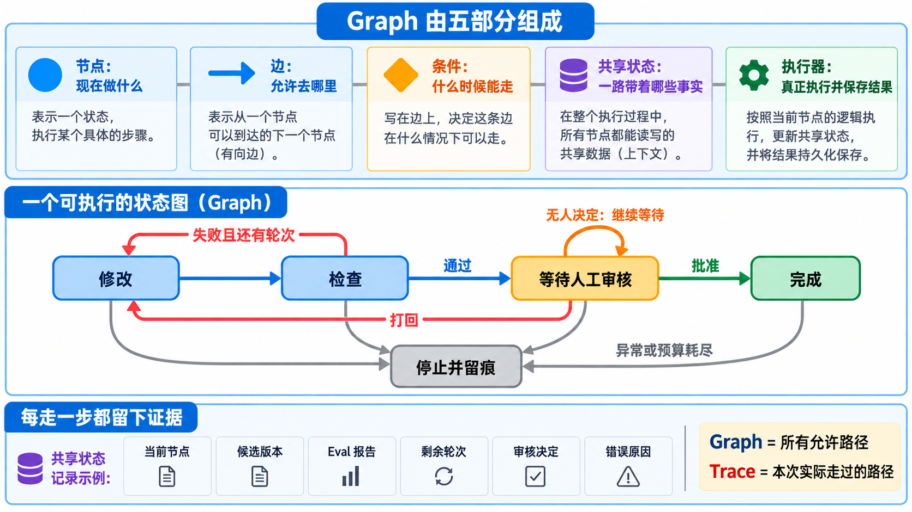
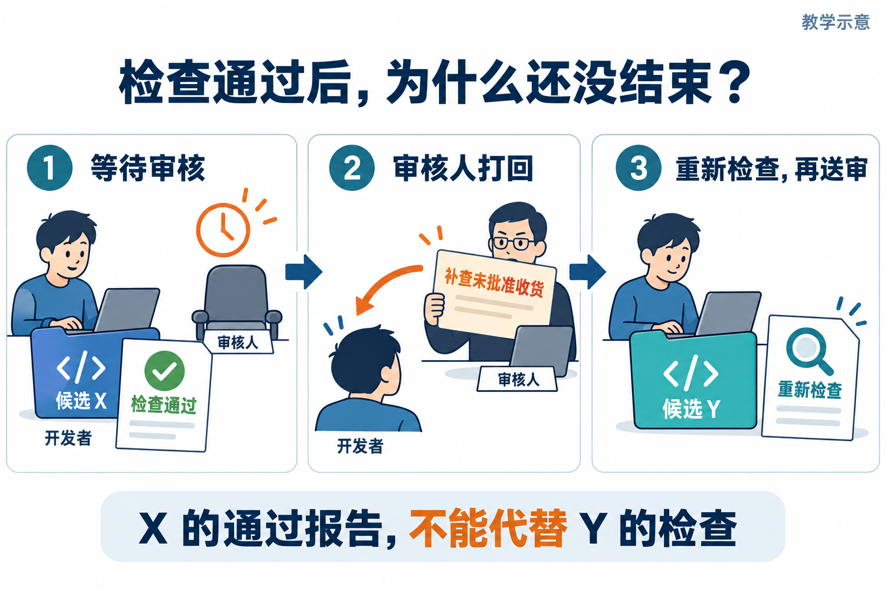
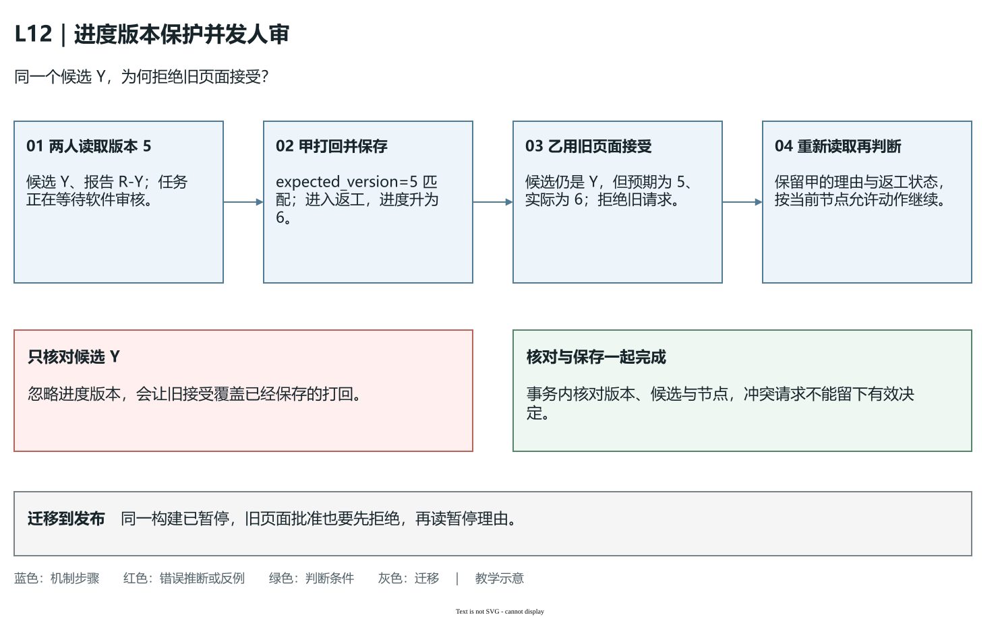
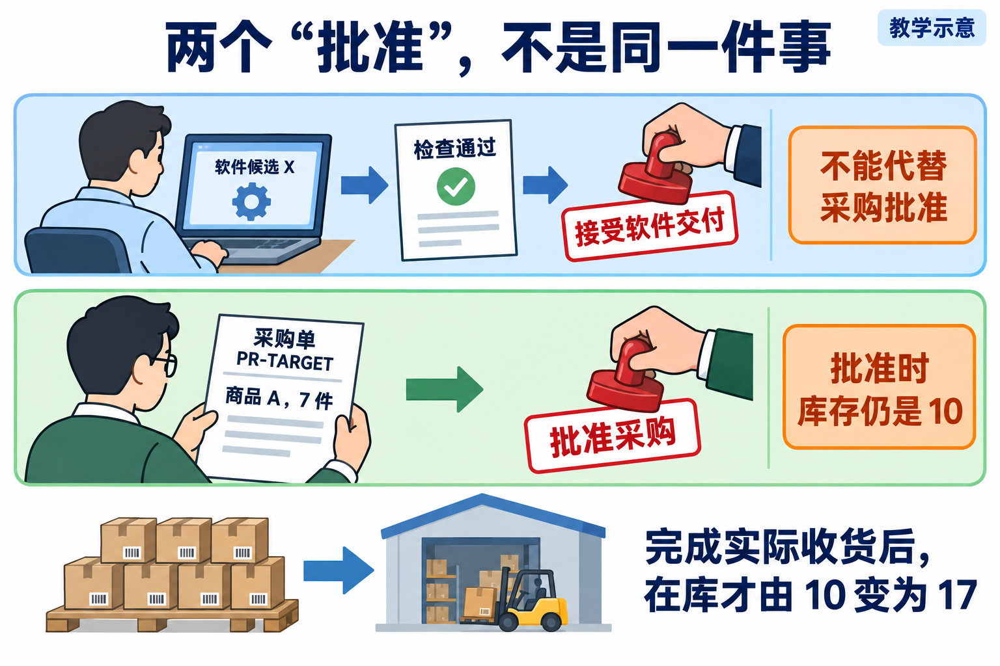
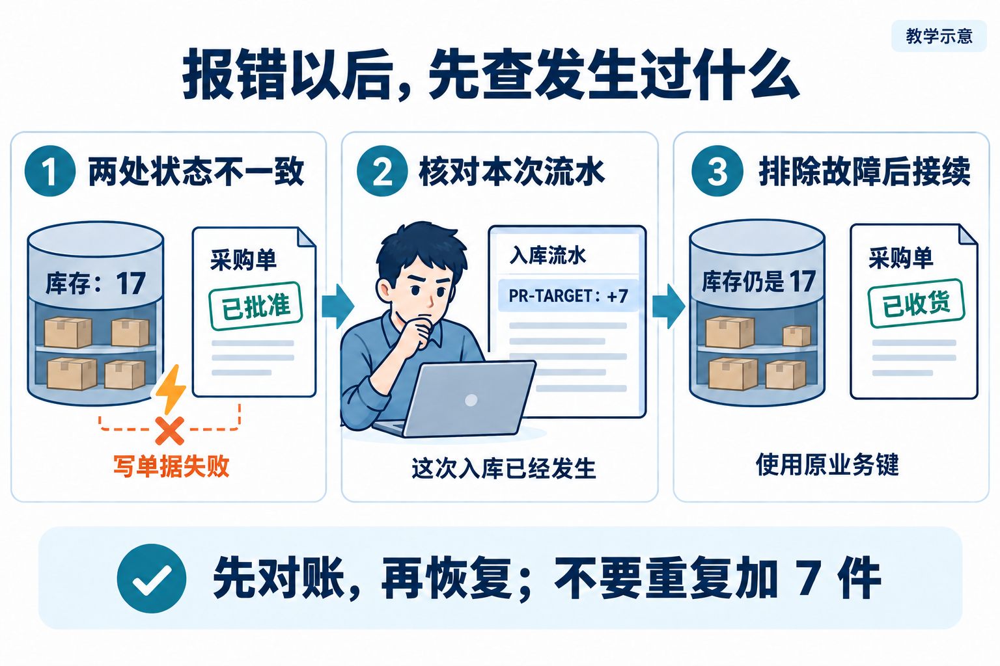
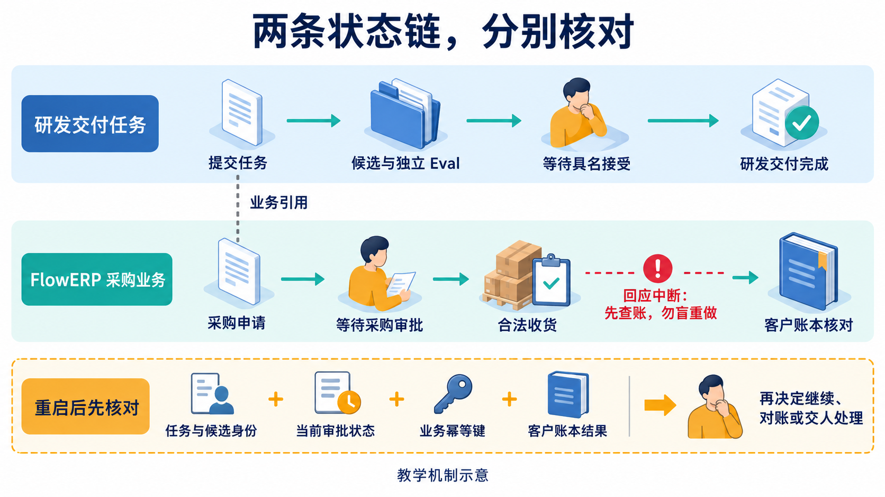

# L12｜用 Graph 显式表达状态、回退和人工审核

L10 的 Loop 能决定是否再修一轮，L11 能让两项独立工作并行。交付中还有另一类问题：检查通过后要等人，审核打回要返回修改，程序重启要从可靠位置继续。要让工作台处理这些去向，先要把“当前做什么、什么条件下去哪里”写成可执行规则。这就是本讲的 **Graph，状态图**。

下面先把状态图本身讲清，再用同一条采购交付推演。人在关键位置作决定，Codex 实现与修订，工作台执行规则并保存事实，FlowERP 用业务状态与库存结果检验交付。增加一张图只是设计起点，图上的每次推进还需要真实动作和依据。

## 1｜状态图怎样从一张图变成程序

**节点（Node）**规定当前阶段做什么，例如修改、检查、等待审核。节点不是 Agent 的名字：同一个 Codex 可以参与多个节点，一个检查节点也可以只运行 Python 程序。先明确节点的输入、动作和输出，执行器才知道到了这里该调用什么。

**边（Edge）**规定允许从一个节点去往哪个节点，并且有方向。“修改 → 检查”表示先形成候选，再检查它；没有“修改 → 完成”这条边，就不能跳过检查和审核。允许路线要先规定，不能在运行出错以后随意改一条路绕过去。

**条件（Condition）**决定一条边此刻能否走。“检查 → 等人审核”的条件是收到属于当前候选的有效通过报告；“检查 → 返工”的条件是失败且还有授权和预算。没有报告、空报告或报告属于旧版，都不满足通过条件。条件应来自可核对的数据，不能只来自模型说“应该没问题”。

**共享状态（State）**是沿途交给下一节点的事实：任务身份、当前节点、候选版本、对应报告、已用轮数、决定和异常。它不是把全部聊天内容交给每个节点。下一步要什么事实，就保存什么事实；每个动作更新自己的结果，并保留前面的来源关系，避免一个子任务覆盖整个状态。

**执行器（Executor）**读取当前节点，真正调用受限修改、Harness 检查或决定读取，再校验结果、更新状态和选择允许的下一条边。下面是解释职责的伪代码，不是当前脚本的直接实现：

```text
读取并校验已保存状态
找到当前节点的动作 → 执行动作 → 保存真实输出
依据输出判断条件 → 核对允许的边
记录转移与新状态 → 继续执行，或等待、停止
```

等待时没有新的人工决定，就保存状态并结束本次执行，而不是不断调用 Codex。完成是终态，不再启动新一轮；异常或预算不足时，停止自动推进并留下交接材料。普通 Python 的状态对象与条件分支就能实现这些关系，不必先引入复杂框架。

**运行轨迹（Trace）**记录本次实际从哪里到哪里、为什么、依据什么输出。Graph 规定所有允许路径，Trace 记录某次走过的路径，两者不同。轨迹写了 develop（修改），还要能找到实际执行和 Diff；写了 test（检查），还要能找到报告。标签只能证明记录存在，不能单独证明动作发生。



**图 12-1　先读上方五部分，再沿蓝色正常路径、红色回退路径理解执行。** Graph 是允许路线，Trace 是实际路线；“完成”按终态处理。配图是[已有教学示意](assets/reading-figures-v2/00-graph-core-knowledge.prompt.md)，不是学生的运行结果。

这也是 Loop、Subagents 与 Graph 的关系：Loop 处理重复，Subagents 处理独立工作的委托与汇合，Graph 处理整体控制去向。一个 Graph 节点可以调用有界 Loop 或组织子任务，但仍须由节点执行器收回结果再转移。更换外部编排框架，可以改变保存和调度的实现，不能替你决定业务规则、授权与人审。

## 2｜审核人打回了，为什么必须再检查一次

现在落到采购能力的开发。L11 已能保存 PR-TARGET 的申请，L12 要让 FlowERP 只有在负责人批准后才允许收货，并保证同一次收货重试不重复入账。将第一版待验软件称为候选 X，Graph 的起点是开发这项功能，软件最终是否可交付由实际交付审核人决定。

Codex 在授权范围内修改，形成 X；工作台调用 Harness 检查 X。有效报告通过后，进入等待软件审核，程序中可记为 `awaiting_human_review`。审核人今天不在，此时正确结果就是等待：保存 X、报告及待决定问题，结束本次运行。明天打开仍应等待 X，而不是重复修改或自动接受。



**图 12-2　等人、打回与新版本检查都有自己的去向。** 不同颜色表示不同依据，等待不是失败，也不是已经交付。

第二天审核人指出：“没有看到未经采购批准收货会被拒绝的检查”，打回 X。先保留决定与理由，再判断是只漏检查还是实现也有问题。补测若暴露缺陷，修复实现；形成新候选 Y 后，X 的报告与接受状态不能沿用。Y 重新检查，通过后重新等人审核。

由这段事实可以写出一个最小转移规则：

| 当前节点 | 条件 | 下一位置 |
|---|---|---|
| 修改 | 形成范围内的新候选 | 检查该候选 |
| 检查 | 当前候选的有效报告通过 | 等待软件审核 |
| 检查 | 阻断失败且仍有预算 | 返工，再回修改 |
| 等待审核 | 没有有效新决定 | 保持等待 |
| 等待审核 | 接受当前候选 | 软件交付完成 |
| 等待审核 | 打回且仍有预算 | 保存意见，回修改 |
| 需要继续时 | 异常、预算不足或授权不够 | 停止并交回 |

表中的“当前候选”是条件的一部分。只判断报告中 blocking_failed 为零，会漏掉报告无效或检查错版本；只判断审核文字是 approve（接受），会漏掉它接受的是旧版。Graph 把这些判断放在边上，使跳转依据能够逐条检查。

失败回退还要保留上限。Y 检查失败，可以按 L09 形成任务、按 L10 判断是否再修；审核打回也会消耗后续修改与复验资源。预算用完时保存剩余问题，不能为了让流程抵达“完成”绕开上限。

## 3｜重启以后，怎样知道上次在审核哪版

只有一句“等待审核”，接手者仍不知道等哪版、依据哪份报告、为什么返工。共享状态至少要把这些关系放在一起。下面是教学记录格式，不是 `agent/graph.py` 的直接输入：

```text
任务：采购批准后收货能力
当前节点：等待软件审核
当前候选：Y，附实际目录与内容身份
当前报告：R-Y，检查对象为 Y，结果有效且通过
当前接受决定：尚无
历史：X 因缺少未经批准收货的拒绝检查被打回
已用轮次与剩余预算：按实际记录填写
```

与此同时，Trace 应能查到“X 修改 → X 检查 → X 等审 → X 打回 → 修改得到 Y → Y 检查 → Y 等审”。共享状态是现在的位置与依据，Trace 是怎样走到这里；前者支持继续，后者支持解释与追溯。两者最好作为一次可靠状态更新一起保存，保存失败就不能宣称进度已经可靠记录。

### 把保存的状态与实际走过的路对上

重启恢复先校验状态格式与必要字段，再核对候选仍在、内容未换、报告属于它、当前节点可执行。输入一个针对 X 的旧接受决定，系统应保持 Y 等审并给出对象不匹配的理由；输入针对 Y、依据 R-Y 的有效决定，才允许完成。决定需要实际责任人的记录，非空姓名字符串不能独自认证身份。

如果两个人同时打开同一任务，一个已打回，另一个还在旧页面点击接受怎么办？给状态一个版本号，每次决定都带上它所看到的版本；实际版本已变化，就拒绝旧请求，请接手者重新读取当前状态。这样避免后来提交的旧页面决定覆盖已经发生的变化。版本号确认进度，候选身份确认对象，报告确认检查依据，三者各有职责。

### 候选仍是 Y，旧页面的接受为什么也要拒绝

只核对候选身份还不够。设甲、乙同时读取任务：候选 Y、报告 R-Y、当前等待软件审核，Graph 进度版本为 5。甲发现缺少必要依据，先提交打回；系统保存决定，将节点改为返工，进度版本升为 6。此时还没修改代码，所以候选仍是 Y。乙拿着刚才的页面提交“接受 Y”，候选确实匹配，却依据已经过期的任务状态。

| 时刻 | 请求依据 | 实际保存状态 | 应有结果 |
|---|---|---|---|
| 两人读取 | Y、R-Y、版本 5 | 等待软件审核，版本 5 | 两人获得同一快照 |
| 甲打回 | Y、`expected_version=5` | 等待软件审核，版本 5 | 保存打回，进入返工，升为 6 |
| 乙接受 | Y、`expected_version=5` | 返工，版本 6 | 拒绝旧请求，保持返工 |
| 乙重新读取 | Y、版本 6、甲的理由 | 返工，版本 6 | 先处理打回，不能从返工直接接受 |



**图 12-2a　代码对象相同，控制状态也可能已经变化。** 上方两人先读取版本 5，甲的打回使进度升为 6；乙提交的预期版本仍为 5，因此拒绝。下方反例说明只比较 Y 会漏掉这次变化，右端要求重新读取并遵守返工节点的允许动作。版本 5/6 是机制算例，不是某个任务的实际编号或运行结果。[可编辑源图](assets/reading-depth-20261003/mechanism.drawio)。

这里 `expected_version` 的含义是“仅当任务仍处于我刚才看到的进度，才采用这个决定”。核对与保存必须作为一个可靠动作：如果先在页面比较版本、稍后再无条件写库，中间仍可能被另一人改变。持久化 Graph 的 `decide` 在 `BEGIN IMMEDIATE` 事务内读当前状态、检查版本与候选，再保存决定和转移；状态更新还以原版本作条件，未更新到预期记录就报告冲突。这样，打回与版本增长一起生效，乙的过期请求不会部分留下一个有效接受决定。

拒绝旧请求不表示甲永远正确，也不表示乙没有审核权。它表示系统不能替乙假定已经读过甲的新理由。乙重新读取后，可以参与修订与复验；若形成新候选，再按新的报告送审。即使代码暂未变化，也不能直接绕过返工节点的允许路线。采购批准另有对象与角色检查，本段的“接受 Y”只针对软件交付。

迁移到发布时，设两人查看同一个构建，一个先记录暂停发布，另一个用旧页面批准。构建哈希没有变化，进度却变了；你应要求后者重新读取暂停理由，再按当前节点允许动作决定。能解释“对象身份”与“进度版本”分别防住什么，才能设计可恢复且不会覆盖他人决定的控制流程。

候选从 X 换成 Y 时，旧报告和旧决定留在历史，取消它们对“当前候选”的有效标记。状态文件损坏时保留错误与原文件，停止自动恢复；报告缺失则补齐或复验，不能从历史绿灯猜出完成。恢复的是可靠事实，不是补写一条顺利的故事。

还有一个更难的窗口：动作已经执行，状态尚未保存就中断。此时不能仅凭旧节点重做带副作用的动作。**副作用**是会改变文件、数据库或外部业务的行为。先查动作的执行身份与实际结果，再决定重试还是接续；下面的收货案例会说明为什么需要这一步。

## 4｜软件被接受了，采购单就能入库吗

沿前面的推演，Y 检查通过并由软件审核人接受，完成的是软件交付。接下来业务人员使用这版 FlowERP：PR-TARGET 申请采购商品 A 7 件，在库仍为 10，其中 OTHER 预占 2，可用为 8。此时仍不能立刻加库存，采购负责人还需决定是否批准 PR-TARGET。



**图 12-3　两项决定分别绑定软件候选与采购单。** 即使同一个人承担两种职责，也要分开记录对象与理由。

软件审核回答“Y 是否可以交付”，采购批准回答“PR-TARGET 是否允许执行采购”。软件通过不能替采购批准，另一张 PR-OTHER 的批准也不能授权 PR-TARGET。负责人批准后，货还没有到，在库仍为 10；收到这 7 件并登记后，PR-TARGET 才成为 received（已收货），在库 17、预占 2、可用 15，并有一条属于 PR-TARGET 的 +7 入库流水。

这组输入、处理与结果把采购状态和库存状态连了起来：

```text
PR-TARGET：A，7 件，待审批；库存 10/2/8
采购负责人批准 PR-TARGET → 单据已批准，库存仍 10/2/8
实际收货并登记本次业务键 → 单据已收货，库存 17/2/15
核对 OTHER、PR-OTHER 保留，且本次只有一条 +7 流水
```

失败路径用尚未批准的 PR-TARGET 请求收货：应拒绝，并比较请求前后五表不变。采购已被拒绝的情况也不应进入收货。批准人空白，则先拒绝批准本身。真实身份、角色和权限要由实际应用的授权机制验证，教学字符串只用来观察记录与路径。

在设计之前，用几行写清候选、报告、软件决定、采购申请、业务决定、入库流水各自的身份及关联，这叫**最小领域本体**：为业务对象、关系与规则给出清楚含义。它不是额外的一套术语表，而是条件判断的依据。数量从 7 改为 10，就不能只因状态仍写 approved（已批准）而继续沿用对 7 件的决定；先核对批准对象与内容，按规则重新判断。

## 5｜收货时报错，下一次能不能直接重做

设收货流程没有正确覆盖全部写入：库存已从 10 增加到 17，并写了 +7 流水，但更新 PR-TARGET 为已收货时失败，单据仍显示已批准。若恢复时只看单据，再加一次 7，就变成 24。报错不证明动作完全没发生，Graph 保存的“收货未完成”也不证明业务库没有改变。



**图 12-4　先查本次动作，再决定如何继续。** 单据、库存和流水一起核对，才能区分未执行、部分提交与已完成但回应丢失。

把单据与实际业务记录核对，叫**对账**。先查本次收货的业务身份、流水和请求内容，不能只看总库存；其他入库可能也让总数成为 17。若本次流水存在且库存已增加，停止重复入账，确认是否有受支持的接续方式。若没有本次动作结果，还须确认原请求已结束、不会延迟写入，再按原身份重试。结果未知时应停下核查，不可直接当成失败后重新做。

这里有两项互补机制。**事务**把库存、流水和采购状态的修改放在同一次提交中，避免失败时只保留一半；**幂等**使同一业务动作重复请求时只生效一次，应对动作已完成但成功回应丢失的情况。事务保护一次执行，幂等保护重试，二者不能互相替代。

本次收货可使用一个唯一的**业务键**，示例为 `receipt:PR-TARGET:01`。失败后重试继续带这个键，程序据此查回本次操作。每次点击换新键，会把重试变成新动作；已有键若属于另一采购单、另一商品或不同数量，则应拒绝冲突，不能只因“键存在”就返回成功。请求指纹记录对象和参数的内容身份，帮助区分同一请求与占用了同一键的不同请求。

实践实验的 `replay` 路径应得到库存仍为 17、预占 2、可用 15，仍只有一条 +7 流水。注入状态写入失败时，要读实际阶段快照：若全部回滚，说明没有部分提交；若观察到库存 17 而单据仍批准，说明需要修复或受支持的恢复。不能把脚本报错后“再跑一次”概括成安全恢复，更不能手工增加库存让结果对齐。

Graph 的恢复因此分两层：先恢复工作台中可靠的节点与决定，再核对副作用的实际结果，确认继续不会重复业务动作。代码执行与业务执行各有身份及记录，二者关联以后才形成可以接手的交付链。

### 持久化编排：等待人的决定，恢复时查清两边发生了什么

一次模型会话结束，采购交付可能还没有结束：软件待接受，采购待批准，收货结果也可能等待核对。**持久化编排**把当前节点、对象身份、依据和历史保存下来，使流程能够跨会话、跨重启继续。**HITL（Human in the Loop，人工介入）**把实际责任人的判断放在有明确对象与条件的节点上。它要求系统能够可靠等待，下一次进入时仍读到待决定的问题；不能把“没有新的拒绝”解释为批准。

这次交付有两条相关路线。研发路线检查软件候选 Y，由具名软件审核人决定是否接受，回答这版是否可交付；客户业务路线围绕 PR-TARGET，由采购负责人决定是否批准，收到 7 件后才登记入库。Y 被接受，不会把 PR-TARGET 变成已批准；PR-TARGET 已批准，也不证明 Y 已通过软件检查。即使同一人承担两种职责，两份决定仍需分别绑定对象与内容。持久化不是把它们合成一个“审核通过”，而是保存它们怎样关联、各自停在哪里。



**图 12-5　两条路线共享交付关联，各自保留完成依据。** 先沿上方找 Y 的检查和具名接受，再沿下方找 PR-TARGET 的采购批准、收货与账本核对。指出重启时先读哪份保存记录、再查哪种实际状态。图为教学示意，等待节点不能自行批准，保存检查点也不证明客户账已核对。

再看一个区别于“业务事务回滚”的窗口：FlowERP 已正确提交本次收货，在库 17、预占 2、可用 15，只有一条 +7 流水；工作台还没保存成功结果就断电了。重启后，工作台记录可能仍显示本次动作 pending（结果待确认），但客户账已经完成。两套数据库各有自己的提交边界，工作台的一次事务不能替独立 FlowERP 保证同时提交。此时重新点击并换新业务键，会把记录丢失误当成业务未执行。

安全恢复要沿同一个动作身份核对：读取原采购单、收货键与请求内容，在客户账查询本次流水和单据状态。若已经完成，保存该次实际结果并完成对账；若确认未执行且原请求不会再迟到，才按同一键重试；结果仍未知时保留等待核查。`begin_effect` 在工作台留下 pending 与请求指纹，`finish_effect` 保存调用结果，再进入对账节点，这些接口提供了记录位置。实际客户调用与查询仍需可信连接和原始结果；`reconcile` 接收的 `matched: true` 必须有真实账本核对支持，不能由调用者为推进状态随意填写。

幂等与对账在这里配合：同一键保护重复请求只生效一次，查询结果帮助恢复者区分未执行、已完成和未知。持久化状态告诉你要核对哪次动作，客户账告诉你动作实际造成了什么。迁移到软件发布时，发布接口成功但工作台丢了回应，也应先查本次发布身份与已部署构建，再决定接续或重试。能从保存的节点找到对象，再从实际系统找回结果，才形成可以可靠接手的恢复路径。

## 6｜实现并验收等待、打回和恢复

按[实践操作手册](实践操作手册.md)先观察等待、批准后收货及同键重放，再创建个人隔离候选，实现真实动作、转移与保存。手册前三条命令分别观察软件等待和独立采购实验，不是一张采购单已经走完了从软件审核到收货的真实交付。自己的 Graph 还需关联候选、报告及实际责任人的决定。

先用三条反例检验设计：直接从修改跳到完成，应拒绝非法边；给 Y 提交 X 的旧接受决定，应保持等待并解释对象变化；状态文件损坏，应显式停止并保留错误。接着检验审核打回后形成新版本，是否重新检查，预算到限是否留下剩余工作。每条允许路线与拒绝路线都要看执行输出，不能只看状态名。

课程参考边界集中看这一点：`agent/graph.py` 是最小观察支架，develop 节点未调用 Codex，`move` 仅记转移，传入姓名不认证身份，批准未自动绑定实际候选；默认无等待策略可以演示完成。首页工作台的 `workbench/workflow_graph.py` 是另一层持久化治理，已有允许边、expected_version、候选绑定、旧决定失效及副作用请求指纹等检查。这两层不能混称，参考脚本的局限不等于整个工作台缺失这些能力；个人交付应核对自己使用的路径及实际动作。

最后在同一候选运行采购批准与入库幂等检查，核对 PR-TARGET 状态、17/2/15、唯一 +7 流水以及 OTHER、PR-OTHER 保留；再做未批准拒绝和异常对账。检查后若修改候选，需要重新软件审核。原始设计、反例、修订、Trace、报告和实际决定写入[提交模板](SUBMISSION.md)，没有实际审核时保留等待，不用教学姓名代替。

把方法迁移到软件发布：等待决定应指向哪个构建版本？收到针对旧构建的批准为何不能继续？发布超时后先查已部署版本与本次发布身份，还是立即重发？你能从对象、允许路线和已发生副作用推导接手动作，就掌握了 Graph 的控制与恢复含义。

接口与更多实验见[实现细节与扩展阅读](reference/参考说明.md)、[参考详解](reference/参考说明.md)。更换外部框架是挑战任务，仍要保持相同的输入、输出与验收要求。

## 本讲留下什么，下一讲怎样接着用

FlowERP 增加负责人批准后的收货与同次重试不重复入账；工作台用 Graph 组织开发、检查、等待、返工和恢复。Graph 保存同一任务的执行进度，后续事项复用经验还需要来源、版本、适用边界与复验结果，不能仅因状态已保存就宣称跨事项闭环完成。

[课程学习路线](../../README.md#16-讲学习路线) · [实践操作手册](实践操作手册.md) · [上一讲](../L11/辅导资料.md)

## 课程大纲中的本讲要求

- **核心内容**：共享状态、条件分支、审核打回、异常路径和人工介入；原生 Subagents 与外部编排框架的边界。
- **演示结果**：开发 → 测试 → 审核；审核失败回到开发，关键决策等待人工确认。
- **课内增量**：用最小 Python 状态图实现移交、回退、状态保存和审核结论。
- **通过标准**：状态变化可追踪；审核结果来自 Eval；循环有上限；异常不会被静默忽略。

配图为教学示意；来源与提示词：[新增案例图与完整提示词](assets/reading-story-20260926/生成说明.md)、[两种批准](assets/reading-figures-v2/01-two-approvals.prompt.md)、[等待与打回](assets/reading-figures-v2/02-review-return.prompt.md)、[核对后接续](assets/reading-figures-v2/03-safe-retry.prompt.md)。
