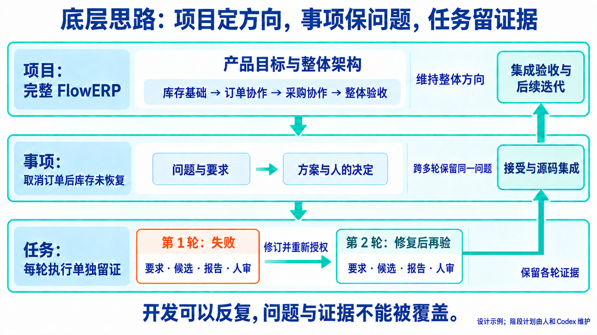
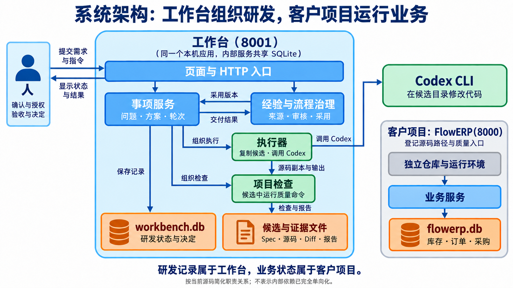
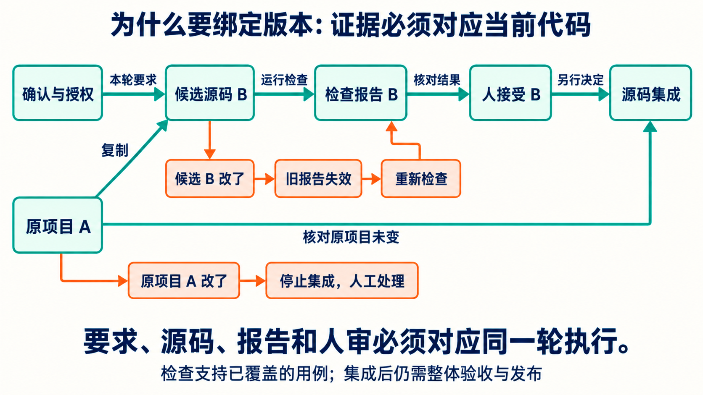
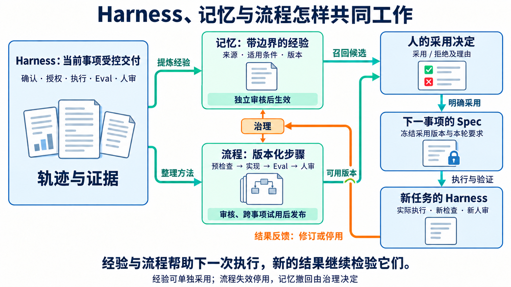

# 个人 AI 研发工作台：设计思路与整体架构

个人 AI 研发工作台帮助人与 Codex 协同完成一个软件项目从构思、设计、开发到验收和持续迭代的全过程。课程用它持续建设完整的 FlowERP 产品，库存导出和订单修复都是这个项目中的事项。

理解工作台，要沿着四个问题看：**为什么需要统一组织开发 → 怎样划分职责与数据 → 如何判断一次交付可信 → 怎样让经验支持后续建设。** 下面用四张图说明这些关系，每一节先解释设计原因，再说明它怎样落到当前实现。

图中的阶段和交付情形均为设计示例，不能作为真实客户验收记录。实现说明依据 2026-10-03 当前工作区源码；四图使用内置 imagegen 生成，[配图与提示词](assets/workbench-design/imagegen-design-guide.md)可供核对。源码细节见[工作台具体设计](工作台具体设计.md)。

## 1. 底层思路：让开发持续推进，也保留判断依据

完整项目会经历需求变化、跨会话协作和多轮返工。工作台首先解决的是连续性：始终知道要完成什么、当前做到哪里、哪些结论仍有效，以及下一步由谁决定。

### 1.1 为什么用事项组织长期问题

假设订单取消后库存没有恢复。一次对话可能提出方案，下一次修改代码，再下一次发现失败。如果只保存最后一句“修复完成”，就无法回答：修复的是哪版要求，检查的是哪份代码，失败原因是什么，谁接受了结果。后续开发也容易重复以前的错误。

因此，**事项是持续推进一个问题的核心单位，任务是其中某一轮执行。** 事项保留原始问题、目标、讨论、方案和人的决定；每轮任务分别保存执行要求、候选代码、检查与人审。返工在原事项内继续，新任务不会覆盖旧失败，换会话后仍能沿同一问题推进。

这一设计同时保留两种信息：事项说明“为什么做、现在怎样判断”，任务说明“这次实际做了什么”。人的决定与执行结果由此可以相互核对。

### 1.2 从项目整体落实到每轮任务

事项还需要共同的项目方向。人和 Codex 先明确 FlowERP 服务谁、第一版做到哪里，再确定库存、订单、采购的模块职责、接口和数据规则。例如“可用库存 = 在库量 − 预占量”应同时约束订单、页面和导出功能，各事项才能组合成一致的产品。

图从上到下表示不同寿命的开发依据：项目目标与架构长期约束建设；阶段安排当前成果；事项跨轮次保留问题；任务记录一次尝试。右侧回流表示局部修复最终要回到事项判断与项目整体验收。

例如，先建设库存基础，再接通订单预占与取消，随后建设采购审批与入库。每个阶段包含多个事项，每个事项可以经历多轮任务。阶段结束时，要核对这些增量能否组成完整业务；发布后依据真实使用反馈继续迭代。当前阶段规划由人和 Codex 在项目文档中维护，项目登记主要提供仓库与检查入口。

## 2. 系统架构：划清决策、执行与业务责任

统一组织开发，需要让每种判断由合适的部分承担。人负责取舍与验收，服务核对状态与版本，执行器调用工具，客户产品落实业务规则。下面的图同时显示调用方向和数据归属。

### 2.1 各模块接收什么，产出什么

先沿人的动作读图：人从 `http://127.0.0.1:8001/` 首页“事项与决策”提出问题、确认方案并授权。页面与 HTTP 入口提交动作、展示状态；事项服务核对这轮要求、授权与源码是否仍有效，再组织执行和检查。按钮显示出来以后，后端仍会拒绝过期或条件不足的请求。

执行器把受控源码复制成待验收的副本，这份副本称为“候选”，再调用 Codex 修改它。项目检查在同一候选中运行登记的质量命令，产出报告。事项服务依据这些结果等待人接受、返工或集成；经验与流程治理则接收交付结果，向后续方案提供可采用的版本。

这些模块组成一个本机应用，存取模块共用 SQLite。职责划分让判断依据更清楚，也便于分别验证；当前代码仍有跨模块查表与相互依赖，尚未处处强制单向依赖。模块与源码位置的对应见[具体设计第一节](工作台具体设计.md#一模块分开是为了让不同责任有自己的判断依据)。

### 2.2 为什么研发数据与业务数据分开

| 数据 | 由谁保存 | 用来回答什么 |
|---|---|---|
| 项目、事项、方案版本、任务状态、审核与采用记录 | 工作台的 `workbench.db` | 当前依据是什么，谁决定了什么，允许推进到哪里 |
| 冻结要求、候选源码、代码改动对比（Diff）、输出和检查报告 | 工作台运行目录，数据库保存关联 | 这一轮实际改了什么、检查了什么 |
| 库存、订单与采购状态 | 独立 FlowERP 服务和 `flowerp.db` | 客户业务当前是否正确 |

工作台负责研发过程，FlowERP 的业务服务负责库存预占、取消释放、审批与入库。FlowERP 有独立仓库和运行环境，客户页面默认在端口 8000；工作台通过项目登记找到源码和质量入口，通过进程调用检查。

分开这两类责任，工作台可以组织其他客户项目的开发，FlowERP 也能独立运行。它们的证明责任随之明确：工作台机制检查证明授权、记录等对应机制；ERP 检查和业务验收证明客户规则。数据库记录还要能追到实际代码与报告，状态显示成功本身不足以说明交付正确。

## 3. 交付控制：证据必须对应当前要求与代码

模块分工回答“谁负责”，版本关联回答“凭什么相信结果”。要求、候选、报告和审核可能分别存在，却不再对应同一轮执行。工作台因此在每个关键动作前重新核对关联。

### 3.1 为什么要确认、授权、检查与人审

一次交付先确认业务要求与技术方案，再单独授权执行。确认使本轮要达到的结果、允许修改的范围和检查条件明确；授权使一次实际修改有清楚的起点。执行后核对真实 Diff，才能判断 Codex 是否遵守了范围。

以库存导出为例，在库量 10、预占量 4，可用量应为 6。Codex 输出 10 时，需要检查暴露错误，再修订方案、重新确认与授权。候选副本使这轮失败能够保留，原项目也不必先接受未经审查的改动。

图中 A 是原项目源码起点，B 是候选。检查报告与人的接受都针对 B；B 改了，须重新检查；A 改了，须停止集成并人工核对。工作台保存源码清单和内容指纹，用来判断关联是否仍有效。

### 3.2 为什么检查通过以后还要另行接受和集成

Eval 是项目质量检查，只能说明已覆盖用例的结果。如果用例没有检查“10 − 4 = 6”，错误导出也可能显示通过。人审还需要核对业务行为与检查覆盖，才能决定接受还是返工。

人工接受的是当前候选；源码集成另行核对候选、原项目起点和累计授权范围，再将改动写回。这样可以保留完整的失败与修复过程，也能避免覆盖并行修改。当前比较整个受控源码清单，范围外的源码变化也可能阻断集成，代价是需要更多人工核对。

检查通过、人工接受、源码集成和客户使用分别表示不同结果。集成后仍需跨模块业务验收与实际发布；多个事项各自通过，也要证明它们共同满足项目目标。并发、中断与恢复的具体处理见[工作台具体设计](工作台具体设计.md)。

## 4. 长期积累：用交付结果改进下一次开发

工作台既要组织本次开发，也要积累能够帮助后续建设的方法。关键是让经验有可信来源，并把“找到一条经验”继续落实为“这次明确采用了它，还验证了结果”。

### 4.1 Harness、记忆与流程怎样互相支持

这里的 **Harness** 是工作台中的受控交付机制：确认、授权、候选执行、Eval 和人审共同留下轨迹。**记忆系统**保存从轨迹中提炼的经验及来源、适用条件和版本；**工作流蒸馏**将真实交付中的方法整理成版本化步骤，经过复验与审核后复用。

左侧交付为中间经验与流程提供来源。右侧人的采用决定把选定版本绑定到下一事项的 Spec，也就是本轮执行要求；新任务再通过 Harness 产生自己的检查与人审。底部反馈回到治理，决定是否修订或停用。它们共同服务同一条研发路径。

经验可以单独采用。例如库存导出验收后得到“用含预占的数据核对库存口径”的方法，后续取消订单时可以采用它；但旧的读取检查不能证明新的写入事务正确，仍须验证取消成功会释放预占、取消失败保持订单与库存原状。[经验迁移案例图](assets/workbench-design/workbench-experience-transfer-imagegen-v1.png)展开了这一例子。

流程进一步规定步骤和每步证据。当前固定组织“预检查 → 实现 → Eval → 人审”；候选流程独立审核后获准试用，在另一事项试用、检查与具名验收通过后才能发布。复用失败会停用对应流程版本，记忆撤回由治理决定。能力增长来自实际交付与修订，未涉及模型训练或权重更新。

### 4.2 当前支持到哪里，怎样判断整体完成

当前首页已连接事项调研、方案确认、授权、候选执行、检查、人审和源码集成，也有经验与流程的提炼、审核、召回、采用及复用治理入口。完整目标、架构基线与阶段计划由人和 Codex 主动维护；阶段调度、发布和业务效果采集尚不自动完成。

完整项目的完成，需要运行中的业务、跨模块检查、项目整体验收与发布证据。复用闭环的完成，需要前一事项提供真实来源，后一事项明确采用版本并执行、审核，失败能够触发修订或停用。本轮更新的是设计说明与配图，没有执行真实客户交付或跨事项业务验收。

可选 `harness_web/` 驾驶舱默认端口 8010，不属于课程必做工作台；不得宣称它与参考产品等价或已接入官方 app-server。

理解整体后，按问题继续查阅：[具体设计](工作台具体设计.md)解释源码机制与取舍，[日常研发入口](daily-development.md)说明实际操作，[参考资料索引](README.md)与[闭环建设规格](../architecture/工作台范式与闭环建设.md)提供其余资料和建设缺口。
