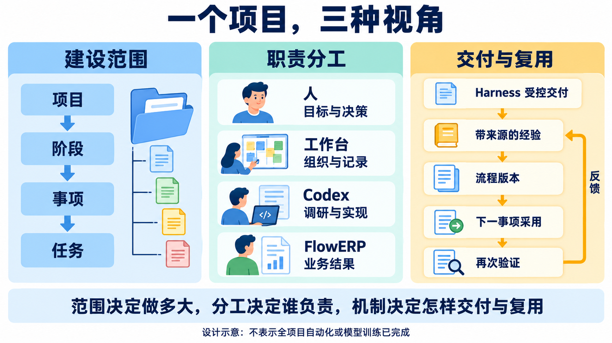
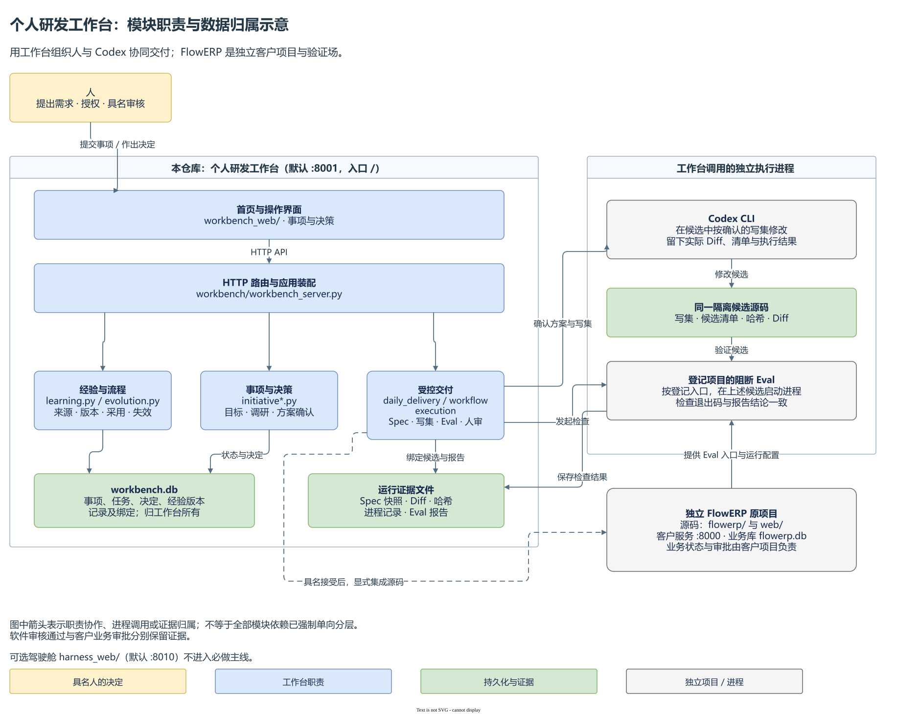
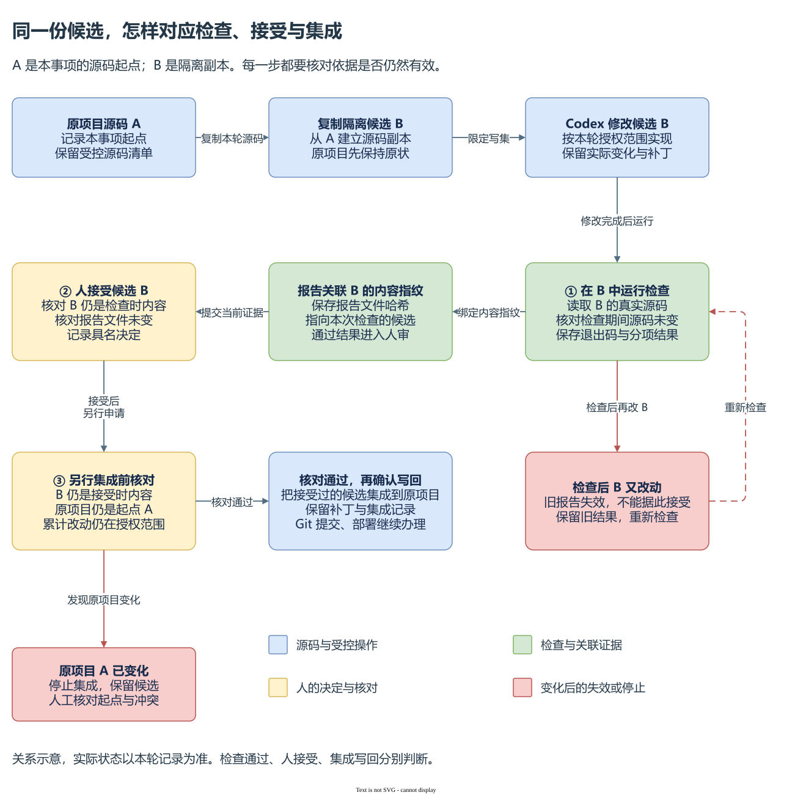

# 工作台具体设计

这套工作台面向完整软件项目的协同研发。人和 Codex 共同维护产品目标、整体架构和阶段计划，再通过多个事项推进实现、集成验收与迭代。具体执行层要解决的设计问题是：**人确认的要求，怎样约束 Codex 的真实执行；实际结果，怎样成为人作决定和后续事项复用的依据。** 如果需求、代码、检查和审核各自有效，却对应不同版本，仍然不能认定完成。因此，设计的重点在于把这些对象连起来，并在关联失效时停止推进。

本文按 2026-10-03 当前工作区源码解释实现及其取舍。以下“FlowERP 导出可用库存 CSV”是完整项目中的一个局部设计示例，用于展开执行层机制，不是已完成的客户验收记录；选择理由是对当前实现的分析，不冒充历史决策记录。完整项目主线与整体构思见[个人 AI 研发工作台](个人AI研发工作台.md)，具体操作见[参考资料入口](README.md)。

当前项目登记、多事项归属和事项内交付已有实现；全项目规划、架构基线及阶段安排由人和 Codex 通过项目文档组织。没有自动拆解排期或自动判定全项目完成的机制，整体验收需要另行组织并保留项目级业务与运行证据。

## 一、模块分开，是为了让不同责任有自己的判断依据

假设运营人员要求导出可用库存。Codex 需要理解已有库存服务，提出字段和实现方案；程序需要检查本次是否获准执行、实际改了哪些文件、报告是否对应当前代码；人需要确定库存口径，并对业务结果作出接受决定。这些判断的依据不同，不能全部交给模型的最后一句“已完成”。

图为 imagegen 设计示意，[生成提示词与说明](assets/workbench-design/workbench-three-views-imagegen-v1.prompt.md)。读图先在左侧定位范围：完整 FlowERP 是项目，订单建设是一阶段成果，库存未恢复是一件事项，某次修复是一轮任务；阶段目前由项目文档维护。再看中间的责任：人决定与验收，Codex 调研与实现，工作台核对条件并保存记录，FlowERP 承担业务结果。

右侧把受控交付（Harness）、带来源经验和流程版本连成复用路径。三个视角解释同一次研发；经验可以单独采用，整理为流程时还须独立审核、跨事项试用和发布，图中的箭头不能代替这些决定与证据。

页面首先收集人的意图。它通过 HTTP API 提交动作，再展示服务返回的结果。`workbench_server.py` 是入口与装配点，负责把事项、项目、任务、交付和维护服务组合起来。真正决定某一步能否发生的是服务中的状态条件：`InitiativeWorkflow` 管理事项的讨论、方案和轮次，`workflow.py` 组织一次任务的执行与检查，`TaskStore` 限制合法迁移。于是，即使页面显示了按钮，过期版本或不满足条件的请求仍会被后台拒绝。

执行责任则继续向外分开。`daily_delivery.py` 建立候选，`CodexExecutionRunner` 启动 Codex CLI 并读取实际文件变化，`CandidateProjectEval` 在候选目录执行项目登记的检查命令。模型的说明用于帮助人理解结果；文件差异、进程退出码和报告用于判断实际发生了什么。客户项目的库存、订单和采购规则仍由独立 FlowERP 的领域服务负责，工作台不拥有这些业务状态。

[可编辑架构图](assets/workbench-design/workbench-architecture.drawio) · [简洁概览](assets/workbench-design/workbench-overview.svg)。日常入口是 8001 的根路径 `/`，独立 FlowERP 默认使用 8000。代码定位：先看 [WorkbenchApp 的服务装配](../../workbench/workbench_server.py)，再看 [run_task 的执行与检查组织](../../workbench/workflow.py)。

这是一种职责划分，尚不是处处强制的单向依赖。当前 `workflow.py` 引用 Eval，`eval/cases.py` 的契约检查又引用工作台 Store，`learning.py` 直接读取同库中的事项、任务和反馈。共用 SQLite 使这些关联易于实现，也让模块依赖了彼此的表结构。后续若调整实现，应先固定交付、报告和采用记录的输入输出，再减少跨模块直接查表；仅把文件拆开，无法获得这条边界。

`harness_web/` 与 `platform_api.py` 是另一套可选服务面，默认 8010，使用 `platform.db` 与 `tasks.db` 保存平台配置、会话和任务。它不属于 L01～L16 必做工作台。本文分析的是 8001 的日常交付路径，不把可选平台的能力自动算到这条路径上。

## 二、项目、事项和任务有不同寿命，数据也有不同归属

库存导出第一次做错、第二次修正时，业务问题没有换，执行对象已经换了。若覆盖同一条结果，第一次失败就会消失；若另建一个无关联需求，又会丢失原先的目标。因此，项目保存工作位置，事项长期保存问题，每轮任务保存一次尝试。需要对照记录关系时，可查看[对象关联图](assets/workbench-design/workbench-object-relations.svg)。

项目登记包含真实仓库路径和项目检查命令，决定“改哪里、检查哪里”。登记不会安装依赖，也不代表环境已经可运行。事项保存原始信号、目标、非目标和人的决定；调研产生业务要求与技术方案的文档版本，确认后产生本轮执行方案。一次执行创建任务，任务关联冻结要求、候选、报告与审核，事项的轮次记录把它带回原问题。返工继续这个关系，保留已有失败，不要求把失败改写为成功。

这组关系也决定了哪一份数据可以作为依据：

| 内容 | 依据保存在哪里 | 它能说明什么 |
|---|---|---|
| 项目、事项、方案与文档版本、任务、审核、经验状态 | `workbench.db`，由相应 Store/服务管理 | 系统当前处于什么阶段，谁确认或采用了什么 |
| 冻结 Spec、候选源码、补丁、报告、进程输出 | 工作台运行目录，数据库保存关联与指纹 | 这轮实际要求、改动和检查是什么 |
| 库存、订单和采购状态 | 独立 FlowERP 服务及 `flowerp.db` | 客户业务对象的实际状态 |
| 尚未提交的人工输入 | 浏览器本机草稿 | 用户还在填写什么，不能证明已经确认 |

事项内容 `version` 核对需求是否变化，流程 `revision` 拒绝旧页面动作，文档版本区分每轮 PRD 与技术方案。方案与文档主要保存在 `initiative_workflows` 的 JSON 数据中；进入执行时，要求还会写成冻结的 `SPEC.md`。这不是两份可以任意替换的方案：服务中的版本与确认记录解释授权依据，执行文件解释该轮交给 Codex 的输入。任务事件再保存它的哈希及候选位置，使人能够追到当时的要求。代码定位见 [InitiativeWorkflow 的 `_documents` 与 `_save`](../../workbench/initiative_workflow.py)、[submit_daily 的冻结与候选创建](../../workbench/daily_delivery.py)。

数据库中的任务状态和对应迁移事件可以在同一事务内保存，整个研发过程却跨越了数据库、文件系统和外部进程。写文件、执行检查、集成源码无法由一次 SQLite 事务全部撤销。因此，“状态显示已接受”必须能追到实际候选和报告；只备份数据库可能失去证据，复制源码也不会迁移运行历史。当前事件用于追踪发生过的动作，不能仅凭事件表存在就宣称能从事件重建整个系统。

## 三、确认要求、授权执行、接受候选和集成分别改变什么

先看业务要求与技术方案为何分别确认。对于 CSV，业务负责人要决定导出在手数量还是可用库存、是否包含零库存项、如何验证结果；技术方案再确定复用哪条服务、允许修改哪些文件、怎样构造检查。与主文相同，本例约定某商品在手数量为 10、已预占 4，导出的可用库存应为 6。这是示例中的验收约定，工作台不会自行替业务人员决定这个口径。

当前首页先确认业务要求文档（PRD），再确认技术方案。技术确认会核对事项版本、调研时的源码、项目检查入口、验收负责人和经验采用决定，并冻结六段式 Spec：来源、目标、非目标、约束、验收用例、完成定义。确认的是“这个版本的方案可作为本轮依据”；单独授权执行才允许启动修改。服务执行开关默认关闭，也需要明确启用。服务具备执行能力，与这轮获准执行，是两个条件。

两次动作之间可能发生变化，所以冻结不等于永久有效。当前方案有效期为 15 分钟；执行前还会核对事项版本、采用资产的有效状态，提交候选前再核对源码清单。方案过期、事项改动、来源文件变化或流程被停用，都会要求重新确认。代码定位见 [InitiativeWorkflow 的 `confirm` 与 `execute`](../../workbench/initiative_workflow.py)。

执行以后又有另一对决定。检查通过只把任务推到 `review`，表示有候选等待人审。已指定的验收人需要核对 CSV 的业务结果、当前报告和候选，填写接受依据；`accept` 再检查这些证据是否仍有效，然后把任务标为 `completed`、事项标为候选已接受。此时原项目源码尚未写回。

`integrate` 才由验收负责人另行确认写回。程序检查候选仍是验收过的版本，原项目仍是这件事项起初的版本，累计改动仍在各轮授权范围内。原项目比较的是整个受控源码清单；即使变化发生在本次需求不涉及的文件，也可能阻断集成。这是保守地避免覆盖并行工作的选择，代价是需要人工核对更多基线变化。当前实现保留候选和补丁，等待人工处理冲突，没有自动合并器。

写入前保存原文件与收据，写入异常时尝试恢复并记录冲突。这提供恢复依据，但不能保证服务在任意写入时刻崩溃后自动完成回滚。集成成功记录 `committed: False`；Git 提交、实际部署和业务效果仍需继续完成。发布与效果面板保存人提供的版本、环境、观察和证据，不自动部署或采集指标。代码定位见 [InitiativeWorkflow 的 `accept` 与 `_apply_integration`](../../workbench/initiative_workflow.py)。

因此，任务完成、候选接受、源码集成、实际发布、业务效果达成必须分别解释。它们依次回答“本轮是否被接受”“代码是否写回”“客户是否用到”“使用后是否达到目标”，不能由一个绿色状态代替全部判断。署名用于责任记录，当前不构成多用户身份认证。动作顺序可对照[确认、返工与集成图](assets/workbench-design/workbench-delivery-decisions.svg)。

## 四、隔离候选与旧结果失效，解决的是两种风险

隔离候选先解决修改位置的问题。`submit_daily` 按确认时的源文件清单复制代码，可以包含源项目当时尚未提交的修改，然后在运行目录中建立新的 Git 基线。Codex 在这个副本中执行；工作台保留完整补丁和实际变化。如此，第一次把在手数量 10 导成可用库存 10 时，错误实现可以留下来调查，原项目不必先接受它。

返工下一轮可以以前一轮保留的候选为起点，继续调研和复制新的候选。重新调研会新增 PRD 与技术文档，即使业务要求未变，也须确认本轮文档。因此，第二轮能修正第一轮的代码，也能保留第一次失败的报告。最终集成比较的是最新候选与最初源项目的累计变化，授权范围来自所有轮次；不能只检查第二轮补丁就认定整件事项的改动都已获准。

读图先沿主箭头看“复制候选 → 修改 → 检查 → 人接受 → 另行集成”。再分别跟两条失效路径：候选改了，要重新检查；原项目改了，要停止集成并人工核对。这里的 A、B 表示本轮源码的起点与隔离副本，实际判断依靠保存的源码清单、内容指纹和报告。[可编辑源图](assets/workbench-design/candidate-report-identity.drawio) · [PNG](assets/workbench-design/candidate-report-identity.png)

当前复制的是受控的源码清单，不会自动复制完整虚拟环境、运行数据库或所有外部依赖。项目检查使用登记环境中的解释器或程序，在候选工作目录运行。因此，候选源码有哈希并不等于环境已经完全固定；解释器、依赖或外部文件变化仍需核对。日常新增需求可以从已有检查全绿开始，但新增行为需要自己的验证。课程 L04+ 的起始红、范围内 Diff 和执行后绿是另一条课程实验要求，不直接成为任意日常事项的合同。

写集约束也分两层。提示词告诉 Codex 允许修改哪些路径，CLI 使用候选工作区写权限；程序随后比较实际文件变化，发现越界或执行失败就不能认定成功。允许写集并不是逐文件的操作系统权限表。检查发现越界时，错误改动已可能存在于候选，必须作为失败证据保留和处理。规则文件、进程权限与实际差异校验各承担一部分作用，不能互相替代。代码定位见 [submit_daily](../../workbench/daily_delivery.py) 和 [CodexExecutionRunner](../../workbench/execution.py)。

版本与报告指纹则解决结果对应关系的问题。项目检查必须在候选目录实际运行，返回可对账的分项报告。`CandidateProjectEval` 先保存进程输出和原始报告，再验证非空用例、名称、检查等级、布尔结果、汇总和退出码，并核对检查期间源码未变。报告称通过而进程失败、结果为空、命令无法启动或超时，都不能形成通过依据。有效阻断失败进入返工；未完成检查需要先处理其失败原因。

即使报告真实，也可能过期。假设 CSV 检查通过后，有人又改变了导出计算；旧报告仍然能打开，却已经不能说明新代码正确。人审会重新核对候选指纹和报告文件哈希，变化后须再次运行检查。集成还要核对原项目起点，防止把“检查过的候选”写到另一个已经改变的基线上。指纹证明关联内容未变，不能证明用例覆盖充分，也不是防篡改签名。代码定位见 [CandidateProjectEval](../../workbench/project_delivery.py) 与 [report_view](../../workbench/eval_harness.py)。

工作台自身契约检查负责验证授权、任务和证据机制；客户项目检查负责验证其已覆盖的业务条件。统一 `eval/harness.py` 当前也登记 ERP 显式课程用例，经过 `external_project.evaluate_case` 子进程委托独立 FlowERP。查看这些结果需要追到客户项目的用例与进程，不能由工作台自身检查通过推断 CSV 或库存业务正确。

Hook、CI、Loop 和 Graph 还会复用质量入口，但每一种触发都需要自己的执行证据。Hook 包准备完不能替代实际宿主触发，CI 配置不能替代对应版本的运行结果。课程 `agent/graph.py` 的开发与默认审批包含演示策略，不能把默认 `completed` 用作真实开发和具名人审证明；实际任务的持久化 Graph 在 `workbench/workflow_graph.py`。这些机制的操作细节见 [Eval Harness](工作台Eval-Harness.md) 和 [Hook 使用说明](工作台-Hook-使用说明.md)。

## 五、长任务可以异步运行，写入与恢复仍采用保守边界

Codex 调研、修改与项目检查可能持续较久。当前服务先保存阶段，再启动后台线程，页面通过查询读取进展；关闭页面不等于任务已经停止。取消动作由服务的取消信号与检查点协调，运行器处理超时和终止。Windows Job 对象管理子进程树的生命周期，解决的是进程归属和寿命，不是文件访问权限。

异步并不等于所有改动可以安全并行。同一事项的请求要带最新修订号；上一项操作未结束时，服务拒绝冲突动作。一个运行目录由文件锁限制为一个工作台服务占用。主交付使用进程内锁串行，Codex 写入另有运行目录文件锁，集成也有锁及源文件一致性核对。这减少重复执行和证据混杂，却限制吞吐量；这些锁也不能推导出不同运行目录、不同机器对同一仓库的写入已获得统一调度。代码定位见 [InitiativeWorkflow 的 `_check`、`_launch` 与 `_execute`](../../workbench/initiative_workflow.py)、[WorkbenchRuntimeLease](../../workbench/runtime_lease.py)。

当服务重启，处于调研、排队、执行、检查、取消或集成阶段的事项会被标记为中断，已有候选和记录保留。等待确认、等待人审等事项不会一律变成中断。当前日常事项不会自动重放代码修改；人需要核对真实文件、报告和可能未完成的集成，再决定如何继续。这是停止后保留依据的恢复策略，不是保存模型会话并保证从断点自动接着做，也不证明任意外部副作用只发生一次。

备份必须覆盖数据库和它引用的内部证据。维护门使备份与写任务互斥，备份还检查文件清单、哈希、引用及数据库是否变化；校验不通过就不发布备份。当前恢复要求原本机运行路径，工作台库之外的项目源码、环境、FlowERP 数据、浏览器草稿及外部 Git 注册需要另行保留。恢复运行历史与迁移完整执行环境是两件事。代码定位见 [MaintenanceGate](../../workbench/maintenance.py) 与 [BackupService / restore_backup](../../workbench/workbench_backup.py)。

本机标准库、SQLite 与文件目录减少了个人及课程环境要维护的服务，代价是本机路径和运行环境仍然重要。多人身份、跨机器恢复和更细粒度的并行交付需要独立设计，不能仅靠增加线程或把服务暴露到网络上获得。

## 六、记忆与流程治理，要把“找到经验”变成“实际采用过”

库存导出失败后，可以提炼“统一库存口径，用含预占数据对账”的经验。但导出只读成功不能证明取消订单的写入事务正确，记录一句话也不能说明来源可信或适用于下一事项。当前设计先治理来源和版本，再记录采用与结果。[经验迁移图](assets/workbench-design/workbench-experience-transfer-imagegen-v1.png)与[生成说明](assets/workbench-design/workbench-experience-transfer-imagegen-v1.prompt.md)用设计案例解释这一区别。

`feedback.py` 保存观察和具名接受，`evolution.py` 管理改进提案及资产变化，`learning.py` 管理可召回的记忆与流程。已验收成功任务需要能核对通过报告和审核；失败任务需要已接受反馈对应的改进提案及实际失败轨迹。候选保留来源快照、适用与排除条件、版本和哈希，由非提炼者独立审核。记忆审核后生效；流程审核后先获准试用，不能直接把第一次交付的做法当成已验证通用流程。

召回只发生在同一项目内，排除同一来源事项，并检查有效状态、适用及排除关键词、来源完整性和上下文字符预算。同主题结论冲突会提示人判断。这是有界的关键词筛选，不能代替业务适用性判断。原始轨迹保存在证据中，模型上下文接收带来源与边界的摘要，而不是无差别重放所有旧会话。代码定位见 [LearningStore 的 `source`、`govern` 与 `recall`](../../workbench/learning.py)。

后续事项召回以后，人要逐项填写采用或拒绝理由；确认方案时把采用的确定版本、参数和前置检查结果保存为采用快照，并写入冻结 Spec。执行前再检查版本是否有效、内容是否变化以及流程前置条件是否仍成立。后来发布新版本不会改写旧任务当时采用的快照；但旧版本被撤回或替代后，已准备而尚未执行的采用需要重新核对，不能靠旧快照绕过有效状态。

经验说明为何对账，流程进一步规定从哪里开始、按什么顺序做及留下什么证据。以取消订单为例，假设本订单占用全部 4 个预占量，在手、预占、可用依次为：取消前 10/4/6，成功后 10/0/10；取消失败则订单与库存保持原状态，库存仍为 10/4/6。这些是本轮需编写并验证的条件，不能继承库存导出的通过结论。

| 环节 | 本轮输入与动作 | 责任与证据 |
|---|---|---|
| 本轮输入 | 确定服务与检查文件、样例、允许修改范围及采用版本 | 人与 Codex 核对，工作台绑定快照 |
| 前置检查 | 自动核对指定文件；人判断口径和适用边界 | 工作台保存检查结果，人记录采用理由 |
| 实现 | 按确认方案修复，落实本事项事务和失败不变性要求 | Codex 在授权范围实现，保存实际 Diff 与输出 |
| Eval | 在同一候选检查数值、订单状态及失败后状态 | 工作台调用项目命令，关联报告、退出码与源码 |
| 人审与结果 | 核对业务行为与检查覆盖，决定接受或返工 | 具名验收人记录依据，复用结果用于发布或停用修订 |

首版流程固定为“前置检查 → 实现 → Eval → 人审”，使用已确认方案授权和项目阻断检查。可执行前置条件仅有文件存在、文件包含指定内容两种；它们不能证明业务口径或事务正确。步骤说明随采用版本进入 Spec，由现有交付机制执行并记录实际阶段；没有任意节点编排器，停止和回退说明也不代表自动执行业务回退。

另一事项试用完成后，系统检查前置、实现、Eval 的实际阶段，以及隔离候选和具名审核，再允许流程发布。若复用任务失败，对应流程版本会被停用，保留原因并要求提炼新版本；记忆的撤回由治理决定。这里的停用说明这次复用不能继续作为有效流程，尚不等于系统自动查明了失败的唯一根因。代码定位见 [LearningStore 的 `bind`、`check_acceptance` 与 `finish`](../../workbench/learning.py)、[submit_daily 的阶段证据记录](../../workbench/daily_delivery.py)。

因此，闭环需要前后两个事项的真实关联：前项产生来源，后项明确采用版本，真实执行与人审留下结果，失败能够停用或修订。事件持久化、检索命中或一次测试通过都不足以替代这条关系。可对照[跨事项闭环图](assets/workbench-design/workbench-learning-cycle.svg)。当前首页已有提炼、审核、召回、采用、试用发布与停用入口；自动蒸馏、任意流程编排、重复失败减少和效率提升不能据此认定已完成。

本轮深化的是文档与源码解释，没有运行真实 Codex 交付，也没有完成真实 FlowERP 跨事项业务验收。现有机制仍需通过指定版本的交付、返工、基线冲突、中断恢复和前后事项复用来验证；业务效果需要实际观察，学生达成需要学生自己的判断、失败、修订、迁移与答辩。已有历史命令、失败与修复结果见[工作台范式与闭环建设](../architecture/工作台范式与闭环建设.md)，不能因本说明更新而升级为新的验收结论。
